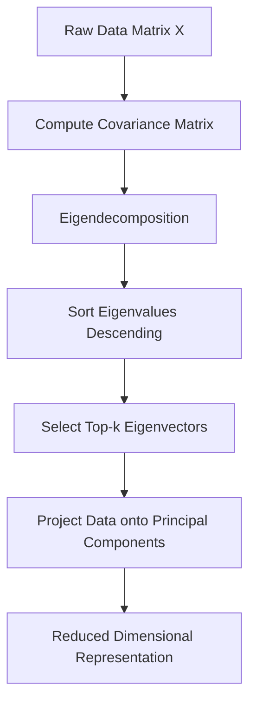

## Linear Algebra: Vectors, Matrices, Eigenvalues

### Overview

Linear algebra provides the mathematical scaffolding for nearly every machine learning algorithm. Data is represented as vectors and matrices, transformations are expressed as matrix operations, and many optimization and dimensionality-reduction techniques rely directly on eigenvalues and eigenvectors. Understanding these structures makes it possible to reason about how models represent, transform, and compress information.

### Vectors

A vector is an ordered collection of numbers representing a point or direction in space.

$$\mathbf{v} = \begin{bmatrix} v_1 \\ v_2 \\ \vdots \\ v_n \end{bmatrix}$$

In machine learning, a feature vector represents a single data sample, where each component corresponds to a measured attribute (e.g., pixel intensity, word frequency, sensor reading).

#### Vector Operations

**Addition and Scalar Multiplication**

Vectors combine element-wise:

$$\mathbf{u} + \mathbf{v} = \begin{bmatrix} u_1 + v_1 \\ u_2 + v_2 \\ \vdots \\ u_n + v_n \end{bmatrix}$$

Scalar multiplication scales every component: $c\mathbf{v} = [cv_1, cv_2, \dots, cv_n]^T$.

**Dot Product**

The dot product measures alignment between two vectors:

$$\mathbf{u} \cdot \mathbf{v} = \sum_{i=1}^{n} u_i v_i = |\mathbf{u}||\mathbf{v}|\cos\theta$$

This underlies similarity measures such as cosine similarity, used in recommendation systems and embedding comparisons.

**Norms**

A norm measures vector magnitude. The most common is the **L2 (Euclidean) norm**:

$$|\mathbf{v}|_2 = \sqrt{\sum_{i=1}^{n} v_i^2}$$

The **L1 norm** sums absolute values: $|\mathbf{v}|_1 = \sum_i |v_i|$. L1 and L2 norms appear directly in regularization terms (Lasso and Ridge regression, respectively).

**Key Points**
- Vectors represent single data points or directions in feature space.
- The dot product connects to angle and similarity between vectors.
- Norms quantify magnitude and appear throughout loss functions and regularization.

### Matrices

A matrix is a rectangular array of numbers, often representing a dataset (rows as samples, columns as features) or a linear transformation.

$$A = \begin{bmatrix} a_{11} & a_{12} & \cdots & a_{1n} \\ a_{21} & a_{22} & \cdots & a_{2n} \\ \vdots & \vdots & \ddots & \vdots \\ a_{m1} & a_{m2} & \cdots & a_{mn} \end{bmatrix}$$

#### Matrix Operations

**Matrix Multiplication**

For $A$ ($m \times n$) and $B$ ($n \times p$), the product $C = AB$ has entries:

$$c_{ij} = \sum_{k=1}^{n} a_{ik} b_{kj}$$

Matrix multiplication is the computational core of neural network forward passes, where layer outputs are computed as $\mathbf{y} = W\mathbf{x} + \mathbf{b}$.

**Transpose**

The transpose $A^T$ flips rows and columns: $(A^T)_{ij} = A_{ji}$. Transposes appear frequently in normal equations and gradient computations.

**Identity and Inverse**

The identity matrix $I$ satisfies $AI = IA = A$. The inverse $A^{-1}$, when it exists, satisfies $AA^{-1} = I$. Matrix inversion appears in the closed-form solution to linear regression:

$$\hat{\boldsymbol{\beta}} = (X^T X)^{-1} X^T \mathbf{y}$$

[Inference] In practice, direct matrix inversion is often avoided in favor of numerically stable decomposition methods (e.g., QR or SVD-based solvers), because inversion can be computationally expensive or unstable for ill-conditioned matrices. This is a general numerical-methods consideration rather than something confirmed for every specific library implementation.

**Determinant**

The determinant is a scalar that encodes whether a matrix is invertible ($\det(A) \neq 0$) and represents the volume scaling factor of the linear transformation it describes.

**Key Points**
- Matrices represent datasets, transformations, or systems of linear equations.
- Matrix multiplication is the fundamental operation inside neural network layers.
- Invertibility and determinants determine whether unique solutions exist to linear systems.

### Eigenvalues and Eigenvectors

For a square matrix $A$, a nonzero vector $\mathbf{v}$ is an eigenvector if it satisfies:

$$A\mathbf{v} = \lambda \mathbf{v}$$

where $\lambda$ is the corresponding eigenvalue. Geometrically, $\mathbf{v}$ is a direction that $A$ only stretches or shrinks — it does not rotate.

#### Computing Eigenvalues

Eigenvalues are found by solving the characteristic equation:

$$\det(A - \lambda I) = 0$$

This produces a polynomial in $\lambda$ whose roots are the eigenvalues. For each eigenvalue, substituting back into $(A - \lambda I)\mathbf{v} = 0$ yields the corresponding eigenvector(s).

**Example**

For $A = \begin{bmatrix} 2 & 1 \\ 1 & 2 \end{bmatrix}$:

$$\det\left(\begin{bmatrix} 2-\lambda & 1 \\ 1 & 2-\lambda \end{bmatrix}\right) = (2-\lambda)^2 - 1 = 0$$

Solving gives $\lambda_1 = 3$ and $\lambda_2 = 1$, with eigenvectors $[1,1]^T$ and $[1,-1]^T$ respectively.

#### Eigendecomposition

A matrix that has $n$ linearly independent eigenvectors can be decomposed as:

$$A = V \Lambda V^{-1}$$

where $V$ is the matrix of eigenvectors and $\Lambda$ is a diagonal matrix of eigenvalues. This decomposition is central to **Principal Component Analysis (PCA)**, where the eigenvectors of the covariance matrix identify directions of maximum variance in the data.

### Diagram: Eigenvector Transformation

<svg xmlns="http://www.w3.org/2000/svg" viewBox="0 0 500 320">
  <text x="250" y="25" font-size="16" text-anchor="middle" font-family="sans-serif" font-weight="bold">Eigenvector Direction Preserved Under Transformation (svg_diagram)</text>

  
  <text x="120" y="55" font-size="13" text-anchor="middle" font-family="sans-serif">Before: A applied to v</text>
  <line x1="40" y1="180" x2="200" y2="180" stroke="#999" stroke-width="1" />
  <line x1="120" y1="100" x2="120" y2="260" stroke="#999" stroke-width="1" />
  <line x1="120" y1="180" x2="170" y2="130" stroke="#2563eb" stroke-width="3" marker-end="url(#arrow1)" />
  <text x="180" y="120" font-size="12" fill="#2563eb" font-family="sans-serif">v</text>

  
  <text x="380" y="55" font-size="13" text-anchor="middle" font-family="sans-serif">After: Av = λv (same direction)</text>
  <line x1="300" y1="180" x2="460" y2="180" stroke="#999" stroke-width="1" />
  <line x1="380" y1="100" x2="380" y2="260" stroke="#999" stroke-width="1" />
  <line x1="380" y1="180" x2="455" y2="105" stroke="#dc2626" stroke-width="3" marker-end="url(#arrow2)" />
  <text x="440" y="95" font-size="12" fill="#dc2626" font-family="sans-serif">λv</text>

  <text x="250" y="300" font-size="12" text-anchor="middle" font-family="sans-serif" fill="#555">Eigenvector direction is unchanged; only magnitude scales by λ</text>

  </svg>

### Applications in Machine Learning

**Key applications:**
- **Principal Component Analysis (PCA)**: Uses eigenvectors of the covariance matrix to find directions of maximum variance for dimensionality reduction.
- **Spectral clustering**: Uses eigenvectors of a graph Laplacian to partition data into clusters.
- **PageRank**: Uses the dominant eigenvector of a transition matrix to rank nodes in a graph.
- **Neural network stability**: [Inference] The eigenvalues of weight matrices relate to gradient behavior during training (e.g., vanishing or exploding gradients), though the precise relationship depends on architecture, activation functions, and initialization scheme, so this should not be treated as a universal rule without checking the specific model setup.

### Singular Value Decomposition (SVD)

For non-square or non-diagonalizable matrices, **Singular Value Decomposition** generalizes eigendecomposition:

$$A = U \Sigma V^T$$

where $U$ and $V$ are orthogonal matrices and $\Sigma$ is a diagonal matrix of singular values. SVD is used in recommendation systems (matrix factorization), noise reduction, and as the computational backbone of PCA implementations that avoid directly computing the covariance matrix.

**Conclusion**

Vectors, matrices, and eigen-based decompositions form the computational language of machine learning. Every neural network forward pass is matrix multiplication; every dimensionality reduction technique relies on eigenvalues or singular values; and every optimization routine operates over vector spaces. A solid grasp of these operations makes it substantially easier to understand why algorithms like PCA, gradient descent, and neural network layers behave the way they do.

**Next Topic**

Mathematical Foundations — Calculus: derivatives, gradients, chain rule, partial derivatives, and their role in backpropagation and optimization.

**Related Topics**
- Matrix decompositions: LU, QR, Cholesky
- Singular Value Decomposition in depth
- Principal Component Analysis (full derivation and implementation)
- Vector spaces, basis, and rank
- Positive definite matrices and their role in optimization
- Norms and their use in regularization (L1/L2)
- Eigenvalues in neural network weight initialization