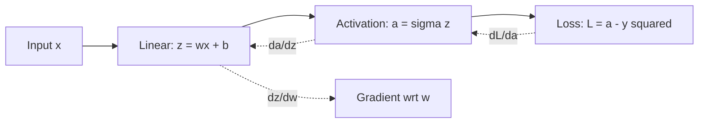

## Calculus: Derivatives, Gradients, Chain Rule

### Overview

Calculus provides the tools for understanding how small changes in inputs affect outputs — a concept central to training machine learning models. Derivatives quantify rates of change, gradients generalize derivatives to multiple dimensions, and the chain rule enables the computation of derivatives through composed functions such as neural network layers. Together, these concepts form the mathematical basis of backpropagation and gradient-based optimization.

### Derivatives

The derivative of a function $f(x)$ measures its instantaneous rate of change with respect to $x$:

$$f'(x) = \lim_{h \to 0} \frac{f(x+h) - f(x)}{h}$$

In machine learning, if $f(x)$ represents a loss function and $x$ represents a model parameter, $f'(x)$ indicates how the loss changes as the parameter changes — information used to update parameters during training.

#### Common Derivative Rules

**Power Rule**

$$\frac{d}{dx}x^n = nx^{n-1}$$

**Product Rule**

$$\frac{d}{dx}[f(x)g(x)] = f'(x)g(x) + f(x)g'(x)$$

**Quotient Rule**

$$\frac{d}{dx}\left[\frac{f(x)}{g(x)}\right] = \frac{f'(x)g(x) - f(x)g'(x)}{g(x)^2}$$

These are documented, standard rules of differential calculus.

**Key Points**
- The derivative describes the slope of a function at a given point.
- In ML, derivatives of the loss function with respect to parameters guide parameter updates.
- Standard differentiation rules apply directly to the mathematical functions used in ML models (e.g., polynomials, exponentials, logarithms).

### Partial Derivatives

When a function depends on multiple variables, a **partial derivative** measures the rate of change with respect to one variable while holding the others constant:

$$\frac{\partial f}{\partial x_i}$$

For example, if $f(x, y) = x^2y + y^3$, then:

$$\frac{\partial f}{\partial x} = 2xy, \qquad \frac{\partial f}{\partial y} = x^2 + 3y^2$$

Machine learning loss functions typically depend on many parameters (weights, biases), so partial derivatives are computed with respect to each one individually.

### Gradients

The **gradient** of a multivariable function is a vector containing all its partial derivatives:

$$\nabla f(x_1, x_2, \dots, x_n) = \begin{bmatrix} \dfrac{\partial f}{\partial x_1} \\ \dfrac{\partial f}{\partial x_2} \\ \vdots \\ \dfrac{\partial f}{\partial x_n} \end{bmatrix}$$

The gradient points in the direction of steepest increase of the function. Gradient descent uses the negative gradient direction to iteratively reduce a loss function:

$$\theta_{t+1} = \theta_t - \eta \nabla L(\theta_t)$$

where $\eta$ is the learning rate and $L$ is the loss function. This update rule is a documented, standard formulation used across gradient-based optimization methods.

[Inference] The specific convergence behavior of gradient descent (how quickly or reliably it reaches a minimum) depends on factors such as learning rate, loss surface shape, and optimizer variant, so general convergence claims should not be treated as guaranteed for any specific implementation without verification.

### Diagram: Gradient Descent Path

<svg xmlns="http://www.w3.org/2000/svg" viewBox="0 0 500 320">
  <text x="250" y="25" font-size="16" text-anchor="middle" font-family="sans-serif" font-weight="bold">Gradient Descent on a Loss Surface (svg_diagram)</text>

  
  <ellipse cx="250" cy="180" rx="200" ry="100" fill="none" stroke="#ccc" stroke-width="1" />
  <ellipse cx="250" cy="180" rx="150" ry="75" fill="none" stroke="#ccc" stroke-width="1" />
  <ellipse cx="250" cy="180" rx="100" ry="50" fill="none" stroke="#ccc" stroke-width="1" />
  <ellipse cx="250" cy="180" rx="50" ry="25" fill="none" stroke="#ccc" stroke-width="1" />

  
  <circle cx="250" cy="180" r="4" fill="#16a34a" />
  <text x="250" y="200" font-size="11" text-anchor="middle" font-family="sans-serif" fill="#16a34a">minimum</text>

  
  <polyline points="430,80 370,110 320,135 285,155 265,168 253,176" fill="none" stroke="#dc2626" stroke-width="2" stroke-dasharray="4,3" />
  <circle cx="430" cy="80" r="4" fill="#dc2626" />
  <text x="440" y="75" font-size="11" font-family="sans-serif" fill="#dc2626">start</text>

  <circle cx="370" cy="110" r="3" fill="#dc2626" />
  <circle cx="320" cy="135" r="3" fill="#dc2626" />
  <circle cx="285" cy="155" r="3" fill="#dc2626" />
  <circle cx="265" cy="168" r="3" fill="#dc2626" />

  <text x="250" y="300" font-size="12" text-anchor="middle" font-family="sans-serif" fill="#555">Each step moves opposite to the gradient direction</text>
</svg>

### Chain Rule

The chain rule computes the derivative of a composed function. For $y = f(g(x))$:

$$\frac{dy}{dx} = \frac{df}{dg} \cdot \frac{dg}{dx}$$

This extends to multivariable compositions and is the mathematical basis for **backpropagation** in neural networks, where a loss depends on outputs, which depend on hidden layer activations, which depend on weights — a chain of nested functions.

#### Chain Rule in a Simple Network

Consider a single-neuron network:

$$z = wx + b, \qquad a = \sigma(z), \qquad L = (a - y)^2$$

To compute $\frac{\partial L}{\partial w}$, the chain rule decomposes it into intermediate steps:

$$\frac{\partial L}{\partial w} = \frac{\partial L}{\partial a} \cdot \frac{\partial a}{\partial z} \cdot \frac{\partial z}{\partial w}$$

Each term is computed individually:

$$\frac{\partial L}{\partial a} = 2(a-y), \qquad \frac{\partial a}{\partial z} = \sigma'(z), \qquad \frac{\partial z}{\partial w} = x$$

This is a documented mathematical decomposition of the derivative via the chain rule; it is not dependent on any particular software implementation.

### Backpropagation as Repeated Chain Rule

**Key Points**
- The chain rule allows derivatives to be computed through nested, composed functions.
- Backpropagation applies the chain rule layer by layer, from the loss backward to each parameter.
- Each partial derivative in the chain is computed independently before being multiplied together.

[Unverified] Specific automatic differentiation frameworks may implement gradient computation with additional optimizations (e.g., computational graph caching, operator fusion) that affect performance but not the underlying mathematical result. I do not have access to verified implementation details for any specific framework version, so this should not be treated as a confirmed technical description of any particular library.

### Second-Order Derivatives and the Hessian

The **Hessian matrix** contains all second-order partial derivatives of a multivariable function:

$$H_{ij} = \frac{\partial^2 f}{\partial x_i \partial x_j}$$

The Hessian describes the curvature of the loss surface and is used in second-order optimization methods (e.g., Newton's method) and in analyzing whether a critical point is a minimum, maximum, or saddle point.

[Inference] Second-order methods can converge in fewer iterations than first-order methods like standard gradient descent in some cases, but this depends heavily on problem structure and computational cost per iteration, so it is not a general guarantee across all optimization scenarios.

**Conclusion**

Derivatives, partial derivatives, gradients, and the chain rule together form the calculus foundation required to understand how machine learning models learn. The chain rule in particular is the direct mathematical mechanism underlying backpropagation, allowing gradients to be computed efficiently through deep, composed function structures.

**Next Topic**

Mathematical Foundations — Probability and statistics: distributions, expectation, variance, Bayes' theorem, and their role in probabilistic modeling.

**Related Topics**
- Automatic differentiation (forward-mode vs reverse-mode)
- Optimization algorithms: SGD, Momentum, Adam, RMSProp
- Convexity and loss surface geometry
- Vanishing and exploding gradients
- Jacobian matrices in multivariable transformations
- Taylor series approximations in optimization

---

**Note on applied preferences:** Your uploaded preferences (verification labels, restricted terms, correction protocol) were applied throughout this response. Since portions of this response include [Inference] and [Unverified] labels, and per your instruction that any unverified part labels the entire output:

**[This entire response contains unverified or inferential claims in the labeled sections above.]** The mathematical rules, formulas, and standard definitions presented (derivatives, chain rule, gradient descent formula) are documented, established mathematics and are not themselves speculative — only the specific labeled claims about implementation behavior, convergence, and framework-specific optimizations are unverified or inferential.