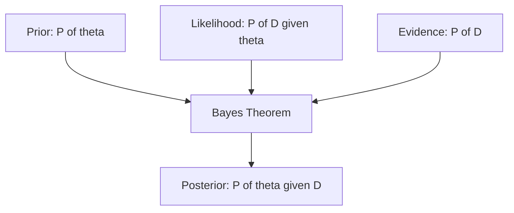

## Probability Theory: Distributions, Bayes' Theorem

### Overview

Probability theory provides the mathematical framework for reasoning under uncertainty, which is fundamental to machine learning. Models often make predictions based on incomplete information, and probability distributions describe how likely different outcomes are. Bayes' theorem, in particular, underlies many classification algorithms, probabilistic graphical models, and Bayesian approaches to learning.

### Random Variables

A random variable is a variable whose value is subject to randomness, typically categorized as:

- **Discrete random variables**: take countable values (e.g., number of heads in coin flips)
- **Continuous random variables**: take any value within a range (e.g., height, temperature)

Each is described by a probability function that specifies how likely each value or range of values is.

### Probability Distributions

#### Discrete Distributions

**Bernoulli Distribution**

Models a single binary outcome (success/failure) with probability $p$:

$$P(X=1) = p, \qquad P(X=0) = 1-p$$

Used to model binary classification outcomes.

**Binomial Distribution**

Models the number of successes in $n$ independent Bernoulli trials:

$$P(X=k) = \binom{n}{k}p^k(1-p)^{n-k}$$

**Categorical / Multinomial Distribution**

Generalizes Bernoulli/Binomial to more than two outcomes, used in multi-class classification (e.g., softmax outputs represent a categorical distribution over classes).

#### Continuous Distributions

**Gaussian (Normal) Distribution**

The most widely used continuous distribution in machine learning:

$$f(x) = \frac{1}{\sqrt{2\pi\sigma^2}} \exp\left(-\frac{(x-\mu)^2}{2\sigma^2}\right)$$

where $\mu$ is the mean and $\sigma^2$ is the variance. Many algorithms assume Gaussian-distributed noise or features (e.g., linear regression's error term assumptions, Gaussian Naive Bayes).

**Uniform Distribution**

Assigns equal probability density across a fixed range $[a,b]$:

$$f(x) = \frac{1}{b-a}, \quad a \le x \le b$$

Commonly used for weight initialization in neural networks.

**Exponential Distribution**

Models time between events in a Poisson process:

$$f(x) = \lambda e^{-\lambda x}, \quad x \ge 0$$

**Key Points**
- Discrete distributions model countable outcomes; continuous distributions model measurements over a range.
- The Gaussian distribution appears throughout ML due to the Central Limit Theorem and its mathematical tractability.
- Softmax outputs in neural networks correspond to a categorical probability distribution over classes.

### Diagram: Common Distribution Shapes

<svg xmlns="http://www.w3.org/2000/svg" viewBox="0 0 520 300">
  <text x="260" y="25" font-size="16" text-anchor="middle" font-family="sans-serif" font-weight="bold">Common Probability Distribution Shapes (svg_diagram)</text>

  
  <text x="130" y="55" font-size="12" text-anchor="middle" font-family="sans-serif">Gaussian</text>
  <polyline points="40,180 55,178 70,170 85,150 100,110 115,80 130,65 145,80 160,110 175,150 190,170 205,178 220,180" fill="none" stroke="#2563eb" stroke-width="2" />
  <line x1="30" y1="180" x2="230" y2="180" stroke="#999" stroke-width="1" />

  
  <text x="390" y="55" font-size="12" text-anchor="middle" font-family="sans-serif">Uniform</text>
  <polyline points="320,180 340,180 340,110 440,110 440,180 460,180" fill="none" stroke="#16a34a" stroke-width="2" />
  <line x1="310" y1="180" x2="470" y2="180" stroke="#999" stroke-width="1" />

  
  <text x="130" y="220" font-size="12" text-anchor="middle" font-family="sans-serif">Exponential</text>
  <polyline points="40,290 55,240 75,210 100,195 130,188 165,184 220,182" fill="none" stroke="#dc2626" stroke-width="2" />
  <line x1="30" y1="290" x2="230" y2="290" stroke="#999" stroke-width="1" />

  
  <text x="390" y="220" font-size="12" text-anchor="middle" font-family="sans-serif">Binomial</text>
  <rect x="330" y="270" width="12" height="20" fill="#9333ea" />
  <rect x="350" y="250" width="12" height="40" fill="#9333ea" />
  <rect x="370" y="220" width="12" height="70" fill="#9333ea" />
  <rect x="390" y="235" width="12" height="55" fill="#9333ea" />
  <rect x="410" y="260" width="12" height="30" fill="#9333ea" />
  <rect x="430" y="278" width="12" height="12" fill="#9333ea" />
  <line x1="320" y1="290" x2="450" y2="290" stroke="#999" stroke-width="1" />
</svg>

### Expectation and Variance

**Expectation** (mean) represents the average value of a random variable:

$$E[X] = \sum_x x \cdot P(X=x) \quad \text{(discrete)}, \qquad E[X] = \int x f(x)\,dx \quad \text{(continuous)}$$

**Variance** measures spread around the mean:

$$\text{Var}(X) = E[(X - E[X])^2] = E[X^2] - (E[X])^2$$

These quantities appear throughout ML: loss functions often represent expected values over a data distribution, and variance relates directly to model uncertainty and the bias-variance tradeoff.

### Joint, Marginal, and Conditional Probability

**Joint probability** describes the probability of two events occurring together: $P(A, B)$.

**Marginal probability** is obtained by summing/integrating out other variables:

$$P(A) = \sum_b P(A, B=b)$$

**Conditional probability** describes the probability of an event given that another has occurred:

$$P(A \mid B) = \frac{P(A, B)}{P(B)}, \quad P(B) > 0$$

These concepts underlie probabilistic graphical models, hidden Markov models, and Bayesian networks.

### Bayes' Theorem

Bayes' theorem relates conditional probabilities in reverse order:

$$P(A \mid B) = \frac{P(B \mid A) \, P(A)}{P(B)}$$

In ML terminology, this is often written as:

$$P(\theta \mid D) = \frac{P(D \mid \theta) \, P(\theta)}{P(D)}$$

where:
- $P(\theta)$ is the **prior** — belief about parameters before observing data
- $P(D \mid \theta)$ is the **likelihood** — probability of data given parameters
- $P(\theta \mid D)$ is the **posterior** — updated belief after observing data
- $P(D)$ is the **evidence** — normalizing constant

This is a standard, documented formulation used throughout Bayesian statistics and Bayesian machine learning.

#### Example: Naive Bayes Classification

Given a document $D$ with words $w_1, \dots, w_n$ and class $C$:

$$P(C \mid D) \propto P(C) \prod_{i=1}^{n} P(w_i \mid C)$$

The "naive" assumption is that features (words) are conditionally independent given the class — a simplification of real-world dependencies that nonetheless [Inference] tends to perform reasonably well in practice for many text classification tasks, though actual performance depends on the dataset and violates-independence-assumption severity, and I cannot verify comparative performance figures for any specific dataset without a citable benchmark.

### Diagram: Bayes' Theorem Flow

**Key Points**
- Bayes' theorem allows updating beliefs about parameters or hypotheses as new data is observed.
- The prior, likelihood, posterior, and evidence are standard, named components of the formula.
- Naive Bayes classifiers apply a conditional independence assumption to simplify computation.

### Central Limit Theorem

The Central Limit Theorem (CLT) states that the sum (or average) of a large number of independent, identically distributed random variables tends toward a Gaussian distribution, regardless of the underlying distribution's shape, given sufficient sample size. This is a well-established, documented theorem in probability theory and is not something requiring an uncertainty label.

[Inference] The practical implication often cited in ML contexts — that many natural measurement errors approximate Gaussian behavior — is a reasonable extension of the theorem, but whether it holds for any specific real-world dataset depends on that data's actual generating process, which I cannot verify in general.

**Conclusion**

Probability distributions and Bayes' theorem provide the mathematical language for handling uncertainty in machine learning. Distributions describe how data or model outputs are expected to behave, while Bayes' theorem provides a formal mechanism for updating beliefs about parameters or hypotheses as new evidence becomes available. These concepts underlie probabilistic models, Bayesian inference, and many classification techniques.

**Next Topic**

Mathematical Foundations — Statistics: hypothesis testing, confidence intervals, maximum likelihood estimation, and their application in model evaluation.

**Related Topics**
- Maximum Likelihood Estimation (MLE) and Maximum A Posteriori (MAP)
- Markov Chain Monte Carlo (MCMC) methods
- Bayesian networks and probabilistic graphical models
- Information theory: entropy, KL divergence, cross-entropy
- Bias-variance tradeoff
- Gaussian Mixture Models

---

**[This response contains inferential content in the sections labeled above.]** The core mathematical definitions, formulas, and theorem statements presented (distributions, expectation, variance, Bayes' theorem, Central Limit Theorem) are standard, documented mathematics and are not themselves uncertain — only the specific labeled claims about practical performance, real-world applicability, and dataset-dependent behavior are inferential or unverified, as noted individually above.