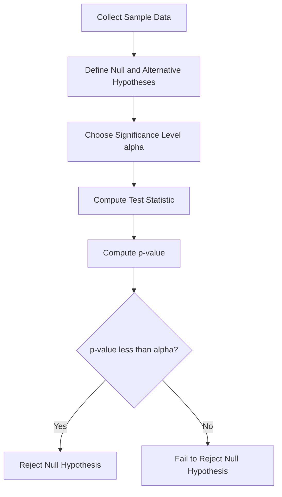

## Statistics: Hypothesis Testing, Confidence Intervals

### Overview

Statistical inference allows conclusions to be drawn about populations from sample data. In machine learning, these tools are used to evaluate whether model performance differences are meaningful, to quantify uncertainty in estimates, and to validate assumptions about data. Hypothesis testing and confidence intervals are the two primary mechanisms for expressing statistical confidence in results.

### Point Estimation

A **point estimate** is a single value used to approximate a population parameter (e.g., using a sample mean $\bar{x}$ to estimate a population mean $\mu$). Point estimates alone do not convey how much uncertainty surrounds them, which motivates the use of confidence intervals.

### Confidence Intervals

A **confidence interval (CI)** provides a range of plausible values for a population parameter, along with a confidence level (commonly 95% or 99%).

$$\bar{x} \pm z \cdot \frac{\sigma}{\sqrt{n}}$$

where $\bar{x}$ is the sample mean, $\sigma$ is the population standard deviation (or sample standard deviation $s$ when $\sigma$ is unknown), $n$ is the sample size, and $z$ is the critical value corresponding to the desired confidence level (e.g., $z \approx 1.96$ for 95% confidence under a normal distribution).

#### Interpretation

A 95% confidence interval means that if the sampling process were repeated many times, approximately 95% of the constructed intervals would contain the true population parameter. It does **not** mean there is a 95% probability that the true parameter lies within one specific calculated interval — this is a standard, documented distinction in classical (frequentist) statistics.

**Key Points**
- Confidence intervals express a range of plausible values, not certainty about the exact parameter value.
- Interval width depends on sample size, variability, and the chosen confidence level.
- Larger sample sizes generally produce narrower confidence intervals, given constant variability.

### Diagram: Confidence Interval Around a Sample Mean

<svg xmlns="http://www.w3.org/2000/svg" viewBox="0 0 500 220">
  <text x="250" y="25" font-size="16" text-anchor="middle" font-family="sans-serif" font-weight="bold">Confidence Interval Around Sample Mean (svg_diagram)</text>

  <line x1="60" y1="150" x2="440" y2="150" stroke="#999" stroke-width="1" />

  
  <line x1="180" y1="150" x2="320" y2="150" stroke="#2563eb" stroke-width="4" />
  <line x1="180" y1="135" x2="180" y2="165" stroke="#2563eb" stroke-width="3" />
  <line x1="320" y1="135" x2="320" y2="165" stroke="#2563eb" stroke-width="3" />

  
  <circle cx="250" cy="150" r="5" fill="#dc2626" />
  <text x="250" y="130" font-size="12" text-anchor="middle" font-family="sans-serif" fill="#dc2626">sample mean</text>

  <text x="180" y="180" font-size="11" text-anchor="middle" font-family="sans-serif">lower bound</text>
  <text x="320" y="180" font-size="11" text-anchor="middle" font-family="sans-serif">upper bound</text>

  <text x="250" y="205" font-size="12" text-anchor="middle" font-family="sans-serif" fill="#555">Interval width reflects sample size and variability</text>
</svg>

### Hypothesis Testing

Hypothesis testing evaluates whether observed data provides enough evidence to reject a default assumption.

#### Null and Alternative Hypotheses

- **Null hypothesis ($H_0$)**: assumes no effect or no difference (e.g., "Model A and Model B have equal accuracy")
- **Alternative hypothesis ($H_1$ or $H_a$)**: assumes an effect or difference exists (e.g., "Model A and Model B have different accuracy")

#### p-values

The **p-value** is the probability of observing a result at least as extreme as the one obtained, assuming the null hypothesis is true.

$$p = P(\text{data as extreme as observed} \mid H_0 \text{ is true})$$

A small p-value (commonly below a threshold such as 0.05) is conventionally interpreted as evidence against the null hypothesis. This threshold-based convention is standard in classical statistics, though the choice of 0.05 itself is a convention rather than a mathematically derived requirement.

#### Test Statistic and Decision

A test statistic (e.g., $z$-score, $t$-statistic) is computed from sample data and compared against a critical value or used to compute a p-value:

$$z = \frac{\bar{x} - \mu_0}{\sigma / \sqrt{n}}$$

If the test statistic falls in the rejection region (or the p-value is below the significance threshold $\alpha$), $H_0$ is rejected in favor of $H_1$.

**Key Points**
- Hypothesis testing provides a formal decision procedure, not proof of truth or falsehood.
- The p-value quantifies evidence against the null hypothesis, not the probability that $H_0$ is true.
- Significance thresholds (e.g., $\alpha = 0.05$) are conventional choices, not universal mathematical constants.

### Types of Errors

| Decision | $H_0$ True | $H_0$ False |
|---|---|---|
| Reject $H_0$ | Type I Error (false positive), probability $\alpha$ | Correct decision |
| Fail to reject $H_0$ | Correct decision | Type II Error (false negative), probability $\beta$ |

**Statistical power** is defined as $1 - \beta$, the probability of correctly rejecting a false null hypothesis.

### Common Hypothesis Tests

**t-test**: compares means between one or two groups (e.g., comparing average accuracy of two models across cross-validation folds).

**Chi-squared test**: tests independence between categorical variables (e.g., checking whether a categorical feature is associated with a target class).

**ANOVA (Analysis of Variance)**: compares means across three or more groups.

These are standard, documented statistical tests with established mathematical definitions.

### Diagram: Hypothesis Testing Decision Flow

### Application in Machine Learning Model Evaluation

Hypothesis testing and confidence intervals are commonly used to:
- Compare model performance across cross-validation folds to assess whether a performance difference is statistically meaningful rather than due to random variation.
- Construct confidence intervals around metrics such as accuracy, precision, or AUC to communicate estimate uncertainty.
- Test whether feature distributions differ significantly between training and test sets (a check sometimes used to detect data drift).

[Inference] Whether a statistically significant performance difference between two models is also *practically* meaningful depends on the specific application and evaluation context, so statistical significance alone should not be treated as sufficient evidence of practical importance. This is a reasoned extension of the general statistical principle rather than a confirmed claim about any particular study or model comparison.

**Key Points**
- Statistical tests help distinguish genuine performance differences from random variation in model evaluation.
- Confidence intervals communicate the precision of an estimated metric.
- Statistical significance and practical significance are related but distinct concepts.

### Common Pitfalls

- **Multiple comparisons problem**: running many hypothesis tests increases the likelihood of false positives unless corrected for (e.g., Bonferroni correction). This is a documented statistical phenomenon.
- **p-hacking**: selectively reporting or repeating tests until a significant result is obtained, which undermines the validity of the resulting p-value.
- **Misinterpreting p-values**: treating a p-value as the probability that the null hypothesis is true is a common misconception; this is not what a p-value represents under standard frequentist statistics.

[Unverified] The frequency with which these pitfalls occur in real-world applied machine learning research is not something I can verify without access to a specific survey or meta-analysis, and I do not have a citable source for such a frequency claim in this response.

**Conclusion**

Hypothesis testing and confidence intervals provide standardized frameworks for quantifying uncertainty and making evidence-based decisions from sample data. In machine learning, these tools support rigorous model comparison and help distinguish genuine performance differences from random sampling variation, though care must be taken to avoid common statistical misinterpretations.

**Next Topic**

Machine Learning Fundamentals — Supervised learning: regression and classification, training/test splits, and the bias-variance tradeoff.

**Related Topics**
- Maximum Likelihood Estimation (MLE)
- A/B testing methodology
- Bootstrap resampling and bootstrap confidence intervals
- Multiple hypothesis correction methods (Bonferroni, Benjamini-Hochberg)
- Bayesian alternatives to frequentist hypothesis testing
- Cross-validation and statistical significance of model comparisons

---

**[This response contains inferential and unverified content in the sections labeled above.]** The core statistical definitions, formulas, and standard conventions presented (confidence intervals, hypothesis testing procedure, p-value definition, error types, common tests) are documented, established statistical methodology and are not themselves uncertain — only the specific labeled claims about practical significance and real-world pitfall frequency are inferential or unverified, as noted individually above.