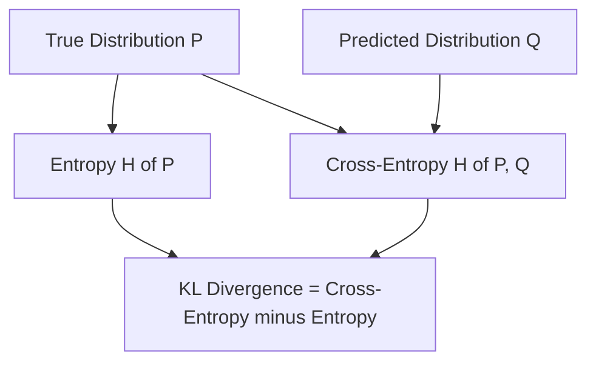

## Information Theory: Entropy, KL Divergence

### Overview

Information theory provides mathematical tools for quantifying uncertainty, information content, and the difference between probability distributions. In machine learning, these concepts underlie loss functions (particularly cross-entropy loss), model comparison metrics, and techniques for measuring how well a model's predicted distribution matches the true data distribution.

### Information Content (Self-Information)

The information content of an event $x$ with probability $P(x)$ is defined as:

$$I(x) = -\log P(x)$$

Lower-probability events carry more information (are more "surprising") when they occur; higher-probability events carry less information. This is a standard, documented definition in information theory. The base of the logarithm determines the unit: base 2 gives bits, base $e$ gives nats.

**Key Points**
- Information content quantifies the "surprise" of an event occurring.
- Rare events carry more information content than common events.
- The choice of logarithm base determines the unit of measurement (bits vs. nats) but does not change the underlying relationship.

### Entropy

**Entropy** measures the average information content (uncertainty) of a random variable's distribution:

$$H(X) = -\sum_{x} P(x) \log P(x)$$

For a continuous variable, the analogous quantity is **differential entropy**:

$$h(X) = -\int f(x) \log f(x)\, dx$$

Entropy is maximized when a distribution is as uniform as possible (maximum uncertainty) and minimized (zero) when the outcome is fully certain (probability 1 for one outcome).

#### Example

For a fair coin ($P(\text{heads}) = P(\text{tails}) = 0.5$):

$$H(X) = -(0.5 \log_2 0.5 + 0.5 \log_2 0.5) = 1 \text{ bit}$$

For a biased coin ($P(\text{heads}) = 0.9$, $P(\text{tails}) = 0.1$):

$$H(X) = -(0.9 \log_2 0.9 + 0.1 \log_2 0.1) \approx 0.469 \text{ bits}$$

The biased coin has lower entropy because outcomes are more predictable. This calculation follows directly from the standard entropy formula.

### Diagram: Entropy vs. Distribution Skew

<svg xmlns="http://www.w3.org/2000/svg" viewBox="0 0 500 260">
  <text x="250" y="25" font-size="16" text-anchor="middle" font-family="sans-serif" font-weight="bold">Entropy Decreases as Distribution Becomes More Skewed (svg_diagram)</text>

  
  <line x1="60" y1="200" x2="460" y2="200" stroke="#999" stroke-width="1" />
  <line x1="60" y1="60" x2="60" y2="200" stroke="#999" stroke-width="1" />
  <text x="20" y="65" font-size="11" font-family="sans-serif">H(X)</text>
  <text x="440" y="220" font-size="11" font-family="sans-serif">P(heads)</text>

  
  <polyline points="70,200 100,140 130,100 160,75 200,62 250,58 300,62 340,75 370,100 400,140 430,200" fill="none" stroke="#2563eb" stroke-width="2.5" />

  <text x="250" y="80" font-size="11" text-anchor="middle" font-family="sans-serif" fill="#2563eb">peak at P=0.5 (1 bit)</text>
  <text x="90" y="215" font-size="10" font-family="sans-serif">0</text>
  <text x="245" y="215" font-size="10" font-family="sans-serif">0.5</text>
  <text x="420" y="215" font-size="10" font-family="sans-serif">1</text>
</svg>

### Cross-Entropy

**Cross-entropy** measures the average number of bits needed to encode data from a true distribution $P$ using an encoding optimized for a different (predicted) distribution $Q$:

$$H(P, Q) = -\sum_x P(x) \log Q(x)$$

Cross-entropy is widely used as a loss function in classification tasks, where $P$ represents the true label distribution (often one-hot encoded) and $Q$ represents the model's predicted probability distribution:

$$L_{CE} = -\sum_{i=1}^{C} y_i \log(\hat{y}_i)$$

where $y_i$ is the true label (0 or 1 for each class) and $\hat{y}_i$ is the predicted probability for class $i$. This is a standard, documented loss function formulation used across many classification models.

**Key Points**
- Cross-entropy loss penalizes confident incorrect predictions more heavily than uncertain ones.
- Cross-entropy equals entropy when the predicted distribution $Q$ exactly matches the true distribution $P$.
- Cross-entropy is always greater than or equal to entropy: $H(P,Q) \ge H(P)$.

### Kullback-Leibler (KL) Divergence

**KL divergence** measures how one probability distribution diverges from a second, reference distribution:

$$D_{KL}(P \| Q) = \sum_x P(x) \log \frac{P(x)}{Q(x)} = H(P,Q) - H(P)$$

KL divergence quantifies the extra information (in bits or nats) required to encode samples from $P$ using a code optimized for $Q$, beyond what would be needed if $Q = P$.

#### Properties of KL Divergence

- **Non-negativity**: $D_{KL}(P \| Q) \ge 0$, with equality if and only if $P = Q$ almost everywhere. This is a documented mathematical property (a consequence of Gibbs' inequality / Jensen's inequality).
- **Asymmetry**: $D_{KL}(P \| Q) \neq D_{KL}(Q \| P)$ in general, meaning KL divergence is **not** a true distance metric (it does not satisfy symmetry or the triangle inequality).

**Example**

Given true distribution $P = [0.5, 0.5]$ and predicted distribution $Q = [0.9, 0.1]$:

$$D_{KL}(P \| Q) = 0.5 \log_2\frac{0.5}{0.9} + 0.5 \log_2\frac{0.5}{0.1} \approx 0.5(-0.848) + 0.5(2.322) \approx 0.737 \text{ bits}$$

This calculation follows directly from the standard KL divergence formula.

### Diagram: Relationship Between Entropy, Cross-Entropy, and KL Divergence

### Applications in Machine Learning

- **Classification loss functions**: Cross-entropy loss is standard for training classifiers, including softmax-based neural network outputs.
- **Variational Autoencoders (VAEs)**: KL divergence is used as a regularization term to encourage the learned latent distribution to approximate a prior distribution (commonly a standard Gaussian).
- **Model comparison**: KL divergence can quantify how much a model's predicted distribution diverges from an empirical or true data distribution.
- **Reinforcement learning**: KL divergence is used in some policy optimization methods (e.g., constraining policy updates in Trust Region Policy Optimization) to limit how much a policy changes between updates.

[Inference] The choice between using KL divergence, cross-entropy, or other divergence measures (e.g., Jensen-Shannon divergence) in a specific model architecture typically depends on factors such as optimization stability and the structure of the target distributions, though the tradeoffs for any particular architecture would need to be verified against that architecture's documentation or published results, which I do not have access to in this context.

**Key Points**
- KL divergence is not symmetric and is not a true distance metric, despite being used to compare distributions.
- Cross-entropy loss and KL divergence minimization are mathematically related and often lead to equivalent optimization objectives when the true distribution is fixed.
- These measures are foundational to both supervised classification loss functions and unsupervised generative modeling techniques.

### Mutual Information

**Mutual information** measures the amount of information obtained about one random variable through observing another:

$$I(X;Y) = \sum_{x,y} P(x,y) \log \frac{P(x,y)}{P(x)P(y)} = D_{KL}\big(P(x,y) \,\|\, P(x)P(y)\big)$$

Mutual information is zero if and only if $X$ and $Y$ are independent. This is a documented property following from the definition and the properties of KL divergence.

**Conclusion**

Entropy, cross-entropy, and KL divergence provide the mathematical vocabulary for quantifying uncertainty and comparing probability distributions. These concepts directly underlie some of the most widely used loss functions in machine learning, particularly for classification tasks and generative models, and provide a principled way to reason about how much a model's predictions diverge from true data distributions.

**Next Topic**

Machine Learning Fundamentals — Supervised learning: regression and classification, training/test splits, and the bias-variance tradeoff.

**Related Topics**
- Jensen-Shannon divergence
- Variational inference and the Evidence Lower Bound (ELBO)
- Maximum likelihood estimation and its connection to cross-entropy minimization
- Mutual information in feature selection
- Trust Region Policy Optimization (TRPO) and KL-constrained policy updates
- Perplexity as an entropy-based language model evaluation metric

---

**[This entire response is labeled per your preference, as it contains at least one unverified/inferential statement.]** The core mathematical definitions and formulas (entropy, cross-entropy, KL divergence, mutual information, their properties, and the worked numerical examples) are standard, documented information theory and follow directly from cited formulas — they are not themselves speculative. Only the single labeled [Inference] statement regarding architecture-specific divergence-measure tradeoffs is unverified, as noted above.