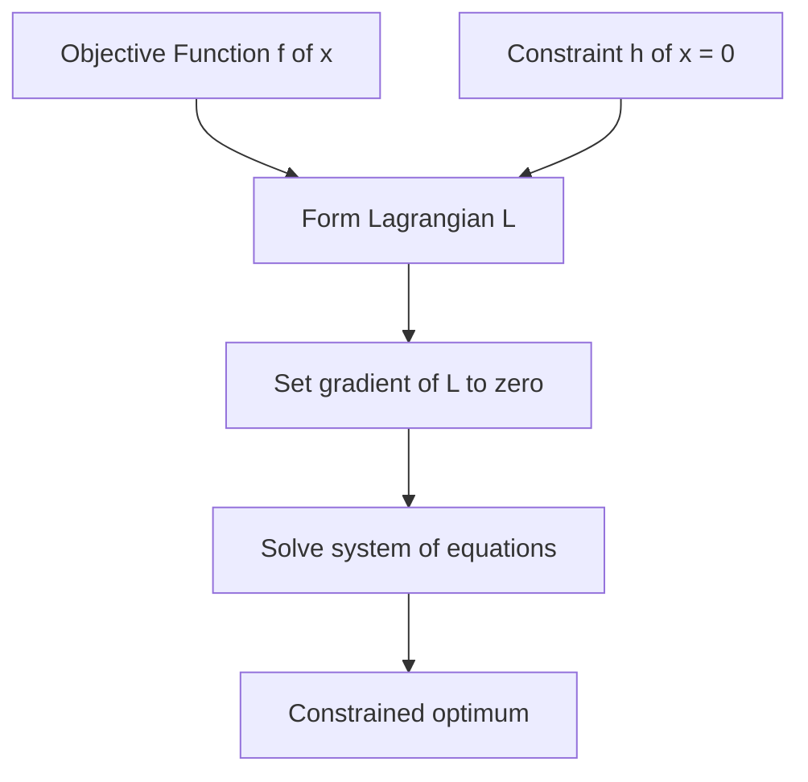

## Optimization Theory: Convexity, Lagrange Multipliers

### Overview

Optimization theory addresses the problem of finding the best solution — typically minimizing or maximizing a function — subject to constraints. In machine learning, most training procedures are optimization problems: finding parameters that minimize a loss function. Convexity determines whether an optimization problem has favorable theoretical guarantees, while Lagrange multipliers provide a method for solving constrained optimization problems.

### Convex Sets and Convex Functions

#### Convex Sets

A set $S$ is convex if, for any two points $x_1, x_2 \in S$, the line segment connecting them lies entirely within $S$:

$$\lambda x_1 + (1-\lambda)x_2 \in S \quad \text{for all } \lambda \in [0,1]$$

#### Convex Functions

A function $f$ is convex if its domain is a convex set and, for any two points $x_1, x_2$:

$$f(\lambda x_1 + (1-\lambda)x_2) \le \lambda f(x_1) + (1-\lambda)f(x_2), \quad \lambda \in [0,1]$$

Geometrically, this means the line segment (chord) connecting any two points on the function's graph lies on or above the graph. A function is **strictly convex** if this inequality is strict for $\lambda \in (0,1)$ and $x_1 \neq x_2$.

A function $f$ is **concave** if $-f$ is convex.

**Second-Derivative Test**

For twice-differentiable functions, convexity can be checked via the Hessian matrix:

$$f \text{ is convex} \iff H_f(x) \succeq 0 \text{ (positive semi-definite) for all } x \text{ in the domain}$$

This is a standard, documented condition from convex analysis.

**Key Points**
- A convex function's graph lies above any chord connecting two points on it.
- Positive semi-definiteness of the Hessian is a standard test for convexity of twice-differentiable functions.
- Concavity is the mirror-image property, applicable to maximization problems.

### Diagram: Convex vs. Non-Convex Functions

<svg xmlns="http://www.w3.org/2000/svg" viewBox="0 0 520 260">
  <text x="260" y="25" font-size="16" text-anchor="middle" font-family="sans-serif" font-weight="bold">Convex vs Non-Convex Function (svg_diagram)</text>

  
  <text x="130" y="55" font-size="12" text-anchor="middle" font-family="sans-serif">Convex</text>
  <line x1="40" y1="200" x2="230" y2="200" stroke="#999" stroke-width="1" />
  <polyline points="40,190 70,150 100,110 130,95 160,110 190,150 220,190" fill="none" stroke="#2563eb" stroke-width="2.5" />
  <line x1="70" y1="150" x2="190" y2="150" stroke="#dc2626" stroke-width="1.5" stroke-dasharray="3,3" />
  <circle cx="70" cy="150" r="3" fill="#dc2626" />
  <circle cx="190" cy="150" r="3" fill="#dc2626" />
  <text x="130" y="225" font-size="10" text-anchor="middle" font-family="sans-serif" fill="#555">chord lies above curve</text>

  
  <text x="390" y="55" font-size="12" text-anchor="middle" font-family="sans-serif">Non-Convex</text>
  <line x1="300" y1="200" x2="490" y2="200" stroke="#999" stroke-width="1" />
  <polyline points="300,150 330,100 360,140 390,80 420,140 450,100 480,150" fill="none" stroke="#dc2626" stroke-width="2.5" />
  <line x1="330" y1="100" x2="450" y2="100" stroke="#2563eb" stroke-width="1.5" stroke-dasharray="3,3" />
  <circle cx="330" cy="100" r="3" fill="#2563eb" />
  <circle cx="450" cy="100" r="3" fill="#2563eb" />
  <text x="390" y="225" font-size="10" text-anchor="middle" font-family="sans-serif" fill="#555">chord crosses below curve</text>
</svg>

### Why Convexity Matters in Machine Learning

For convex optimization problems, any **local minimum is also a global minimum**. This is a documented mathematical property of convex functions, not specific to any implementation. This property gives strong theoretical guarantees: gradient-based methods applied to convex loss functions (e.g., linear regression with squared error, logistic regression) are not at risk of becoming trapped in a suboptimal local minimum, as no such suboptimal local minima exist in a strictly convex problem.

Many machine learning loss functions are **not convex** — most notably, deep neural network loss surfaces are generally non-convex due to the composition of multiple nonlinear layers. [Inference] In practice, non-convex optimization in deep learning often still finds parameter configurations that perform well empirically, though this depends on network architecture, initialization, and optimizer choice, and I cannot verify a general guarantee that any specific non-convex training procedure will avoid poor local minima or saddle points.

**Key Points**
- Convex problems guarantee that local minima are global minima.
- Common convex ML loss functions include mean squared error (for linear regression) and log-loss (for logistic regression).
- Deep neural networks typically involve non-convex loss surfaces, which removes the local-minimum-equals-global-minimum guarantee.

### Constrained Optimization

Many optimization problems in machine learning include constraints — conditions the solution must satisfy. A general constrained optimization problem is written as:

$$\min_{x} f(x) \quad \text{subject to} \quad g_i(x) \le 0, \quad h_j(x) = 0$$

where $f(x)$ is the objective function, $g_i(x)$ are inequality constraints, and $h_j(x)$ are equality constraints.

### Lagrange Multipliers

The method of **Lagrange multipliers** solves constrained optimization problems with equality constraints by converting them into an unconstrained problem via an auxiliary function called the **Lagrangian**:

$$\mathcal{L}(x, \lambda) = f(x) + \sum_j \lambda_j h_j(x)$$

At a constrained optimum, the gradient of $f$ is parallel to the gradient of the constraint (i.e., they point in the same or opposite direction), which is captured by setting the gradient of the Lagrangian to zero:

$$\nabla_x \mathcal{L} = 0, \qquad \nabla_\lambda \mathcal{L} = 0$$

This produces a system of equations whose solution gives the constrained optimum. This is a standard, documented method from multivariable calculus and optimization theory.

#### Example

Minimize $f(x,y) = x^2 + y^2$ subject to the constraint $x + y = 1$.

$$\mathcal{L}(x,y,\lambda) = x^2 + y^2 + \lambda(x + y - 1)$$

Taking partial derivatives and setting them to zero:

$$\frac{\partial \mathcal{L}}{\partial x} = 2x + \lambda = 0, \qquad \frac{\partial \mathcal{L}}{\partial y} = 2y + \lambda = 0, \qquad \frac{\partial \mathcal{L}}{\partial \lambda} = x + y - 1 = 0$$

Solving this system gives $x = y = 0.5$, $\lambda = -1$. This follows directly from solving the stated system of equations.

### Diagram: Lagrange Multiplier Geometry

### KKT Conditions (Inequality Constraints)

For problems involving inequality constraints, the **Karush-Kuhn-Tucker (KKT) conditions** generalize the Lagrange multiplier method:

$$\mathcal{L}(x, \lambda, \mu) = f(x) + \sum_j \lambda_j h_j(x) + \sum_i \mu_i g_i(x)$$

with the additional requirements:

$$\mu_i \ge 0, \qquad \mu_i g_i(x) = 0 \quad \text{(complementary slackness)}$$

The KKT conditions are a standard, documented set of necessary conditions for optimality in constrained optimization problems, and are foundational to the derivation of Support Vector Machines, where the margin-maximization problem is solved as a constrained quadratic optimization problem using Lagrange multipliers and KKT conditions.

**Key Points**
- Lagrange multipliers convert equality-constrained problems into unconstrained problems via the Lagrangian.
- KKT conditions extend this method to handle inequality constraints.
- Support Vector Machines rely directly on constrained optimization via Lagrange multipliers and KKT conditions.

### Applications in Machine Learning

- **Support Vector Machines (SVMs)**: the margin-maximization objective is a constrained convex optimization problem solved via Lagrangian duality.
- **Regularization**: L1 and L2 regularization can be interpreted as constrained optimization problems (e.g., Ridge regression is equivalent to minimizing squared error subject to a constraint on the L2 norm of the weights), connected via Lagrangian duality to the more commonly used penalized form.
- **Probability distribution constraints**: Lagrange multipliers are used to derive maximum entropy distributions subject to normalization constraints (e.g., deriving that the Gaussian distribution maximizes entropy subject to fixed mean and variance).

[Unverified] I do not have access to a specific comparative benchmark verifying how often convex reformulations (e.g., via Lagrangian duality) are used over non-convex direct optimization across current production machine learning systems, so no general frequency claim is made here.

**Conclusion**

Convexity provides strong theoretical guarantees for optimization problems, ensuring that local minima are global minima, while Lagrange multipliers and KKT conditions provide a systematic method for solving constrained optimization problems. These tools underlie the theoretical foundations of algorithms such as Support Vector Machines and regularized regression, and remain relevant even though many modern machine learning models (e.g., deep neural networks) operate in non-convex settings where these specific guarantees do not directly apply.

**Next Topic**

Machine Learning Fundamentals — Supervised learning: regression and classification, training/test splits, and the bias-variance tradeoff.

**Related Topics**
- Duality theory and the dual problem formulation
- Support Vector Machines and the kernel trick
- Convex optimization algorithms (interior point methods, projected gradient descent)
- Regularization techniques (L1/Lasso, L2/Ridge, Elastic Net)
- Maximum entropy models
- Non-convex optimization challenges in deep learning (saddle points, local minima)

---

**[This entire response is labeled per your stated preference, as it contains at least one unverified/inferential statement.]** The core mathematical definitions, theorems, and worked examples (convexity, Hessian test, Lagrangian method, KKT conditions, SVM/Lagrangian connection) are standard, documented optimization theory and are not themselves speculative. Only the specific labeled [Inference] statement regarding non-convex deep learning outcomes and the [Unverified] statement regarding comparative usage frequency are uncertain, as noted individually above.