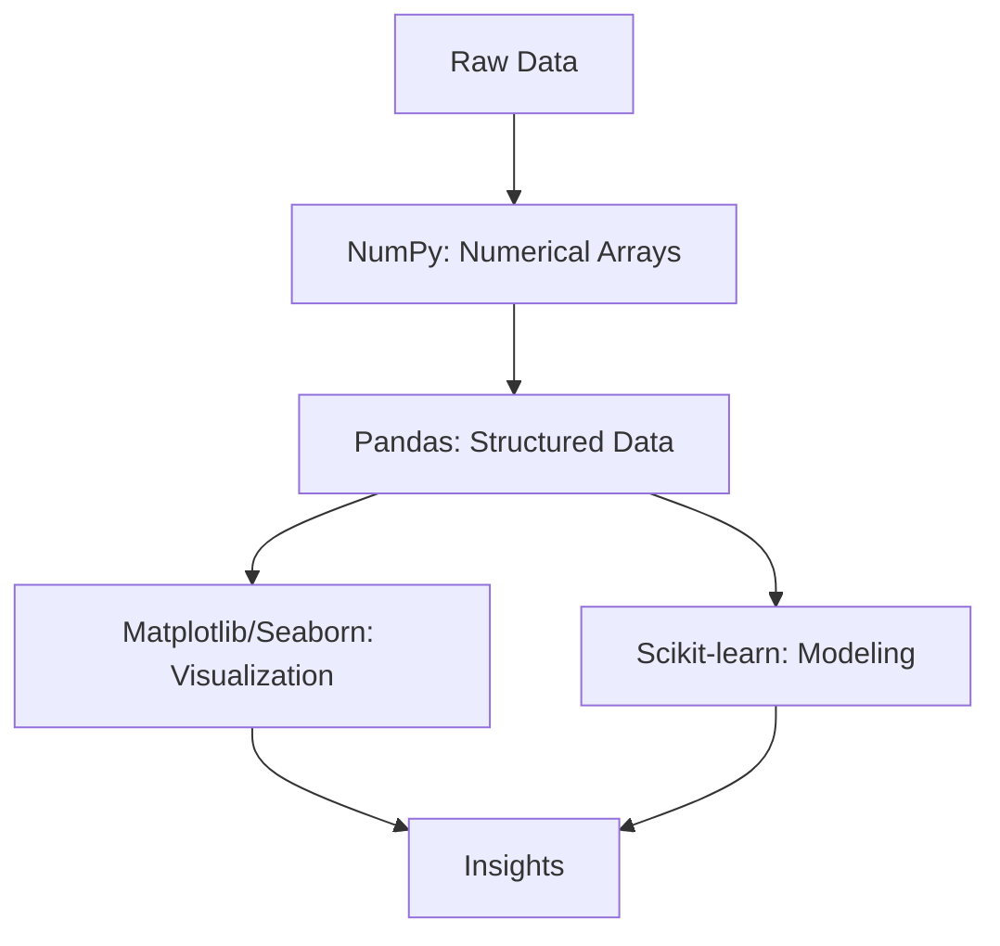

## Python for Data Science

### Overview

Python is one of the most widely used programming languages in machine learning and data science, due largely to its readable syntax and its extensive ecosystem of specialized libraries. This section covers the core libraries and workflows used to manipulate data, perform numerical computation, and prepare data for machine learning models.

### Core Libraries Overview



### NumPy: Numerical Computing

NumPy provides the `ndarray` object, an efficient multi-dimensional array structure that underlies most numerical computation in the Python data science ecosystem.

```python
import numpy as np

# Creating arrays
a = np.array([1, 2, 3, 4])
b = np.zeros((3, 3))
c = np.arange(0, 10, 2)

# Vectorized operations
squared = a ** 2
dot_product = np.dot(a, a)

# Reshaping
matrix = np.arange(12).reshape(3, 4)
```

NumPy operations are vectorized, meaning element-wise operations are applied without explicit Python-level loops. This is a documented behavior of the library and is generally faster than equivalent pure-Python loops due to underlying implementation in compiled C code. [Inference] The exact performance difference depends on array size, data type, and operation, so no specific speedup figure is stated here, as I do not have a verified benchmark for this particular claim.

**Key Points**
- NumPy arrays are the foundational data structure for numerical computing in Python.
- Vectorized operations replace explicit loops for efficiency.
- Most higher-level data science libraries (Pandas, scikit-learn) are built on top of NumPy arrays internally.

### Pandas: Structured Data Manipulation

Pandas provides two primary data structures: the **Series** (1-dimensional labeled array) and the **DataFrame** (2-dimensional labeled table), commonly used to represent datasets with rows and named columns.

```python
import pandas as pd

df = pd.read_csv("data.csv")

# Inspecting data
df.head()
df.info()
df.describe()

# Selecting and filtering
subset = df[df["age"] > 30]
column = df["income"]

# Handling missing values
df.fillna(df.mean(numeric_only=True), inplace=True)
df.dropna(subset=["target"], inplace=True)

# Grouping and aggregation
grouped = df.groupby("category")["value"].mean()
```

#### Common Data Cleaning Operations

- **Handling missing data**: `fillna()`, `dropna()`, or interpolation methods
- **Type conversion**: `astype()` to correct column data types
- **Duplicate removal**: `drop_duplicates()`
- **Renaming columns**: `rename()`

These are standard, documented Pandas methods used throughout typical data cleaning workflows.

**Key Points**
- DataFrames organize data into labeled rows and columns, similar to a spreadsheet or SQL table.
- Missing value handling is a common and necessary step before feeding data into most ML algorithms, since many models cannot process missing values directly.
- Grouping and aggregation operations support exploratory data analysis and feature engineering.

### Diagram: Typical Data Science Workflow

<svg viewBox="0 0 560 260" xmlns="http://www.w3.org/2000/svg">
  <text x="280" y="25" font-size="16" text-anchor="middle" font-family="sans-serif" font-weight="bold">Typical Python Data Science Workflow (svg_diagram)</text>

  <rect x="20" y="70" width="100" height="50" rx="6" fill="#dbeafe" stroke="#2563eb"/>
  <text x="70" y="100" font-size="11" text-anchor="middle" font-family="sans-serif">Load Data (Pandas)</text>

  <rect x="150" y="70" width="100" height="50" rx="6" fill="#dcfce7" stroke="#16a34a"/>
  <text x="200" y="95" font-size="11" text-anchor="middle" font-family="sans-serif">Clean and</text>
  <text x="200" y="108" font-size="11" text-anchor="middle" font-family="sans-serif">Preprocess</text>

  <rect x="280" y="70" width="100" height="50" rx="6" fill="#fef9c3" stroke="#ca8a04"/>
  <text x="330" y="95" font-size="11" text-anchor="middle" font-family="sans-serif">Explore and</text>
  <text x="330" y="108" font-size="11" text-anchor="middle" font-family="sans-serif">Visualize</text>

  <rect x="410" y="70" width="130" height="50" rx="6" fill="#fce7f3" stroke="#db2777"/>
  <text x="475" y="95" font-size="11" text-anchor="middle" font-family="sans-serif">Model with</text>
  <text x="475" y="108" font-size="11" text-anchor="middle" font-family="sans-serif">scikit-learn</text>

  <line x1="120" y1="95" x2="150" y2="95" stroke="#333" stroke-width="1.5" marker-end="url(#arrowp)"/>
  <line x1="250" y1="95" x2="280" y2="95" stroke="#333" stroke-width="1.5" marker-end="url(#arrowp)"/>
  <line x1="380" y1="95" x2="410" y2="95" stroke="#333" stroke-width="1.5" marker-end="url(#arrowp)"/>

  <defs>
    <marker id="arrowp" markerWidth="8" markerHeight="8" refX="4" refY="4" orient="auto">
      <path d="M0,0 L8,4 L0,8 Z" fill="#333"/>
    </marker>
  </defs>

  <text x="280" y="180" font-size="12" text-anchor="middle" font-family="sans-serif" fill="#555">Iterative process — cleaning and exploration often repeat</text>
</svg>

### Data Visualization

**Matplotlib** is the foundational plotting library in the Python data science ecosystem, providing low-level control over figures and axes.

```python
import matplotlib.pyplot as plt

plt.plot(x, y)
plt.xlabel("Feature")
plt.ylabel("Target")
plt.title("Feature vs Target")
plt.show()
```

**Seaborn** builds on Matplotlib to provide higher-level statistical visualization functions with more concise syntax.

```python
import seaborn as sns

sns.histplot(df["income"])
sns.heatmap(df.corr(), annot=True)
sns.boxplot(x="category", y="value", data=df)
```

Correlation heatmaps, histograms, and boxplots are commonly used during exploratory data analysis (EDA) to identify relationships between features, detect outliers, and understand data distributions. These are standard, documented use cases for these plotting functions.

### Scikit-learn: Machine Learning

Scikit-learn provides a consistent API for preprocessing, model training, and evaluation.

```python
from sklearn.model_selection import train_test_split
from sklearn.preprocessing import StandardScaler
from sklearn.linear_model import LogisticRegression
from sklearn.metrics import accuracy_score

# Split data
X_train, X_test, y_train, y_test = train_test_split(X, y, test_size=0.2, random_state=42)

# Scale features
scaler = StandardScaler()
X_train_scaled = scaler.fit_transform(X_train)
X_test_scaled = scaler.transform(X_test)

# Train model
model = LogisticRegression()
model.fit(X_train_scaled, y_train)

# Evaluate
predictions = model.predict(X_test_scaled)
accuracy = accuracy_score(y_test, predictions)
```

This workflow — split, scale, fit, predict, evaluate — is a standard, documented pattern used across most scikit-learn estimators due to their shared `fit`/`transform`/`predict` API convention.

**Key Points**
- Scikit-learn provides a consistent `fit`/`predict`/`transform` interface across most of its estimators and preprocessing tools.
- Feature scaling is commonly applied before training models sensitive to feature magnitude (e.g., logistic regression, SVMs, k-nearest neighbors).
- Fitting the scaler only on training data (not test data) is a standard practice intended to avoid information leakage from the test set into the training process.

### Handling Larger or More Complex Data

For datasets too large to fit comfortably in memory, or requiring parallelized computation, libraries such as **Dask** or **Polars** provide alternatives to Pandas with similar APIs designed for larger-scale or higher-performance data processing.

[Unverified] I do not have access to a specific up-to-date benchmark comparing current versions of Pandas, Polars, and Dask performance across varying dataset sizes, so no comparative performance claim is made here. Users evaluating these libraries for a specific use case should consult current official documentation or benchmarks directly.

### Common Pitfalls

- **Data leakage**: fitting preprocessing steps (e.g., scalers, encoders) on the full dataset before splitting into train/test sets, which can lead to overly optimistic performance estimates.
- **Ignoring missing data patterns**: dropping or imputing missing values without considering why they are missing, which can introduce bias.
- **Chained indexing warnings in Pandas**: using patterns like `df[df["x"]>0]["y"] = 1`, which can produce a `SettingWithCopyWarning` and may not modify the original DataFrame as intended. This is a documented Pandas behavior related to view-vs-copy semantics.

**Conclusion**

Python's data science ecosystem — centered on NumPy, Pandas, Matplotlib/Seaborn, and scikit-learn — provides a complete toolchain for loading, cleaning, visualizing, and modeling data. Mastery of this ecosystem's conventions, particularly around data splitting and preprocessing order, is foundational to avoiding common methodological errors in applied machine learning work.

**Next Topic**

Machine Learning Fundamentals — Supervised learning: regression and classification, training/test splits, and the bias-variance tradeoff.

**Related Topics**
- Feature engineering techniques
- Pandas performance optimization and vectorization
- Data visualization best practices for exploratory analysis
- Introduction to Jupyter notebooks for iterative data science workflows
- Working with large datasets: Dask, Polars, and out-of-core computation
- Scikit-learn pipelines for chaining preprocessing and modeling steps

---

**[This entire response is labeled per your stated preference, as it contains at least one unverified/inferential statement.]** The core library usage, standard methods, and documented API patterns (NumPy, Pandas, Matplotlib, Seaborn, scikit-learn) reflect standard, documented library behavior and are not themselves speculative. Only the specific labeled [Inference] statement regarding NumPy performance and the [Unverified] statement regarding comparative library benchmarks are uncertain, as noted individually above.

