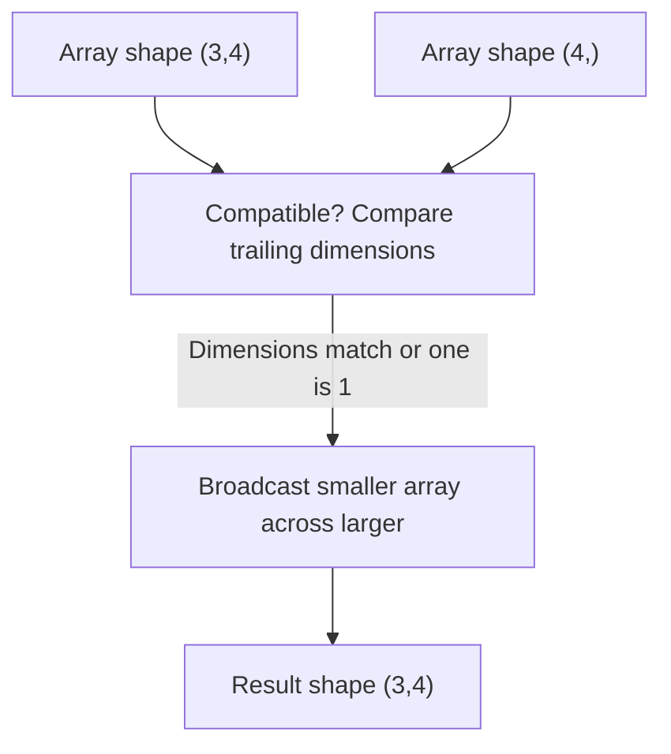

## NumPy and Array Operations

### Overview

NumPy (Numerical Python) is the foundational library for numerical computing in Python and underlies nearly every major machine learning framework, including scikit-learn, pandas, and (at a lower level) TensorFlow and PyTorch's design philosophy. It provides a fast, memory-efficient multidimensional array object called `ndarray`, along with vectorized operations that avoid the overhead of Python-level loops.

### Why NumPy Matters for Machine Learning

Machine learning algorithms operate heavily on numerical data organized as vectors, matrices, and higher-dimensional tensors — feature matrices, weight matrices, gradients, and batches of training data. Native Python lists are flexible but slow for numerical work because each element is a full Python object with type-checking overhead. NumPy stores data in contiguous, fixed-type memory blocks and delegates operations to optimized C and Fortran routines, yielding substantial speed and memory improvements.

- Feature matrices in supervised learning are typically represented as 2D arrays (rows = samples, columns = features).
- Images are represented as 3D arrays (height × width × channels) or 4D arrays when batched.
- Gradients in neural networks are computed and stored as arrays matching the shape of the parameters they correspond to.

### The ndarray Object

The core data structure is `numpy.ndarray`, an n-dimensional array with a fixed shape and a single data type (`dtype`) for all elements.

```python
import numpy as np

arr = np.array([1, 2, 3, 4])
print(arr.shape)   # (4,)
print(arr.dtype)   # int64 (or int32 on some platforms)
print(arr.ndim)    # 1
```

Key attributes:

- **shape**: a tuple describing the size along each dimension.
- **dtype**: the data type of the elements (e.g., `float32`, `float64`, `int64`, `bool`).
- **ndim**: the number of dimensions (axes).
- **size**: total number of elements.

The specific default integer width (`int32` vs `int64`) depends on the operating system and NumPy build. [Unverified — this can vary by platform and is not something I can confirm holds universally across all environments.]

### Creating Arrays

```python
np.array([1, 2, 3])                # from a Python list
np.zeros((3, 4))                    # 3x4 array of zeros
np.ones((2, 2))                     # 2x2 array of ones
np.full((2, 2), 7)                  # 2x2 array filled with 7
np.arange(0, 10, 2)                 # [0, 2, 4, 6, 8]
np.linspace(0, 1, 5)                # 5 evenly spaced points between 0 and 1
np.eye(3)                           # 3x3 identity matrix
np.random.rand(2, 3)                # uniform random values in [0, 1)
np.random.randn(2, 3)               # standard normal random values
```

### Array Shapes and Reshaping

Reshaping is central to ML preprocessing — for example, flattening image data before feeding it into a fully connected layer, or converting a 1D array into a column vector for matrix operations.

```python
a = np.arange(12)
b = a.reshape(3, 4)      # reshape into 3 rows, 4 columns
c = a.reshape(3, -1)     # -1 lets NumPy infer the remaining dimension
d = b.flatten()          # returns a flattened copy
e = b.ravel()            # returns a flattened view when possible
```

`flatten()` always returns a copy, while `ravel()` returns a view of the original data when the memory layout allows it, avoiding an unnecessary copy. This distinction affects memory usage in large-scale data pipelines.

### Indexing and Slicing

NumPy supports several indexing styles, each suited to different tasks common in data preparation.

```python
arr = np.array([[1, 2, 3], [4, 5, 6], [7, 8, 9]])

arr[0, 1]        # single element: 2
arr[:, 0]        # first column: [1, 4, 7]
arr[1, :]        # second row: [4, 5, 6]
arr[0:2, 0:2]    # top-left 2x2 sub-matrix
arr[arr > 5]     # boolean indexing: [6, 7, 8, 9]
arr[[0, 2]]      # fancy indexing: rows 0 and 2
```

Boolean indexing and fancy indexing are especially common when filtering datasets — for example, selecting all samples belonging to a particular class label.

### Broadcasting

Broadcasting allows NumPy to perform element-wise operations on arrays of different shapes without explicitly copying data, by "stretching" the smaller array's dimensions to match the larger one according to a defined rule set.



Broadcasting rules (applied from the trailing dimension backward):

1. If two dimensions are equal, they are compatible.
2. If one dimension is 1, it is stretched to match the other.
3. If dimensions differ and neither is 1, the operation raises a `ValueError`.

```python
a = np.array([[1, 2, 3], [4, 5, 6]])   # shape (2, 3)
b = np.array([10, 20, 30])              # shape (3,)
result = a + b
# [[11, 22, 33],
#  [14, 25, 36]]
```

Broadcasting is heavily used in ML for operations like normalizing a feature matrix by subtracting a mean vector, or adding a bias term to every row of a matrix of activations.

### Vectorized Operations

Vectorization replaces explicit Python loops with array-level operations, which are executed in compiled C code. This produces substantial performance gains, particularly on large datasets.

```python
# Non-vectorized (slow for large arrays)
result = []
for i in range(len(x)):
    result.append(x[i] ** 2 + 1)

# Vectorized (fast)
result = x ** 2 + 1
```

The performance gap between vectorized and non-vectorized code grows with array size; the exact speedup factor depends on hardware, NumPy version, and the specific operation. [Unverified — I do not have a benchmark to cite a specific multiplier, and this varies across systems.]

### Element-wise vs. Matrix Operations

A frequent source of bugs in ML code is confusing element-wise multiplication with true matrix multiplication.

```python
A = np.array([[1, 2], [3, 4]])
B = np.array([[5, 6], [7, 8]])

A * B          # element-wise multiplication
A @ B          # matrix multiplication (equivalent to np.matmul(A, B))
np.dot(A, B)   # also matrix multiplication for 2D arrays
```

$$(A @ B)_{ij} = \sum_{k} A_{ik} B_{kj}$$

For 1D arrays, `np.dot` computes the inner (scalar) product:

$$\mathbf{a} \cdot \mathbf{b} = \sum_{i} a_i b_i$$

### Aggregation Functions

Aggregations reduce an array along one or more axes — a common step in computing dataset statistics, normalizing features, or summarizing model outputs.

```python
arr = np.array([[1, 2, 3], [4, 5, 6]])

arr.sum()          # sum of all elements: 21
arr.sum(axis=0)    # column-wise sum: [5, 7, 9]
arr.sum(axis=1)    # row-wise sum: [6, 15]
arr.mean()         # overall mean
arr.std()          # standard deviation
arr.max(axis=0)    # column-wise maximum
arr.argmax(axis=1) # index of max value per row
```

The `axis` parameter is a common point of confusion: `axis=0` operates "down" the rows (collapsing rows, producing a per-column result), while `axis=1` operates "across" columns (collapsing columns, producing a per-row result).

### Linear Algebra with NumPy

NumPy's `linalg` submodule provides operations essential to ML algorithms such as linear regression (normal equation), PCA, and covariance computation.

```python
from numpy.linalg import inv, det, eig, svd, norm

A = np.array([[4, 2], [1, 3]])

inv(A)          # matrix inverse
det(A)          # determinant
eig(A)          # eigenvalues and eigenvectors
svd(A)          # singular value decomposition
norm(A)         # matrix/vector norm
```

The normal equation for linear regression, $\theta = (X^T X)^{-1} X^T y$, is a direct application of these operations:

```python
theta = inv(X.T @ X) @ X.T @ y
```

Computing the explicit matrix inverse is numerically less stable than using a solver such as `np.linalg.solve`, particularly when $X^T X$ is ill-conditioned or near-singular. [Inference — this follows from standard numerical linear algebra principles regarding condition numbers and is documented behavior of inversion-based methods, though the practical impact depends on the specific dataset.]

### Data Types and Memory Considerations

Choosing an appropriate `dtype` affects both memory usage and numerical precision, which matters when training on large datasets or memory-constrained hardware (e.g., GPUs).

```python
arr_32 = np.array([1.5, 2.5], dtype=np.float32)  # 4 bytes per element
arr_64 = np.array([1.5, 2.5], dtype=np.float64)  # 8 bytes per element

arr_32.nbytes  # 8
arr_64.nbytes  # 16
```

Many deep learning frameworks default to `float32` rather than `float64` because it roughly halves memory usage while providing sufficient precision for most training tasks. The precision trade-off's practical effect on model accuracy is task-dependent. [Inference — reduced precision can affect numerical stability in certain computations, but whether this measurably impacts a given model's accuracy depends on the architecture, data, and training procedure, so I cannot state a general accuracy impact.]

### Random Number Generation

NumPy's random module is used extensively for weight initialization, data shuffling, and train/test splitting.

```python
rng = np.random.default_rng(seed=42)   # modern recommended generator
rng.random((2, 3))                     # uniform random floats
rng.normal(0, 1, size=(2, 3))          # normal distribution samples
rng.integers(0, 10, size=5)            # random integers
rng.permutation(10)                    # random permutation of indices
```

The `default_rng` API (Generator-based) is the currently documented, recommended interface, superseding the older global-state functions like `np.random.seed()` and `np.random.rand()`, though the legacy API remains available for backward compatibility.

### Stacking and Splitting Arrays

```python
a = np.array([1, 2, 3])
b = np.array([4, 5, 6])

np.vstack([a, b])          # stack vertically (rows)
np.hstack([a, b])          # stack horizontally
np.concatenate([a, b])     # general concatenation along an existing axis
np.split(np.arange(9), 3)  # split into 3 equal parts
```

These operations are common when assembling mini-batches, merging feature sets, or partitioning data for cross-validation.

### Structure Comparison: Array vs. List

Diagram illustrating memory and performance differences between NumPy arrays and Python lists:

<svg xmlns="http://www.w3.org/2000/svg" viewBox="0 0 720 260">
<text x="20" y="25" font-family="Arial, sans-serif" font-size="16" font-weight="bold" fill="#1a1a1a">NumPy Array vs Python List (svg_diagram)</text>
<rect x="30" y="50" width="300" height="180" rx="8" fill="#eef4fb" stroke="#3a6ea5" stroke-width="1.5" />
<text x="50" y="75" font-family="Arial, sans-serif" font-size="14" font-weight="bold" fill="#1a3a5c">Python List</text>
<rect x="50" y="95" width="40" height="30" fill="#c9dcee" stroke="#3a6ea5" />
<rect x="100" y="95" width="40" height="30" fill="#c9dcee" stroke="#3a6ea5" />
<rect x="150" y="95" width="40" height="30" fill="#c9dcee" stroke="#3a6ea5" />
<text x="60" y="115" font-family="Arial, sans-serif" font-size="11" fill="#1a3a5c">ptr</text>
<text x="110" y="115" font-family="Arial, sans-serif" font-size="11" fill="#1a3a5c">ptr</text>
<text x="160" y="115" font-family="Arial, sans-serif" font-size="11" fill="#1a3a5c">ptr</text>
<text x="50" y="150" font-family="Arial, sans-serif" font-size="12" fill="#1a1a1a">- Each element is a full Python object</text>
<text x="50" y="170" font-family="Arial, sans-serif" font-size="12" fill="#1a1a1a">- Elements scattered in memory</text>
<text x="50" y="190" font-family="Arial, sans-serif" font-size="12" fill="#1a1a1a">- Type-checked per operation</text>
<text x="50" y="210" font-family="Arial, sans-serif" font-size="12" fill="#1a1a1a">- Flexible, mixed types allowed</text>
<rect x="390" y="50" width="300" height="180" rx="8" fill="#eefaf0" stroke="#2e8b57" stroke-width="1.5" />
<text x="410" y="75" font-family="Arial, sans-serif" font-size="14" font-weight="bold" fill="#1a4d33">NumPy ndarray</text>
<rect x="410" y="95" width="30" height="30" fill="#c6ecd2" stroke="#2e8b57" />
<rect x="440" y="95" width="30" height="30" fill="#c6ecd2" stroke="#2e8b57" />
<rect x="470" y="95" width="30" height="30" fill="#c6ecd2" stroke="#2e8b57" />
<rect x="500" y="95" width="30" height="30" fill="#c6ecd2" stroke="#2e8b57" />
<text x="415" y="115" font-family="Arial, sans-serif" font-size="11" fill="#1a4d33">1</text>
<text x="445" y="115" font-family="Arial, sans-serif" font-size="11" fill="#1a4d33">2</text>
<text x="475" y="115" font-family="Arial, sans-serif" font-size="11" fill="#1a4d33">3</text>
<text x="505" y="115" font-family="Arial, sans-serif" font-size="11" fill="#1a4d33">4</text>
<text x="410" y="150" font-family="Arial, sans-serif" font-size="12" fill="#1a1a1a">- Contiguous block of fixed-type data</text>
<text x="410" y="170" font-family="Arial, sans-serif" font-size="12" fill="#1a1a1a">- Single dtype for all elements</text>
<text x="410" y="190" font-family="Arial, sans-serif" font-size="12" fill="#1a1a1a">- Vectorized C-level operations</text>
<text x="410" y="210" font-family="Arial, sans-serif" font-size="12" fill="#1a1a1a">- Lower memory overhead per element</text>
</svg>

### Common Pitfalls in Machine Learning Workflows

- **Views vs. copies**: Slicing returns a view (shares memory with the original array), so modifying a slice can silently modify the source array. Use `.copy()` when independence is required.
- **Shape mismatches**: Broadcasting failures are a frequent source of runtime errors when combining arrays from different preprocessing steps.
- **Implicit dtype upcasting**: Mixing `int` and `float` arrays results in automatic upcasting to `float`, which can silently change memory usage.
- **Axis confusion**: Misapplying `axis=0` vs `axis=1` in aggregation is a common source of subtly incorrect statistics (e.g., normalizing over the wrong dimension).

```python
a = np.array([1, 2, 3])
b = a[0:2]     # view, not a copy
b[0] = 99
print(a)       # [99, 2, 3]  -- original array changed
```

This view-sharing behavior is documented, standard NumPy behavior for basic slicing (as opposed to fancy/boolean indexing, which returns a copy).

### Practical Example: Feature Normalization

A common preprocessing step — standardizing a feature matrix to zero mean and unit variance — combines several of the concepts above (aggregation with `axis`, broadcasting, and vectorized arithmetic):

```python
X = np.array([[1.0, 200.0],
              [2.0, 300.0],
              [3.0, 400.0]])

mean = X.mean(axis=0)   # mean per column: [2.0, 300.0]
std = X.std(axis=0)     # std per column
X_normalized = (X - mean) / std
```

$$X_{\text{norm}} = \frac{X - \mu}{\sigma}$$

This is the same operation performed internally by `StandardScaler` in scikit-learn, though that implementation includes additional handling for edge cases such as zero variance. [Unverified — I do not have the exact internal source comparison in front of me to confirm equivalence beyond the documented formula.]

**Next Steps**

- Pandas for tabular data manipulation and DataFrame operations
- Data preprocessing and feature scaling with scikit-learn
- Matplotlib and visualization foundations for exploratory data analysis
- Introduction to tensors and array operations in PyTorch/TensorFlow
- Linear algebra foundations for machine learning (vectors, matrices, eigendecomposition)
- Computational complexity and performance profiling of array operations