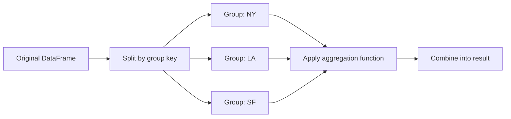

## Pandas for Data Manipulation

### Overview

Pandas is a Python library built on top of NumPy that provides labeled, tabular data structures — primarily the `Series` (1D) and `DataFrame` (2D) — along with a large set of tools for reading, cleaning, transforming, and analyzing structured data. It is one of the most widely used libraries in the data preparation stage of machine learning workflows.

### Why Pandas Matters for Machine Learning

Raw data for ML projects typically arrives in heterogeneous, labeled formats — CSV files, database tables, spreadsheets, JSON logs — where columns have names and mixed types (numeric, categorical, datetime, text). NumPy arrays are optimized for homogeneous numerical computation but lack native support for labeled axes and mixed-type columns. Pandas fills this gap, serving as the standard tool for the data-loading and preprocessing stages that precede model training.

- Feature engineering, missing-value handling, and encoding of categorical variables are commonly performed in pandas before data is converted to NumPy arrays for model input.
- Exploratory data analysis (EDA) — inspecting distributions, correlations, and data quality issues — is typically done using pandas.

### Core Data Structures

**Series**: a one-dimensional labeled array capable of holding any data type.

```python
import pandas as pd

s = pd.Series([10, 20, 30], index=['a', 'b', 'c'])
print(s)
# a    10
# b    20
# c    30
```

**DataFrame**: a two-dimensional labeled structure, conceptually similar to a spreadsheet or SQL table, where each column is a `Series`.

```python
df = pd.DataFrame({
    'age': [25, 32, 47],
    'income': [50000, 64000, 120000],
    'city': ['NY', 'LA', 'SF']
})
print(df)
```

### Reading and Writing Data

Pandas provides readers/writers for many common formats used in ML pipelines.

```python
df = pd.read_csv('data.csv')
df = pd.read_excel('data.xlsx')
df = pd.read_json('data.json')
df = pd.read_parquet('data.parquet')
df = pd.read_sql('SELECT * FROM table', connection)

df.to_csv('output.csv', index=False)
df.to_parquet('output.parquet')
```

Format support (e.g., Parquet, SQL) depends on optional dependencies (such as `pyarrow` or a database driver) being installed. [Unverified — I do not have access to confirm which optional packages are bundled by default in any specific pandas installation or environment.]

### Inspecting Data

```python
df.head()          # first 5 rows
df.tail(3)          # last 3 rows
df.shape            # (rows, columns)
df.info()           # dtypes, non-null counts, memory usage
df.describe()       # summary statistics for numeric columns
df.dtypes           # data type of each column
df.columns          # column names
df.isnull().sum()   # missing value counts per column
```

`df.describe()` by default computes statistics only for numeric columns unless `include='all'` is specified.

### Selecting and Indexing Data

Pandas provides multiple indexing mechanisms, each with distinct semantics:

```python
df['age']                    # select a single column (returns a Series)
df[['age', 'income']]        # select multiple columns (returns a DataFrame)
df.loc[0]                    # label-based row selection
df.loc[0, 'age']             # label-based row + column selection
df.iloc[0]                   # integer-position-based row selection
df.iloc[0:2, 0:2]            # integer-position-based slicing
df[df['age'] > 30]           # boolean filtering
```

- `.loc` is label-based: it selects by index/column *names*.
- `.iloc` is position-based: it selects by integer *position*, similar to NumPy indexing.

Mixing `.loc` and `.iloc` semantics incorrectly (e.g., assuming `.loc` behaves like positional slicing) is a documented, common source of off-by-one errors, since `.loc` slicing is inclusive of the endpoint while `.iloc` is not.

```python
df.loc[0:2]   # includes rows labeled 0, 1, AND 2
df.iloc[0:2]  # includes only rows at positions 0 and 1
```

### Handling Missing Data

Missing data handling is a routine and consequential step in ML preprocessing, since most estimators cannot operate directly on missing values.

```python
df.isnull()                          # boolean mask of missing values
df.dropna()                          # drop rows with any missing values
df.dropna(axis=1)                    # drop columns with any missing values
df.fillna(0)                         # fill missing values with 0
df.fillna(df.mean(numeric_only=True))# fill with column mean
df.fillna(method='ffill')            # forward-fill
df.interpolate()                     # interpolate missing values
```

The choice of missing-data strategy (dropping vs. imputing, and which imputation method) affects downstream model performance in ways that are dataset-dependent. [Inference — the general principle that imputation choice affects model outcomes is well established in ML literature, but the direction or magnitude of the effect for any specific dataset cannot be determined without testing on that dataset.]

### Data Transformation

```python
df['age_squared'] = df['age'] ** 2                       # new column from vectorized op
df['category'] = df['income'].apply(lambda x: 'high' if x > 60000 else 'low')
df.rename(columns={'age': 'years'}, inplace=True)
df.astype({'age': 'float64'})                             # change dtype
df.replace({'NY': 'New York'})                             # value replacement
df.drop(columns=['city'])                                  # drop a column
df.drop_duplicates()                                       # remove duplicate rows
```

`.apply()` operates row-by-row or element-by-element in Python and is generally slower than vectorized pandas/NumPy operations on large datasets, since it does not benefit from the same compiled-loop optimizations. [Inference — this follows from `.apply()`'s documented implementation using Python-level iteration rather than vectorized C operations, though the actual performance gap depends on the operation and data size.]

### Grouping and Aggregation

`groupby` implements a split-apply-combine pattern, commonly used to compute per-category statistics — for example, average feature values per class label.

```python
df.groupby('city')['income'].mean()
df.groupby('city').agg({'income': 'mean', 'age': 'max'})
df.groupby(['city', 'category']).size()
```



### Merging and Joining DataFrames

Combining multiple data sources is common when features originate from different tables (e.g., joining a user table with a transactions table).

```python
pd.merge(df1, df2, on='id', how='inner')   # inner join
pd.merge(df1, df2, on='id', how='left')    # left join
pd.merge(df1, df2, on='id', how='outer')   # full outer join
pd.concat([df1, df2], axis=0)              # stack rows
pd.concat([df1, df2], axis=1)              # stack columns
df1.join(df2, how='left')                  # join on index
```

The `how` parameter (`inner`, `left`, `right`, `outer`) follows standard SQL join semantics.

### Handling Categorical Data

Categorical encoding is a prerequisite step for most ML algorithms, which generally require numeric input.

```python
pd.get_dummies(df, columns=['city'])            # one-hot encoding
df['city'].astype('category').cat.codes          # integer label encoding
df['city'].value_counts()                        # frequency count
```

One-hot encoding via `get_dummies` increases dimensionality by one column per category (or one fewer if `drop_first=True` is used), which is a documented characteristic of the function relevant to models sensitive to multicollinearity.

### Working with Dates and Times

Time-based features are common in forecasting and any dataset with a temporal component.

```python
df['date'] = pd.to_datetime(df['date'])
df['year'] = df['date'].dt.year
df['month'] = df['date'].dt.month
df['day_of_week'] = df['date'].dt.dayofweek
df.set_index('date', inplace=True)
df.resample('M').mean()   # resample to monthly frequency
```

### Pivot Tables and Reshaping

```python
df.pivot_table(values='income', index='city', columns='category', aggfunc='mean')
df.melt(id_vars=['id'], value_vars=['age', 'income'])   # wide to long format
df.stack()      # columns to rows
df.unstack()    # rows to columns
```

### Structure Comparison: DataFrame Anatomy

<svg xmlns="http://www.w3.org/2000/svg" viewBox="0 0 700 320">
<text x="20" y="25" font-family="Arial, sans-serif" font-size="16" font-weight="bold" fill="#1a1a1a">Anatomy of a DataFrame (svg_diagram)</text>

<text x="200" y="55" font-family="Arial, sans-serif" font-size="12" font-weight="bold" fill="`#1a3a5c`">age</text>

<text x="300" y="55" font-family="Arial, sans-serif" font-size="12" font-weight="bold" fill="`#1a3a5c`">income</text>

<text x="400" y="55" font-family="Arial, sans-serif" font-size="12" font-weight="bold" fill="`#1a3a5c`">city</text>

<rect x="60" y="65" width="100" height="30" fill="#f0f0f0" stroke="#999" />
<text x="70" y="85" font-family="Arial, sans-serif" font-size="12" fill="#333">index: 0</text>
<rect x="170" y="65" width="100" height="30" fill="#eef4fb" stroke="#3a6ea5" />
<text x="200" y="85" font-family="Arial, sans-serif" font-size="12" fill="#1a1a1a">25</text>
<rect x="270" y="65" width="100" height="30" fill="#eef4fb" stroke="#3a6ea5" />
<text x="295" y="85" font-family="Arial, sans-serif" font-size="12" fill="#1a1a1a">50000</text>
<rect x="370" y="65" width="100" height="30" fill="#eef4fb" stroke="#3a6ea5" />
<text x="405" y="85" font-family="Arial, sans-serif" font-size="12" fill="#1a1a1a">NY</text>
<rect x="60" y="95" width="100" height="30" fill="#f0f0f0" stroke="#999" />
<text x="70" y="115" font-family="Arial, sans-serif" font-size="12" fill="#333">index: 1</text>
<rect x="170" y="95" width="100" height="30" fill="#eef4fb" stroke="#3a6ea5" />
<text x="200" y="115" font-family="Arial, sans-serif" font-size="12" fill="#1a1a1a">32</text>
<rect x="270" y="95" width="100" height="30" fill="#eef4fb" stroke="#3a6ea5" />
<text x="295" y="115" font-family="Arial, sans-serif" font-size="12" fill="#1a1a1a">64000</text>
<rect x="370" y="95" width="100" height="30" fill="#eef4fb" stroke="#3a6ea5" />
<text x="405" y="115" font-family="Arial, sans-serif" font-size="12" fill="#1a1a1a">LA</text>
<rect x="60" y="125" width="100" height="30" fill="#f0f0f0" stroke="#999" />
<text x="70" y="145" font-family="Arial, sans-serif" font-size="12" fill="#333">index: 2</text>
<rect x="170" y="125" width="100" height="30" fill="#eef4fb" stroke="#3a6ea5" />
<text x="200" y="145" font-family="Arial, sans-serif" font-size="12" fill="#1a1a1a">47</text>
<rect x="270" y="125" width="100" height="30" fill="#eef4fb" stroke="#3a6ea5" />
<text x="295" y="145" font-family="Arial, sans-serif" font-size="12" fill="#1a1a1a">120000</text>
<rect x="370" y="125" width="100" height="30" fill="#eef4fb" stroke="#3a6ea5" />
<text x="405" y="145" font-family="Arial, sans-serif" font-size="12" fill="#1a1a1a">SF</text>

<text x="60" y="180" font-family="Arial, sans-serif" font-size="12" fill="`#1a1a1a`">- Index (row labels): gray column on the left</text>

<text x="60" y="200" font-family="Arial, sans-serif" font-size="12" fill="`#1a1a1a`">- Each column is a Series with its own dtype</text>

<text x="60" y="220" font-family="Arial, sans-serif" font-size="12" fill="`#1a1a1a`">- Columns can hold different types (int, float, object)</text>

<text x="60" y="240" font-family="Arial, sans-serif" font-size="12" fill="`#1a1a1a`">- Row and column labels enable .loc-style access</text>

</svg>

### Common Pitfalls in Machine Learning Workflows

- **Chained indexing**: Expressions like `df[df['a'] > 0]['b'] = 5` may trigger a `SettingWithCopyWarning` because it is ambiguous whether a view or a copy is being modified. Using `.loc` for combined filtering and assignment (`df.loc[df['a'] > 0, 'b'] = 5`) is the documented recommended pattern.
- **Data leakage during preprocessing**: Computing statistics (mean, std) on the full dataset before a train/test split — rather than fitting only on the training set — can leak information from the test set into preprocessing. This is a well-established methodological concern in ML practice, not specific to pandas itself.
- **Silent dtype coercion**: Introducing a single `NaN` into an integer column upcasts the entire column to `float64`, since pandas' legacy integer dtype cannot represent missing values natively. Newer nullable integer types (e.g., `Int64`, capital I) address this. [Unverified — I cannot confirm the current default behavior across all pandas versions without checking the specific version in use.]
- **Copy vs. view ambiguity**: Similar to NumPy, some pandas operations return views and others return copies, and this is not always predictable from the syntax alone; this has been a long-standing, documented source of confusion referenced in pandas' own documentation.

### Practical Example: Preparing a Dataset for Model Training

```python
import pandas as pd

df = pd.read_csv('customers.csv')

# Handle missing values
df['income'] = df['income'].fillna(df['income'].median())
df = df.dropna(subset=['target'])

# Encode categorical variables
df = pd.get_dummies(df, columns=['city'], drop_first=True)

# Feature engineering
df['income_per_age'] = df['income'] / df['age']

# Split features and target
X = df.drop(columns=['target'])
y = df['target']

print(X.shape, y.shape)
```

This sequence — impute, encode, engineer, split — reflects a common but not universal ordering; specific projects may require encoding before imputation or additional steps such as outlier removal. [Speculation — the "typical" ordering described here is a general convention I am presenting based on common practice, not a fixed rule confirmed by any single authoritative source.]

**Next Steps**

- NumPy and array operations (foundation for pandas' underlying data representation)
- Scikit-learn preprocessing: `StandardScaler`, `OneHotEncoder`, `SimpleImputer` as pipeline alternatives to manual pandas transforms
- Exploratory data analysis and visualization with Matplotlib/Seaborn
- Feature engineering strategies for structured/tabular data
- Handling large datasets: pandas performance, chunking, and alternatives like Dask or Polars
- Train/test splitting and avoiding data leakage in preprocessing pipelines