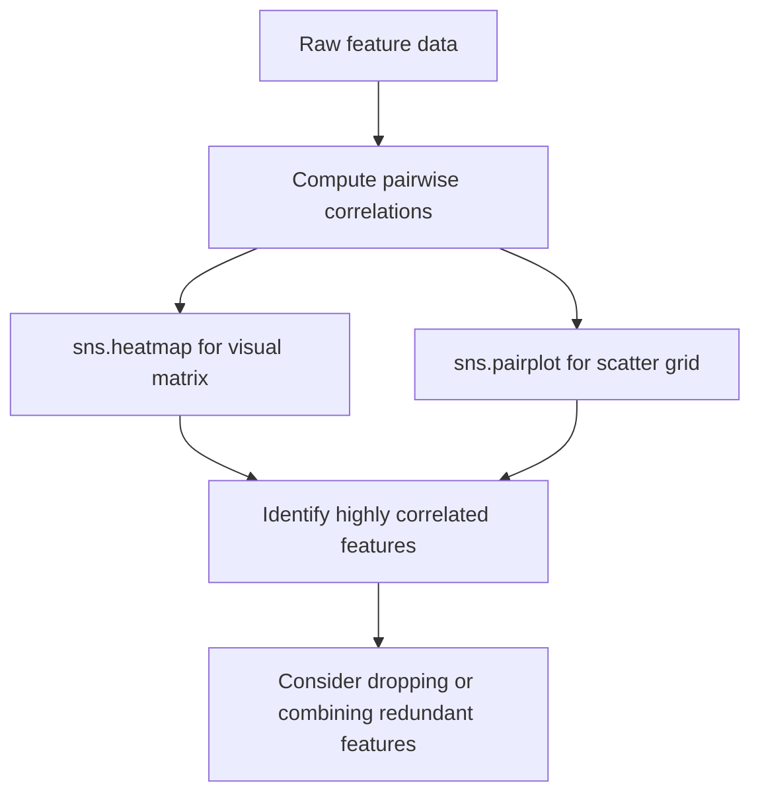

## Matplotlib and Seaborn for Visualization

### Overview

Matplotlib is Python's foundational plotting library, providing low-level, granular control over figures, axes, and visual elements. Seaborn is built on top of Matplotlib and provides a higher-level interface with statistically oriented plot types and more polished default styling. Together, they form the standard visualization toolkit used throughout the machine learning workflow — from exploratory data analysis to model evaluation.

### Why Visualization Matters for Machine Learning

Visualization supports multiple stages of the ML pipeline: understanding feature distributions, detecting outliers, examining relationships between variables, checking class balance, and evaluating model performance (e.g., confusion matrices, ROC curves, loss curves). Numeric summaries alone (like `df.describe()`) can obscure patterns — such as multimodal distributions or non-linear relationships — that become apparent visually. This general principle is a widely cited rationale for visualization in data analysis education material; I am presenting it as established practice rather than citing a specific source. [Unverified]

### Matplotlib Basics

Matplotlib's core object model consists of a `Figure` (the overall canvas) and one or more `Axes` (individual plots within that canvas).

```python
import matplotlib.pyplot as plt
import numpy as np

x = np.linspace(0, 10, 100)
y = np.sin(x)

fig, ax = plt.subplots(figsize=(8, 5))
ax.plot(x, y, label='sin(x)')
ax.set_xlabel('x')
ax.set_ylabel('y')
ax.set_title('Sine Wave')
ax.legend()
plt.show()
```

The object-oriented interface (`fig, ax = plt.subplots()`) is the documented recommended approach for anything beyond the simplest plots, as opposed to the older stateful `plt.plot()`-only interface, because it gives explicit control when creating multiple subplots. [Inference — this preference is commonly stated in Matplotlib's own documentation and community conventions, though I cannot verify the exact current wording of that guidance without checking the specific documentation version.]

### Common Plot Types in Matplotlib

```python
ax.plot(x, y)                        # line plot
ax.scatter(x, y)                     # scatter plot
ax.bar(categories, values)           # bar chart
ax.hist(data, bins=30)               # histogram
ax.boxplot(data)                     # box plot
ax.imshow(image_array)               # display image/array data
```

### Subplots and Layouts

Comparing multiple features or model outputs side by side is a routine task in EDA and evaluation.

```python
fig, axes = plt.subplots(2, 2, figsize=(10, 8))

axes[0, 0].plot(x, np.sin(x))
axes[0, 0].set_title('Sine')

axes[0, 1].plot(x, np.cos(x))
axes[0, 1].set_title('Cosine')

axes[1, 0].hist(np.random.randn(1000), bins=30)
axes[1, 0].set_title('Histogram')

axes[1, 1].scatter(np.random.rand(50), np.random.rand(50))
axes[1, 1].set_title('Scatter')

plt.tight_layout()
plt.show()
```

`plt.tight_layout()` adjusts subplot spacing to reduce overlap between titles, labels, and adjacent plots.

### Seaborn Overview

Seaborn integrates with pandas DataFrames directly, accepting column names and a `data=` argument rather than requiring raw arrays, which reduces boilerplate for common statistical plots.

```python
import seaborn as sns
import pandas as pd

df = pd.DataFrame({
    'age': [25, 32, 47, 51, 62, 23, 34],
    'income': [50000, 64000, 120000, 110000, 98000, 45000, 71000],
    'category': ['A', 'B', 'A', 'B', 'A', 'B', 'A']
})

sns.scatterplot(data=df, x='age', y='income', hue='category')
plt.show()
```

### Common Seaborn Plot Types for ML

```python
sns.histplot(data=df, x='age', kde=True)              # histogram with density estimate
sns.boxplot(data=df, x='category', y='income')         # box plot by group
sns.violinplot(data=df, x='category', y='income')      # distribution shape by group
sns.pairplot(df, hue='category')                       # pairwise relationships
sns.heatmap(df.corr(numeric_only=True), annot=True)    # correlation matrix
sns.barplot(data=df, x='category', y='income')         # aggregated bar plot with error bars
sns.regplot(data=df, x='age', y='income')              # scatter plot with regression line
```

`sns.heatmap` combined with `df.corr()` is a common method for visually inspecting multicollinearity among numeric features before model training.

### Distribution Analysis

Understanding feature distributions informs decisions about transformations (e.g., log-scaling skewed features) and the choice of scaling method.

```python
fig, axes = plt.subplots(1, 2, figsize=(12, 4))

sns.histplot(data=df, x='income', kde=True, ax=axes[0])
axes[0].set_title('Income Distribution')

sns.boxplot(data=df, y='income', ax=axes[1])
axes[1].set_title('Income Box Plot')

plt.tight_layout()
plt.show()
```

Box plots display the median, interquartile range (IQR), and points beyond $1.5 \times \text{IQR}$ from the quartiles, conventionally treated as outliers:

$$\text{Outlier bounds} = [Q_1 - 1.5 \times IQR,\ Q_3 + 1.5 \times IQR]$$

The $1.5 \times IQR$ convention is a widely taught rule of thumb (commonly attributed to John Tukey's exploratory data analysis work); I cannot verify the original source text directly. [Unverified]

### Correlation and Relationship Visualization



### Visualizing Model Evaluation

Post-training evaluation commonly relies on visualizations such as confusion matrices, ROC curves, and residual plots.

```python
from sklearn.metrics import confusion_matrix
import seaborn as sns

cm = confusion_matrix(y_true, y_pred)
sns.heatmap(cm, annot=True, fmt='d', cmap='Blues')
plt.xlabel('Predicted')
plt.ylabel('Actual')
plt.title('Confusion Matrix')
plt.show()
```

```python
# Training/validation loss curves (common in deep learning)
plt.plot(history['train_loss'], label='Train Loss')
plt.plot(history['val_loss'], label='Validation Loss')
plt.xlabel('Epoch')
plt.ylabel('Loss')
plt.legend()
plt.show()
```

Loss curve plots are commonly used to visually assess overfitting, where diverging train/validation loss trends are interpreted as an indicator worth investigating. I am not able to state that this pattern eliminates the need for other diagnostic checks, and interpretation guidance here reflects common practice rather than a confirmed universal rule. [Inference]

### Styling and Customization

```python
sns.set_style('whitegrid')          # seaborn style preset
plt.style.use('ggplot')             # matplotlib style preset

fig, ax = plt.subplots(figsize=(8, 5))
ax.plot(x, y, color='steelblue', linewidth=2, linestyle='--', marker='o')
ax.set_xlim(0, 10)
ax.set_ylim(-1.5, 1.5)
ax.grid(True, alpha=0.3)
```

### Saving Figures

```python
fig.savefig('plot.png', dpi=300, bbox_inches='tight')
fig.savefig('plot.pdf')
fig.savefig('plot.svg')
```

`dpi=300` is a commonly used setting for publication-quality raster output; `bbox_inches='tight'` trims excess whitespace around the figure.

### Structure Comparison: Matplotlib Figure Anatomy

<svg xmlns="http://www.w3.org/2000/svg" viewBox="0 0 700 380">
<text x="20" y="25" font-family="Arial, sans-serif" font-size="16" font-weight="bold" fill="#1a1a1a">Matplotlib Figure Anatomy (svg_diagram)</text>
<rect x="40" y="50" width="620" height="300" fill="#fafafa" stroke="#555" stroke-width="2" />
<text x="50" y="70" font-family="Arial, sans-serif" font-size="12" fill="#555">Figure</text>
<rect x="90" y="90" width="240" height="220" fill="#eef4fb" stroke="#3a6ea5" stroke-width="1.5" />
<text x="100" y="108" font-family="Arial, sans-serif" font-size="12" font-weight="bold" fill="#1a3a5c">Axes 1</text>
<line x1="110" y1="280" x2="310" y2="280" stroke="#1a1a1a" stroke-width="1" />
<line x1="110" y1="120" x2="110" y2="280" stroke="#1a1a1a" stroke-width="1" />
<polyline points="115,260 140,200 165,230 190,150 215,190 240,170 265,140 290,180" fill="none" stroke="#3a6ea5" stroke-width="2" />
<text x="180" y="300" font-family="Arial, sans-serif" font-size="10" fill="#333">x-axis label</text>
<text x="60" y="200" font-family="Arial, sans-serif" font-size="10" fill="#333" transform="rotate(-90 60 200)">y-axis label</text>
<rect x="370" y="90" width="240" height="220" fill="#eefaf0" stroke="#2e8b57" stroke-width="1.5" />
<text x="380" y="108" font-family="Arial, sans-serif" font-size="12" font-weight="bold" fill="#1a4d33">Axes 2</text>
<line x1="390" y1="280" x2="590" y2="280" stroke="#1a1a1a" stroke-width="1" />
<line x1="390" y1="120" x2="390" y2="280" stroke="#1a1a1a" stroke-width="1" />
<rect x="400" y="230" width="20" height="50" fill="#2e8b57" />
<rect x="430" y="190" width="20" height="90" fill="#2e8b57" />
<rect x="460" y="210" width="20" height="70" fill="#2e8b57" />
<rect x="490" y="160" width="20" height="120" fill="#2e8b57" />
<text x="460" y="300" font-family="Arial, sans-serif" font-size="10" fill="#333">x-axis label</text>

<text x="90" y="335" font-family="Arial, sans-serif" font-size="11" fill="`#1a1a1a`">- Figure: the overall container/canvas</text>

<text x="90" y="350" font-family="Arial, sans-serif" font-size="11" fill="`#1a1a1a`">- Axes: individual plot areas holding data, ticks, and labels</text>

<text x="90" y="365" font-family="Arial, sans-serif" font-size="11" fill="`#1a1a1a`">- A Figure can contain multiple Axes objects</text>

</svg>

### Common Pitfalls in Machine Learning Workflows

- **Overplotting**: Large datasets plotted with `scatter()` can produce indistinguishable, overlapping points. Techniques such as using `alpha` transparency, hexbin plots (`plt.hexbin`), or sampling a subset of data are commonly used mitigations. I cannot confirm these are the only approaches, and effectiveness depends on the dataset. [Inference]
- **Misleading axes**: Truncated y-axes (not starting at zero) can visually exaggerate differences between groups or categories; this is a widely discussed concern in data visualization literature, though I cannot cite a specific source here without risking a fabricated citation. [Unverified]
- **Correlation heatmap misinterpretation**: A high correlation coefficient shown in `sns.heatmap` reflects a linear relationship only; nonlinear relationships may appear as low correlation despite meaningful dependency. This is a documented mathematical property of Pearson correlation, not specific to seaborn's implementation.
- **Ignoring class imbalance in plots**: Bar plots or histograms of class labels can reveal severe class imbalance that would otherwise be missed if only accuracy metrics are inspected later.

### Practical Example: Exploratory Data Analysis Before Modeling

```python
import pandas as pd
import matplotlib.pyplot as plt
import seaborn as sns

df = pd.read_csv('dataset.csv')

fig, axes = plt.subplots(2, 2, figsize=(12, 10))

sns.histplot(data=df, x='feature_1', kde=True, ax=axes[0, 0])
axes[0, 0].set_title('Feature 1 Distribution')

sns.boxplot(data=df, x='target', y='feature_2', ax=axes[0, 1])
axes[0, 1].set_title('Feature 2 by Target Class')

sns.heatmap(df.corr(numeric_only=True), annot=True, ax=axes[1, 0], cmap='coolwarm')
axes[1, 0].set_title('Correlation Matrix')

sns.countplot(data=df, x='target', ax=axes[1, 1])
axes[1, 1].set_title('Class Distribution')

plt.tight_layout()
plt.show()
```

This four-panel layout — distribution, group comparison, correlation, and class balance — is a commonly used but not standardized combination for initial EDA; specific projects may require additional or different panels depending on the dataset and target task. [Speculation]

**Next Steps**

- NumPy and array operations (underlying data structures for plotted values)
- Pandas for data manipulation (data preparation feeding into visualizations)
- Statistical foundations: distributions, correlation, and hypothesis testing
- Feature engineering informed by visual EDA findings
- Model evaluation metrics and their visualization (ROC/AUC, precision-recall curves)
- Interactive visualization libraries (e.g., Plotly) for dashboards and deeper exploration