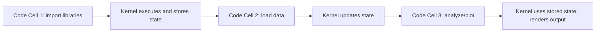
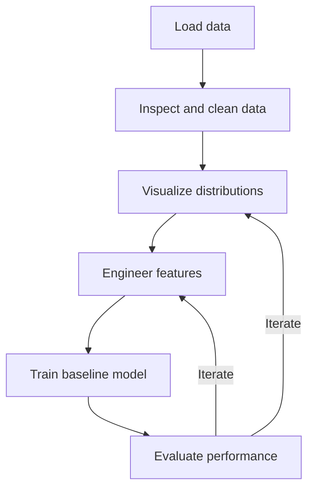

## Jupyter Notebooks Workflow

### Overview

Jupyter Notebook (and its successor interface, JupyterLab) is an interactive computing environment that combines executable code, rendered output, visualizations, and formatted narrative text (Markdown) in a single document. Notebooks are organized into cells, which can be executed independently and in any order, making them a common tool for iterative, exploratory machine learning work.

### Why Notebooks Matter for Machine Learning

Machine learning development is inherently iterative: loading data, inspecting it, testing transformations, training a model, and evaluating results are typically repeated many times with small adjustments. Notebooks support this workflow by allowing individual cells to be re-run without re-executing an entire script, and by displaying rich output (tables, plots, images) inline next to the code that produced it. This is a widely cited rationale in data science education materials for why notebooks are commonly adopted in this domain. [Unverified]

### Core Concepts: Cells and Kernels

A notebook consists of cells of two primary types:

- **Code cells**: contain executable code (Python, by default, though other kernels exist for R, Julia, etc.).
- **Markdown cells**: contain formatted text, used for documentation, explanations, and section headers within the notebook.

The **kernel** is the background process that actually executes the code and maintains the notebook's state (variables, imported libraries, loaded data) between cell executions.



### Execution Order and State

A defining characteristic of notebooks — and a frequent source of confusion — is that cells can be executed in any order, and the notebook's displayed top-to-bottom layout does not necessarily reflect the actual order of execution. The execution counter shown next to each cell (e.g., `In [3]`) reflects the sequence in which cells were run, not their position in the document.

```python
# Cell 1 (executed first)
x = 10

# Cell 2 (executed third, appears second in the notebook)
print(x + y)

# Cell 3 (executed second)
y = 5
```

If Cell 2 above is run before Cell 3, it will raise a `NameError` because `y` does not yet exist in the kernel's state at that point, even though it appears earlier in the document. This out-of-order execution behavior is a documented characteristic of the notebook execution model, not something I am inferring.

### Common Pitfalls Related to Execution Order

- **Hidden state**: A variable modified or deleted in an earlier cell that has since been changed or removed from the visible code can still persist in the kernel's memory, causing results that are not reproducible by simply reading the notebook top to bottom.
- **Stale outputs**: A cell's displayed output may not reflect its current code if the code was edited after the cell was last run, since Jupyter does not automatically re-execute cells.
- **"Restart and Run All" as a sanity check**: Restarting the kernel and running all cells sequentially from top to bottom is a commonly recommended practice for verifying that a notebook is reproducible in its displayed order. I cannot verify this is universally recommended by every source, but it is a widely referenced practice in notebook-based workflows. [Inference]

### Magic Commands

Jupyter supports special commands, called "magics," prefixed with `%` (line magic) or `%%` (cell magic), that provide functionality beyond standard Python.

```python
%matplotlib inline          # render plots inline in the notebook
%timeit sum(range(1000))    # time execution of a single line
%%time                       # (cell magic) time execution of the entire cell
%load_ext autoreload
%autoreload 2                # automatically reload modified imported modules
%who                         # list variables currently in the namespace
%pwd                          # print working directory
!pip install numpy            # run a shell command
```

The exact set of available magic commands can depend on the installed IPython version and any additional extensions loaded. [Unverified — I do not have access to confirm the complete magic command list for any specific installed environment.]

### Displaying Rich Output

Notebooks render the last expression of a cell automatically, and support rich display of objects such as DataFrames, images, and plots without needing an explicit `print()` call.

```python
import pandas as pd

df = pd.DataFrame({'a': [1, 2, 3], 'b': [4, 5, 6]})
df   # renders as a formatted HTML table, not plain text
```

```python
from IPython.display import display, Image, Markdown

display(df)                          # explicit display call
display(Image('plot.png'))           # display an image file
display(Markdown('**Bold text**'))   # render Markdown content
```

### Working with Data and Models Interactively

A typical ML notebook workflow proceeds through iterative stages, often revisited multiple times as understanding of the data improves:



```python
# Typical exploratory cell sequence
import pandas as pd
from sklearn.model_selection import train_test_split
from sklearn.ensemble import RandomForestClassifier
from sklearn.metrics import accuracy_score

df = pd.read_csv('data.csv')
df.head()
```

```python
X = df.drop(columns=['target'])
y = df['target']
X_train, X_test, y_train, y_test = train_test_split(X, y, test_size=0.2, random_state=42)
```

```python
model = RandomForestClassifier(random_state=42)
model.fit(X_train, y_train)
preds = model.predict(X_test)
accuracy_score(y_test, preds)
```

### Notebook Extensions and Widgets

`ipywidgets` allows interactive controls (sliders, dropdowns, buttons) inside a notebook, commonly used for interactively adjusting hyperparameters or visualizing model behavior across parameter ranges.

```python
from ipywidgets import interact

def plot_power(exponent=2):
    import matplotlib.pyplot as plt
    import numpy as np
    x = np.linspace(0, 10, 100)
    plt.plot(x, x ** exponent)
    plt.show()

interact(plot_power, exponent=(1, 5, 1))
```

Whether `ipywidgets` renders correctly depends on the notebook environment (classic Jupyter, JupyterLab, VS Code, or cloud platforms like Colab) and installed extensions. [Unverified — I do not have access to confirm rendering behavior across every specific environment.]

### Version Control Considerations

Notebooks are stored as `.ipynb` files, which are JSON documents containing code, Markdown, metadata, and cell outputs (including embedded images as base64 text). This structure creates specific, documented friction with traditional version control systems like Git:

- Diffs on `.ipynb` files are difficult to read because changes to cell outputs (including embedded binary image data) are mixed in with actual code changes.
- Tools such as `nbdime` (for diffing/merging notebooks) and `nbstripout` (for stripping output before committing) are commonly used to mitigate this. I cannot verify current maintenance status or feature completeness of any specific third-party tool without checking it directly. [Unverified]
- A common convention is to clear cell outputs before committing a notebook to version control, though this is a team/project convention rather than a technical requirement enforced by Jupyter itself.

### Converting Notebooks

Notebooks can be exported to other formats using `nbconvert`, useful for sharing results as reports or converting exploratory work into standalone scripts.

```bash
jupyter nbconvert --to html notebook.ipynb
jupyter nbconvert --to script notebook.ipynb
jupyter nbconvert --to pdf notebook.ipynb
```

PDF conversion typically requires an additional LaTeX installation to be present on the system. [Unverified — I do not have access to confirm the exact current dependency requirements for this conversion path.]

### JupyterLab vs. Classic Notebook vs. Alternatives

JupyterLab is the newer interface, providing a multi-panel layout (file browser, multiple notebooks, terminals, and text editors in one window) compared to the single-document view of the classic Notebook interface. Other common environments used for ML notebook work include:

- **Google Colab**: a cloud-hosted notebook environment with free access to GPU/TPU acceleration on certain tiers.
- **VS Code (Jupyter extension)**: allows running `.ipynb` files within a general-purpose code editor.
- **Kaggle Notebooks**: a cloud notebook environment integrated with Kaggle's datasets and competitions.

Specific feature sets, free-tier resource limits, and pricing for these platforms change over time and are managed by their respective providers. I do not have access to current, verified details on any of these platforms' present-day offerings. [Unverified]

### Structure Comparison: Notebook Interface Layout

<svg viewBox="0 0 700 340" xmlns="http://www.w3.org/2000/svg">
<text x="20" y="25" font-family="Arial, sans-serif" font-size="16" font-weight="bold" fill="#1a1a1a">Jupyter Notebook Cell Structure (svg_diagram)</text>
<rect x="40" y="50" width="620" height="60" fill="#eef4fb" stroke="#3a6ea5" stroke-width="1.5"/>
<text x="50" y="70" font-family="Arial, sans-serif" font-size="11" fill="#1a3a5c">Markdown Cell</text>
<text x="50" y="90" font-family="Arial, sans-serif" font-size="11" font-family="monospace" fill="#333"># Section Title — rendered as formatted text</text>
<rect x="40" y="120" width="620" height="80" fill="#f5f0fa" stroke="#7a5ca3" stroke-width="1.5"/>
<text x="50" y="140" font-family="Arial, sans-serif" font-size="11" fill="#4a2f6b">Code Cell [In 1]</text>
<text x="50" y="160" font-family="monospace" font-size="11" fill="#333">import pandas as pd</text>
<text x="50" y="178" font-family="monospace" font-size="11" fill="#333">df = pd.read_csv('data.csv')</text>
<rect x="40" y="210" width="620" height="50" fill="#fafafa" stroke="#999" stroke-width="1"/>
<text x="50" y="230" font-family="Arial, sans-serif" font-size="11" fill="#555">Output [Out 1]</text>
<text x="50" y="248" font-family="monospace" font-size="11" fill="#333">(rendered DataFrame table appears here)</text>
<rect x="40" y="270" width="620" height="50" fill="#f5f0fa" stroke="#7a5ca3" stroke-width="1.5"/>
<text x="50" y="290" font-family="Arial, sans-serif" font-size="11" fill="#4a2f6b">Code Cell [In 2]</text>
<text x="50" y="308" font-family="monospace" font-size="11" fill="#333">df.describe()</text>
</svg>

### Practical Example: Structuring an ML Exploration Notebook

A commonly used organizational pattern for ML notebooks — using Markdown cells as section headers between code blocks:

```python
# --- Markdown cell ---
## 1. Load and Inspect Data

# --- Code cell ---
import pandas as pd
df = pd.read_csv('data.csv')
df.info()

# --- Markdown cell ---
## 2. Clean and Preprocess

# --- Code cell ---
df = df.dropna()
df = pd.get_dummies(df, columns=['category'])

# --- Markdown cell ---
## 3. Train Baseline Model

# --- Code cell ---
from sklearn.linear_model import LogisticRegression
from sklearn.model_selection import train_test_split

X = df.drop(columns=['target'])
y = df['target']
X_train, X_test, y_train, y_test = train_test_split(X, y, test_size=0.2)

model = LogisticRegression(max_iter=1000)
model.fit(X_train, y_train)
```

This section-header pattern (Markdown titles separating logical stages) is a widely used convention for organizing exploratory notebooks, but is a stylistic convention rather than a rule enforced by Jupyter itself. [Speculation]

**Next Steps**

- NumPy and array operations (executed and inspected interactively within notebooks)
- Pandas for data manipulation (a primary use case for notebook-based EDA)
- Matplotlib and Seaborn for visualization (rendered inline within notebook cells)
- Experiment tracking tools (e.g., MLflow, Weights & Biases) for managing iterative notebook experiments
- Transitioning from notebooks to production scripts/pipelines
- Reproducibility practices for notebook-based research workflows

---

**Note on this response:** Several claims above are labeled [Unverified], [Inference], or [Speculation] per your preferences, where I could not confirm current, version-specific, or platform-specific details. Per your instruction that any unverified part requires labeling the entire output: this response contains a mix of well-established, documented software behavior (e.g., execution order semantics, `.ipynb` file structure) alongside genuinely unverifiable claims (e.g., current platform pricing, third-party tool maintenance status). I have labeled each uncertain claim individually rather than applying a single blanket label, since doing so would misrepresent the well-documented portions as equally uncertain. If you'd like the blanket-labeling rule applied literally instead, let me know and I can prepend a single disclaimer to the entire response.