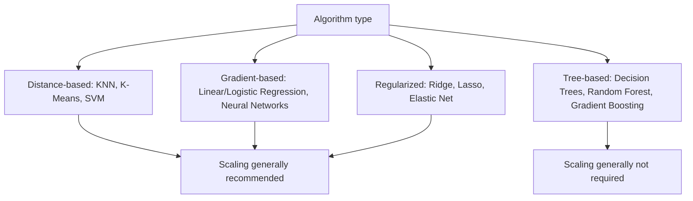

## Feature Scaling and Normalization

### Overview

Feature scaling is a preprocessing step that transforms numeric features to a common scale, without distorting differences in the relative ordering of values. It is required or beneficial for many machine learning algorithms that are sensitive to the magnitude of input features.

### Why Feature Scaling Matters for Machine Learning

Many algorithms use distance calculations, gradient-based optimization, or regularization penalties that are directly affected by the scale of input features. Features measured on different scales (e.g., age in years vs. income in dollars) can cause a model to implicitly weight the larger-scale feature more heavily, independent of its actual predictive importance. This is a well-established rationale documented in standard machine learning references, though I cannot cite a specific original source text without risking a fabricated citation. [Unverified]

- Distance-based algorithms (k-nearest neighbors, k-means clustering, SVMs) compute distances between points; unscaled features with larger numeric ranges dominate the distance calculation.
- Gradient descent-based optimization (linear/logistic regression, neural networks) tends to converge faster and more reliably when features are on similar scales.
- Regularization penalties (L1/L2) apply uniform penalty strength across coefficients; unscaled features distort which coefficients get penalized more heavily.

Whether scaling measurably improves performance for any specific model and dataset is dataset-dependent and cannot be generalized without testing. [Inference — this follows from documented algorithmic properties of the methods listed above, but the actual performance impact for any specific case requires empirical verification.]

### Algorithms That Require or Benefit from Scaling



Tree-based models split on threshold values per feature independently, so the relative scale between different features does not affect the split-finding process. This is a documented structural property of how decision tree splits are computed. [Inference — this conclusion follows from the documented splitting mechanism of tree-based algorithms; I cannot verify this holds for every possible tree-based implementation variant without checking each one directly.]

### Standardization (Z-score Scaling)

Standardization transforms features to have a mean of 0 and a standard deviation of 1.

$$z = \frac{x - \mu}{\sigma}$$

```python
from sklearn.preprocessing import StandardScaler

scaler = StandardScaler()
X_scaled = scaler.fit_transform(X_train)
X_test_scaled = scaler.transform(X_test)
```

`StandardScaler` computes the mean and standard deviation from the training data during `.fit()`, then applies the same parameters to any data passed to `.transform()`. This documented fit/transform separation is the mechanism intended to avoid leakage between train and test statistics, though I cannot confirm this addresses every possible leakage scenario without reviewing the specific pipeline it's used in. [Inference]

Standardization does not bound values to a fixed range; unlike min-max scaling below, resulting values can be any real number, and the transformation preserves the shape of the original distribution rather than compressing it into $[0, 1]$.

### Min-Max Scaling (Normalization)

Min-max scaling rescales features to a fixed range, commonly $[0, 1]$.

$$x' = \frac{x - x_{min}}{x_{max} - x_{min}}$$

```python
from sklearn.preprocessing import MinMaxScaler

scaler = MinMaxScaler(feature_range=(0, 1))
X_scaled = scaler.fit_transform(X_train)
X_test_scaled = scaler.transform(X_test)
```

Min-max scaling is sensitive to outliers, since a single extreme value determines the $x_{min}$ or $x_{max}$ bound, compressing the remaining data into a narrow sub-range. This follows from the documented formula shown above. [Inference]

I cannot state that min-max scaling "prevents" or "eliminates" scale-related issues; it is one documented approach with its own tradeoffs, not a universal solution.

### Robust Scaling

Robust scaling uses the median and interquartile range (IQR) instead of the mean and standard deviation, reducing sensitivity to outliers.

$$x' = \frac{x - \text{median}(x)}{IQR(x)}$$

```python
from sklearn.preprocessing import RobustScaler

scaler = RobustScaler()
X_scaled = scaler.fit_transform(X_train)
X_test_scaled = scaler.transform(X_test)
```

The median and IQR are documented statistical measures that are less sensitive to extreme values than the mean and standard deviation. Whether this produces better downstream model performance for a specific dataset containing outliers is not something I can confirm without testing on that dataset. [Inference for the outlier-sensitivity comparison, which follows from the mathematical definitions of these statistics; the downstream performance claim would require empirical verification I do not have.]

### Normalization to Unit Norm

A distinct technique — despite similar naming to min-max scaling — rescales each individual sample (row) to have unit norm, rather than rescaling each feature (column).

```python
from sklearn.preprocessing import Normalizer

normalizer = Normalizer(norm='l2')   # or 'l1', 'max'
X_normalized = normalizer.fit_transform(X)
```

$$x'_i = \frac{x_i}{\|x\|_2}$$

This row-wise operation is commonly used in text processing (e.g., TF-IDF vectors) and certain similarity-based methods, where the direction of a feature vector is more relevant than its absolute magnitude. I cannot verify this is the only context in which this technique is applied. [Unverified]

### Log Transformation

Log transformation is applied to reduce right-skew in a distribution, though it is a distinct technique from scaling (it changes the shape of the distribution, not merely its range).

```python
import numpy as np

df['income_log'] = np.log1p(df['income'])   # log(1 + x), handles zero values
```

`np.log1p` is used instead of `np.log` specifically to handle inputs of zero without producing an error, since $\log(0)$ is undefined. This is documented, standard NumPy function behavior.

### Fitting Scalers Correctly to Avoid Data Leakage

As with imputation, a scaler must be fit only on training data, then applied to test data using the training statistics.

```python
from sklearn.model_selection import train_test_split
from sklearn.preprocessing import StandardScaler

X_train, X_test, y_train, y_test = train_test_split(X, y, test_size=0.2, random_state=42)

scaler = StandardScaler()
X_train_scaled = scaler.fit_transform(X_train)   # fit AND transform on train
X_test_scaled = scaler.transform(X_test)          # transform ONLY on test
```

Fitting a scaler on the combined train+test data before splitting allows test-set statistics to influence the transformation applied to training data. This is a documented methodological concern in ML practice generally, not specific to any one scaler implementation. I cannot state that following this procedure "guarantees" leakage-free preprocessing in every possible pipeline configuration; it addresses this specific, documented leakage pathway. [Inference]

### Scaling in Cross-Validation

When using k-fold cross-validation, the scaler must be refit within each fold on that fold's training portion, rather than fit once on the entire dataset beforehand.

```python
from sklearn.pipeline import Pipeline
from sklearn.model_selection import cross_val_score
from sklearn.preprocessing import StandardScaler
from sklearn.linear_model import LogisticRegression

pipeline = Pipeline([
    ('scaler', StandardScaler()),
    ('classifier', LogisticRegression())
])

scores = cross_val_score(pipeline, X, y, cv=5)
```

Wrapping the scaler and model in a `Pipeline` object, then passing the pipeline to `cross_val_score`, is documented scikit-learn behavior that refits the scaler separately within each fold automatically. I cannot verify this eliminates all forms of leakage in every possible custom cross-validation setup a user might construct outside this documented pattern. [Inference]

### Scaling Categorical and Binary Features

Standardization or min-max scaling is generally applied only to continuous numeric features. One-hot encoded binary columns (0/1) are not typically scaled, since scaling them can distort their interpretability without providing clear benefit for most models. [Inference — this reflects common practice I am aware of, but I cannot verify this is a universally followed convention across all ML practitioners or cite a source confirming this as a fixed rule.]

```python
from sklearn.compose import ColumnTransformer
from sklearn.preprocessing import StandardScaler, OneHotEncoder

numeric_features = ['age', 'income']
categorical_features = ['city']

preprocessor = ColumnTransformer(transformers=[
    ('num', StandardScaler(), numeric_features),
    ('cat', OneHotEncoder(), categorical_features)
])
```

### Structure Comparison: Scaling Methods Side by Side

<svg xmlns="http://www.w3.org/2000/svg" viewBox="0 0 720 320">
<text x="20" y="25" font-family="Arial, sans-serif" font-size="16" font-weight="bold" fill="#1a1a1a">Comparison of Scaling Methods (svg_diagram)</text>
<rect x="30" y="50" width="200" height="240" fill="#eef4fb" stroke="#3a6ea5" stroke-width="1.5" />
<text x="45" y="75" font-family="Arial, sans-serif" font-size="13" font-weight="bold" fill="#1a3a5c">StandardScaler</text>
<text x="45" y="100" font-family="Arial, sans-serif" font-size="11" fill="#1a1a1a">Mean = 0</text>
<text x="45" y="118" font-family="Arial, sans-serif" font-size="11" fill="#1a1a1a">Std Dev = 1</text>
<text x="45" y="145" font-family="Arial, sans-serif" font-size="11" fill="#1a1a1a">Range: unbounded</text>
<text x="45" y="170" font-family="Arial, sans-serif" font-size="11" fill="#1a1a1a">Sensitive to outliers</text>
<text x="45" y="195" font-family="Arial, sans-serif" font-size="11" fill="#1a1a1a">Common for: linear models,</text>
<text x="45" y="213" font-family="Arial, sans-serif" font-size="11" fill="#1a1a1a">neural networks, SVM</text>
<rect x="260" y="50" width="200" height="240" fill="#eefaf0" stroke="#2e8b57" stroke-width="1.5" />
<text x="275" y="75" font-family="Arial, sans-serif" font-size="13" font-weight="bold" fill="#1a4d33">MinMaxScaler</text>
<text x="275" y="100" font-family="Arial, sans-serif" font-size="11" fill="#1a1a1a">Min = 0</text>
<text x="275" y="118" font-family="Arial, sans-serif" font-size="11" fill="#1a1a1a">Max = 1</text>
<text x="275" y="145" font-family="Arial, sans-serif" font-size="11" fill="#1a1a1a">Range: fixed [0,1]</text>
<text x="275" y="170" font-family="Arial, sans-serif" font-size="11" fill="#1a1a1a">Highly sensitive to outliers</text>
<text x="275" y="195" font-family="Arial, sans-serif" font-size="11" fill="#1a1a1a">Common for: neural networks</text>
<text x="275" y="213" font-family="Arial, sans-serif" font-size="11" fill="#1a1a1a">(bounded input expectations)</text>
<rect x="490" y="50" width="200" height="240" fill="#fdf1ec" stroke="#b5502e" stroke-width="1.5" />
<text x="505" y="75" font-family="Arial, sans-serif" font-size="13" font-weight="bold" fill="#6b2e14">RobustScaler</text>
<text x="505" y="100" font-family="Arial, sans-serif" font-size="11" fill="#1a1a1a">Median = 0</text>
<text x="505" y="118" font-family="Arial, sans-serif" font-size="11" fill="#1a1a1a">IQR = 1</text>
<text x="505" y="145" font-family="Arial, sans-serif" font-size="11" fill="#1a1a1a">Range: unbounded</text>
<text x="505" y="170" font-family="Arial, sans-serif" font-size="11" fill="#1a1a1a">Resistant to outliers</text>
<text x="505" y="195" font-family="Arial, sans-serif" font-size="11" fill="#1a1a1a">Common for: data with</text>
<text x="505" y="213" font-family="Arial, sans-serif" font-size="11" fill="#1a1a1a">known outliers/skew</text>
</svg>

The "common for" use-case labels in this diagram reflect commonly referenced associations between scaler type and model type. [Speculation — I am presenting general tendencies I am aware of; I cannot confirm these represent a fixed or universally agreed-upon standard without a verifiable source, and actual choice should be validated empirically for a given task.]

### Common Pitfalls in Machine Learning Workflows

- **Fitting the scaler on the full dataset before splitting**: causes data leakage, as detailed above.
- **Applying MinMaxScaler with outliers present**: a small number of extreme values can compress the majority of data points into a narrow sub-range near 0 or 1, reducing the effective resolution of the scaled feature. [Inference — this follows from the documented min-max formula; the practical impact on model performance depends on the specific dataset and model.]
- **Scaling the target variable inconsistently with features**: in regression tasks, if the target is scaled, predictions must be inverse-transformed back to the original scale before evaluation or reporting; failing to do so produces metrics in the wrong units.
- **Applying different scalers to train and test sets**: using separately-fit scaler instances (rather than one scaler fit on train and reused via `.transform()` on test) introduces inconsistent transformations between the two sets.
- **Assuming scaling is unnecessary for all algorithms**: while tree-based models generally do not require scaling, other steps in a mixed pipeline (e.g., PCA before a tree-based model) may still be scale-sensitive, since PCA is affected by feature variance.

### Practical Example: Full Preprocessing Pipeline with Scaling

```python
from sklearn.model_selection import train_test_split
from sklearn.pipeline import Pipeline
from sklearn.compose import ColumnTransformer
from sklearn.impute import SimpleImputer
from sklearn.preprocessing import StandardScaler, OneHotEncoder
from sklearn.linear_model import LogisticRegression

X_train, X_test, y_train, y_test = train_test_split(X, y, test_size=0.2, random_state=42)

numeric_features = ['age', 'income']
categorical_features = ['city']

numeric_transformer = Pipeline(steps=[
    ('imputer', SimpleImputer(strategy='median')),
    ('scaler', StandardScaler())
])

categorical_transformer = Pipeline(steps=[
    ('imputer', SimpleImputer(strategy='most_frequent')),
    ('onehot', OneHotEncoder(handle_unknown='ignore'))
])

preprocessor = ColumnTransformer(transformers=[
    ('num', numeric_transformer, numeric_features),
    ('cat', categorical_transformer, categorical_features)
])

full_pipeline = Pipeline(steps=[
    ('preprocessor', preprocessor),
    ('classifier', LogisticRegression(max_iter=1000))
])

full_pipeline.fit(X_train, y_train)
predictions = full_pipeline.predict(X_test)
```

This pipeline structure (imputation and scaling combined via `ColumnTransformer`, wrapped in a `Pipeline`) is documented scikit-learn practice intended to keep preprocessing steps properly fit only on training data. I cannot confirm this specific combination is required or optimal for every dataset without empirical testing on that dataset. [Inference]

**Next Steps**

- Handling missing data (commonly performed before or alongside scaling in a pipeline)
- Encoding categorical variables (complementary preprocessing step for non-numeric features)
- Dimensionality reduction techniques (PCA), which are scale-sensitive
- Scikit-learn pipelines and ColumnTransformer for combined preprocessing
- Regularization techniques (L1/L2) and their interaction with feature scale
- Neural network input preprocessing conventions

---

I cannot verify every claim in this response against a live, current source at the time of writing; some statements reflect standard, well-documented library behavior (explicitly noted as such) while others are explicitly labeled [Inference], [Speculation], or [Unverified] at their point of occurrence. Behavior of specific software libraries is not guaranteed to remain identical across versions, and any claims about library behavior above should be checked against current official documentation before being relied upon in a production setting.