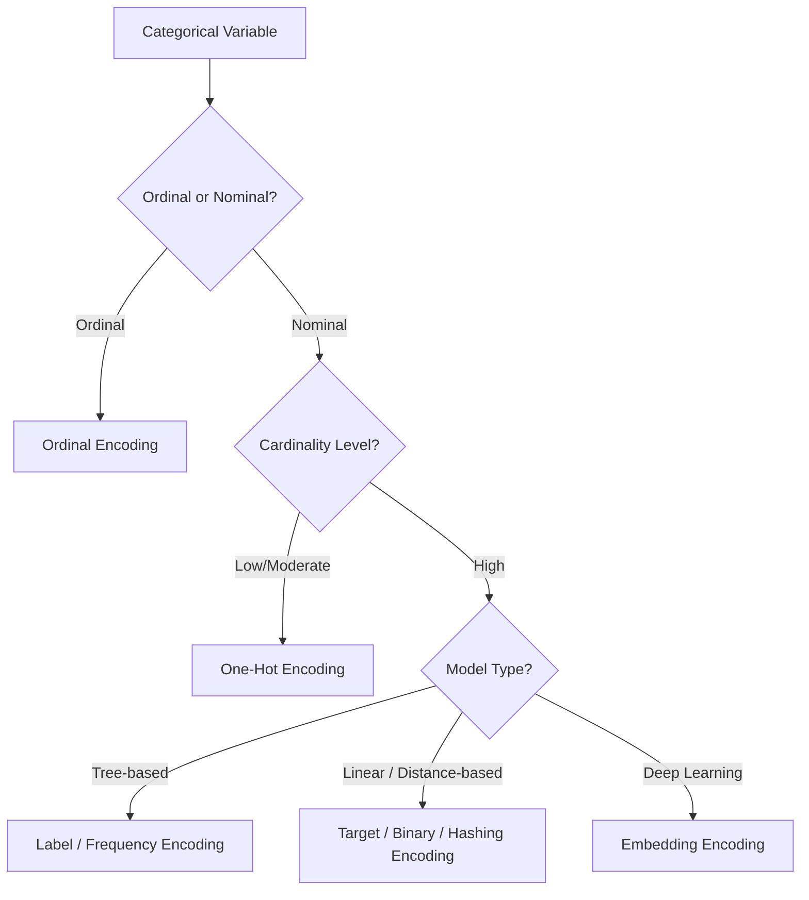

## Encoding Categorical Variables

### Overview

Categorical variables represent data that takes on a limited, fixed set of values (categories or labels) rather than continuous numeric values. Most machine learning algorithms require numeric input, so categorical variables must be transformed into a numeric representation before they can be used in a model. The choice of encoding method affects model performance, training time, and interpretability, and different encodings are appropriate for different types of categorical data.

### Types of Categorical Variables

#### Nominal Variables

Categories with no inherent order or ranking. Examples: color (red, blue, green), country, blood type. Numeric encodings that imply order (like 1, 2, 3) are misleading for nominal data unless the encoding method is specifically designed to avoid implying rank.

#### Ordinal Variables

Categories with a meaningful order but not necessarily equal spacing between them. Examples: education level (high school, bachelor's, master's, PhD), satisfaction rating (poor, fair, good, excellent). Encoding should preserve this order.

#### Binary Variables

Categories with exactly two possible values. Examples: yes/no, true/false, male/female. These can typically be encoded directly as 0 and 1.

#### High-Cardinality Categorical Variables

Categorical variables with a very large number of unique categories. Examples: zip code, user ID, product SKU. These pose unique challenges since naive encoding methods can create excessive dimensionality.

### Label Encoding

Label encoding assigns a unique integer to each category.

**Example**

| Category | Encoded Value |
| --- | --- |
| Red | 0 |
| Green | 1 |
| Blue | 2 |

**Key Points**

- Simple and memory-efficient.
- Introduces an artificial ordinal relationship between categories, which can mislead algorithms that assume numeric distance is meaningful (e.g., linear regression, k-nearest neighbors).
- Well-suited for ordinal variables where the order is meaningful, and for tree-based models, which can split on arbitrary thresholds without assuming linear relationships between encoded values.

```python
from sklearn.preprocessing import LabelEncoder

encoder = LabelEncoder()
df['color_encoded'] = encoder.fit_transform(df['color'])
```

[Inference] Tree-based models such as decision trees, random forests, and gradient boosting machines are generally considered more tolerant of label encoding for nominal variables than linear models, because they split on thresholds rather than assuming a linear numeric relationship. Actual model performance depends on the dataset, the specific algorithm implementation, and hyperparameters, so results may vary.

### One-Hot Encoding

One-hot encoding creates a new binary column for each category, with a 1 indicating the presence of that category and 0 otherwise.

**Example**

Original column `color`: [Red, Green, Blue]

| color_Red | color_Green | color_Blue |
| --- | --- | --- |
| 1 | 0 | 0 |
| 0 | 1 | 0 |
| 0 | 0 | 1 |

```python
import pandas as pd

df_encoded = pd.get_dummies(df, columns=['color'])
```

Or using scikit-learn:

```python
from sklearn.preprocessing import OneHotEncoder

encoder = OneHotEncoder(sparse_output=False, drop=None)
encoded_array = encoder.fit_transform(df[['color']])
```

**Key Points**

- Avoids implying any ordinal relationship between categories.
- Increases dimensionality significantly for high-cardinality features, which can lead to sparse matrices and increased memory/computation requirements.
- The `drop='first'` parameter can be used to avoid the "dummy variable trap" (perfect multicollinearity) in linear models, where one column can be predicted exactly from the others.
- Well suited for nominal variables with a small to moderate number of categories.

### Ordinal Encoding

Ordinal encoding maps categories to integers according to a specified, meaningful order.

**Example**

| Education Level | Encoded Value |
| --- | --- |
| High School | 0 |
| Bachelor's | 1 |
| Master's | 2 |
| PhD | 3 |

```python
from sklearn.preprocessing import OrdinalEncoder

categories_order = [['High School', "Bachelor's", "Master's", 'PhD']]
encoder = OrdinalEncoder(categories=categories_order)
df['education_encoded'] = encoder.fit_transform(df[['education']])
```

**Key Points**

- Requires domain knowledge to specify the correct order.
- Preserves ranking information that models can use, particularly useful for linear models and distance-based models where the numeric gap is meant to be meaningful.
- [Inference] The assumption of equal spacing between encoded values (e.g., the "distance" between High School and Bachelor's being equal to the distance between Bachelor's and Master's) may not hold in reality, which can affect model behavior in distance-sensitive algorithms. This depends on the specific data and use case.

### Binary Encoding

Binary encoding converts categories into integers, then represents those integers in binary form, splitting each binary digit into a separate column.

**Example**

| Category | Integer | Binary | Col_1 | Col_2 | Col_3 |
| --- | --- | --- | --- | --- | --- |
| A | 1 | 001 | 0 | 0 | 1 |
| B | 2 | 010 | 0 | 1 | 0 |
| C | 3 | 011 | 0 | 1 | 1 |

```python
import category_encoders as ce

encoder = ce.BinaryEncoder(cols=['category'])
df_encoded = encoder.fit_transform(df)
```

**Key Points**

- Produces far fewer columns than one-hot encoding for high-cardinality variables (roughly $\log_2(n)$ columns for $n$ categories, versus $n$ columns for one-hot).
- Introduces some artificial numeric relationships between categories due to shared binary digits, though generally less severe than plain label encoding.
- A reasonable middle ground between one-hot encoding and label encoding for moderate-to-high cardinality features.

### Target Encoding (Mean Encoding)

Target encoding replaces each category with a statistic (typically the mean) of the target variable for that category.

**Example**

For a binary classification target (0/1):

| City | Target Mean |
| --- | --- |
| New York | 0.72 |
| Chicago | 0.45 |
| Austin | 0.30 |

```python
import category_encoders as ce

encoder = ce.TargetEncoder(cols=['city'])
df['city_encoded'] = encoder.fit_transform(df['city'], df['target'])
```

**Key Points**

- Effective for high-cardinality categorical variables without exploding dimensionality.
- Prone to data leakage and overfitting if not implemented carefully, since it uses target information directly.
- Requires techniques like cross-validation folds, smoothing, or noise addition to reduce leakage risk in production pipelines.
- Must be fit only on training data and applied to validation/test data using training-derived statistics to avoid leaking test information.

[Unverified] The degree of overfitting risk from target encoding varies substantially depending on category frequency, smoothing parameters, and cross-validation strategy used; specific quantitative claims about performance impact would need to be verified against the particular dataset and implementation in use.

### Frequency / Count Encoding

Replaces each category with the frequency (or count) of its occurrence in the dataset.

```python
freq_map = df['category'].value_counts(normalize=True)
df['category_encoded'] = df['category'].map(freq_map)
```

**Key Points**

- Simple and computationally inexpensive.
- Can lose information if different categories happen to have the same frequency.
- Works well for tree-based models, and can be useful as a supplementary feature alongside other encodings.

### Hashing Encoding (Feature Hashing)

Applies a hash function to category values and maps them into a fixed number of columns, regardless of the number of unique categories.

```python
import category_encoders as ce

encoder = ce.HashingEncoder(cols=['category'], n_components=8)
df_encoded = encoder.fit_transform(df)
```

**Key Points**

- Useful for very high-cardinality features (e.g., user IDs) where one-hot encoding would be computationally infeasible.
- Introduces the possibility of hash collisions, where different categories map to the same encoded representation, potentially losing information.
- Encoded columns are not directly interpretable, which can reduce model explainability.

### Embedding-Based Encoding

Used primarily in neural network contexts, categorical variables are mapped to dense, low-dimensional continuous vectors that are learned during model training.

**Key Points**

- Common in deep learning frameworks (e.g., TensorFlow, PyTorch) for handling high-cardinality categorical variables such as words, user IDs, or product IDs.
- Captures latent relationships between categories that are learned from the data during training rather than specified manually.
- Requires sufficient training data to learn meaningful embeddings; may perform poorly on categories with very few observations.
- [Inference] The quality and interpretability of learned embeddings depends heavily on the amount of training data, model architecture, and training duration; results are not guaranteed to generalize equally well across all categorical features in a dataset.

```python
import torch
import torch.nn as nn

num_categories = 100
embedding_dim = 8

embedding_layer = nn.Embedding(num_embeddings=num_categories, embedding_dim=embedding_dim)
```

### Choosing an Encoding Strategy

The following diagram summarizes a general decision path for selecting an encoding method.



[Inference] This decision path reflects commonly cited heuristics in applied machine learning practice; the optimal choice for a specific dataset may differ and typically benefits from empirical validation via cross-validation or holdout testing.

### Common Pitfalls

- **Data Leakage**: Encoding categorical variables using statistics computed from the entire dataset (including test data) before splitting into train/test sets can leak information and inflate reported performance.
- **Unseen Categories**: Categories present in test/production data but absent from training data can cause errors or require a defined fallback strategy (e.g., mapping to a default value or "unknown" category).
- **Dimensionality Explosion**: One-hot encoding high-cardinality features can create very large, sparse feature matrices, increasing memory usage and training time.
- **Ignoring Domain Knowledge**: Applying ordinal encoding to genuinely nominal data (or vice versa) can introduce misleading numeric relationships that degrade model performance.

### Conclusion

Encoding categorical variables is a foundational step in preparing data for machine learning models. The appropriate technique depends on the nature of the categorical variable (nominal vs. ordinal), its cardinality, the downstream model type, and computational constraints. No single encoding method is universally optimal; selection generally involves balancing information preservation, dimensionality, interpretability, and risk of data leakage or overfitting.

### Related Topics

- Handling missing values in categorical features
- Feature scaling and normalization for numeric variables
- Handling unseen/rare categories in production pipelines
- Dimensionality reduction techniques (e.g., PCA) after encoding
- Feature selection methods for high-dimensional encoded data
- Cross-validation strategies to prevent target encoding leakage
- Embedding layers in deep learning architectures