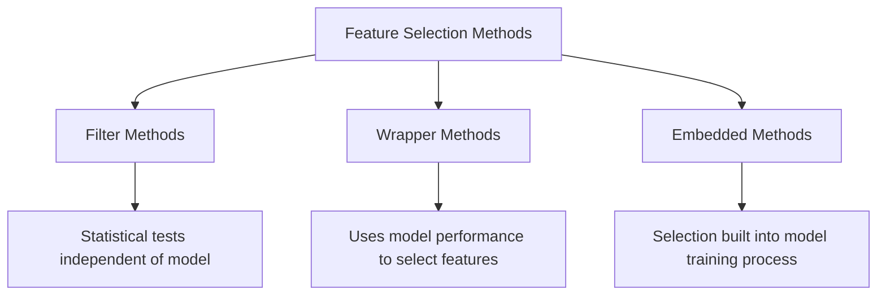

## Feature Selection Methods

### Overview

Feature selection is the process of identifying and retaining the most relevant input variables (features) for a machine learning model while discarding redundant, irrelevant, or noisy ones. It differs from feature extraction (such as PCA), which transforms features into new representations, because feature selection retains a subset of the original features unchanged. Effective feature selection can improve model performance, reduce overfitting, decrease training time, and improve interpretability.

### Why Feature Selection Matters

**Key Points**

- Reduces overfitting by removing noisy or irrelevant features that a model might otherwise fit to.
- Improves training and inference speed by reducing dimensionality.
- Improves model interpretability, since fewer features are easier to reason about.
- Can mitigate the "curse of dimensionality," where model performance degrades as the number of features grows relative to the number of observations.

[Inference] The degree of performance improvement from feature selection depends on the dataset, the model type, and the specific features removed. This is a reasoned expectation based on general machine learning principles, not a guaranteed outcome for any specific case.

### Categories of Feature Selection Methods

There are three broad categories of feature selection methods: filter methods, wrapper methods, and embedded methods.



### Filter Methods

Filter methods evaluate features based on their statistical properties relative to the target variable, independent of any specific machine learning model.

#### Variance Threshold

Removes features with low variance, on the assumption that features with little variation carry little information.

```python
from sklearn.feature_selection import VarianceThreshold

selector = VarianceThreshold(threshold=0.01)
X_reduced = selector.fit_transform(X)
```

**Key Points**

- Does not consider the relationship between features and the target variable.
- Useful as a quick, computationally inexpensive first pass to remove near-constant features.

#### Correlation-Based Selection

Removes features that are highly correlated with each other (multicollinearity) or that show weak correlation with the target variable.

```python
import pandas as pd

corr_matrix = df.corr().abs()
upper_triangle = corr_matrix.where(
    ~corr_matrix.mask(corr_matrix.isna(), False).astype(bool).T
)
```

**Key Points**

- Pearson correlation captures linear relationships only; non-linear relationships between a feature and the target may be missed.
- A common threshold cited in practice is removing one of a pair of features when correlation exceeds approximately 0.8–0.9, though [Inference] the appropriate threshold depends on the dataset and domain, and this range reflects commonly cited practice rather than a fixed rule.

#### Chi-Square Test

Used for categorical features against a categorical target to test statistical independence.

```python
from sklearn.feature_selection import chi2, SelectKBest

selector = SelectKBest(score_func=chi2, k=10)
X_selected = selector.fit_transform(X, y)
```

**Key Points**

- Requires non-negative feature values.
- Applicable only to categorical or discretized features, not continuous raw features.

#### Mutual Information

Measures the amount of information obtained about the target variable through observing a given feature, capturing both linear and non-linear relationships.

```python
from sklearn.feature_selection import mutual_info_classif, SelectKBest

selector = SelectKBest(score_func=mutual_info_classif, k=10)
X_selected = selector.fit_transform(X, y)
```

**Key Points**

- Can capture non-linear dependencies that correlation-based methods miss.
- Computationally more expensive than simple correlation for large datasets.

#### ANOVA F-Test

Tests whether the means of a continuous feature differ significantly across groups defined by a categorical target.

```python
from sklearn.feature_selection import f_classif, SelectKBest

selector = SelectKBest(score_func=f_classif, k=10)
X_selected = selector.fit_transform(X, y)
```

**Key Points**

- Assumes features are normally distributed within each group.
- Commonly used for classification tasks with continuous input features.

### Wrapper Methods

Wrapper methods use a specific machine learning model's performance to evaluate the usefulness of feature subsets, searching through combinations of features to find those that optimize model performance.

#### Forward Selection

Starts with no features and iteratively adds the feature that most improves model performance until no further improvement is found or a stopping criterion is reached.

#### Backward Elimination

Starts with all features and iteratively removes the least useful feature until performance degrades beyond an acceptable threshold.

#### Recursive Feature Elimination (RFE)

Recursively fits a model, ranks features by importance (e.g., coefficients or feature importances), removes the weakest feature(s), and repeats until the desired number of features remains.

```python
from sklearn.feature_selection import RFE
from sklearn.linear_model import LogisticRegression

model = LogisticRegression(max_iter=1000)
selector = RFE(estimator=model, n_features_to_select=10)
X_selected = selector.fit_transform(X, y)
```

**Key Points**

- Computationally expensive since it requires retraining the model multiple times.
- Performance depends on the underlying estimator's ability to rank feature importance accurately.
- [Inference] RFE is generally considered more computationally costly than filter methods but potentially more accurate because it accounts for feature interactions specific to the chosen model; this is a reasoned expectation rather than a guaranteed outcome for every dataset or model combination.

#### Exhaustive Feature Selection

Evaluates all possible combinations of features to find the optimal subset.

**Key Points**

- Computationally infeasible for datasets with a large number of features, since the number of subsets grows exponentially ($2^n$ for $n$ features).
- Rarely used in practice outside of small feature sets or research settings.

### Embedded Methods

Embedded methods perform feature selection as part of the model training process itself, rather than as a separate preprocessing step.

#### LASSO (L1 Regularization)

Adds a penalty term proportional to the absolute value of coefficients, which can shrink some coefficients exactly to zero, effectively removing those features.

$$\text{Loss} = \text{RSS} + \lambda \sum_{i=1}^{n} |\beta_i|$$

```python
from sklearn.linear_model import Lasso

model = Lasso(alpha=0.1)
model.fit(X, y)
selected_features = X.columns[model.coef_ != 0]
```

**Key Points**

- The regularization strength $\lambda$ (alpha in scikit-learn) controls how aggressively coefficients are shrunk toward zero.
- Well-suited for linear models; less directly applicable to tree-based or non-linear models.

#### Tree-Based Feature Importance

Tree-based ensemble models (e.g., Random Forest, Gradient Boosting) provide feature importance scores based on how much each feature contributes to reducing impurity across splits.

```python
from sklearn.ensemble import RandomForestClassifier

model = RandomForestClassifier(n_estimators=100, random_state=42)
model.fit(X, y)
importances = model.feature_importances_
```

**Key Points**

- Importance scores can be biased toward high-cardinality features or continuous features in some implementations. [Unverified] The extent of this bias varies by implementation and dataset, and I do not have access to specific benchmark figures to quantify it generally.
- Commonly used as a fast, model-native way to rank features without additional computation.

#### Elastic Net

Combines L1 (LASSO) and L2 (Ridge) regularization penalties, allowing simultaneous feature selection and coefficient shrinkage.

$$\text{Loss} = \text{RSS} + \lambda_1 \sum_{i=1}^{n} |\beta_i| + \lambda_2 \sum_{i=1}^{n} \beta_i^2$$

```python
from sklearn.linear_model import ElasticNet

model = ElasticNet(alpha=0.1, l1_ratio=0.5)
model.fit(X, y)
```

**Key Points**

- Useful when features are correlated, since LASSO alone tends to arbitrarily select one feature from a correlated group.
- Requires tuning two hyperparameters: overall regularization strength and the L1/L2 mixing ratio.

### Comparison of Method Categories

| Aspect | Filter | Wrapper | Embedded |
| --- | --- | --- | --- |
| Model-dependent | No | Yes | Yes |
| Computational cost | Low | High | Moderate |
| Considers feature interactions | No | Yes | Partially |
| Risk of overfitting to model | Low | Higher | Moderate |

[Inference] This comparison reflects general characteristics commonly described in machine learning literature. Actual computational cost and overfitting risk depend on dataset size, feature count, and the specific algorithms used, so individual results may differ from this general characterization.

### Feature Selection Workflow Diagram

<svg xmlns="http://www.w3.org/2000/svg" viewBox="0 0 800 320">
<text x="400" y="30" font-size="18" font-weight="bold" text-anchor="middle" fill="#1a1a1a">Feature Selection Workflow (svg_diagram)</text>
<rect x="20" y="70" width="160" height="50" rx="6" fill="#e8f0fe" stroke="#4285f4" stroke-width="1.5" />
<text x="100" y="100" font-size="13" text-anchor="middle" fill="#1a1a1a">Raw Feature Set</text>
<rect x="220" y="70" width="160" height="50" rx="6" fill="#e8f0fe" stroke="#4285f4" stroke-width="1.5" />
<text x="300" y="95" font-size="13" text-anchor="middle" fill="#1a1a1a">Filter Method</text>
<text x="300" y="112" font-size="11" text-anchor="middle" fill="#555">(remove low-value features)</text>
<rect x="420" y="70" width="160" height="50" rx="6" fill="#e8f0fe" stroke="#4285f4" stroke-width="1.5" />
<text x="500" y="95" font-size="13" text-anchor="middle" fill="#1a1a1a">Wrapper/Embedded</text>
<text x="500" y="112" font-size="11" text-anchor="middle" fill="#555">(model-based refinement)</text>
<rect x="620" y="70" width="160" height="50" rx="6" fill="#e6f4ea" stroke="#34a853" stroke-width="1.5" />
<text x="700" y="100" font-size="13" text-anchor="middle" fill="#1a1a1a">Final Feature Subset</text>
<line x1="180" y1="95" x2="215" y2="95" stroke="#555" stroke-width="1.5" marker-end="url(#arrow)" />
<line x1="380" y1="95" x2="415" y2="95" stroke="#555" stroke-width="1.5" marker-end="url(#arrow)" />
<line x1="580" y1="95" x2="615" y2="95" stroke="#555" stroke-width="1.5" marker-end="url(#arrow)" />
<rect x="120" y="180" width="560" height="110" rx="6" fill="#fff8e1" stroke="#f9a825" stroke-width="1.5" />
<text x="400" y="205" font-size="13" font-weight="bold" text-anchor="middle" fill="#1a1a1a">Validation Step</text>
<text x="400" y="228" font-size="12" text-anchor="middle" fill="#333">Evaluate selected feature subset using cross-validation</text>
<text x="400" y="248" font-size="12" text-anchor="middle" fill="#333">on a held-out set before finalizing the model</text>
<text x="400" y="270" font-size="11" text-anchor="middle" fill="#777">(Skipping validation risks selection bias / overfitting to training data)</text>
<line x1="700" y1="120" x2="400" y2="178" stroke="#555" stroke-width="1.5" stroke-dasharray="4,3" marker-end="url(#arrow)" />
</svg>

### Common Pitfalls

- **Selection Bias / Data Leakage**: Performing feature selection using the entire dataset (including test data) before splitting into train/test sets can leak information and produce overly optimistic performance estimates.
- **Ignoring Feature Interactions**: Filter methods evaluate features independently and may discard a feature that is only useful in combination with another.
- **Instability**: Some methods (e.g., stepwise selection) can produce different selected feature sets under small changes to the training data. [Unverified] The degree of instability depends on the dataset, sample size, and correlation structure among features; I do not have access to a general quantitative measure applicable across all cases.
- **Over-reliance on a Single Method**: Combining filter, wrapper, and embedded approaches, or validating selected features across multiple models, is generally considered more robust than relying on one method alone. [Inference] This is a reasoned practice recommendation based on general methodology, not a confirmed universal result.

### Conclusion

Feature selection methods span a spectrum from computationally inexpensive, model-agnostic filter methods to computationally expensive but potentially more accurate wrapper methods, with embedded methods offering a middle ground by integrating selection into model training. The choice of method depends on dataset size, feature count, computational budget, and the specific model being used. Cross-validation is generally recommended to confirm that selected features generalize beyond the training data.

### Related Topics

- Dimensionality reduction techniques (PCA, t-SNE, UMAP)
- Regularization techniques in linear and neural network models
- Cross-validation strategies for model evaluation
- Handling multicollinearity in regression models
- Feature importance interpretation (e.g., SHAP, permutation importance)
- Automated feature engineering and selection pipelines (AutoML)