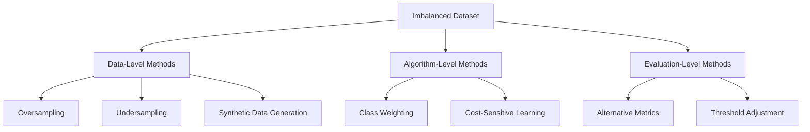

## Handling Imbalanced Datasets

### Overview

An imbalanced dataset is one in which the target classes are not represented equally — one or more classes (majority classes) have substantially more samples than others (minority classes). This is common in domains such as fraud detection, medical diagnosis, and rare event prediction. Class imbalance can cause models to be biased toward predicting the majority class, since standard training objectives optimize for overall accuracy, which can be misleadingly high even when the minority class is poorly predicted.

### Why Imbalance Is a Problem

**Key Points**

- Many algorithms optimize for overall accuracy by default, which can result in a model that predicts the majority class almost exclusively while still achieving high accuracy.
- Standard evaluation metrics like accuracy can be misleading; a dataset with 95% majority class samples allows a naive "always predict majority" model to reach 95% accuracy while providing no value for the minority class.
- Minority class errors are often the most costly in real-world applications (e.g., failing to detect fraud or disease), making this an important problem to address rather than only an academic concern. [Inference] The relative cost of minority-class errors depends on the specific application and business context; this is a reasoned general observation, not a universal rule that applies to every imbalanced dataset.

### Detecting Imbalance

```python
import pandas as pd

class_counts = df['target'].value_counts()
class_proportions = df['target'].value_counts(normalize=True)
print(class_counts)
print(class_proportions)
```

**Example**

| Class | Count | Proportion |
| --- | --- | --- |
| 0 (Majority) | 9,500 | 95% |
| 1 (Minority) | 500 | 5% |

### Categories of Solutions



### Data-Level Methods

#### Random Oversampling

Duplicates existing minority class samples to balance class distribution.

```python
from imblearn.over_sampling import RandomOverSampler

ros = RandomOverSampler(random_state=42)
X_resampled, y_resampled = ros.fit_resample(X, y)
```

**Key Points**

- Simple to implement and does not discard any majority class information.
- Increases the risk of overfitting, since duplicated samples can cause the model to memorize specific minority class instances rather than generalize. [Inference] The degree of overfitting risk depends on the specific dataset, model, and amount of oversampling applied; this is a reasoned expectation rather than a confirmed outcome for every case.

#### Random Undersampling

Removes samples from the majority class to balance the class distribution.

```python
from imblearn.under_sampling import RandomUnderSampler

rus = RandomUnderSampler(random_state=42)
X_resampled, y_resampled = rus.fit_resample(X, y)
```

**Key Points**

- Reduces dataset size, which can decrease training time.
- Discards potentially useful majority class information, which may degrade overall model performance. [Unverified] The magnitude of this effect depends heavily on the dataset size and how much data is removed; I do not have access to information that would let me quantify this for a general case.

#### SMOTE (Synthetic Minority Over-sampling Technique)

Generates synthetic minority class samples by interpolating between existing minority class samples and their nearest neighbors, rather than simply duplicating them.

```python
from imblearn.over_sampling import SMOTE

smote = SMOTE(random_state=42, k_neighbors=5)
X_resampled, y_resampled = smote.fit_resample(X, y)
```

**Key Points**

- Documented in the original SMOTE research literature (Chawla et al., 2002) as a method for creating synthetic examples along line segments joining minority class neighbors.
- Can introduce noise if synthetic samples are generated in regions where minority and majority classes overlap.
- Requires numeric features; categorical features require variants such as SMOTENC.

#### SMOTE Variants

```python
from imblearn.over_sampling import SMOTENC, ADASYN, BorderlineSMOTE

# For datasets with categorical features
smote_nc = SMOTENC(categorical_features=[0, 2], random_state=42)

# Adaptive Synthetic Sampling - generates more samples for harder-to-learn instances
adasyn = ADASYN(random_state=42)

# Focuses synthetic sample generation near the decision boundary
borderline_smote = BorderlineSMOTE(random_state=42)
```

**Key Points**

- ADASYN adapts the number of synthetic samples generated based on the local density of minority class instances, generating more samples for minority instances that are harder to learn.
- BorderlineSMOTE focuses synthetic sample generation on minority samples near the decision boundary between classes, based on the underlying method as described in its originating research literature.
- [Unverified] Whether these variants outperform standard SMOTE depends on the specific dataset and problem; I do not have access to benchmark results that would support a general claim of superiority across datasets.

#### Combining Oversampling and Undersampling

```python
from imblearn.combine import SMOTETomek, SMOTEENN

smote_tomek = SMOTETomek(random_state=42)
X_resampled, y_resampled = smote_tomek.fit_resample(X, y)
```

**Key Points**

- Combines synthetic oversampling of the minority class with removal of ambiguous or noisy majority class samples near class boundaries.
- Adds computational complexity compared to using a single resampling method alone.

### Algorithm-Level Methods

#### Class Weighting

Many algorithms allow assigning higher weights to minority class samples so that misclassifying them incurs a larger penalty during training.

```python
from sklearn.linear_model import LogisticRegression
from sklearn.ensemble import RandomForestClassifier

# Automatically weight classes inversely proportional to their frequency
model = LogisticRegression(class_weight='balanced')
model_rf = RandomForestClassifier(class_weight='balanced')
```

**Key Points**

- The `class_weight='balanced'` option in scikit-learn is documented to adjust weights inversely proportional to class frequencies in the input data.
- Avoids the need to modify the dataset itself, unlike oversampling or undersampling.
- Not all algorithms support class weighting natively; support varies by library and estimator.

#### Custom Class Weights

```python
model = LogisticRegression(class_weight={0: 1, 1: 10})
```

**Key Points**

- Allows manual control over the relative penalty for misclassifying each class.
- Appropriate weight values typically require experimentation or domain knowledge specific to the dataset and cost structure of misclassification errors.

#### Cost-Sensitive Learning

Incorporates the real-world cost of different types of misclassification errors directly into the model's objective function, rather than treating all errors as equally costly.

**Key Points**

- Requires defining a cost matrix that specifies the cost of each type of misclassification (e.g., false negative vs. false positive).
- [Inference] Cost-sensitive learning is generally considered more aligned with real-world business objectives than accuracy-based optimization when misclassification costs are asymmetric, though the specific costs must be defined by domain experts for the method to be effective in a given application.

### Ensemble-Based Approaches

#### Balanced Random Forest

```python
from imblearn.ensemble import BalancedRandomForestClassifier

brf = BalancedRandomForestClassifier(n_estimators=100, random_state=42)
brf.fit(X, y)
```

#### Easy Ensemble / RUSBoost

```python
from imblearn.ensemble import EasyEnsembleClassifier, RUSBoostClassifier

eec = EasyEnsembleClassifier(n_estimators=10, random_state=42)
rus_boost = RUSBoostClassifier(n_estimators=50, random_state=42)
```

**Key Points**

- These methods combine undersampling with ensemble learning, training multiple models on different balanced subsets of the majority class and combining their predictions.
- Documented in the imbalanced-learn library documentation as ensemble techniques designed specifically for imbalanced classification problems.

### Evaluation-Level Methods

#### Alternative Metrics

Accuracy is generally considered an unsuitable primary metric for imbalanced datasets. Commonly used alternatives include:

- **Precision**: $\frac{TP}{TP + FP}$ — proportion of positive predictions that are correct.
- **Recall (Sensitivity)**: $\frac{TP}{TP + FN}$ — proportion of actual positives correctly identified.
- **F1-Score**: $2 \times \frac{\text{Precision} \times \text{Recall}}{\text{Precision} + \text{Recall}}$ — harmonic mean of precision and recall.
- **ROC-AUC**: Measures the model's ability to distinguish between classes across all classification thresholds.
- **Precision-Recall AUC**: Often considered more informative than ROC-AUC specifically for highly imbalanced datasets, since it focuses on the minority (positive) class performance.

```python
from sklearn.metrics import classification_report, roc_auc_score, average_precision_score

print(classification_report(y_test, y_pred))
roc_auc = roc_auc_score(y_test, y_pred_proba)
pr_auc = average_precision_score(y_test, y_pred_proba)
```

**Key Points**

- [Inference] Precision-Recall AUC is often recommended over ROC-AUC for severely imbalanced datasets because ROC-AUC can appear misleadingly high when the negative class vastly outnumbers the positive class; this is a widely cited methodological recommendation, not a claim I can independently verify as universally optimal for every dataset.

#### Confusion Matrix Analysis

```python
from sklearn.metrics import confusion_matrix

cm = confusion_matrix(y_test, y_pred)
```

**Key Points**

- Provides a direct breakdown of true positives, true negatives, false positives, and false negatives, which is more informative than a single accuracy score for imbalanced problems.

#### Threshold Adjustment

Rather than using the default 0.5 classification threshold, the decision threshold can be adjusted based on precision-recall tradeoffs relevant to the specific application.

```python
from sklearn.metrics import precision_recall_curve

precisions, recalls, thresholds = precision_recall_curve(y_test, y_pred_proba)
```

**Key Points**

- Allows tuning the balance between precision and recall according to the relative cost of false positives versus false negatives in the specific application.
- The optimal threshold is data- and application-specific; there is no universally correct threshold value.

### Method Comparison

| Method | Modifies Data | Modifies Algorithm | Risk of Overfitting | Computational Cost |
| --- | --- | --- | --- | --- |
| Random Oversampling | Yes | No | Higher | Low |
| Random Undersampling | Yes | No | Lower | Low |
| SMOTE | Yes | No | Moderate | Moderate |
| Class Weighting | No | Yes | Lower | Low |
| Ensemble Methods | Yes | Yes | Varies | Higher |

[Inference] This comparison reflects general characteristics commonly described in machine learning literature on imbalanced learning. I cannot verify that these characterizations (e.g., relative overfitting risk) hold precisely for every dataset, implementation, or hyperparameter configuration.

### Workflow Diagram

<svg xmlns="http://www.w3.org/2000/svg" viewBox="0 0 750 300">
<text x="375" y="30" font-size="18" font-weight="bold" text-anchor="middle" fill="#1a1a1a">Imbalanced Data Handling Workflow (svg_diagram)</text>
<rect x="20" y="70" width="150" height="55" rx="6" fill="#e8f0fe" stroke="#4285f4" stroke-width="1.5" />
<text x="95" y="93" font-size="12" text-anchor="middle" fill="#1a1a1a">Detect Class</text>
<text x="95" y="108" font-size="12" text-anchor="middle" fill="#1a1a1a">Imbalance</text>
<rect x="205" y="70" width="150" height="55" rx="6" fill="#e8f0fe" stroke="#4285f4" stroke-width="1.5" />
<text x="280" y="93" font-size="12" text-anchor="middle" fill="#1a1a1a">Choose Strategy</text>
<text x="280" y="108" font-size="12" text-anchor="middle" fill="#1a1a1a">(Data/Algo/Eval)</text>
<rect x="390" y="70" width="150" height="55" rx="6" fill="#e8f0fe" stroke="#4285f4" stroke-width="1.5" />
<text x="465" y="93" font-size="12" text-anchor="middle" fill="#1a1a1a">Apply Resampling</text>
<text x="465" y="108" font-size="12" text-anchor="middle" fill="#1a1a1a">or Weighting</text>
<rect x="575" y="70" width="155" height="55" rx="6" fill="#e6f4ea" stroke="#34a853" stroke-width="1.5" />
<text x="652" y="93" font-size="12" text-anchor="middle" fill="#1a1a1a">Evaluate with</text>
<text x="652" y="108" font-size="12" text-anchor="middle" fill="#1a1a1a">Appropriate Metrics</text>
<line x1="170" y1="97" x2="200" y2="97" stroke="#555" stroke-width="1.5" marker-end="url(#arr1)" />
<line x1="355" y1="97" x2="385" y2="97" stroke="#555" stroke-width="1.5" marker-end="url(#arr1)" />
<line x1="540" y1="97" x2="570" y2="97" stroke="#555" stroke-width="1.5" marker-end="url(#arr1)" />
<rect x="150" y="180" width="450" height="80" rx="6" fill="#fff8e1" stroke="#f9a825" stroke-width="1.5" />
<text x="375" y="205" font-size="12" font-weight="bold" text-anchor="middle" fill="#1a1a1a">Critical: Apply resampling only to training data</text>
<text x="375" y="228" font-size="12" text-anchor="middle" fill="#333">after train/test split, to avoid data leakage into</text>
<text x="375" y="248" font-size="12" text-anchor="middle" fill="#333">the evaluation set</text>
<line x1="652" y1="125" x2="450" y2="178" stroke="#555" stroke-width="1.5" stroke-dasharray="4,3" marker-end="url(#arr1)" />
</svg>

### Common Pitfalls

- **Resampling Before Train/Test Split**: Applying oversampling or undersampling before splitting data can cause synthetic or duplicated samples to appear in both training and test sets, leaking information and inflating reported performance.
- **Relying on Accuracy Alone**: Accuracy does not reflect model performance on the minority class in imbalanced settings and is generally considered a poor primary metric for such problems.
- **Over-Applying SMOTE**: Generating excessive synthetic samples, particularly in regions of class overlap, can introduce noise and degrade model performance. [Unverified] The specific point at which this becomes harmful depends on the dataset's class overlap structure; I do not have access to a general threshold applicable across datasets.
- **Ignoring Business Context**: Selecting a resampling ratio or classification threshold without considering the real-world cost of false positives versus false negatives can produce a model that is statistically balanced but misaligned with actual business needs.

### Conclusion

Handling imbalanced datasets involves a combination of data-level techniques (oversampling, undersampling, synthetic sample generation), algorithm-level techniques (class weighting, cost-sensitive learning), and evaluation-level adjustments (alternative metrics, threshold tuning). [Inference] No single method is universally best; the appropriate approach depends on the size of the dataset, the degree of imbalance, the specific algorithm used, and the real-world cost of different types of misclassification errors. This is a reasoned conclusion based on the methods described above, not a confirmed result for any specific dataset.

### Related Topics

- Evaluation metrics for classification models
- Anomaly detection techniques as an alternative framing for rare-event problems
- Cost-sensitive learning and business-aligned model objectives
- Cross-validation strategies for imbalanced data (e.g., stratified k-fold)
- Ensemble learning methods
- Threshold tuning and decision boundary calibration