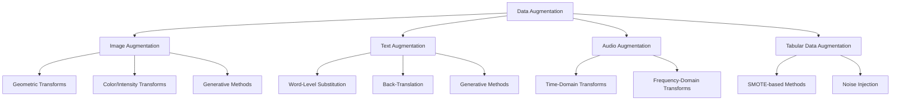

## Data Augmentation Techniques

### Overview

Data augmentation is the practice of artificially expanding a training dataset by creating modified copies of existing data or generating synthetic data points, without collecting new raw data. It is used to improve model generalization, reduce overfitting, and address limited data availability. Augmentation strategies differ substantially depending on data type (image, text, audio, tabular).

### Why Data Augmentation Matters

**Key Points**

- Increases the effective size and diversity of a training dataset, which can help reduce overfitting to the specific samples present in the original data.
- Helps models generalize to variations that may appear in real-world data but are underrepresented in the original training set.
- [Inference] The degree of benefit from data augmentation depends on the dataset size, the model architecture, and how well the augmentation strategy reflects realistic variation in the target domain. This is a reasoned expectation based on general machine learning principles, not a guaranteed outcome for any specific case.

### Categories of Data Augmentation



### Image Augmentation

#### Geometric Transformations

Includes rotation, flipping, cropping, scaling, and translation of images.

```python
from torchvision import transforms

transform = transforms.Compose([
    transforms.RandomHorizontalFlip(p=0.5),
    transforms.RandomRotation(degrees=15),
    transforms.RandomCrop(size=(224, 224)),
    transforms.RandomResizedCrop(size=(224, 224), scale=(0.8, 1.0)),
])
```

**Key Points**

- Documented as standard practice in computer vision pipelines (e.g., in the torchvision and Keras documentation) for improving model robustness to spatial variation.
- Not all transformations are appropriate for all tasks; for example, horizontal flipping may be inappropriate for tasks where left-right orientation carries meaning (e.g., text recognition in images).

#### Color and Intensity Transformations

Includes brightness, contrast, saturation, and hue adjustments.

```python
transform = transforms.Compose([
    transforms.ColorJitter(brightness=0.2, contrast=0.2, saturation=0.2, hue=0.1),
    transforms.RandomGrayscale(p=0.1),
])
```

**Key Points**

- Helps models become more robust to variations in lighting conditions and camera settings that may occur in deployment but not in the original training set.

#### Noise Injection and Cutout Methods

```python
import numpy as np

def add_gaussian_noise(image, mean=0, std=0.1):
    noise = np.random.normal(mean, std, image.shape)
    return np.clip(image + noise, 0, 1)
```

**Cutout / Random Erasing**: Randomly masks out square regions of an image during training.

```python
from torchvision.transforms import RandomErasing

transform = transforms.Compose([
    transforms.ToTensor(),
    RandomErasing(p=0.5, scale=(0.02, 0.33)),
])
```

**Key Points**

- Random erasing is documented in its originating research literature as a technique to encourage models to rely on multiple regions of an image rather than a single discriminative patch.

#### Mixing-Based Methods

**Mixup**: Creates new training examples by taking a weighted linear combination of two images and their corresponding labels.

$$\tilde{x} = \lambda x_i + (1 - \lambda) x_j, \quad \tilde{y} = \lambda y_i + (1 - \lambda) y_j$$

```python
def mixup(x, y, alpha=0.2):
    lam = np.random.beta(alpha, alpha)
    index = np.random.permutation(x.size(0))
    mixed_x = lam * x + (1 - lam) * x[index]
    y_a, y_b = y, y[index]
    return mixed_x, y_a, y_b, lam
```

**CutMix**: Replaces a rectangular region of one image with a patch from another image, combining labels proportionally to the area of each source image.

**Key Points**

- Both methods are documented in their respective originating research papers (Zhang et al., 2017 for Mixup; Yun et al., 2019 for CutMix) as regularization techniques that can improve generalization.
- [Unverified] The degree of performance improvement from Mixup or CutMix varies by dataset, model architecture, and task; I do not have access to benchmark results that would support a general quantitative claim across all use cases.

#### Generative Methods

Uses generative models (e.g., GANs, diffusion models) to create entirely synthetic training images.

**Key Points**

- Can generate novel, realistic samples beyond simple transformations of existing images.
- Requires substantial computational resources and a sufficiently large initial dataset to train the generative model effectively.
- [Inference] Synthetic images generated this way may not fully capture the statistical properties of real-world data, which could affect downstream model performance; this depends on the quality of the generative model and the specific domain, and I cannot verify the extent of this effect in general.

### Text Augmentation

#### Word-Level Substitution

**Synonym Replacement**: Replaces words with synonyms, often using a thesaurus or word embedding similarity.

```python
import nlpaug.augmenter.word as naw

aug = naw.SynonymAug(aug_src='wordnet')
augmented_text = aug.augment("The quick brown fox jumps over the lazy dog")
```

**Random Insertion, Deletion, and Swap**: Randomly inserts, deletes, or swaps words in a sentence.

```python
aug_swap = naw.RandomWordAug(action="swap")
aug_delete = naw.RandomWordAug(action="delete")
```

**Key Points**

- Documented in the EDA (Easy Data Augmentation) paper (Wei & Zou, 2019) as a set of simple, computationally inexpensive text augmentation techniques.
- Can occasionally alter sentence meaning or grammaticality, particularly with aggressive substitution rates.

#### Back-Translation

Translates text into another language and then back into the original language, producing a paraphrased version of the original sentence.

```python
from transformers import MarianMTModel, MarianTokenizer

# Translate English -> French -> English (conceptual example)
# Requires appropriate pretrained translation models
```

**Key Points**

- Documented as a common technique in NLP augmentation literature for generating paraphrases while approximately preserving meaning.
- Translation quality directly affects the quality of the augmented text; errors introduced during translation can propagate into the training data.

#### Contextual Word Embedding Substitution

Uses pretrained language models (e.g., BERT) to substitute words based on contextual meaning rather than fixed synonym lists.

```python
aug = naw.ContextualWordEmbsAug(model_path='bert-base-uncased', action="substitute")
```

**Key Points**

- Documented as generally producing more contextually appropriate substitutions than static thesaurus-based synonym replacement, since the substitution model considers surrounding words.

#### Generative Text Augmentation

Uses large language models to paraphrase, expand, or generate new training examples conditioned on existing data.

**Key Points**

- [Inference] Generative augmentation can produce more diverse and fluent text than rule-based methods, but the quality depends heavily on the specific generative model used and how outputs are filtered or validated; I cannot verify this holds true for every generative model or dataset.

### Audio Augmentation

#### Time-Domain Transformations

```python
import librosa

def time_stretch(audio, rate=1.1):
    return librosa.effects.time_stretch(audio, rate=rate)

def pitch_shift(audio, sr, n_steps=2):
    return librosa.effects.pitch_shift(audio, sr=sr, n_steps=n_steps)
```

**Key Points**

- Time stretching alters the speed of audio without changing pitch; pitch shifting alters pitch without changing speed. Both are documented, standard operations in the librosa library.

#### Noise and Environmental Augmentation

```python
def add_background_noise(audio, noise, snr_db=10):
    audio_power = np.mean(audio ** 2)
    noise_power = np.mean(noise ** 2)
    target_noise_power = audio_power / (10 ** (snr_db / 10))
    scaled_noise = noise * np.sqrt(target_noise_power / noise_power)
    return audio + scaled_noise
```

**Key Points**

- Adding background noise or simulating room acoustics can improve model robustness to real-world audio recording conditions.

#### Frequency-Domain Transformations

**SpecAugment**: Applies masking directly to the spectrogram representation of audio, masking blocks of time steps or frequency channels.

**Key Points**

- Documented in its originating research paper (Park et al., 2019) as an augmentation method specifically designed for speech recognition tasks, applied directly on spectrograms rather than raw waveforms.

### Tabular Data Augmentation

#### SMOTE-Based Methods

As discussed in the context of imbalanced datasets, SMOTE and its variants can also serve as a general data augmentation strategy for tabular data, not solely for class imbalance correction.

#### Noise Injection

Adds small random noise to numeric features to create slightly varied synthetic samples.

```python
def augment_tabular_noise(X, noise_level=0.01):
    noise = np.random.normal(0, noise_level, X.shape)
    return X + noise
```

**Key Points**

- Simple to implement, but the appropriate noise magnitude must be tuned carefully; excessive noise can distort meaningful feature relationships. [Unverified] The specific noise level threshold at which distortion becomes problematic depends on the dataset and feature scale; I do not have access to a general rule applicable across all tabular datasets.

#### Generative Approaches (GANs, VAEs)

Uses generative models such as CTGAN (Conditional Tabular GAN) to synthesize realistic tabular records.

```python
# Conceptual usage of a tabular GAN library
from ctgan import CTGAN

model = CTGAN()
model.fit(real_data, discrete_columns=categorical_columns)
synthetic_data = model.sample(1000)
```

**Key Points**

- Documented in the CTGAN originating research literature as a method designed specifically to handle mixed discrete and continuous tabular data distributions.
- [Inference] Generative tabular augmentation may better preserve complex feature interactions than simple noise injection, though this depends on the quality of the generative model and the specific dataset; I cannot verify this holds universally.

### Augmentation Pipeline Diagram

<svg xmlns="http://www.w3.org/2000/svg" viewBox="0 0 750 260">
<text x="375" y="30" font-size="18" font-weight="bold" text-anchor="middle" fill="#1a1a1a">Data Augmentation Pipeline (svg_diagram)</text>
<rect x="20" y="70" width="150" height="55" rx="6" fill="#e8f0fe" stroke="#4285f4" stroke-width="1.5" />
<text x="95" y="93" font-size="12" text-anchor="middle" fill="#1a1a1a">Original Training</text>
<text x="95" y="108" font-size="12" text-anchor="middle" fill="#1a1a1a">Dataset</text>
<rect x="205" y="70" width="150" height="55" rx="6" fill="#e8f0fe" stroke="#4285f4" stroke-width="1.5" />
<text x="280" y="93" font-size="12" text-anchor="middle" fill="#1a1a1a">Apply Augmentation</text>
<text x="280" y="108" font-size="12" text-anchor="middle" fill="#1a1a1a">(per data type)</text>
<rect x="390" y="70" width="150" height="55" rx="6" fill="#e8f0fe" stroke="#4285f4" stroke-width="1.5" />
<text x="465" y="93" font-size="12" text-anchor="middle" fill="#1a1a1a">Combine with</text>
<text x="465" y="108" font-size="12" text-anchor="middle" fill="#1a1a1a">Original Data</text>
<rect x="575" y="70" width="155" height="55" rx="6" fill="#e6f4ea" stroke="#34a853" stroke-width="1.5" />
<text x="652" y="93" font-size="12" text-anchor="middle" fill="#1a1a1a">Train Model on</text>
<text x="652" y="108" font-size="12" text-anchor="middle" fill="#1a1a1a">Expanded Dataset</text>
<line x1="170" y1="97" x2="200" y2="97" stroke="#555" stroke-width="1.5" marker-end="url(#arrA)" />
<line x1="355" y1="97" x2="385" y2="97" stroke="#555" stroke-width="1.5" marker-end="url(#arrA)" />
<line x1="540" y1="97" x2="570" y2="97" stroke="#555" stroke-width="1.5" marker-end="url(#arrA)" />
<rect x="150" y="160" width="450" height="70" rx="6" fill="#fff8e1" stroke="#f9a825" stroke-width="1.5" />
<text x="375" y="185" font-size="12" font-weight="bold" text-anchor="middle" fill="#1a1a1a">Important: Augmentation is typically applied only</text>
<text x="375" y="205" font-size="12" text-anchor="middle" fill="#333">to training data, not validation/test data</text>
<line x1="652" y1="125" x2="450" y2="158" stroke="#555" stroke-width="1.5" stroke-dasharray="4,3" marker-end="url(#arrA)" />
</svg>

### Common Pitfalls

- **Augmenting Validation/Test Sets**: Applying augmentation to validation or test data can produce misleading evaluation results, since these sets are meant to reflect real, unaltered data distributions.
- **Unrealistic Transformations**: Applying augmentations that do not reflect plausible real-world variation (e.g., vertically flipping images of text) can introduce noise rather than useful diversity. [Inference] Whether a specific transformation is "unrealistic" depends entirely on the task and domain; this is a reasoned general caution, not a claim about any specific transformation being universally inappropriate.
- **Over-Augmentation**: Applying excessive or overly aggressive augmentation can distort data to the point where it no longer represents the underlying distribution, potentially harming model performance. [Unverified] The specific threshold at which augmentation becomes excessive depends on the dataset and augmentation method; I do not have access to a general rule that applies across all cases.
- **Label Inconsistency**: Some augmentations (e.g., certain crops or word deletions) can inadvertently change the true label of a sample without updating the label accordingly.

### Conclusion

Data augmentation techniques vary substantially by data modality, ranging from simple geometric and noise-based transformations to advanced generative methods. [Inference] The effectiveness of any given augmentation strategy depends on the specific dataset, task, and model architecture involved; I cannot verify that any particular technique will improve performance for a specific use case without direct experimentation. Augmentation is generally applied only to training data, with validation and test sets left unaltered to preserve an accurate assessment of real-world model performance.

I cannot verify subjective claims about which augmentation techniques are "best" for a specific project without direct testing on that specific dataset and task.

### Related Topics

- Handling imbalanced datasets (related but distinct problem framing)
- Regularization techniques (dropout, weight decay) as complementary methods to reduce overfitting
- Generative Adversarial Networks (GANs) and diffusion models
- Transfer learning and pretrained model fine-tuning
- Synthetic data generation for privacy-preserving machine learning
- Cross-validation strategies when using augmented data