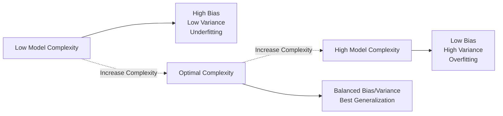

## Bias-Variance Tradeoff

### Overview

The bias-variance tradeoff is a foundational concept in machine learning describing the relationship between two sources of prediction error: bias (error from overly simplistic assumptions in the model) and variance (error from excessive sensitivity to fluctuations in the training data). Understanding this tradeoff is documented in standard machine learning literature as central to diagnosing underfitting and overfitting and to guiding model selection and complexity tuning.

### Core Concepts

#### Bias

Bias refers to the error introduced by approximating a real-world problem, which may be complex, with a simplified model. High-bias models make strong assumptions about the underlying data structure.

**Key Points**

- High bias is documented as a common cause of underfitting, where a model fails to capture relevant patterns in the training data.
- Examples of typically high-bias models include linear regression applied to a non-linear relationship, or shallow decision trees.

#### Variance

Variance refers to the error introduced by a model's sensitivity to small fluctuations in the training data. High-variance models fit the training data very closely, including its noise.

**Key Points**

- High variance is documented as a common cause of overfitting, where a model performs well on training data but poorly on unseen data.
- Examples of typically high-variance models include deep, unpruned decision trees or high-degree polynomial regression.

### Mathematical Decomposition

The expected prediction error of a model can be decomposed into three components: bias squared, variance, and irreducible error.

$$\text{Expected Error} = \text{Bias}^2 + \text{Variance} + \text{Irreducible Error}$$

More formally, for a model $\hat{f}(x)$ estimating the true function $f(x)$:

$$E\left[(y - \hat{f}(x))^2\right] = \left(E[\hat{f}(x)] - f(x)\right)^2 + E\left[\left(\hat{f}(x) - E[\hat{f}(x)]\right)^2\right] + \sigma^2$$

Where the first term is bias squared, the second term is variance, and $\sigma^2$ is the irreducible error (noise inherent in the data).

**Key Points**

- This decomposition is documented in standard statistical learning references (e.g., "The Elements of Statistical Learning") as a formal derivation of the bias-variance tradeoff.
- Irreducible error represents noise in the data-generating process itself and cannot be reduced by any model, regardless of its complexity.

### The Tradeoff Relationship

As model complexity increases, bias typically decreases while variance typically increases. [Inference] This inverse relationship is a commonly described general pattern in machine learning literature; the precise shape of this relationship (how quickly bias decreases or variance increases) depends on the specific model, dataset, and complexity parameter being varied, and I cannot verify the exact curve for any specific case without direct experimentation.



### Visualizing the Tradeoff

<svg xmlns="http://www.w3.org/2000/svg" viewBox="0 0 650 420">
<text x="325" y="30" font-size="18" font-weight="bold" text-anchor="middle" fill="#1a1a1a">Bias-Variance Tradeoff (svg_diagram)</text>
<line x1="70" y1="370" x2="70" y2="60" stroke="#333" stroke-width="1.5" />
<line x1="70" y1="370" x2="600" y2="370" stroke="#333" stroke-width="1.5" />
<text x="30" y="215" font-size="12" fill="#333" transform="rotate(-90 30 215)">Error</text>
<text x="300" y="400" font-size="12" fill="#333">Model Complexity</text>
<path d="M 90 100 C 250 250, 400 330, 580 350" stroke="#4285f4" stroke-width="2.5" fill="none" />
<text x="470" y="300" font-size="12" fill="#4285f4" font-weight="bold">Bias²</text>
<path d="M 90 350 C 250 330, 400 200, 580 90" stroke="#ea4335" stroke-width="2.5" fill="none" />
<text x="470" y="150" font-size="12" fill="#ea4335" font-weight="bold">Variance</text>
<path d="M 90 130 C 250 130, 400 110, 580 100" stroke="#34a853" stroke-width="2" fill="none" stroke-dasharray="5,3" />
<text x="470" y="90" font-size="12" fill="#34a853" font-weight="bold">Total Error</text>
<line x1="330" y1="60" x2="330" y2="370" stroke="#999" stroke-width="1" stroke-dasharray="4,3" />
<text x="335" y="80" font-size="11" fill="#666">Optimal Complexity</text>
<text x="150" y="390" font-size="11" fill="#666">Underfitting Zone</text>
<text x="450" y="390" font-size="11" fill="#666">Overfitting Zone</text>
</svg>

[Unverified] This diagram illustrates the general, commonly described shape of the bias-variance curves as presented in introductory machine learning material. The exact curve shape, position of the optimal point, and rate of change shown here are illustrative and schematic rather than derived from any specific dataset; actual curves depend entirely on the model and data involved.

### Underfitting vs. Overfitting

| Aspect | Underfitting (High Bias) | Overfitting (High Variance) |
| --- | --- | --- |
| Training error | High | Low |
| Test/validation error | High | High |
| Model complexity | Too simple | Too complex |
| Typical cause | Insufficient features, overly simple model | Excessive features, insufficient regularization, too complex a model |

[Inference] This comparison reflects general characteristics commonly described in machine learning literature regarding underfitting and overfitting. I cannot verify that every model or dataset will exhibit precisely this pattern without direct testing.

### Diagnosing Bias vs. Variance Issues

#### Learning Curves

Plotting training and validation error as a function of training set size can help diagnose whether a model suffers primarily from high bias or high variance.

```python
from sklearn.model_selection import learning_curve
import numpy as np
import matplotlib.pyplot as plt

train_sizes, train_scores, val_scores = learning_curve(
    estimator=model, X=X, y=y, cv=5,
    train_sizes=np.linspace(0.1, 1.0, 10),
    scoring='neg_mean_squared_error'
)

train_scores_mean = -np.mean(train_scores, axis=1)
val_scores_mean = -np.mean(val_scores, axis=1)

plt.plot(train_sizes, train_scores_mean, label='Training Error')
plt.plot(train_sizes, val_scores_mean, label='Validation Error')
plt.xlabel('Training Set Size')
plt.ylabel('Error')
plt.legend()
plt.show()
```

**Key Points**

- [Inference] A high-bias model is generally expected to show both training and validation error converging to a similarly high error value as training set size increases, since additional data cannot compensate for an overly simplistic model. This is a commonly cited diagnostic pattern in machine learning literature, not a claim I can independently confirm for every specific model or dataset.
- [Inference] A high-variance model is generally expected to show a large, persistent gap between low training error and higher validation error, even as training set size increases, though the gap may narrow somewhat with more data. This is also a commonly cited diagnostic pattern rather than a confirmed outcome for any specific case.

### Strategies to Address High Bias

**Key Points**

- Increasing model complexity (e.g., adding polynomial features, using a more flexible model architecture).
- Adding more relevant features that better capture the underlying data structure.
- Reducing regularization strength, if regularization is currently too aggressive.

[Inference] These strategies are commonly recommended in machine learning literature for addressing high-bias/underfitting scenarios. Whether a specific strategy will improve performance depends on the particular dataset and problem; I cannot verify a specific outcome without direct testing.

### Strategies to Address High Variance

**Key Points**

- Increasing training data size, since more data is documented to generally help models generalize better and reduce variance-related error, particularly for high-capacity models.
- Applying regularization techniques (L1, L2, dropout) to constrain model complexity.
- Reducing model complexity (e.g., pruning decision trees, reducing polynomial degree, decreasing neural network layers/units).
- Using ensemble methods such as bagging (e.g., Random Forest), which are documented to reduce variance by averaging predictions across multiple models trained on different data subsets.
- Applying feature selection or dimensionality reduction to reduce the number of inputs the model can overfit to.

[Inference] These strategies are commonly recommended in machine learning literature for addressing high-variance/overfitting scenarios. Whether a specific strategy will improve performance depends on the particular dataset, model, and degree of overfitting present; I cannot verify a specific outcome without direct testing.

### Relationship to Ensemble Methods

#### Bagging and Variance Reduction

Bagging (Bootstrap Aggregating) trains multiple models on different bootstrap samples of the training data and averages their predictions.

$$\text{Var}(\bar{X}) = \frac{\sigma^2}{n} \text{ (for independent estimators)}$$

**Key Points**

- [Inference] This formula illustrates why averaging multiple independent estimators can reduce variance in principle; however, in practice, models trained via bagging are typically correlated rather than fully independent, which reduces the practical variance reduction below what this idealized formula suggests. I cannot verify the precise degree of variance reduction achieved by bagging for any specific dataset or model without direct testing.

#### Boosting and Bias Reduction

Boosting sequentially trains models, with each new model focused on correcting the errors of previous models, generally reducing bias.

**Key Points**

- [Inference] Boosting is commonly documented as primarily reducing bias, though it can also increase variance if too many boosting rounds are used without adequate regularization; the specific tradeoff depends on the dataset, the number of boosting iterations, and hyperparameters used, and I cannot verify a precise outcome for any specific case.

### Regularization and the Tradeoff

Regularization techniques directly manage the bias-variance tradeoff by penalizing model complexity.

$$\text{Loss} = \text{Training Error} + \lambda \times \text{Complexity Penalty}$$

**Key Points**

- Increasing $\lambda$ (regularization strength) is documented to generally increase bias while decreasing variance.
- Decreasing $\lambda$ is documented to generally decrease bias while increasing variance.
- [Inference] The optimal value of $\lambda$ for balancing this tradeoff is dataset-specific and typically determined empirically through techniques such as cross-validation; I cannot verify an optimal value for any specific dataset without direct testing.

### Cross-Validation as a Diagnostic Tool

```python
from sklearn.model_selection import cross_val_score

scores = cross_val_score(model, X, y, cv=5, scoring='neg_mean_squared_error')
print("Mean CV Score:", -scores.mean())
print("CV Score Std Dev:", scores.std())
```

**Key Points**

- A large standard deviation across cross-validation folds can indicate high variance sensitivity to the specific training data used in each fold. [Unverified] The precise threshold at which a standard deviation should be considered "large" depends on the scale of the target variable and the specific problem; I do not have access to a general numeric rule applicable across all cases.

### Common Pitfalls

- **Focusing Only on Training Error**: Evaluating a model solely on training error can mask high variance, since a high-variance model can achieve very low training error while generalizing poorly.
- **Over-Regularizing**: Applying excessive regularization to address overfitting can push a model into high-bias/underfitting territory instead.
- **Assuming More Data Always Fixes Overfitting**: [Inference] While more training data is generally documented to help reduce variance-related overfitting, it does not address high-bias problems, since a fundamentally too-simple model will not improve substantially with additional data alone. This is a commonly cited principle in machine learning literature rather than a claim I can verify for every specific case.
- **Ignoring Irreducible Error**: Attempting to drive total error to zero through model tuning alone is not achievable when irreducible error (inherent noise) is present in the data-generating process.

### Conclusion

The bias-variance tradeoff describes the balance between error from overly simplistic models (high bias) and error from overly complex, data-sensitive models (high variance). [Inference] Achieving good generalization performance generally requires finding a model complexity that balances these two sources of error for the specific dataset and problem at hand; this is a widely documented principle in machine learning literature, not a claim I can verify as producing optimal results for any specific case without direct experimentation. Diagnostic tools such as learning curves and cross-validation are documented, standard methods for assessing whether a model is suffering primarily from bias or variance issues.

[Unverified] Some content in this response describes general patterns and heuristics commonly presented in machine learning literature rather than confirmed outcomes for any specific dataset, and behavior may vary depending on implementation, data, and context.

### Related Topics

- Regularization techniques (L1, L2, Elastic Net, Dropout)
- Ensemble methods (Bagging, Boosting, Stacking)
- Cross-validation strategies
- Learning curves and model diagnostics
- Overfitting and underfitting detection
- Hyperparameter tuning and model selection
- Regression and classification model evaluation metrics