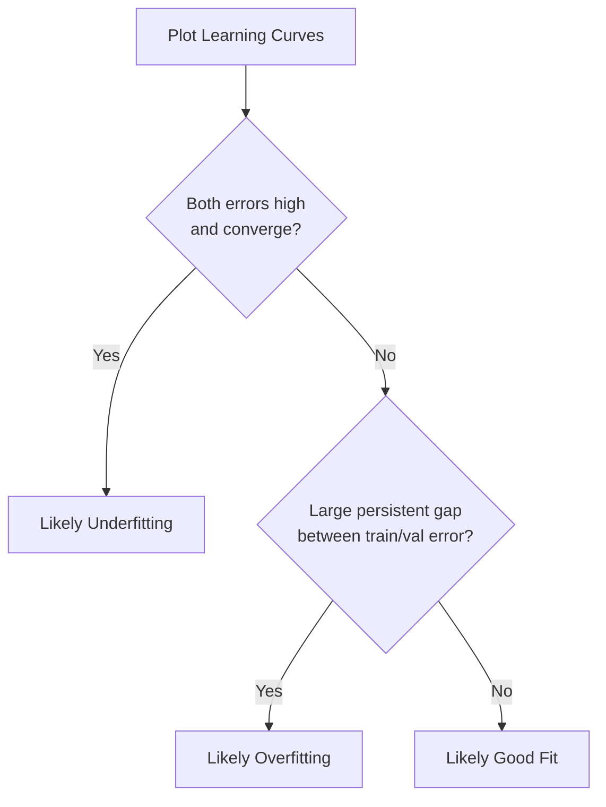
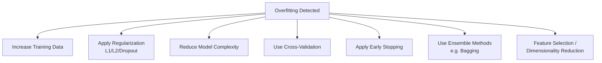
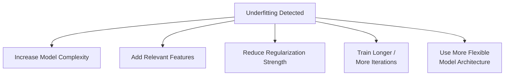

## Overfitting and Underfitting

### Overview

Overfitting and underfitting describe two failure modes in machine learning models related to how well a model generalizes from training data to unseen data. Overfitting occurs when a model learns the training data too closely, including its noise, while underfitting occurs when a model is too simple to capture the underlying patterns in the data. These concepts are closely related to, and largely explained by, the bias-variance tradeoff.

### Defining Overfitting

Overfitting occurs when a model fits the training data very closely, including random noise and idiosyncrasies specific to that dataset, resulting in poor performance on new, unseen data.

**Key Points**

- Characterized by low training error combined with substantially higher validation or test error.
- Associated with high model variance, as discussed in the bias-variance tradeoff.
- Commonly documented causes include excessive model complexity relative to the amount of training data, insufficient regularization, and training for too many iterations/epochs.

### Defining Underfitting

Underfitting occurs when a model is too simple to capture the underlying structure of the data, resulting in poor performance on both training and unseen data.

**Key Points**

- Characterized by high training error combined with similarly high validation or test error.
- Associated with high model bias, as discussed in the bias-variance tradeoff.
- Commonly documented causes include an overly simple model architecture, insufficient relevant features, or excessive regularization.

### Visual Comparison

<svg xmlns="http://www.w3.org/2000/svg" viewBox="0 0 750 320">
<text x="375" y="30" font-size="18" font-weight="bold" text-anchor="middle" fill="#1a1a1a">Underfitting vs. Good Fit vs. Overfitting (svg_diagram)</text>
<rect x="20" y="60" width="220" height="220" fill="none" stroke="#ccc" stroke-width="1" />
<text x="130" y="55" font-size="13" text-anchor="middle" fill="#1a1a1a" font-weight="bold">Underfitting</text>
<circle cx="50" cy="230" r="4" fill="#4285f4" />
<circle cx="80" cy="200" r="4" fill="#4285f4" />
<circle cx="110" cy="240" r="4" fill="#4285f4" />
<circle cx="140" cy="180" r="4" fill="#4285f4" />
<circle cx="170" cy="210" r="4" fill="#4285f4" />
<circle cx="200" cy="160" r="4" fill="#4285f4" />
<line x1="40" y1="240" x2="220" y2="170" stroke="#ea4335" stroke-width="2.5" />
<text x="130" y="300" font-size="11" text-anchor="middle" fill="#666">High bias, poor fit</text>
<rect x="265" y="60" width="220" height="220" fill="none" stroke="#ccc" stroke-width="1" />
<text x="375" y="55" font-size="13" text-anchor="middle" fill="#1a1a1a" font-weight="bold">Good Fit</text>
<circle cx="295" cy="230" r="4" fill="#4285f4" />
<circle cx="325" cy="195" r="4" fill="#4285f4" />
<circle cx="355" cy="215" r="4" fill="#4285f4" />
<circle cx="385" cy="170" r="4" fill="#4285f4" />
<circle cx="415" cy="190" r="4" fill="#4285f4" />
<circle cx="445" cy="150" r="4" fill="#4285f4" />
<path d="M 290 235 Q 375 210, 460 145" stroke="#34a853" stroke-width="2.5" fill="none" />
<text x="375" y="300" font-size="11" text-anchor="middle" fill="#666">Balanced bias/variance</text>
<rect x="510" y="60" width="220" height="220" fill="none" stroke="#ccc" stroke-width="1" />
<text x="620" y="55" font-size="13" text-anchor="middle" fill="#1a1a1a" font-weight="bold">Overfitting</text>
<circle cx="540" cy="230" r="4" fill="#4285f4" />
<circle cx="570" cy="195" r="4" fill="#4285f4" />
<circle cx="600" cy="215" r="4" fill="#4285f4" />
<circle cx="630" cy="170" r="4" fill="#4285f4" />
<circle cx="660" cy="190" r="4" fill="#4285f4" />
<circle cx="690" cy="150" r="4" fill="#4285f4" />
<path d="M 535 232 Q 560 190, 600 218 Q 630 240, 632 172 Q 660 200, 695 148" stroke="#fbbc05" stroke-width="2.5" fill="none" />
<text x="620" y="300" font-size="11" text-anchor="middle" fill="#666">High variance, fits noise</text>
</svg>

[Unverified] This diagram is a schematic, illustrative representation commonly used in introductory machine learning material to convey the general concepts of underfitting, good fit, and overfitting. It does not represent output from any actual fitted model or dataset.

### Detecting Overfitting and Underfitting

#### Train/Validation Error Comparison

```python
from sklearn.model_selection import train_test_split
from sklearn.metrics import mean_squared_error

X_train, X_val, y_train, y_val = train_test_split(X, y, test_size=0.2, random_state=42)

model.fit(X_train, y_train)

train_error = mean_squared_error(y_train, model.predict(X_train))
val_error = mean_squared_error(y_val, model.predict(X_val))

print("Training Error:", train_error)
print("Validation Error:", val_error)
```

**Key Points**

- A large gap between low training error and high validation error is a commonly documented signal of overfitting.
- Similarly high training and validation error is a commonly documented signal of underfitting.
- [Inference] These are general diagnostic heuristics described in machine learning literature; the specific error values that should be considered "large" or "similar" depend on the dataset, target scale, and problem context. I cannot verify a precise numeric threshold that applies universally.

#### Learning Curves

Learning curves plot training and validation error against training set size and are documented as a standard diagnostic tool for distinguishing between bias- and variance-related problems.



[Inference] This decision path reflects commonly cited diagnostic heuristics in machine learning literature. I cannot verify that this exact pattern will hold for every model or dataset without direct testing, and results may vary.

### Causes of Overfitting

**Key Points**

- Excessive model complexity relative to the amount and diversity of available training data.
- Insufficient regularization, allowing the model to fit noise in the training data.
- Training for too many iterations or epochs, particularly in iterative algorithms such as gradient boosting or neural networks. [Inference] This is a commonly documented risk in iterative training procedures; the specific point at which additional training begins to cause overfitting depends on the dataset, model, and learning rate, and I cannot verify a general threshold.
- Too many irrelevant or noisy features relative to the number of training samples.
- Data leakage, where information from outside the training set (including target information) inadvertently influences training.

### Causes of Underfitting

**Key Points**

- Model architecture that is too simple to represent the underlying relationship in the data (e.g., linear regression applied to a highly non-linear relationship).
- Excessive regularization that overly constrains model flexibility.
- Insufficient or poorly engineered features that fail to capture relevant signal.
- Insufficient training (e.g., too few iterations for an iterative algorithm to converge).

### Strategies to Address Overfitting



#### Regularization

```python
from sklearn.linear_model import Ridge, Lasso

ridge_model = Ridge(alpha=1.0)
lasso_model = Lasso(alpha=0.1)
```

#### Early Stopping

```python
from sklearn.ensemble import GradientBoostingClassifier

model = GradientBoostingClassifier(
    n_estimators=1000,
    validation_fraction=0.1,
    n_iter_no_change=10,
    tol=0.0001
)
model.fit(X_train, y_train)
```

**Key Points**

- Early stopping is documented in scikit-learn and general deep learning literature as a technique that halts training once validation performance stops improving, in order to avoid continued fitting to training-set-specific noise.
- Requires a held-out validation set distinct from the training and test sets.

#### Dropout (Neural Networks)

```python
import torch.nn as nn

model = nn.Sequential(
    nn.Linear(128, 64),
    nn.ReLU(),
    nn.Dropout(p=0.5),
    nn.Linear(64, 10)
)
```

**Key Points**

- Dropout is documented in its originating research literature (Srivastava et al., 2014) as a regularization technique that randomly deactivates a proportion of neurons during training, intended to reduce co-adaptation between neurons.

#### Cross-Validation

```python
from sklearn.model_selection import cross_val_score

scores = cross_val_score(model, X, y, cv=5)
print("Mean CV Score:", scores.mean())
```

**Key Points**

- Cross-validation is a documented, standard method for obtaining a more robust estimate of model generalization performance than a single train/validation split.

### Strategies to Address Underfitting



**Key Points**

- Increasing model complexity (e.g., using a higher-degree polynomial, deeper decision tree, or more flexible model class).
- Adding relevant features or engineering new features that better represent underlying patterns.
- Reducing regularization strength if current regularization is overly constraining.
- [Inference] These strategies are commonly recommended in machine learning literature for addressing underfitting. Whether a specific strategy improves performance depends on the dataset and problem; I cannot verify a specific outcome without direct testing.

### Regularization's Role in Balancing Both

Regularization directly controls the tradeoff between fitting the training data closely and maintaining generalizable simplicity.

$$\text{Loss} = \text{Training Error} + \lambda \times \text{Complexity Penalty}$$

**Key Points**

- Increasing $\lambda$ generally shifts a model toward underfitting if applied excessively.
- Decreasing $\lambda$ generally shifts a model toward overfitting if applied insufficiently.
- [Inference] Determining an appropriate value of $\lambda$ is typically dataset-specific and determined empirically, often via cross-validation; I cannot verify an optimal value for any specific dataset without direct testing.

### Comparison Table

| Aspect | Underfitting | Overfitting |
| --- | --- | --- |
| Training error | High | Low |
| Validation/test error | High | High |
| Associated bias/variance | High bias | High variance |
| Model complexity | Too low | Too high |
| Common fix | Increase complexity, add features | Regularize, add data, reduce complexity |

[Inference] This table reflects general characteristics commonly described in machine learning literature regarding underfitting and overfitting. I cannot verify that every model or dataset will exhibit precisely this pattern without direct testing, and behavior may vary by implementation and context.

### Common Pitfalls

- **Evaluating Only on Training Data**: Relying solely on training performance can mask overfitting, since a high-variance model can achieve very low training error while generalizing poorly to new data.
- **Tuning Hyperparameters on the Test Set**: Using the test set to select hyperparameters (rather than a separate validation set) can itself introduce a form of overfitting to the test set, inflating reported performance. [Inference] This is a widely cited methodological concern in machine learning practice, not a claim about the outcome for any specific project.
- **Assuming More Data Always Fixes Underfitting**: [Inference] Adding more training data generally addresses variance-related overfitting but does not resolve high-bias/underfitting problems, since a fundamentally too-simple model will not substantially improve with more data alone. This reflects a commonly cited principle rather than a confirmed outcome for every case.
- **Over-Regularizing to Fix Overfitting**: Applying excessive regularization can overcorrect and push a model from overfitting into underfitting.

### Conclusion

Overfitting and underfitting represent two ends of a spectrum related to model complexity and generalization ability, closely tied to the bias-variance tradeoff. [Inference] Achieving a well-generalizing model generally requires iteratively diagnosing which failure mode is present (via train/validation error comparison and learning curves) and applying targeted strategies — such as regularization, added data, or feature engineering — to move the model toward better balance. This is a widely documented approach in machine learning literature, not a claim I can verify as producing optimal results for any specific dataset without direct experimentation.

[Unverified] Several claims in this response describe general patterns, heuristics, and commonly cited practices from machine learning literature rather than confirmed outcomes for any specific dataset, model, or implementation; behavior may vary and is not guaranteed.

### Related Topics

- Bias-variance tradeoff
- Regularization techniques (L1, L2, Dropout, Early Stopping)
- Cross-validation strategies
- Learning curves and model diagnostics
- Ensemble methods (Bagging, Boosting)
- Hyperparameter tuning and model selection
- Data leakage detection and prevention