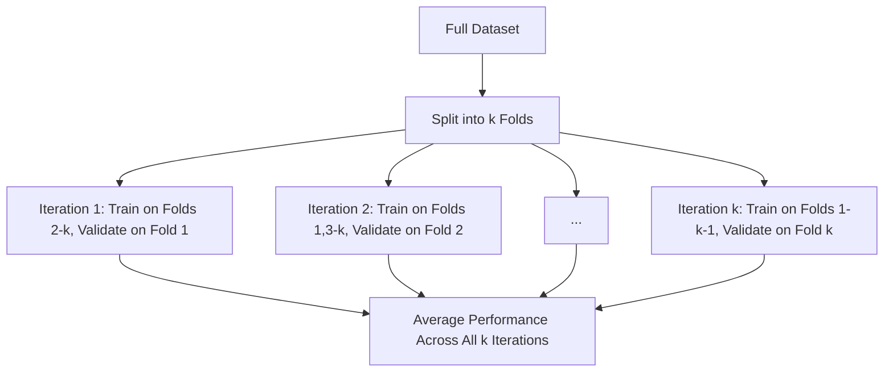
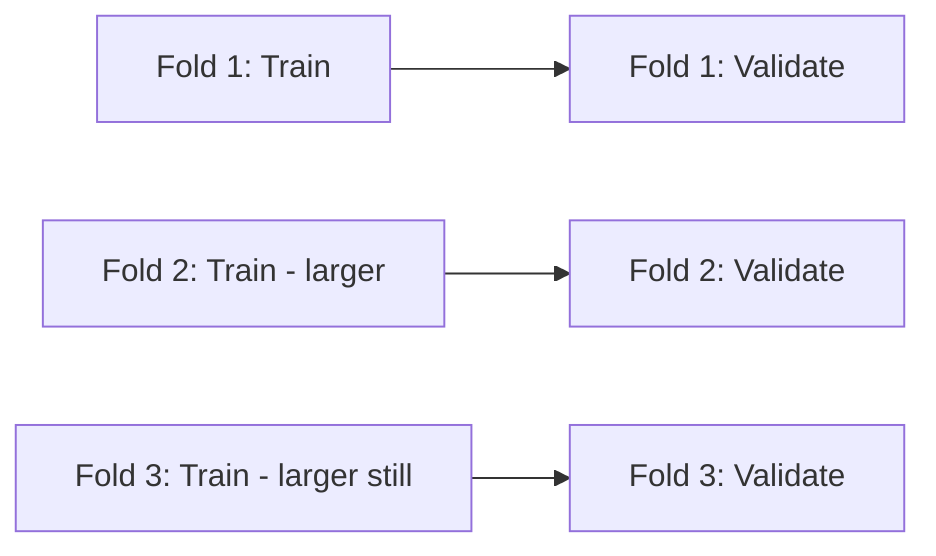
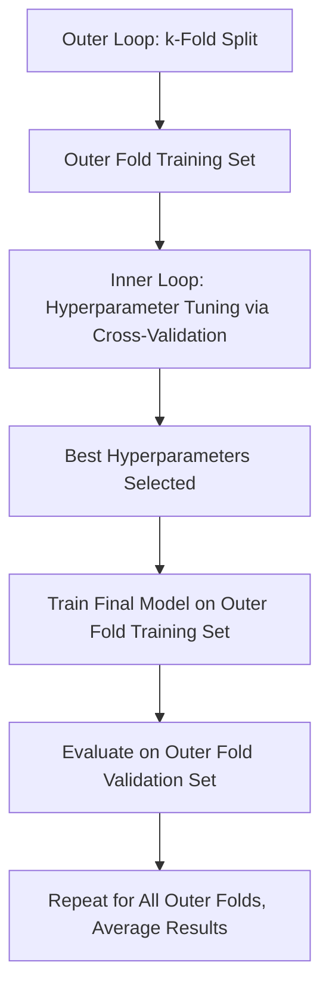
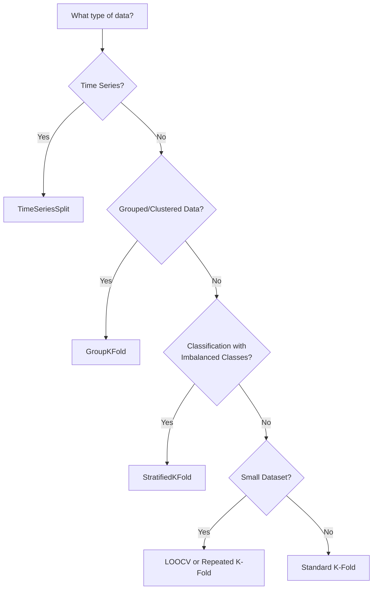

## Cross-Validation Techniques

### Overview

Cross-validation is a resampling technique used to evaluate how well a machine learning model generalizes to independent data. It works by partitioning the available data into subsets, training on some subsets and validating on others, repeated across multiple iterations. Cross-validation is documented as a standard method for obtaining a more robust estimate of model performance than a single train/test split, and for supporting hyperparameter tuning and model selection.

### Why Cross-Validation Matters

**Key Points**

- A single train/test split can produce a performance estimate that is highly dependent on which specific samples happened to fall into each split. Cross-validation is documented as a method for reducing this dependency by averaging performance across multiple splits.
- Supports more reliable hyperparameter tuning by reducing the risk of tuning parameters to fit one particular split of the data.
- [Inference] Provides a more realistic estimate of how a model is likely to perform on unseen data, compared to a single split, though the specific degree of improvement in estimate reliability depends on the dataset size, variability, and the cross-validation method used. I cannot verify a precise quantitative benefit for any specific dataset without direct testing.

### K-Fold Cross-Validation

The dataset is split into $k$ equally sized folds. The model is trained on $k-1$ folds and validated on the remaining fold, repeated $k$ times so that each fold serves as the validation set exactly once.



```python
from sklearn.model_selection import KFold, cross_val_score

kf = KFold(n_splits=5, shuffle=True, random_state=42)
scores = cross_val_score(model, X, y, cv=kf, scoring='accuracy')

print("Fold Scores:", scores)
print("Mean Accuracy:", scores.mean())
print("Std Dev:", scores.std())
```

**Key Points**

- A commonly cited default choice in applied practice is $k=5$ or $k=10$. [Inference] The most appropriate value of $k$ depends on dataset size and computational budget; I cannot verify a universally optimal value of $k$ for any specific dataset.
- Higher values of $k$ increase computational cost, since the model must be trained $k$ separate times.

### Stratified K-Fold Cross-Validation

A variant of k-fold cross-validation that preserves the percentage of samples for each class in every fold, which is documented as particularly relevant for classification tasks with imbalanced class distributions.

```python
from sklearn.model_selection import StratifiedKFold

skf = StratifiedKFold(n_splits=5, shuffle=True, random_state=42)
scores = cross_val_score(model, X, y, cv=skf, scoring='accuracy')
```

**Key Points**

- Documented in scikit-learn as helping avoid folds in which a minority class is severely underrepresented or entirely absent, which could otherwise distort performance estimates.
- Standard k-fold cross-validation applied to imbalanced classification data risks producing folds with highly variable class proportions, which stratification is specifically designed to address.

### Leave-One-Out Cross-Validation (LOOCV)

An extreme case of k-fold cross-validation where $k$ equals the number of samples in the dataset — each iteration trains on all samples except one, which is used for validation.

```python
from sklearn.model_selection import LeaveOneOut

loo = LeaveOneOut()
scores = cross_val_score(model, X, y, cv=loo, scoring='accuracy')
```

**Key Points**

- Documented as computationally expensive for large datasets, since the model must be trained a number of times equal to the number of samples.
- [Inference] Generally considered to produce a low-bias estimate of model performance, since nearly all data is used for training in each iteration, but this estimate can have high variance across iterations. This is a commonly cited characterization in statistical learning literature, not a claim I can independently verify for every dataset.

### Leave-P-Out Cross-Validation

A generalization of LOOCV where $p$ samples are left out for validation in each iteration, rather than just one.

**Key Points**

- The number of possible train/validation splits grows combinatorially with $p$, specifically $\binom{n}{p}$, making this approach computationally infeasible for anything beyond small values of $p$ and small datasets.

### Repeated K-Fold Cross-Validation

Performs k-fold cross-validation multiple times with different random splits of the data, averaging results across all repetitions.

```python
from sklearn.model_selection import RepeatedKFold

rkf = RepeatedKFold(n_splits=5, n_repeats=3, random_state=42)
scores = cross_val_score(model, X, y, cv=rkf, scoring='accuracy')
```

**Key Points**

- [Inference] Documented as providing a more stable estimate of model performance than a single k-fold run, since it averages over multiple different random partitions of the data, though this increases computational cost proportionally to the number of repetitions. I cannot verify the precise degree of stability improvement for any specific dataset without direct testing.

### Time Series Cross-Validation

Standard k-fold cross-validation is not appropriate for time series data, since it can allow future data to be used to predict past data (a form of data leakage). Time series cross-validation instead respects temporal order.



```python
from sklearn.model_selection import TimeSeriesSplit

tscv = TimeSeriesSplit(n_splits=5)
scores = cross_val_score(model, X, y, cv=tscv, scoring='neg_mean_squared_error')
```

**Key Points**

- Documented in scikit-learn as an expanding-window approach, where each successive training set includes all prior data, and validation is always performed on data that chronologically follows the training set.
- Prevents the temporal data leakage that would occur if standard k-fold cross-validation were applied directly to time-ordered data.

### Group K-Fold Cross-Validation

Ensures that the same group (e.g., the same patient, user, or entity) does not appear in both the training and validation sets within a given fold.

```python
from sklearn.model_selection import GroupKFold

gkf = GroupKFold(n_splits=5)
scores = cross_val_score(model, X, y, cv=gkf, groups=groups, scoring='accuracy')
```

**Key Points**

- Documented as important when multiple samples belong to the same underlying entity (e.g., multiple scans from the same patient), since allowing the same entity's data to appear in both training and validation sets can leak entity-specific information and inflate performance estimates.

### Nested Cross-Validation

Uses two levels of cross-validation: an outer loop for estimating model performance, and an inner loop for hyperparameter tuning, keeping these two processes separate.



```python
from sklearn.model_selection import GridSearchCV, cross_val_score

inner_cv = KFold(n_splits=3, shuffle=True, random_state=42)
outer_cv = KFold(n_splits=5, shuffle=True, random_state=42)

param_grid = {'C': [0.1, 1, 10]}
grid_search = GridSearchCV(estimator=model, param_grid=param_grid, cv=inner_cv)

nested_scores = cross_val_score(grid_search, X, y, cv=outer_cv)
```

**Key Points**

- Documented as a method for avoiding overly optimistic performance estimates that can result from using the same cross-validation splits for both hyperparameter tuning and final performance evaluation.
- More computationally expensive than standard cross-validation due to the nested loop structure requiring many more total model fits.

### Choosing a Cross-Validation Strategy



[Inference] This decision path reflects commonly cited heuristics in applied machine learning practice for selecting a cross-validation strategy. The optimal choice for a specific dataset may differ and typically benefits from empirical validation; I cannot verify that this exact decision path is optimal for every case.

### Method Comparison

| Method | Computational Cost | Suitable For |
| --- | --- | --- |
| K-Fold | Moderate | General-purpose, i.i.d. data |
| Stratified K-Fold | Moderate | Classification with class imbalance |
| LOOCV | Very High | Small datasets |
| Time Series Split | Moderate | Sequential/temporal data |
| Group K-Fold | Moderate | Grouped/clustered data (e.g., multiple samples per entity) |
| Nested CV | Very High | Hyperparameter tuning + unbiased performance estimation |

[Inference] This comparison reflects general characteristics commonly described in machine learning literature regarding these cross-validation methods. I cannot verify that these characterizations hold precisely for every implementation, dataset size, or computational environment.

### Common Pitfalls

- **Data Leakage from Preprocessing**: Applying preprocessing steps (e.g., scaling, imputation, feature selection) before splitting into folds can leak information from validation data into training data. Documented best practice is to fit preprocessing steps only on the training fold within each iteration, typically using a pipeline.

```python
from sklearn.pipeline import Pipeline
from sklearn.preprocessing import StandardScaler

pipeline = Pipeline([
    ('scaler', StandardScaler()),
    ('model', model)
])
scores = cross_val_score(pipeline, X, y, cv=5)
```

- **Ignoring Temporal Structure**: Applying standard k-fold cross-validation to time series data can allow future information to leak into training, producing overly optimistic performance estimates.
- **Ignoring Grouped Structure**: Allowing samples from the same entity/group to appear in both training and validation folds can inflate performance estimates due to entity-specific information leakage.
- **Using the Same CV Splits for Tuning and Final Evaluation**: This can produce an overly optimistic estimate of generalization performance; nested cross-validation is documented as a method to address this specific concern.

### Conclusion

Cross-validation techniques provide a documented, standard framework for estimating model generalization performance more robustly than a single train/test split, with specific variants (stratified, time series, group-based, nested) designed to address particular data structures and evaluation concerns. [Inference] Selecting the most appropriate cross-validation strategy depends on the structure of the specific dataset (e.g., presence of class imbalance, temporal ordering, or grouped samples) and the computational resources available; I cannot verify which specific method will be optimal for any given dataset without direct testing on that dataset.

[Unverified] Several claims in this response describe general patterns, heuristics, and commonly cited practices from machine learning literature rather than confirmed outcomes for any specific dataset, model, or implementation. Behavior may vary depending on data characteristics, library version, and implementation details, and no specific outcome is guaranteed.

### Related Topics

- Bias-variance tradeoff
- Hyperparameter tuning (Grid Search, Random Search, Bayesian Optimization)
- Overfitting and underfitting detection
- Handling imbalanced datasets
- Time series forecasting methods
- Data leakage detection and prevention
- Model evaluation metrics for classification and regression