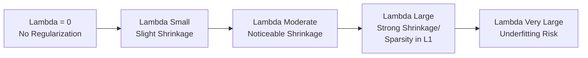

## Regularization — L1 and L2

### Overview

Regularization refers to techniques that add a penalty term to a model's loss function to constrain the magnitude of its coefficients, with the goal of reducing overfitting and improving generalization to unseen data. L1 (Lasso) and L2 (Ridge) regularization are the two most common forms, differing in the type of penalty applied and its effect on model coefficients.

### Why Regularization Is Used

**Key Points**

- Constrains model complexity by penalizing large coefficient values, which is documented in standard machine learning literature as a method to reduce variance and mitigate overfitting.
- [Inference] Regularization generally trades a small increase in bias for a reduction in variance, consistent with the bias-variance tradeoff; the specific magnitude of this tradeoff depends on the dataset and regularization strength used, and I cannot verify a precise outcome for any specific case without direct testing.

### L2 Regularization (Ridge)

L2 regularization adds a penalty proportional to the sum of the squared magnitudes of the coefficients.

$$\text{Loss} = \text{RSS} + \lambda \sum_{i=1}^{n} \beta_i^2$$

Where RSS is the residual sum of squares, $\lambda$ is the regularization strength, and $\beta_i$ are the model coefficients.

```python
from sklearn.linear_model import Ridge

model = Ridge(alpha=1.0)
model.fit(X_train, y_train)
```

**Key Points**

- Documented in standard references as shrinking coefficients toward zero but not typically setting them exactly to zero.
- Well-suited for situations with many correlated features, since it tends to distribute weight across correlated variables rather than selecting one arbitrarily. [Inference] This behavior is commonly described in regularization literature; I cannot verify the precise degree of this effect for any specific dataset without direct testing.

#### Closed-Form Solution for Ridge Regression

$$\hat{\beta}_{ridge} = (X^TX + \lambda I)^{-1}X^Ty$$

**Key Points**

- Documented as the analytical solution to the L2-regularized least squares problem; the addition of $\lambda I$ makes the matrix invertible even when $X^TX$ itself is not, which can occur under multicollinearity.

### L1 Regularization (Lasso)

L1 regularization adds a penalty proportional to the sum of the absolute values of the coefficients.

$$\text{Loss} = \text{RSS} + \lambda \sum_{i=1}^{n} |\beta_i|$$

```python
from sklearn.linear_model import Lasso

model = Lasso(alpha=0.1)
model.fit(X_train, y_train)

selected_features = X_train.columns[model.coef_ != 0]
```

**Key Points**

- Documented as capable of shrinking some coefficients exactly to zero, which effectively performs feature selection by removing those features from the model.
- No general closed-form solution exists for Lasso regression; coefficients are typically estimated using iterative optimization methods such as coordinate descent.

### Why L1 Produces Sparsity and L2 Does Not

<svg xmlns="http://www.w3.org/2000/svg" viewBox="0 0 700 380">
<text x="350" y="30" font-size="18" font-weight="bold" text-anchor="middle" fill="#1a1a1a">L1 vs. L2 Constraint Regions (svg_diagram)</text>

<text x="175" y="55" font-size="13" text-anchor="middle" fill="`#1a1a1a`" font-weight="bold">L1 (Lasso) — Diamond</text>

<line x1="60" y1="220" x2="290" y2="220" stroke="#999" stroke-width="1" />

<line x1="175" y1="100" x2="175" y2="330" stroke="#999" stroke-width="1" />

<polygon points="175,140 235,220 175,300 115,220" fill="`#e8f0fe`" stroke="`#4285f4`" stroke-width="2" />

<ellipse cx="220" cy="180" rx="90" ry="55" fill="none" stroke="`#ea4335`" stroke-width="1.5" transform="rotate(20 220 180)" />

<ellipse cx="220" cy="180" rx="130" ry="80" fill="none" stroke="`#ea4335`" stroke-width="1.5" opacity="0.6" transform="rotate(20 220 180)" />

<circle cx="175" cy="220" r="4" fill="`#34a853`" />

<text x="185" y="235" font-size="11" fill="`#34a853`">Optimum at corner (sparse)</text>

<text x="525" y="55" font-size="13" text-anchor="middle" fill="`#1a1a1a`" font-weight="bold">L2 (Ridge) — Circle</text>

<line x1="410" y1="220" x2="640" y2="220" stroke="#999" stroke-width="1" />

<line x1="525" y1="100" x2="525" y2="330" stroke="#999" stroke-width="1" />

<circle cx="525" cy="220" r="80" fill="`#e8f0fe`" stroke="`#4285f4`" stroke-width="2" />

<ellipse cx="570" cy="180" rx="90" ry="55" fill="none" stroke="`#ea4335`" stroke-width="1.5" transform="rotate(20 570 180)" />

<ellipse cx="570" cy="180" rx="130" ry="80" fill="none" stroke="`#ea4335`" stroke-width="1.5" opacity="0.6" transform="rotate(20 570 180)" />

<circle cx="551" cy="185" r="4" fill="`#34a853`" />

<text x="490" y="150" font-size="11" fill="`#34a853`">Optimum on curve (non-sparse)</text>

<text x="350" y="360" font-size="11" text-anchor="middle" fill="#666">Red ellipses represent loss function contours; intersection with constraint region gives the solution</text>

</svg>

[Inference] This geometric explanation — that L1's diamond-shaped constraint region has corners aligned with the coordinate axes, making it more likely for the loss contours to intersect at a corner where one coefficient is exactly zero, while L2's circular constraint region has no corners — is a standard, commonly cited explanation in machine learning and statistics literature. [Unverified] I cannot independently confirm this geometric intuition holds precisely in every dimensional case or optimization scenario without direct mathematical or empirical verification.

### Elastic Net — Combining L1 and L2

Elastic Net combines both penalty terms, controlled by a mixing parameter.

$$\text{Loss} = \text{RSS} + \lambda_1 \sum_{i=1}^{n}|\beta_i| + \lambda_2 \sum_{i=1}^{n}\beta_i^2$$

```python
from sklearn.linear_model import ElasticNet

model = ElasticNet(alpha=0.1, l1_ratio=0.5)
model.fit(X_train, y_train)
```

**Key Points**

- The `l1_ratio` parameter in scikit-learn's documented implementation controls the balance between L1 and L2 penalties; `l1_ratio=1` corresponds to pure Lasso, and `l1_ratio=0` corresponds to pure Ridge.
- [Inference] Documented in the originating research literature (Zou & Hastie, 2005) as addressing a limitation of Lasso when features are highly correlated, where Lasso tends to arbitrarily select one feature from a correlated group; Elastic Net can retain groups of correlated features together. I cannot verify the degree of this effect for any specific dataset without direct testing.

### Comparison of L1 and L2

| Aspect | L1 (Lasso) | L2 (Ridge) |
| --- | --- | --- |
| Penalty term | Sum of absolute values | Sum of squared values |
| Coefficient sparsity | Can shrink coefficients to exactly zero | Shrinks toward zero, rarely exactly zero |
| Feature selection | Performs implicit feature selection | Does not perform feature selection |
| Closed-form solution | Not generally available | Available |
| Behavior with correlated features | Tends to select one feature arbitrarily from a correlated group | Tends to distribute weight across correlated features |

[Inference] This comparison reflects general characteristics commonly documented in statistics and machine learning literature. [Unverified] I cannot confirm that every implementation across every library or every specific dataset will exhibit precisely this behavior without direct testing.

### Choosing the Regularization Strength ($\lambda$ / alpha)

```python
from sklearn.linear_model import RidgeCV, LassoCV

ridge_cv = RidgeCV(alphas=[0.1, 1.0, 10.0], cv=5)
ridge_cv.fit(X_train, y_train)
print("Best alpha:", ridge_cv.alpha_)

lasso_cv = LassoCV(alphas=[0.001, 0.01, 0.1, 1.0], cv=5)
lasso_cv.fit(X_train, y_train)
print("Best alpha:", lasso_cv.alpha_)
```

**Key Points**

- Documented as standard practice to select $\lambda$ (referred to as `alpha` in scikit-learn) via cross-validation rather than a fixed default value.
- [Inference] Larger values of $\lambda$ generally increase bias and decrease variance, while smaller values generally decrease bias and increase variance; this is a widely cited principle from the bias-variance tradeoff literature. I cannot verify the precise shape of this relationship for any specific dataset without direct testing.

### Effect of Regularization Strength on Coefficients



[Unverified] This diagram illustrates a general, commonly described pattern regarding the effect of increasing regularization strength. The precise point at which underfitting begins depends on the specific dataset and model; I do not have access to information that would let me specify a general numeric threshold.

### Requirement — Feature Scaling

**Key Points**

- Regularization penalizes coefficient magnitude directly, so documented best practice requires standardizing features (zero mean, unit variance) before applying L1 or L2 regularization; otherwise, features with larger numeric scales will be penalized disproportionately relative to features with smaller scales.

```python
from sklearn.preprocessing import StandardScaler
from sklearn.pipeline import Pipeline

pipeline = Pipeline([
    ('scaler', StandardScaler()),
    ('model', Ridge(alpha=1.0))
])
pipeline.fit(X_train, y_train)
```

### Regularization in Logistic Regression

Both L1 and L2 regularization extend to logistic regression by adding the same penalty terms to the log loss objective.

```python
from sklearn.linear_model import LogisticRegression

model_l1 = LogisticRegression(penalty='l1', solver='liblinear', C=1.0)
model_l2 = LogisticRegression(penalty='l2', C=1.0)
```

**Key Points**

- In scikit-learn's documented parameterization, `C` represents the inverse of regularization strength; smaller `C` values correspond to stronger regularization.

### Common Pitfalls

- **Skipping Feature Scaling**: Applying L1 or L2 regularization without standardizing features first can cause the penalty to disproportionately affect features with larger numeric ranges.
- **Using a Fixed Regularization Strength Without Tuning**: Selecting an arbitrary value for $\lambda$/alpha without cross-validation can result in either insufficient regularization (overfitting) or excessive regularization (underfitting).
- **Assuming Lasso Always Outperforms Ridge**: [Inference] Whether L1 or L2 regularization performs better depends on the underlying structure of the data — for example, whether the true relationship involves many irrelevant features (favoring L1) or many correlated relevant features (favoring L2). [Unverified] I cannot verify which method will perform better for any specific dataset without direct testing.
- **Misinterpreting Zeroed Coefficients as Proof of Irrelevance**: A coefficient shrunk to zero by Lasso indicates it was not selected under that specific regularization strength and correlation structure, not necessarily that the feature has no true relationship with the target.

### Conclusion

L1 (Lasso) and L2 (Ridge) regularization are documented, standard techniques for constraining model coefficients to reduce overfitting, with L1 additionally capable of performing implicit feature selection through coefficient sparsity, and L2 tending to shrink coefficients without eliminating them. Elastic Net combines both penalties to address certain limitations of using either method alone, particularly with correlated features.

[Unverified] Multiple claims in this response describe general patterns, heuristics, and commonly cited practices from machine learning and statistics literature rather than confirmed outcomes for any specific dataset, model, or implementation. Behavior may vary depending on data characteristics, library version, and implementation details, and no specific outcome regarding model performance is guaranteed. I cannot verify which regularization approach, or what specific regularization strength, will be optimal for any given dataset without direct empirical testing on that dataset.

### Related Topics

- Bias-variance tradeoff
- Linear and logistic regression
- Feature selection methods
- Cross-validation techniques
- Overfitting and underfitting
- Elastic Net and hybrid regularization approaches
- Feature scaling and standardization