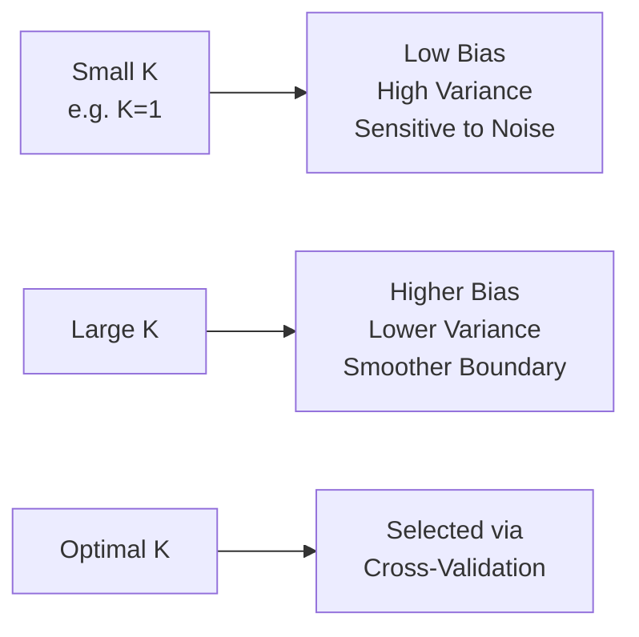

## K-Nearest Neighbors

### Overview

K-Nearest Neighbors (KNN) is a supervised learning algorithm used for both classification and regression tasks. It is documented as an instance-based, non-parametric method: rather than learning explicit model parameters during a training phase, it stores the training dataset and makes predictions by finding the $k$ closest training samples to a new query point, according to a chosen distance metric.

### Core Concept

**Key Points**

- Classified as a "lazy learning" algorithm in standard machine learning references, since it defers computation until prediction time rather than building an explicit model during training.
- For classification, the predicted class is typically determined by majority vote among the $k$ nearest neighbors.
- For regression, the predicted value is typically the average (or weighted average) of the target values of the $k$ nearest neighbors.

### Distance Metrics

#### Euclidean Distance

$$d(x, y) = \sqrt{\sum_{i=1}^{n}(x_i - y_i)^2}$$

#### Manhattan Distance

$$d(x, y) = \sum_{i=1}^{n}|x_i - y_i|$$

#### Minkowski Distance

A generalization of both Euclidean and Manhattan distance.

$$d(x, y) = \left(\sum_{i=1}^{n}|x_i - y_i|^p\right)^{1/p}$$

**Key Points**

- Minkowski distance with $p=2$ is documented to be equivalent to Euclidean distance, and with $p=1$ is documented to be equivalent to Manhattan distance.
- [Inference] The choice of distance metric can affect model performance depending on the structure and scale of the specific dataset; I cannot verify which metric will perform best for any given dataset without direct testing.

#### Hamming Distance

Used for categorical or binary features, counting the number of positions at which two vectors differ.

### Implementation Example

```python
from sklearn.neighbors import KNeighborsClassifier
from sklearn.preprocessing import StandardScaler
from sklearn.model_selection import train_test_split
from sklearn.metrics import classification_report

X_train, X_test, y_train, y_test = train_test_split(X, y, test_size=0.2, random_state=42)

scaler = StandardScaler()
X_train_scaled = scaler.fit_transform(X_train)
X_test_scaled = scaler.transform(X_test)

model = KNeighborsClassifier(n_neighbors=5, metric='minkowski', p=2)
model.fit(X_train_scaled, y_train)

y_pred = model.predict(X_test_scaled)
print(classification_report(y_test, y_pred))
```

### Choosing the Value of K



**Key Points**

- [Inference] A small value of $k$ (e.g., $k=1$) is commonly described in machine learning literature as producing a model highly sensitive to noise in the training data, since a single nearby point determines the prediction. I cannot verify this holds precisely for every specific dataset without direct testing.
- [Inference] A large value of $k$ is commonly described as producing smoother decision boundaries with potentially higher bias, since predictions are averaged over a larger neighborhood that may include less relevant points. This is a reasoned expectation based on general principles rather than a confirmed result for any specific case.
- Documented as standard practice to select $k$ via cross-validation rather than an arbitrary fixed value.

```python
from sklearn.model_selection import GridSearchCV

param_grid = {'n_neighbors': range(1, 31)}
grid_search = GridSearchCV(KNeighborsClassifier(), param_grid, cv=5, scoring='accuracy')
grid_search.fit(X_train_scaled, y_train)

print("Best K:", grid_search.best_params_)
```

### Decision Boundary Illustration

<svg xmlns="http://www.w3.org/2000/svg" viewBox="0 0 650 380">
<text x="325" y="30" font-size="18" font-weight="bold" text-anchor="middle" fill="#1a1a1a">KNN Decision Boundary Example (svg_diagram)</text>
<line x1="60" y1="340" x2="60" y2="60" stroke="#333" stroke-width="1.5" />
<line x1="60" y1="340" x2="590" y2="340" stroke="#333" stroke-width="1.5" />
<text x="30" y="200" font-size="12" fill="#333" transform="rotate(-90 30 200)">Feature 2</text>
<text x="310" y="370" font-size="12" fill="#333">Feature 1</text>
<circle cx="150" cy="120" r="5" fill="#4285f4" />
<circle cx="180" cy="150" r="5" fill="#4285f4" />
<circle cx="210" cy="110" r="5" fill="#4285f4" />
<circle cx="160" cy="190" r="5" fill="#4285f4" />
<circle cx="220" cy="170" r="5" fill="#4285f4" />
<circle cx="400" cy="230" r="5" fill="#fbbc05" />
<circle cx="440" cy="260" r="5" fill="#fbbc05" />
<circle cx="470" cy="210" r="5" fill="#fbbc05" />
<circle cx="420" cy="290" r="5" fill="#fbbc05" />
<circle cx="480" cy="250" r="5" fill="#fbbc05" />
<circle cx="300" cy="180" r="7" fill="#34a853" stroke="#1a1a1a" stroke-width="1.5" />
<text x="300" y="165" font-size="11" text-anchor="middle" fill="#34a853" font-weight="bold">Query Point</text>
<circle cx="220" cy="170" r="13" fill="none" stroke="#34a853" stroke-width="1.5" stroke-dasharray="3,2" />
<circle cx="400" cy="230" r="13" fill="none" stroke="#34a853" stroke-width="1.5" stroke-dasharray="3,2" />
<circle cx="160" cy="190" r="13" fill="none" stroke="#34a853" stroke-width="1.5" stroke-dasharray="3,2" />
<line x1="300" y1="180" x2="220" y2="170" stroke="#34a853" stroke-width="1" />
<line x1="300" y1="180" x2="400" y2="230" stroke="#34a853" stroke-width="1" />
<line x1="300" y1="180" x2="160" y2="190" stroke="#34a853" stroke-width="1" />

<text x="150" y="100" font-size="11" fill="`#4285f4`">Class 0</text>

<text x="450" y="200" font-size="11" fill="`#fbbc05`">Class 1</text>

<text x="300" y="330" font-size="11" text-anchor="middle" fill="#666">K=3 example: 2 of 3 nearest neighbors are Class 0, so query is classified as Class 0</text>

</svg>

### Requirement — Feature Scaling

**Key Points**

- Since KNN relies directly on distance calculations between feature vectors, documented best practice requires standardizing or normalizing features before applying KNN; otherwise, features with larger numeric ranges will disproportionately dominate the distance calculation.

```python
from sklearn.preprocessing import StandardScaler
from sklearn.pipeline import Pipeline

pipeline = Pipeline([
    ('scaler', StandardScaler()),
    ('knn', KNeighborsClassifier(n_neighbors=5))
])
pipeline.fit(X_train, y_train)
```

### Weighted KNN

Rather than giving every neighbor equal vote, weighted KNN assigns greater influence to closer neighbors.

```python
model_weighted = KNeighborsClassifier(n_neighbors=5, weights='distance')
```

**Key Points**

- Documented in scikit-learn as an option where neighbor votes are weighted by the inverse of their distance to the query point, giving closer neighbors more influence than farther ones.

### KNN for Regression

```python
from sklearn.neighbors import KNeighborsRegressor

model_reg = KNeighborsRegressor(n_neighbors=5, weights='distance')
model_reg.fit(X_train_scaled, y_train)
predictions = model_reg.predict(X_test_scaled)
```

**Key Points**

- Documented to predict a continuous value as the (optionally weighted) average of the target values among the $k$ nearest neighbors, rather than a majority-vote class label.

### Computational Considerations

**Key Points**

- Documented as computationally expensive at prediction time for large datasets, since a naive implementation requires computing distances to all training samples for every prediction.
- Data structures such as KD-Trees and Ball Trees are documented in scikit-learn as methods to speed up nearest-neighbor search compared to brute-force distance computation, particularly for lower-dimensional data.

```python
model = KNeighborsClassifier(n_neighbors=5, algorithm='kd_tree')
```

- [Inference] The effectiveness of KD-Trees and Ball Trees in speeding up search is commonly described as diminishing in very high-dimensional feature spaces, a phenomenon related to the general "curse of dimensionality." I cannot verify the precise dimensionality threshold at which this becomes problematic for any specific dataset without direct testing.

### The Curse of Dimensionality

**Key Points**

- [Inference] As the number of features increases, the concept of "nearest" neighbors becomes less meaningful because distances between points tend to become more similar to one another in high-dimensional space, a phenomenon commonly discussed in machine learning literature as the curse of dimensionality. I cannot verify the precise dimensionality at which this effect becomes practically significant for any specific dataset without direct testing.
- Dimensionality reduction techniques (e.g., PCA) or feature selection are commonly recommended in machine learning literature as complementary preprocessing steps to mitigate this issue before applying KNN to high-dimensional data.

### Advantages and Limitations

**Key Points — Advantages**

- Simple to understand and implement, with few assumptions about the underlying data distribution.
- Naturally supports multi-class classification without modification.
- Can capture non-linear decision boundaries, unlike linear models such as logistic regression.

**Key Points — Limitations**

- Computationally expensive at prediction time for large datasets, since it requires comparing the query point to some or all training samples.
- Sensitive to irrelevant or redundant features, as well as to feature scale, since these directly affect distance calculations.
- Performance can degrade in high-dimensional feature spaces due to the curse of dimensionality.
- Requires storing the entire training dataset in memory, which is documented as a practical limitation for very large datasets.

### KNN vs. Other Algorithms

| Aspect | KNN | Logistic Regression | Decision Trees |
| --- | --- | --- | --- |
| Training phase | None (lazy learning) | Iterative parameter fitting | Recursive splitting |
| Prediction cost | High (distance to neighbors) | Low (single equation) | Low (tree traversal) |
| Assumes linear boundary | No | Yes (in log-odds space) | No |
| Sensitive to feature scale | Yes | Yes | Generally no |

[Inference] This comparison reflects general characteristics commonly described in machine learning literature regarding these algorithms. I cannot verify that every implementation across every library will exhibit precisely this behavior in all cases without direct testing.

### Common Pitfalls

- **Skipping Feature Scaling**: Applying KNN without standardizing features can cause features with larger numeric ranges to dominate distance calculations, distorting neighbor selection.
- **Choosing K Without Cross-Validation**: Selecting an arbitrary value of $k$ without validation can result in either an overly noise-sensitive model (small $k$) or an overly smoothed model (large $k$).
- **Ignoring the Curse of Dimensionality**: Applying KNN directly to high-dimensional data without dimensionality reduction or feature selection may degrade performance, since distance metrics can become less discriminative in high dimensions. [Unverified] The specific dimensionality at which this becomes problematic depends on the dataset; I do not have access to a general numeric threshold applicable across all cases.
- **Using KNN on Very Large Datasets Without Optimized Search Structures**: Relying on brute-force distance computation for large datasets can result in impractically slow prediction times.

### Conclusion

K-Nearest Neighbors is documented as a simple, non-parametric algorithm for classification and regression that makes predictions based on the majority class or average value among the $k$ closest training samples to a query point. [Inference] Its effectiveness depends on appropriate feature scaling, a well-chosen value of $k$, and a feature space of manageable dimensionality; whether it is a suitable choice for a specific dataset depends on that dataset's size, dimensionality, and structure, which I cannot verify without direct information about that dataset.

[Unverified] Multiple claims in this response describe general patterns and heuristics commonly cited in machine learning literature rather than confirmed outcomes for any specific dataset, model, or implementation. Behavior may vary depending on data characteristics, library version, and implementation details, and no specific outcome regarding model performance, computational speed, or accuracy is guaranteed.

### Related Topics

- Distance metrics and their effect on model behavior
- The curse of dimensionality
- Dimensionality reduction with PCA
- Decision trees and ensemble methods
- Feature scaling and standardization
- Cross-validation techniques for hyperparameter tuning
- Support Vector Machines as an alternative non-linear classifier