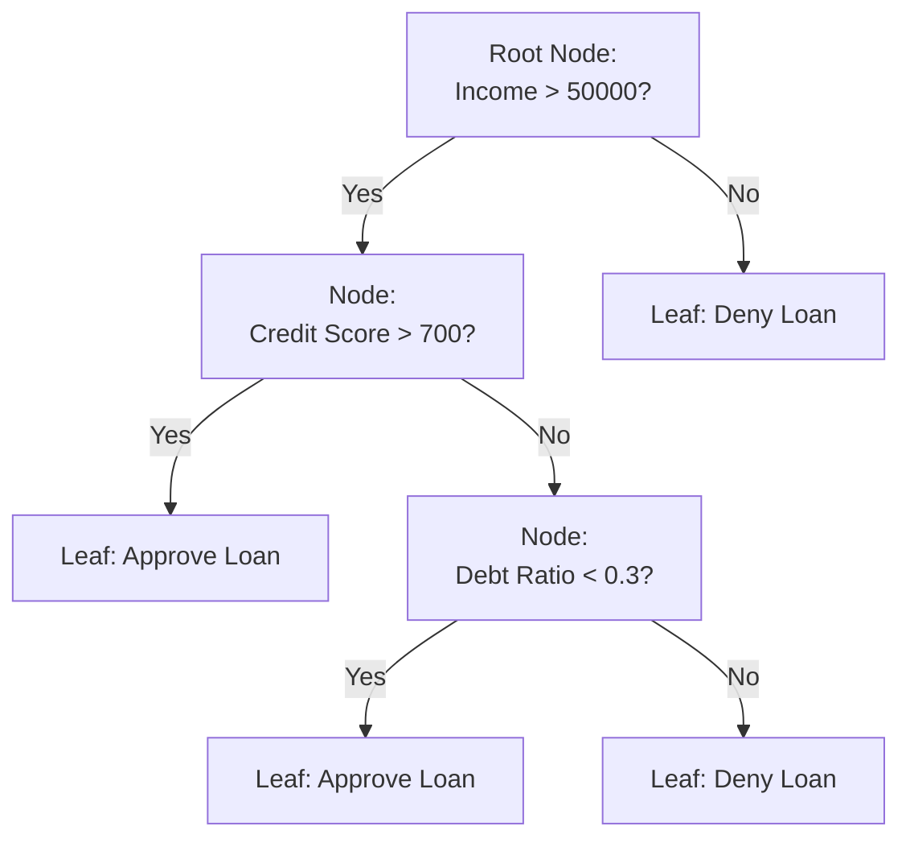

## Decision Trees

### Overview

Decision trees are a supervised learning algorithm used for both classification and regression tasks. They model decisions as a tree-like structure of sequential splits based on feature values, resulting in a set of interpretable if-then rules that lead from a root node to a leaf node representing a prediction.

### Core Concept

**Key Points**

- A decision tree recursively partitions the feature space into regions, with each internal node representing a test on a feature, each branch representing an outcome of that test, and each leaf node representing a predicted class (classification) or value (regression).
- Documented in standard machine learning references as a non-parametric method, since it does not assume a fixed functional form (e.g., linearity) relating features to the target.

### Tree Structure Diagram



**Key Points**

- This is an illustrative example structure only. [Unverified] I cannot verify what specific splits or thresholds an actual decision tree would produce without fitting a model directly to a real dataset.

### How Splits Are Determined

Decision tree algorithms select splits by evaluating which feature and threshold best separate the data according to a chosen impurity or error criterion.

#### Gini Impurity (Classification)

$$Gini = 1 - \sum_{i=1}^{C} p_i^2$$

Where $p_i$ is the proportion of samples belonging to class $i$ in a given node, and $C$ is the number of classes.

**Key Points**

- Documented as the default splitting criterion in scikit-learn's `DecisionTreeClassifier`.
- A Gini impurity of 0 indicates a node containing samples from only one class (perfectly pure); higher values indicate greater class mixing.

#### Entropy and Information Gain (Classification)

$$Entropy = -\sum_{i=1}^{C} p_i \log_2(p_i)$$


$$\text{Information Gain} = Entropy_{parent} - \sum_{j} \frac{n_j}{n} Entropy_{child_j}$$

**Key Points**

- Documented in standard machine learning references (e.g., the ID3 and C4.5 algorithm literature) as an alternative splitting criterion to Gini impurity.
- [Inference] Gini impurity and entropy often produce similar tree structures in practice, though they are not mathematically identical; I cannot verify that they will produce identical trees for any specific dataset without direct testing.

#### Variance Reduction (Regression)

For regression trees, splits are typically chosen to minimize the variance (or mean squared error) of the target variable within resulting child nodes.

$$\text{MSE} = \frac{1}{n}\sum_{i=1}^{n}(y_i - \bar{y})^2$$

### Implementation Example

```python
from sklearn.tree import DecisionTreeClassifier
from sklearn.model_selection import train_test_split
from sklearn.metrics import classification_report

X_train, X_test, y_train, y_test = train_test_split(X, y, test_size=0.2, random_state=42)

model = DecisionTreeClassifier(criterion='gini', max_depth=5, random_state=42)
model.fit(X_train, y_train)

y_pred = model.predict(X_test)
print(classification_report(y_test, y_pred))
```

```python
from sklearn.tree import DecisionTreeRegressor

model_reg = DecisionTreeRegressor(criterion='squared_error', max_depth=5, random_state=42)
model_reg.fit(X_train, y_train)
```

### Visualizing a Fitted Tree

```python
from sklearn.tree import plot_tree
import matplotlib.pyplot as plt

plt.figure(figsize=(15, 10))
plot_tree(model, feature_names=X.columns, class_names=['Class 0', 'Class 1'], filled=True)
plt.show()
```

### Tree Depth and Overfitting

<svg xmlns="http://www.w3.org/2000/svg" viewBox="0 0 700 350">
<text x="350" y="30" font-size="18" font-weight="bold" text-anchor="middle" fill="#1a1a1a">Tree Depth vs. Model Complexity (svg_diagram)</text>

<text x="120" y="60" font-size="13" text-anchor="middle" fill="`#1a1a1a`" font-weight="bold">Shallow Tree</text>

<circle cx="120" cy="90" r="15" fill="`#e8f0fe`" stroke="`#4285f4`" stroke-width="1.5" />

<line x1="110" y1="103" x2="80" y2="140" stroke="#666" stroke-width="1.5" />

<line x1="130" y1="103" x2="160" y2="140" stroke="#666" stroke-width="1.5" />

<circle cx="80" cy="150" r="12" fill="`#e6f4ea`" stroke="`#34a853`" stroke-width="1.5" />

<circle cx="160" cy="150" r="12" fill="`#e6f4ea`" stroke="`#34a853`" stroke-width="1.5" />

<text x="120" y="200" font-size="11" text-anchor="middle" fill="#666">High Bias Risk</text>

<text x="120" y="215" font-size="11" text-anchor="middle" fill="#666">(Underfitting)</text>

<text x="350" y="60" font-size="13" text-anchor="middle" fill="`#1a1a1a`" font-weight="bold">Moderate Tree</text>

<circle cx="350" cy="80" r="13" fill="`#e8f0fe`" stroke="`#4285f4`" stroke-width="1.5" />

<line x1="342" y1="91" x2="310" y2="115" stroke="#666" stroke-width="1.5" />

<line x1="358" y1="91" x2="390" y2="115" stroke="#666" stroke-width="1.5" />

<circle cx="310" cy="125" r="11" fill="`#e8f0fe`" stroke="`#4285f4`" stroke-width="1.5" />

<circle cx="390" cy="125" r="11" fill="`#e8f0fe`" stroke="`#4285f4`" stroke-width="1.5" />

<line x1="303" y1="134" x2="285" y2="155" stroke="#666" stroke-width="1.5" />

<line x1="317" y1="134" x2="335" y2="155" stroke="#666" stroke-width="1.5" />

<line x1="383" y1="134" x2="365" y2="155" stroke="#666" stroke-width="1.5" />

<line x1="397" y1="134" x2="415" y2="155" stroke="#666" stroke-width="1.5" />

<circle cx="285" cy="165" r="9" fill="`#e6f4ea`" stroke="`#34a853`" stroke-width="1.5" />

<circle cx="335" cy="165" r="9" fill="`#e6f4ea`" stroke="`#34a853`" stroke-width="1.5" />

<circle cx="365" cy="165" r="9" fill="`#e6f4ea`" stroke="`#34a853`" stroke-width="1.5" />

<circle cx="415" cy="165" r="9" fill="`#e6f4ea`" stroke="`#34a853`" stroke-width="1.5" />

<text x="350" y="200" font-size="11" text-anchor="middle" fill="#666">Balanced Bias/Variance</text>

<text x="590" y="60" font-size="13" text-anchor="middle" fill="`#1a1a1a`" font-weight="bold">Deep Tree</text>

<g transform="translate(590,75)">

<circle cx="0" cy="0" r="10" fill="`#e8f0fe`" stroke="`#4285f4`" stroke-width="1" />

<line x1="-6" y1="8" x2="-25" y2="25" stroke="#666" stroke-width="1" />

<line x1="6" y1="8" x2="25" y2="25" stroke="#666" stroke-width="1" />

<circle cx="-25" cy="32" r="8" fill="`#e8f0fe`" stroke="`#4285f4`" stroke-width="1" />

<circle cx="25" cy="32" r="8" fill="`#e8f0fe`" stroke="`#4285f4`" stroke-width="1" />

<line x1="-30" y1="39" x2="-40" y2="52" stroke="#666" stroke-width="1" />

<line x1="-20" y1="39" x2="-10" y2="52" stroke="#666" stroke-width="1" />

<line x1="20" y1="39" x2="10" y2="52" stroke="#666" stroke-width="1" />

<line x1="30" y1="39" x2="40" y2="52" stroke="#666" stroke-width="1" />

<circle cx="-40" cy="58" r="6" fill="`#e8f0fe`" stroke="`#4285f4`" stroke-width="1" />

<circle cx="-10" cy="58" r="6" fill="`#e8f0fe`" stroke="`#4285f4`" stroke-width="1" />

<circle cx="10" cy="58" r="6" fill="`#e8f0fe`" stroke="`#4285f4`" stroke-width="1" />

<circle cx="40" cy="58" r="6" fill="`#e8f0fe`" stroke="`#4285f4`" stroke-width="1" />

</g>

<text x="590" y="200" font-size="11" text-anchor="middle" fill="#666">High Variance Risk</text>

<text x="590" y="215" font-size="11" text-anchor="middle" fill="#666">(Overfitting)</text>

<text x="350" y="260" font-size="11" text-anchor="middle" fill="#333">[Inference] General pattern commonly described in machine learning literature;</text>

<text x="350" y="278" font-size="11" text-anchor="middle" fill="#333">actual bias/variance behavior depends on the specific dataset and cannot be verified without testing.</text>

</svg>

### Pruning Techniques

#### Pre-Pruning (Early Stopping)

Restricts tree growth during construction using parameters such as maximum depth, minimum samples per leaf, or minimum samples required to split.

```python
model = DecisionTreeClassifier(
    max_depth=5,
    min_samples_split=20,
    min_samples_leaf=10,
    max_leaf_nodes=50
)
```

**Key Points**

- Documented in scikit-learn as hyperparameters that constrain tree growth before it becomes fully grown, intended to reduce overfitting risk.

#### Post-Pruning (Cost-Complexity Pruning)

Grows a full tree first, then removes branches that provide little predictive power, based on a complexity parameter.

```python
model = DecisionTreeClassifier(random_state=42)
path = model.cost_complexity_pruning_path(X_train, y_train)
ccp_alphas = path.ccp_alphas

models = []
for ccp_alpha in ccp_alphas:
    m = DecisionTreeClassifier(random_state=42, ccp_alpha=ccp_alpha)
    m.fit(X_train, y_train)
    models.append(m)
```

**Key Points**

- Documented in scikit-learn as a technique that uses a complexity parameter (`ccp_alpha`) to prune subtrees whose removal improves the tradeoff between tree simplicity and training error.
- Requires selecting an appropriate `ccp_alpha` value, typically via cross-validation.

### Feature Importance

```python
importances = model.feature_importances_
```

**Key Points**

- Documented in scikit-learn as being calculated based on the total reduction in impurity (e.g., Gini or entropy) that a feature contributes across all splits in the tree, weighted by the number of samples affected at each split.
- [Unverified] Feature importance scores from decision trees can be biased toward high-cardinality or continuous features in some circumstances; I do not have access to specific benchmark data that would let me quantify the extent of this bias in general.

### Handling Different Feature Types

**Key Points**

- Decision trees can handle both numeric and categorical features, though scikit-learn's implementation documented at present requires categorical features to be numerically encoded before fitting (e.g., via one-hot or ordinal encoding).
- Documented as generally not requiring feature scaling, since splits are based on threshold comparisons rather than distance calculations. [Inference] This is a commonly cited characteristic of tree-based models in machine learning literature; I cannot verify this holds for every possible implementation or edge case without direct testing.

### Advantages and Limitations

**Key Points — Advantages**

- Highly interpretable, since the resulting tree structure can be visualized and traced as a sequence of human-readable decision rules.
- Does not require feature scaling or normalization.
- Can capture non-linear relationships and feature interactions without manual feature engineering.
- Naturally handles multi-class classification.

**Key Points — Limitations**

- Documented as prone to overfitting when grown to full depth without pruning or other constraints, since a sufficiently deep tree can perfectly memorize training data.
- [Inference] Considered unstable in the sense that small changes to training data can result in a substantially different tree structure; this is a commonly cited characteristic in machine learning literature. I cannot verify the precise degree of this instability for any specific dataset without direct testing.
- Can create biased trees when one class dominates the dataset, a concern related to the broader topic of handling imbalanced datasets.

### Decision Trees vs. Other Models

| Aspect | Decision Trees | Logistic Regression | KNN |
| --- | --- | --- | --- |
| Interpretability | High | High (via coefficients) | Low |
| Requires feature scaling | No | Yes | Yes |
| Captures non-linear relationships | Yes | No (without engineering) | Yes |
| Prone to overfitting | Yes (if unpruned) | Less so (with regularization) | Depends on K |

[Inference] This comparison reflects general characteristics commonly described in machine learning literature regarding these algorithms. I cannot verify that every implementation across every library or dataset will exhibit precisely this behavior without direct testing.

### Relationship to Ensemble Methods

**Key Points**

- Decision trees serve as the base learner for several documented ensemble methods, including Random Forest (bagging-based) and Gradient Boosting (boosting-based).
- [Inference] Ensemble methods built on decision trees are commonly described in machine learning literature as generally achieving better predictive performance than a single decision tree, at the cost of reduced interpretability; I cannot verify this holds for every specific dataset or use case without direct testing.

### Common Pitfalls

- **Growing Trees Without Pruning or Depth Limits**: Allowing a tree to grow fully without constraints can result in a model that memorizes training data and generalizes poorly.
- **Ignoring Class Imbalance**: Training a decision tree on imbalanced data without addressing class weights or resampling can bias splits toward the majority class.
- **Overinterpreting Feature Importance**: Feature importance scores reflect impurity reduction within the specific fitted tree and dataset; they are not necessarily a definitive measure of real-world causal importance. [Unverified] I cannot verify the extent to which feature importance corresponds to true causal relationships without controlled experimentation, which is generally outside the scope of what feature importance scores are designed to establish.
- **Not Validating with Cross-Validation**: Evaluating a single tree on a single train/test split can produce misleading performance estimates, given the documented instability of decision trees to changes in training data.

### Conclusion

Decision trees are a documented, interpretable supervised learning method that partitions the feature space through a sequence of threshold-based splits, selected according to criteria such as Gini impurity, entropy, or variance reduction. [Inference] While individual decision trees are prone to overfitting and instability without pruning, they commonly serve as the foundation for ensemble methods that are described in machine learning literature as generally improving predictive performance; I cannot verify this improvement for any specific dataset without direct testing.

[Unverified] Multiple claims in this response describe general patterns and heuristics commonly cited in machine learning literature rather than confirmed outcomes for any specific dataset, model, or implementation. Behavior may vary depending on data characteristics, library version, and implementation details, and no specific outcome regarding model performance, stability, or interpretability is guaranteed.

### Related Topics

- Random Forest and bagging methods
- Gradient Boosting (e.g., XGBoost, LightGBM)
- Feature importance interpretation (e.g., SHAP, permutation importance)
- Bias-variance tradeoff
- Handling imbalanced datasets
- Cross-validation techniques
- Ensemble learning methods