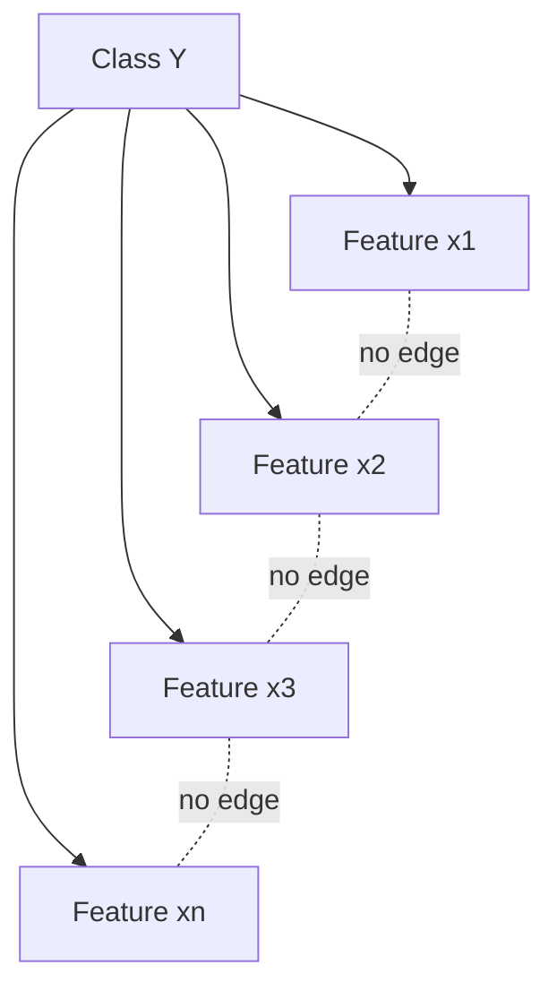

## Naive Bayes Classifiers

### Overview

Naive Bayes is a family of probabilistic classifiers based on applying Bayes' theorem with a strong (naive) independence assumption between features. Despite this simplifying assumption rarely holding true in real-world data, the algorithm performs surprisingly well across many practical applications, including text classification, spam filtering, and sentiment analysis.

The classifier is called "naive" because it assumes all features are conditionally independent given the class label — an assumption that simplifies computation dramatically but is almost never strictly true.

### Bayes' Theorem Foundation

The classifier is built directly on Bayes' theorem:

$$P(y \mid x_1, x_2, \ldots, x_n) = \frac{P(y) \cdot P(x_1, x_2, \ldots, x_n \mid y)}{P(x_1, x_2, \ldots, x_n)}$$

Where:
- $P(y \mid x_1, \ldots, x_n)$ is the posterior probability of class $y$ given features $x_1, \ldots, x_n$
- $P(y)$ is the prior probability of class $y$
- $P(x_1, \ldots, x_n \mid y)$ is the likelihood of the features given the class
- $P(x_1, \ldots, x_n)$ is the evidence (marginal probability of the features)

Since the denominator $P(x_1, \ldots, x_n)$ is constant across all classes for a given input, it can be dropped for classification purposes, leaving:

$$P(y \mid x_1, \ldots, x_n) \propto P(y) \prod_{i=1}^{n} P(x_i \mid y)$$

### The Naive Independence Assumption

The critical simplification is:

$$P(x_1, x_2, \ldots, x_n \mid y) = \prod_{i=1}^{n} P(x_i \mid y)$$

This states that each feature $x_i$ is conditionally independent of every other feature given the class $y$. Without this assumption, estimating the joint likelihood would require exponentially many parameters as the number of features grows. With it, only per-feature conditional probabilities need to be estimated, making the model computationally tractable even for high-dimensional data like text with large vocabularies.

[Inference] This independence assumption is the primary reason Naive Bayes is inaccurate in its probability estimates but often still accurate in its final classification decision, since classification only requires the correct class to have the highest score, not a well-calibrated probability.

### Classification Rule

The final predicted class is the one that maximizes the posterior probability:

$$\hat{y} = \arg\max_{y} \, P(y) \prod_{i=1}^{n} P(x_i \mid y)$$

In practice, this product is computed in log-space to avoid numerical underflow from multiplying many small probabilities:

$$\hat{y} = \arg\max_{y} \left[ \log P(y) + \sum_{i=1}^{n} \log P(x_i \mid y) \right]$$

### Naive Bayes Classification Pipeline (svg_diagram)

<svg xmlns="http://www.w3.org/2000/svg" viewBox="0 0 780 420" font-family="sans-serif">
  <text x="390" y="28" text-anchor="middle" font-size="17" font-weight="bold" fill="#1a1a2e">Naive Bayes Classification Pipeline (svg_diagram)</text>

  <rect x="30" y="60" width="160" height="60" rx="8" fill="#e3f2fd" stroke="#1565c0" stroke-width="1.5" />
  <text x="110" y="85" text-anchor="middle" font-size="12" fill="#0d47a1" font-weight="bold">Training Data</text>
  <text x="110" y="103" text-anchor="middle" font-size="11" fill="#0d47a1">(features + labels)</text>

  <rect x="230" y="60" width="180" height="60" rx="8" fill="#fff3e0" stroke="#e65100" stroke-width="1.5" />
  <text x="320" y="85" text-anchor="middle" font-size="12" fill="#e65100" font-weight="bold">Estimate P(y)</text>
  <text x="320" y="103" text-anchor="middle" font-size="11" fill="#e65100">Class priors</text>

  <rect x="450" y="60" width="200" height="60" rx="8" fill="#fff3e0" stroke="#e65100" stroke-width="1.5" />
  <text x="550" y="85" text-anchor="middle" font-size="12" fill="#e65100" font-weight="bold">Estimate P(xi | y)</text>
  <text x="550" y="103" text-anchor="middle" font-size="11" fill="#e65100">Per-feature likelihoods</text>

  <line x1="190" y1="90" x2="230" y2="90" stroke="#555" stroke-width="1.5" marker-end="url(#arrow)" />
  <line x1="410" y1="90" x2="450" y2="90" stroke="#555" stroke-width="1.5" marker-end="url(#arrow)" />

  <rect x="230" y="170" width="320" height="55" rx="8" fill="#e8f5e9" stroke="#2e7d32" stroke-width="1.5" />
  <text x="390" y="202" text-anchor="middle" font-size="12" fill="#1b5e20" font-weight="bold">Trained Model (priors + likelihood tables)</text>

  <line x1="320" y1="120" x2="360" y2="170" stroke="#555" stroke-width="1.5" marker-end="url(#arrow)" />
  <line x1="550" y1="120" x2="440" y2="170" stroke="#555" stroke-width="1.5" marker-end="url(#arrow)" />

  <rect x="30" y="270" width="160" height="55" rx="8" fill="#e3f2fd" stroke="#1565c0" stroke-width="1.5" />
  <text x="110" y="302" text-anchor="middle" font-size="12" fill="#0d47a1" font-weight="bold">New Instance x</text>

  <rect x="290" y="270" width="200" height="55" rx="8" fill="#f3e5f5" stroke="#6a1b9a" stroke-width="1.5" />
  <text x="390" y="295" text-anchor="middle" font-size="12" fill="#4a148c" font-weight="bold">Compute score</text>
  <text x="390" y="312" text-anchor="middle" font-size="10.5" fill="#4a148c">per class y</text>

  <rect x="570" y="270" width="180" height="55" rx="8" fill="#ffebee" stroke="#c62828" stroke-width="1.5" />
  <text x="660" y="295" text-anchor="middle" font-size="12" fill="#b71c1c" font-weight="bold">arg max</text>
  <text x="660" y="312" text-anchor="middle" font-size="10.5" fill="#b71c1c">Predicted class</text>

  <line x1="190" y1="297" x2="290" y2="297" stroke="#555" stroke-width="1.5" marker-end="url(#arrow)" />
  <line x1="390" y1="225" x2="390" y2="270" stroke="#555" stroke-width="1.5" marker-end="url(#arrow)" />
  <line x1="490" y1="297" x2="570" y2="297" stroke="#555" stroke-width="1.5" marker-end="url(#arrow)" />

  <text x="390" y="365" text-anchor="middle" font-size="11" fill="#555" font-style="italic">score(y) = log P(y) + Σ log P(xi | y)</text>

  </svg>

### Variants of Naive Bayes

Different variants of the algorithm exist depending on the assumed distribution of $P(x_i \mid y)$, chosen to match the data type of the features.

#### Gaussian Naive Bayes

Used when features are continuous and assumed to follow a normal distribution within each class. The likelihood is modeled as:

$$P(x_i \mid y) = \frac{1}{\sqrt{2\pi\sigma_y^2}} \exp\left(-\frac{(x_i - \mu_y)^2}{2\sigma_y^2}\right)$$

Where $\mu_y$ and $\sigma_y^2$ are the mean and variance of feature $x_i$ estimated from the training instances belonging to class $y$.

#### Multinomial Naive Bayes

Used primarily for discrete count data, such as word frequencies in text classification. The likelihood models feature counts as draws from a multinomial distribution:

$$P(x_i \mid y) = \frac{(N_{yi} + \alpha)}{(N_y + \alpha n)}$$

Where $N_{yi}$ is the total count of feature $i$ in class $y$, $N_y$ is the total count of all features in class $y$, $\alpha$ is a smoothing parameter, and $n$ is the number of features (vocabulary size in text applications).

#### Bernoulli Naive Bayes

Used when features are binary (present/absent), such as whether a word occurs in a document at all, regardless of frequency. Unlike Multinomial NB, Bernoulli NB explicitly penalizes the non-occurrence of a feature, since it models both $P(x_i = 1 \mid y)$ and $P(x_i = 0 \mid y)$.

#### Complement Naive Bayes

A variant adapted for imbalanced datasets. It estimates parameters from the complement of each class (i.e., all classes other than $y$) rather than the class itself, which tends to produce more stable estimates when class distributions are skewed. [Unverified] The degree of improvement over standard Multinomial NB is dataset-dependent and is not guaranteed to hold universally; behavior may vary across corpora and class distributions.

### Laplace (Additive) Smoothing

A core practical issue with Naive Bayes is the zero-frequency problem: if a feature value never appears with a given class in the training data, $P(x_i \mid y) = 0$, which zeroes out the entire product regardless of other evidence.

Laplace smoothing addresses this by adding a small constant $\alpha$ (typically $\alpha = 1$ for "add-one" smoothing) to every count:

$$P(x_i \mid y) = \frac{N_{yi} + \alpha}{N_y + \alpha n}$$

This reduces the zero-frequency problem's impact by ensuring no probability estimate is ever exactly zero, at the cost of introducing a small bias toward uniformity. Smaller values of $\alpha$ (such as fractional smoothing, e.g., $\alpha = 0.1$) apply a lighter correction; larger values push estimates further toward a uniform distribution.

### Worked Example: Text Classification

Consider a binary spam classification task with a simplified vocabulary. Suppose the training set yields:

- $P(\text{spam}) = 0.4$, $P(\text{ham}) = 0.6$
- $P(\text{"free"} \mid \text{spam}) = 0.6$, $P(\text{"free"} \mid \text{ham}) = 0.05$
- $P(\text{"meeting"} \mid \text{spam}) = 0.02$, $P(\text{"meeting"} \mid \text{ham}) = 0.3$

For a new message containing the words "free" and "meeting":

$$\text{score(spam)} = P(\text{spam}) \cdot P(\text{"free"} \mid \text{spam}) \cdot P(\text{"meeting"} \mid \text{spam}) = 0.4 \times 0.6 \times 0.02 = 0.0048$$

$$\text{score(ham)} = P(\text{ham}) \cdot P(\text{"free"} \mid \text{ham}) \cdot P(\text{"meeting"} \mid \text{ham}) = 0.6 \times 0.05 \times 0.3 = 0.0090$$

Since $\text{score(ham)} > \text{score(spam)}$, the message is classified as ham. Note that these scores are not true probabilities (they do not sum to 1) but are proportional scores sufficient for comparison and ranking.

### Decision Boundary Intuition

Even though Naive Bayes computes a product of probabilities, the resulting decision boundary between classes is often linear or close to linear for many common feature distributions, particularly in the case of Multinomial and Bernoulli NB applied to text. [Inference] This near-linearity is a consequence of the log-additive form of the scoring function, though the exact shape of the boundary depends on the specific distributional assumptions of the variant used.

### Strengths

- **Computational efficiency**: Training requires only counting and simple statistics, making it one of the fastest algorithms to train, scaling linearly with the number of training instances and features.
- **Performs well with high-dimensional data**: Particularly effective for text classification, where feature spaces (vocabularies) can span tens of thousands of dimensions.
- **Requires relatively little training data**: Because it estimates simple per-feature statistics rather than complex joint distributions, it can produce reasonable estimates even with modest sample sizes.
- **Naturally handles multi-class problems**: No modification is needed to extend beyond binary classification, unlike algorithms such as standard logistic regression or SVMs, which typically require one-vs-rest or one-vs-one extensions.
- **Provides probabilistic output**: Returns class probabilities rather than only hard labels, which can be useful for ranking or thresholding decisions.

### Weaknesses

- **Independence assumption is typically violated**: Real-world features are frequently correlated (e.g., in text, the presence of "New" often correlates with "York"), which can distort the probability estimates, though classification accuracy may remain acceptable.
- **Poor probability calibration**: Because of the independence assumption, the predicted probabilities tend to be pushed toward extreme values (close to 0 or 1) even when the true confidence should be more moderate. [Inference] This means the raw output probabilities should generally not be trusted for tasks requiring calibrated confidence scores without post-hoc calibration (e.g., Platt scaling or isotonic regression).
- **Sensitivity to feature representation**: Performance can vary substantially depending on how features are engineered (e.g., raw counts vs. TF-IDF vs. binary presence), and the appropriate variant (Multinomial, Bernoulli, Gaussian) must be matched to the data type.
- **Continuous feature handling requires distributional assumptions**: Gaussian NB assumes normality, which may not hold for all continuous features, potentially degrading performance on non-normally distributed data.

### Decision Flow for Choosing a Variant (svg_diagram)

<svg xmlns="http://www.w3.org/2000/svg" viewBox="0 0 720 320" font-family="sans-serif">
  <text x="360" y="26" text-anchor="middle" font-size="16" font-weight="bold" fill="#1a1a2e">Choosing a Naive Bayes Variant (svg_diagram)</text>

  <rect x="270" y="50" width="180" height="50" rx="8" fill="#ede7f6" stroke="#4527a0" stroke-width="1.5" />
  <text x="360" y="80" text-anchor="middle" font-size="12" fill="#311b92" font-weight="bold">What type is x_i?</text>

  <line x1="330" y1="100" x2="150" y2="150" stroke="#555" stroke-width="1.5" marker-end="url(#arrow2)" />
  <line x1="390" y1="100" x2="570" y2="150" stroke="#555" stroke-width="1.5" marker-end="url(#arrow2)" />
  <line x1="360" y1="100" x2="360" y2="150" stroke="#555" stroke-width="1.5" marker-end="url(#arrow2)" />

  <text x="200" y="128" font-size="10.5" fill="#333">continuous</text>
  <text x="380" y="128" font-size="10.5" fill="#333">discrete counts</text>
  <text x="580" y="128" font-size="10.5" fill="#333">binary presence</text>

  <rect x="60" y="150" width="180" height="55" rx="8" fill="#e1f5fe" stroke="#0277bd" stroke-width="1.5" />
  <text x="150" y="175" text-anchor="middle" font-size="12" fill="#01579b" font-weight="bold">Gaussian NB</text>
  <text x="150" y="192" text-anchor="middle" font-size="10.5" fill="#01579b">e.g. sensor readings</text>

  <rect x="270" y="150" width="180" height="55" rx="8" fill="#e8f5e9" stroke="#2e7d32" stroke-width="1.5" />
  <text x="360" y="175" text-anchor="middle" font-size="12" fill="#1b5e20" font-weight="bold">Multinomial NB</text>
  <text x="360" y="192" text-anchor="middle" font-size="10.5" fill="#1b5e20">e.g. word counts</text>

  <rect x="480" y="150" width="180" height="55" rx="8" fill="#fff3e0" stroke="#e65100" stroke-width="1.5" />
  <text x="570" y="175" text-anchor="middle" font-size="12" fill="#e65100" font-weight="bold">Bernoulli NB</text>
  <text x="570" y="192" text-anchor="middle" font-size="10.5" fill="#e65100">e.g. word present/absent</text>

  <rect x="270" y="240" width="180" height="55" rx="8" fill="#fce4ec" stroke="#ad1457" stroke-width="1.5" />
  <text x="360" y="265" text-anchor="middle" font-size="12" fill="#880e4f" font-weight="bold">Imbalanced classes?</text>
  <text x="360" y="282" text-anchor="middle" font-size="10.5" fill="#880e4f">→ consider Complement NB</text>

  <line x1="360" y1="205" x2="360" y2="240" stroke="#555" stroke-width="1.5" marker-end="url(#arrow2)" />

  </svg>

### Feature Independence in Practice

The dashed "no edge" annotations represent the naive assumption: features are conditionally independent given the class, and no direct dependency exists between them in the model's graphical structure, even when such dependencies exist in reality.

### Practical Considerations

- **Text preprocessing matters significantly**: tokenization, stop-word removal, and stemming/lemmatization choices directly affect the quality of $P(x_i \mid y)$ estimates.
- **Log-space computation is standard practice** in implementations to avoid floating-point underflow when multiplying many small probabilities together.
- **Feature scaling is not required** for Multinomial or Bernoulli variants, unlike distance-based algorithms such as k-NN or SVM, since Naive Bayes relies on probability estimates rather than distances.
- **Works as a strong baseline**: Due to its speed and simplicity, Naive Bayes is commonly used as an initial baseline model before attempting more complex algorithms.

### Common Applications

- Spam and phishing email detection
- Sentiment analysis of reviews or social media text
- Document categorization and topic labeling
- Medical diagnosis support systems using categorical symptom data
- Real-time prediction systems where inference speed is critical

**Related Topics**
- Logistic Regression as a discriminative counterpart to Naive Bayes' generative approach
- Feature engineering for text: Bag-of-Words, TF-IDF, and n-gram representations
- Model calibration techniques: Platt scaling and isotonic regression
- Support Vector Machines for classification
- Decision Trees and Random Forests
- Evaluation metrics for classifiers: precision, recall, F1-score, ROC-AUC
- Ensemble methods combining generative and discriminative classifiers