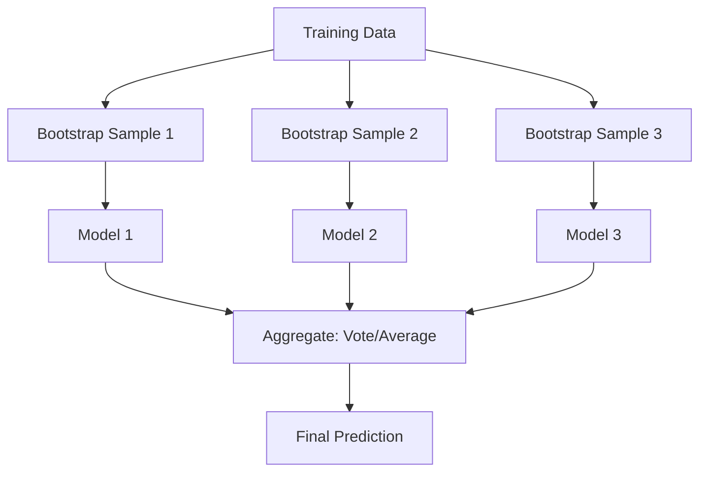
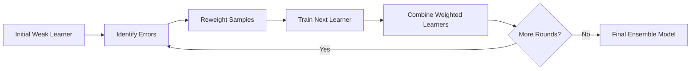

## Ensemble Methods Overview

### Core Concept

Ensemble methods combine multiple individual models (often called "base learners" or "weak learners") to produce a single predictive model with better performance than any of the constituent models alone. The underlying principle is that a group of diverse, reasonably accurate models can collectively correct each other's errors, reducing overall variance, bias, or both, depending on the ensemble strategy used.

Three major families of ensemble methods are commonly distinguished: **bagging**, **boosting**, and **stacking**. Each addresses model error differently and combines predictions through different mechanisms.

### Why Ensembles Work

A single model's prediction error can be decomposed into bias, variance, and irreducible noise:

$$\text{Error}(x) = \text{Bias}^2 + \text{Variance} + \sigma^2$$

Ensemble methods target different components of this decomposition:

- **Bagging** primarily reduces variance by averaging predictions across models trained on different data samples
- **Boosting** primarily reduces bias by sequentially correcting the errors of previous models
- **Stacking** combines models of potentially different types, learning how to weight their outputs optimally

[Inference] The degree to which any specific ensemble reduces bias versus variance in practice depends on the base learners, data characteristics, and hyperparameters used; the bias/variance framing describes a general tendency reasoned from the algorithm's structure, not a fixed quantitative outcome confirmed for every dataset.

### Bagging (Bootstrap Aggregating)

Bagging trains multiple instances of the same base learner on different bootstrap samples (random samples drawn with replacement) of the training data, then aggregates their predictions.

**Procedure:**
1. Draw $B$ bootstrap samples from the training set, each of size $n$ (sampled with replacement)
2. Train a base learner independently on each bootstrap sample
3. Aggregate predictions: majority vote for classification, average for regression

$$\hat{f}_{bag}(x) = \frac{1}{B}\sum_{b=1}^{B} \hat{f}_b(x)$$

Because each model is trained independently, bagging is highly parallelizable. Random Forests are the most widely known bagging-based algorithm, adding an additional layer of randomness by selecting a random subset of features at each split.

### Boosting

Boosting builds an ensemble sequentially, where each new model focuses on correcting the errors made by the previous models. Unlike bagging, boosting models are not trained independently — each depends on the output of the one before it.

**General procedure (conceptual):**
1. Train an initial weak learner on the original data
2. Identify misclassified or poorly predicted samples
3. Increase the weight (or influence) of those samples in the next training round
4. Train the next weak learner on the reweighted data
5. Repeat for a specified number of rounds, combining all learners into a weighted sum

$$F(x) = \sum_{m=1}^{M} \alpha_m h_m(x)$$

where $h_m(x)$ is the $m$-th weak learner and $\alpha_m$ is its assigned weight, typically proportional to its accuracy.

Common boosting algorithms include AdaBoost, Gradient Boosting, XGBoost, LightGBM, and CatBoost. [Unverified] Relative performance differences among these specific implementations vary by dataset, hyperparameter tuning, and task, and no single algorithm is authoritatively superior across all benchmarks I can confirm.

### Stacking (Stacked Generalization)

Stacking trains multiple base models, potentially of different types (e.g., a decision tree, an SVM, and a neural network), and then trains a separate **meta-model** to combine their predictions optimally.

**Procedure:**
1. Split training data using cross-validation folds
2. Train several diverse base models on the training folds
3. Generate out-of-fold predictions from each base model
4. Use these out-of-fold predictions as input features to train a meta-model
5. The meta-model learns how to weight and combine base model outputs

$$\hat{f}_{stack}(x) = g\big(\hat{f}_1(x), \hat{f}_2(x), \ldots, \hat{f}_k(x)\big)$$

where $g$ is the meta-model and $\hat{f}_1, \ldots, \hat{f}_k$ are the base model predictions.

<svg xmlns="http://www.w3.org/2000/svg" viewBox="0 0 550 300">
  <text x="275" y="20" font-size="13" text-anchor="middle" fill="#333">Stacking Architecture (svg_diagram)</text>
  <rect x="30" y="60" width="100" height="50" fill="#e8f0fe" stroke="#1a73e8" stroke-width="1.5" />
  <text x="80" y="90" font-size="11" text-anchor="middle">Model A</text>
  <rect x="30" y="130" width="100" height="50" fill="#e8f0fe" stroke="#1a73e8" stroke-width="1.5" />
  <text x="80" y="160" font-size="11" text-anchor="middle">Model B</text>
  <rect x="30" y="200" width="100" height="50" fill="#e8f0fe" stroke="#1a73e8" stroke-width="1.5" />
  <text x="80" y="230" font-size="11" text-anchor="middle">Model C</text>
  <line x1="130" y1="85" x2="250" y2="150" stroke="#999" stroke-width="1.5" />
  <line x1="130" y1="155" x2="250" y2="155" stroke="#999" stroke-width="1.5" />
  <line x1="130" y1="225" x2="250" y2="160" stroke="#999" stroke-width="1.5" />
  <rect x="250" y="130" width="130" height="50" fill="#fce8e6" stroke="#e94235" stroke-width="1.5" />
  <text x="315" y="150" font-size="11" text-anchor="middle">Meta-Model</text>
  <text x="315" y="165" font-size="10" text-anchor="middle">(combines outputs)</text>
  <line x1="380" y1="155" x2="470" y2="155" stroke="#999" stroke-width="1.5" marker-end="url(#arrow2)" />
  <text x="510" y="160" font-size="11" text-anchor="middle">Final Prediction</text>
  <text x="80" y="270" font-size="10" text-anchor="middle" fill="#555">Diverse base learners</text>
</svg>

### Bagging vs. Boosting vs. Stacking

| Aspect | Bagging | Boosting | Stacking |
|---|---|---|---|
| Training approach | Parallel, independent | Sequential, dependent | Parallel base models, then a meta-model |
| Primary error target | Variance reduction | Bias reduction | Combines both, depending on base model diversity |
| Base learner type | Typically the same model type | Typically the same model type | Often different model types |
| Overfitting risk | Generally lower due to averaging | [Inference] Can be higher if the number of boosting rounds is not controlled, as an inferred consequence of sequential error-fitting; this is not a confirmed outcome for every implementation | Depends on meta-model complexity and cross-validation setup |
| Parallelizability | High | Low (sequential dependency) | Base models parallelizable; meta-model step is sequential |

### Random Forests: A Closer Look

Random Forests extend bagging by introducing feature-level randomness in addition to sample-level randomness. At each split in a decision tree, only a random subset of features is considered as candidates, rather than all available features.

$$m_{try} = \sqrt{p} \quad \text{(common default for classification)}$$

where $p$ is the total number of features. This documented default is implemented in common libraries such as scikit-learn's `RandomForestClassifier`. [Unverified] Whether this specific default is optimal for a given dataset is not something I can confirm without empirical testing on that dataset.

### Gradient Boosting: A Closer Look

Gradient Boosting generalizes the boosting framework by fitting each new weak learner to the negative gradient of a specified loss function with respect to the current ensemble's predictions, rather than only reweighting misclassified samples. This allows gradient boosting to be applied to a wide range of loss functions beyond simple classification error, including regression losses.

$$r_{im} = -\left[\frac{\partial L(y_i, F(x_i))}{\partial F(x_i)}\right]_{F=F_{m-1}}$$

where $r_{im}$ is the pseudo-residual for sample $i$ at boosting round $m$, and $L$ is the chosen loss function.

### Practical Considerations

- **Bagging** tends to be favored when base learners have high variance and low bias (e.g., deep decision trees), since averaging reduces variance without substantially increasing bias.
- **Boosting** tends to be favored when base learners have high bias and low variance (e.g., shallow decision trees, "stumps"), since sequential correction reduces bias.
- **Stacking** is often used in competitive machine learning settings where combining diverse model types can capture different aspects of the data. [Unverified] The specific performance gains from stacking versus simpler ensembling in any given competition or production setting depend on the models and data involved, and I do not have access to a universal benchmark confirming general superiority.
- Computational cost differs substantially: bagging parallelizes well, while boosting's sequential nature can increase training time, particularly with a large number of rounds.

### Common Pitfalls

- Treating ensemble size (number of trees/rounds) as a free hyperparameter without validation can lead to unnecessary computational cost or, in boosting, overfitting if not paired with regularization or early stopping.
- Using highly correlated base learners in bagging or stacking reduces the diversity benefit, since the variance-reduction effect of averaging depends on the errors of individual models being at least partially uncorrelated.
- In stacking, generating meta-model training features from in-sample (rather than out-of-fold) base model predictions can introduce data leakage, inflating apparent performance during training.

### Worked Example: Conceptual Walkthrough

Consider a regression task where a single decision tree overfits the training data, producing high variance across different training samples. Training 100 such trees on different bootstrap samples and averaging their predictions (bagging) tends to smooth out this variance, since errors specific to any one bootstrap sample are diluted by averaging.

By contrast, consider a regression task where a single shallow tree (a stump) underfits the data, capturing only a coarse pattern. Sequentially training additional stumps to fit the residual errors of the previous ensemble (boosting) allows the combined model to progressively capture more complex patterns that no single stump could represent alone.

### Related Topics

- Random Forests: feature importance and out-of-bag error estimation
- AdaBoost algorithm mechanics and exponential loss
- Gradient Boosting Machines, XGBoost, LightGBM, CatBoost comparison
- Cross-validation strategies for stacking meta-model training
- Bias-variance tradeoff in ensemble learning
- Voting classifiers (hard vs. soft voting)