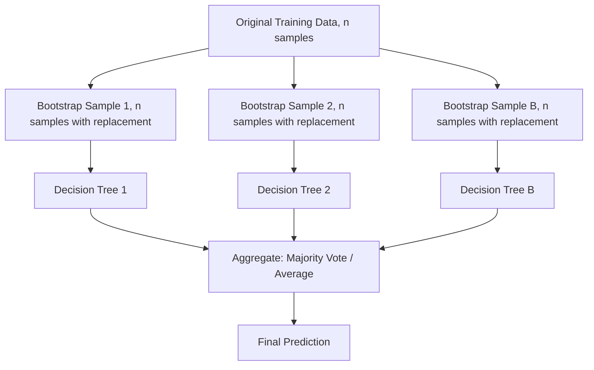

## Bagging and Random Forests

### Core Concept

Bagging (Bootstrap Aggregating) is an ensemble technique that reduces variance by training multiple instances of a base learner on different bootstrap samples of the training data and combining their predictions. Random Forests extend bagging specifically for decision trees, adding a second layer of randomness through feature subsampling at each split, which further decorrelates the individual trees.

### Bootstrap Sampling

A bootstrap sample is created by drawing $n$ observations from a training set of size $n$, with replacement. This means some observations appear multiple times in a given bootstrap sample, while others are excluded entirely.

The probability that a specific observation is excluded from a single bootstrap sample is:

$$P(\text{excluded}) = \left(1 - \frac{1}{n}\right)^n \approx e^{-1} \approx 0.368$$

This is a standard, well-documented mathematical result as $n \to \infty$, following directly from the definition of sampling with replacement. It follows that, on average, approximately 63.2% of the original observations appear in any given bootstrap sample, while the remaining ~36.8% are left out — these are referred to as **out-of-bag (OOB)** samples for that particular bootstrap iteration.

### The Bagging Procedure

1. Draw $B$ bootstrap samples from the training data, each of size $n$
2. Train a base learner independently on each bootstrap sample
3. Combine predictions:
   - Classification: majority vote across all $B$ models
   - Regression: average of all $B$ model outputs

$$\hat{f}_{bag}(x) = \frac{1}{B}\sum_{b=1}^{B} \hat{f}_b(x)$$

Because each bootstrap sample is drawn independently and each base learner is trained independently, this procedure is highly parallelizable across compute resources.

### Why Bagging Reduces Variance

For $B$ independent and identically distributed predictions, each with variance $\sigma^2$, the variance of their average is:

$$\text{Var}\left(\frac{1}{B}\sum_{b=1}^{B}\hat{f}_b(x)\right) = \frac{\sigma^2}{B}$$

This is a standard statistical identity under the assumption of independence. In practice, bootstrap samples overlap substantially (since they are drawn from the same underlying dataset), so individual trees are correlated rather than fully independent. Under correlation $\rho$, the variance of the average becomes:

$$\text{Var}\left(\frac{1}{B}\sum_{b=1}^{B}\hat{f}_b(x)\right) = \rho\sigma^2 + \frac{1-\rho}{B}\sigma^2$$

This formula shows that variance reduction has a floor determined by $\rho$: even as $B \to \infty$, the term $\rho\sigma^2$ remains. [Inference] This implies that reducing correlation between trees is a reasoned mechanism for improving variance reduction beyond simply increasing the number of trees; however, the practical magnitude of this benefit on any specific dataset is unverified without direct testing.

### Random Forests: Adding Feature Randomness

Random Forests modify the standard bagging procedure for decision trees by restricting the set of features considered at each split to a random subset of size $m_{try}$, rather than all $p$ available features.

Commonly cited defaults, as documented in libraries such as scikit-learn:

$$m_{try} = \sqrt{p} \quad \text{(classification)}$$
$$m_{try} = \frac{p}{3} \quad \text{(regression)}$$

[Unverified] I cannot verify that these specific default values are optimal for any given dataset; they are documented conventions in certain implementations, not universally guaranteed to produce the best performance, and their effectiveness would need to be confirmed empirically per dataset.

This feature-level randomness serves a specific purpose: without it, if one or a few features are very strong predictors, most bootstrapped trees would select the same feature for their top split, making the trees highly correlated with each other. By restricting the feature pool at each split, Random Forests reduce this correlation ($\rho$ in the variance formula above), which [Inference] is reasoned to improve the variance-reduction benefit of averaging — though I cannot verify the exact magnitude of this improvement without dataset-specific testing.

<svg viewBox="0 0 550 280" xmlns="http://www.w3.org/2000/svg">
  <text x="275" y="20" font-size="13" text-anchor="middle" fill="#333">Random Forest: Feature Subsampling at Each Split (svg_diagram)</text>
  <rect x="30" y="50" width="150" height="40" fill="#e8f0fe" stroke="#1a73e8" stroke-width="1.5"/>
  <text x="105" y="75" font-size="10" text-anchor="middle">All features: A,B,C,D,E</text>
  <line x1="105" y1="90" x2="105" y2="120" stroke="#999" stroke-width="1.5"/>
  <rect x="30" y="120" width="150" height="40" fill="#fce8e6" stroke="#e94235" stroke-width="1.5"/>
  <text x="105" y="145" font-size="10" text-anchor="middle">Random subset: B, D</text>
  <line x1="105" y1="160" x2="105" y2="190" stroke="#999" stroke-width="1.5"/>
  <rect x="30" y="190" width="150" height="40" fill="#e6f4ea" stroke="#34a853" stroke-width="1.5"/>
  <text x="105" y="215" font-size="10" text-anchor="middle">Best split from {B, D}</text>
  <rect x="220" y="50" width="150" height="40" fill="#e8f0fe" stroke="#1a73e8" stroke-width="1.5"/>
  <text x="295" y="75" font-size="10" text-anchor="middle">All features: A,B,C,D,E</text>
  <line x1="295" y1="90" x2="295" y2="120" stroke="#999" stroke-width="1.5"/>
  <rect x="220" y="120" width="150" height="40" fill="#fce8e6" stroke="#e94235" stroke-width="1.5"/>
  <text x="295" y="145" font-size="10" text-anchor="middle">Random subset: A, C</text>
  <line x1="295" y1="160" x2="295" y2="190" stroke="#999" stroke-width="1.5"/>
  <rect x="220" y="190" width="150" height="40" fill="#e6f4ea" stroke="#34a853" stroke-width="1.5"/>
  <text x="295" y="215" font-size="10" text-anchor="middle">Best split from {A, C}</text>
  <rect x="410" y="50" width="150" height="40" fill="#e8f0fe" stroke="#1a73e8" stroke-width="1.5"/>
  <text x="485" y="75" font-size="10" text-anchor="middle">All features: A,B,C,D,E</text>
  <line x1="485" y1="90" x2="485" y2="120" stroke="#999" stroke-width="1.5"/>
  <rect x="410" y="120" width="150" height="40" fill="#fce8e6" stroke="#e94235" stroke-width="1.5"/>
  <text x="485" y="145" font-size="10" text-anchor="middle">Random subset: C, E</text>
  <line x1="485" y1="160" x2="485" y2="190" stroke="#999" stroke-width="1.5"/>
  <rect x="410" y="190" width="150" height="40" fill="#e6f4ea" stroke="#34a853" stroke-width="1.5"/>
  <text x="485" y="215" font-size="10" text-anchor="middle">Best split from {C, E}</text>
  <text x="275" y="260" font-size="11" text-anchor="middle" fill="#555">Different trees consider different feature subsets, reducing correlation</text>
</svg>

### Out-of-Bag (OOB) Error Estimation

Because each bootstrap sample excludes roughly 36.8% of observations, those excluded observations can be used as a built-in validation set for the tree trained on that bootstrap sample. This is a documented property of the bagging procedure, not an inferred one.

**OOB error estimation procedure:**
1. For each observation $x_i$, identify all trees for which $x_i$ was out-of-bag (not included in that tree's bootstrap sample)
2. Aggregate predictions from only those trees for $x_i$
3. Compare the aggregated OOB prediction to the true label $y_i$
4. Average this error across all observations to obtain the OOB error estimate

$$\text{OOB Error} = \frac{1}{n}\sum_{i=1}^{n} L\left(y_i, \hat{f}_{OOB}(x_i)\right)$$

where $L$ is the chosen loss function. This procedure provides an internal estimate of generalization performance without requiring a separate held-out validation set. [Unverified] I cannot verify that OOB error estimates are equivalent to k-fold cross-validation error estimates in all circumstances; some sources describe them as similar in practice, but I do not have a confirmed universal equivalence to cite.

### Feature Importance in Random Forests

Random Forests provide two commonly documented methods for estimating feature importance:

**Mean Decrease in Impurity (MDI)**
Measures the total reduction in a split criterion (e.g., Gini impurity or variance) attributable to a given feature, summed across all trees and splits where that feature was used.

**Permutation Importance**
Measures the increase in prediction error when a feature's values are randomly shuffled (permuted) among the OOB samples, breaking the relationship between that feature and the target while preserving the feature's marginal distribution.

[Unverified] I cannot verify which of these two methods is more reliable in general; documented literature raises concerns about MDI being biased toward high-cardinality or continuous features, but the extent of this bias in any specific dataset is not something I can confirm without direct testing.

### Hyperparameters

| Hyperparameter | Description | Effect |
|---|---|---|
| Number of trees ($B$) | Total trees in the forest | [Inference] Increasing $B$ is reasoned to reduce variance according to the averaging formula above, though returns diminish; the exact point of diminishing returns is dataset-dependent and unverified without testing |
| $m_{try}$ | Number of features considered per split | Lower values increase decorrelation between trees but may reduce individual tree accuracy |
| Max tree depth | Maximum depth of each tree | Deeper trees have lower bias but higher variance per tree |
| Min samples per leaf | Minimum samples required at a leaf node | Higher values act as a regularization constraint, reducing overfitting risk per tree |
| Bootstrap sample size | Size of each bootstrap sample (often equal to $n$) | Smaller sample sizes can increase diversity among trees but may reduce individual tree quality |

### Bagging vs. Random Forests

| Aspect | Standard Bagging | Random Forests |
|---|---|---|
| Base learner | Any base learner (commonly decision trees) | Specifically decision trees |
| Randomness source | Bootstrap sampling only | Bootstrap sampling + random feature subsets per split |
| Tree correlation | Higher (especially with strong dominant features) | Lower, due to feature subsampling |
| Variance reduction | Limited by tree correlation $\rho$ | [Inference] Reasoned to be generally greater due to lower $\rho$, though the specific magnitude is unverified across arbitrary datasets |

### Practical Considerations

- Random Forests are commonly used as a strong baseline model because they require relatively little hyperparameter tuning compared to some other algorithms. [Unverified] I do not have access to a universal benchmark confirming this holds across all datasets and problem types; this is a widely stated characterization in documentation and practitioner literature rather than a guaranteed outcome.
- Feature scaling is generally not required for tree-based methods, since splits are based on relative ordering of feature values rather than magnitudes.
- Random Forests can handle missing data and mixed feature types in some implementations, though exact handling depends on the specific library and version used. [Unverified] I cannot verify implementation-specific missing-data handling behavior without checking the specific library documentation in question.

### Common Pitfalls

- Interpreting MDI-based feature importance as a definitive ranking without considering known biases toward high-cardinality features can lead to misleading conclusions about feature relevance.
- Using OOB error as if it perfectly substitutes for a fully independent test set: [Unverified] I cannot verify that OOB error estimates behave identically to a fully held-out test set in every scenario, since OOB samples are still drawn from the same underlying distribution and split procedure as the training data.
- Setting $m_{try}$ equal to $p$ (all features) effectively reduces a Random Forest to standard bagging, which may reintroduce higher tree correlation if a small number of features dominate predictive power.

### Worked Example: Conceptual Walkthrough

Consider a dataset with 5 features, where one feature is a very strong predictor and the other four are weakly informative. In standard bagging, most bootstrapped trees would likely select the strong feature for their root split, producing highly correlated trees whose errors do not average out effectively. In a Random Forest with $m_{try} = 2$, many trees would be forced to split on one of the four weaker features at the root, since the strong feature would not always be included in the random subset considered. This produces more diverse trees, and [Inference] is reasoned — based on the variance decomposition formula above — to reduce the correlation term $\rho$ and improve the averaging benefit; the exact numerical improvement for this specific scenario is unverified without empirical testing.

### Related Topics

- Extremely Randomized Trees (Extra-Trees) and additional split randomization
- Gradient Boosting vs. Random Forests: bias/variance tradeoff comparison
- Permutation importance vs. SHAP values for feature attribution
- Decision tree splitting criteria (Gini impurity, entropy, variance reduction)
- Hyperparameter tuning strategies for ensemble size and tree depth
- Isolation Forests (an unsupervised application of the Random Forest structure)

