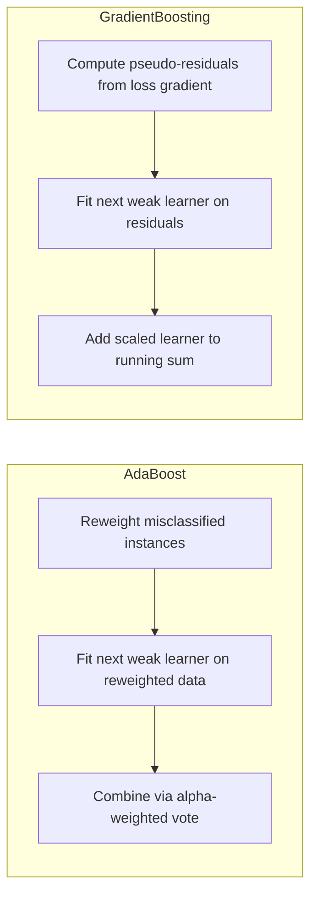
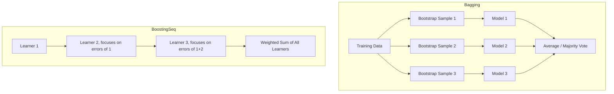

## Boosting Algorithms

### Overview

Boosting is an ensemble learning technique that combines multiple weak learners sequentially to build a single strong learner. Unlike bagging methods (e.g., Random Forests), which train models independently in parallel, boosting trains models iteratively, where each new model focuses on correcting the errors made by the previous ones. The final prediction is a weighted combination of all the weak learners.

A weak learner is a model that performs only slightly better than random guessing, such as a shallow decision tree (often called a "decision stump" when limited to a single split).

### Core Intuition

Boosting works by iteratively reweighting the training data or fitting new models to the residual errors of prior models:

1. Train a weak learner on the data.
2. Identify the instances the learner got wrong (or the residual error, depending on the algorithm).
3. Increase emphasis on those instances (via sample weights or by targeting residuals).
4. Train the next weak learner with this adjusted emphasis.
5. Repeat for a fixed number of iterations or until performance stops improving.
6. Combine all weak learners into a final weighted ensemble.

### Boosting Iteration Cycle (svg_diagram)

<svg xmlns="http://www.w3.org/2000/svg" viewBox="0 0 760 380" font-family="sans-serif">
  <text x="380" y="26" text-anchor="middle" font-size="16" font-weight="bold" fill="#1a1a2e">Boosting Iteration Cycle (svg_diagram)</text>

  <rect x="40" y="60" width="170" height="55" rx="8" fill="#e3f2fd" stroke="#1565c0" stroke-width="1.5" />
  <text x="125" y="90" text-anchor="middle" font-size="12" fill="#0d47a1" font-weight="bold">Weighted Training Set</text>

  <rect x="280" y="60" width="170" height="55" rx="8" fill="#fff3e0" stroke="#e65100" stroke-width="1.5" />
  <text x="365" y="85" text-anchor="middle" font-size="12" fill="#e65100" font-weight="bold">Train Weak Learner</text>
  <text x="365" y="102" text-anchor="middle" font-size="10.5" fill="#e65100">(e.g. stump)</text>

  <rect x="520" y="60" width="200" height="55" rx="8" fill="#e8f5e9" stroke="#2e7d32" stroke-width="1.5" />
  <text x="620" y="85" text-anchor="middle" font-size="12" fill="#1b5e20" font-weight="bold">Evaluate Errors</text>
  <text x="620" y="102" text-anchor="middle" font-size="10.5" fill="#1b5e20">per instance</text>

  <line x1="210" y1="87" x2="280" y2="87" stroke="#555" stroke-width="1.5" marker-end="url(#arrowb)" />
  <line x1="450" y1="87" x2="520" y2="87" stroke="#555" stroke-width="1.5" marker-end="url(#arrowb)" />

  <rect x="280" y="180" width="200" height="60" rx="8" fill="#f3e5f5" stroke="#6a1b9a" stroke-width="1.5" />
  <text x="380" y="205" text-anchor="middle" font-size="12" fill="#4a148c" font-weight="bold">Reweight Instances</text>
  <text x="380" y="223" text-anchor="middle" font-size="10.5" fill="#4a148c">misclassified ↑ weight</text>

  <line x1="620" y1="115" x2="450" y2="180" stroke="#555" stroke-width="1.5" marker-end="url(#arrowb)" />
  <line x1="280" y1="210" x2="210" y2="140" stroke="#555" stroke-width="1.5" marker-end="url(#arrowb)" />
  <line x1="150" y1="115" x2="150" y2="140" stroke="#555" stroke-width="0" />

  <path d="M280,210 C220,190 150,160 125,115" stroke="#555" stroke-width="1.5" fill="none" marker-end="url(#arrowb)" />

  <rect x="280" y="300" width="200" height="55" rx="8" fill="#ffebee" stroke="#c62828" stroke-width="1.5" />
  <text x="380" y="325" text-anchor="middle" font-size="12" fill="#b71c1c" font-weight="bold">Combine All Learners</text>
  <text x="380" y="342" text-anchor="middle" font-size="10.5" fill="#b71c1c">weighted vote / sum</text>

  <text x="600" y="260" font-size="10.5" fill="#333" font-style="italic">repeat N times, then →</text>
  <line x1="620" y1="240" x2="480" y2="315" stroke="#555" stroke-width="1.5" stroke-dasharray="4,3" marker-end="url(#arrowb)" />

  </svg>

### AdaBoost (Adaptive Boosting)

AdaBoost is one of the original and most widely referenced boosting algorithms. It works by assigning weights to training instances, increasing the weight of misclassified samples so subsequent weak learners focus more on the difficult cases.

#### Weight Update Formula

For a binary classification problem with labels $y_i \in \{-1, +1\}$, after training weak learner $h_t$, its contribution weight (the "say" it has in the final vote) is computed as:

$$\alpha_t = \frac{1}{2} \ln\left(\frac{1 - \epsilon_t}{\epsilon_t}\right)$$

Where $\epsilon_t$ is the weighted error rate of learner $t$. Instance weights are then updated as:

$$w_i^{(t+1)} = w_i^{(t)} \cdot \exp\left(-\alpha_t \cdot y_i \cdot h_t(x_i)\right)$$

followed by normalization so weights sum to 1. Instances that are misclassified receive exponentially larger weights, while correctly classified instances receive smaller weights.

#### Final Prediction

$$H(x) = \text{sign}\left(\sum_{t=1}^{T} \alpha_t h_t(x)\right)$$

Each weak learner votes, weighted by its own $\alpha_t$, reflecting how accurate that particular learner was.

#### Worked Example

Suppose a weak learner has a weighted error rate $\epsilon_t = 0.2$ (correctly classifies 80% of weighted instances). Then:

$$\alpha_t = \frac{1}{2} \ln\left(\frac{1 - 0.2}{0.2}\right) = \frac{1}{2} \ln(4) \approx 0.693$$

A lower error rate produces a larger $\alpha_t$, giving that learner more influence in the final weighted vote. If $\epsilon_t = 0.5$ (no better than random guessing for binary classification), $\alpha_t = 0$, meaning the learner contributes nothing to the ensemble.

### Gradient Boosting

Gradient Boosting generalizes the boosting idea by framing it as an optimization problem: each new weak learner is trained to predict the negative gradient (residual) of a specified loss function with respect to the current ensemble's predictions.

#### General Procedure

1. Initialize the model with a constant prediction, typically minimizing the loss function over the training set:

$$F_0(x) = \arg\min_{\gamma} \sum_{i=1}^{n} L(y_i, \gamma)$$

2. For each iteration $m = 1$ to $M$:
   - Compute the pseudo-residuals (negative gradient of the loss):
   
$$r_{im} = -\left[\frac{\partial L(y_i, F(x_i))}{\partial F(x_i)}\right]_{F(x) = F_{m-1}(x)}$$

   - Fit a weak learner $h_m(x)$ to predict these residuals.
   - Compute a multiplier $\gamma_m$ that minimizes the loss when this learner is added.
   - Update the model:

$$F_m(x) = F_{m-1}(x) + \nu \cdot \gamma_m \cdot h_m(x)$$

Where $\nu$ is the learning rate (shrinkage), a value typically between 0 and 1 that controls how much each new learner contributes, helping to prevent overfitting when set to smaller values.

3. Output the final model $F_M(x)$ after $M$ iterations.

For squared error loss in regression, the negative gradient simplifies to the simple residual $y_i - F_{m-1}(x_i)$, which is why the term "residual fitting" is commonly used to describe the intuition behind gradient boosting.

### AdaBoost vs. Gradient Boosting Comparison

### Popular Gradient Boosting Implementations

#### XGBoost (Extreme Gradient Boosting)

A widely used implementation that adds regularization terms (both L1 and L2) to the loss function to control model complexity, along with a second-order Taylor expansion of the loss function for more precise optimization at each step. It also includes built-in handling for missing values and supports parallelized tree construction.

#### LightGBM

Developed by Microsoft, this implementation uses histogram-based algorithms for finding splits and grows trees leaf-wise rather than level-wise, which [Inference] can lead to faster training on large datasets, though the resulting trees may be more prone to overfitting on smaller datasets without careful tuning of parameters such as `max_depth` or `num_leaves`.

#### CatBoost

Developed by Yandex, this implementation is designed to handle categorical features natively without requiring extensive preprocessing such as one-hot encoding, using a technique called "ordered boosting" intended to reduce a specific form of target leakage (prediction shift) that can occur in standard gradient boosting implementations.

I cannot verify comparative benchmark numbers (e.g., specific speed or accuracy percentages) between XGBoost, LightGBM, and CatBoost, as these vary significantly by dataset, hardware, and hyperparameter configuration, and I do not have access to a specific controlled benchmark to cite.

### Regularization in Gradient Boosting

Several mechanisms are commonly used to reduce overfitting in gradient boosting models:

- **Learning rate (shrinkage)**: Smaller values require more boosting iterations but often improve generalization.
- **Tree depth / number of leaves**: Restricting the complexity of individual weak learners.
- **Subsampling (stochastic gradient boosting)**: Training each learner on a random subset of the data or features, similar in spirit to bagging.
- **L1/L2 regularization on leaf weights**: Used in implementations like XGBoost to penalize overly complex trees.
- **Early stopping**: Halting training when performance on a validation set stops improving, rather than fixed at a preset number of iterations.

[Inference] These mechanisms reduce the likelihood of overfitting in many practical scenarios, but the degree of benefit is dataset-dependent and not something that can be stated as a fixed guarantee across all use cases.

### Loss Functions Supported

Gradient boosting is flexible with respect to the loss function, since it only requires the loss to be differentiable. Common choices include:

| Task | Common Loss Function |
|---|---|
| Regression | Squared error, Absolute error, Huber loss |
| Binary classification | Log loss (binomial deviance) |
| Multi-class classification | Multinomial deviance |
| Ranking | Pairwise ranking losses (e.g., LambdaMART) |

### Bias-Variance Perspective

Boosting primarily reduces bias by combining many weak learners into a strong learner, since each additional learner corrects the residual errors of the ensemble so far. This differs from bagging, which primarily reduces variance by averaging over multiple independently trained models.

$$\text{Bagging: reduces variance} \quad | \quad \text{Boosting: reduces bias}$$

[Inference] In practice, boosting can also reduce variance to some degree, particularly with regularization such as shrinkage and subsampling, but this is not something that holds identically across all datasets and configurations.

### Boosting vs. Bagging Structural Difference

### Strengths

- **High predictive accuracy**: Frequently produces state-of-the-art results on structured/tabular data, particularly in competitive settings such as Kaggle.
- **Flexibility**: Supports a wide variety of loss functions, making it applicable to regression, classification, and ranking tasks.
- **Handles mixed feature types well**: Especially in implementations like CatBoost and LightGBM, which have native support for categorical features.
- **Built-in feature importance measures**: Most implementations provide feature importance scores derived from split frequency or gain, useful for model interpretation.

### Weaknesses

- **Sequential training limits parallelization**: Unlike bagging, each learner depends on the previous ones, which constrains how much of the training process can be parallelized (though implementations like XGBoost parallelize computation within each tree's construction).
- **Sensitive to noisy data and outliers**: Because boosting focuses heavily on hard-to-classify instances, mislabeled or outlier data points can receive disproportionately high weight, potentially degrading performance.
- **Requires careful hyperparameter tuning**: Learning rate, number of estimators, tree depth, and regularization terms all interact, and poor choices can lead to overfitting or underfitting.
- **Less interpretable than a single decision tree**: The final model is an ensemble of many weak learners, making it harder to trace an individual prediction back to a simple rule compared to a single shallow tree.

### Common Applications

- Tabular data competitions and structured data prediction tasks
- Click-through rate prediction in advertising
- Credit scoring and fraud detection
- Search ranking systems
- Any structured/tabular prediction task where gradient boosting implementations are frequently reported to perform competitively [Unverified] relative to deep learning approaches, though this comparison depends heavily on dataset size, feature engineering, and problem domain, and I do not have access to a specific controlled study to cite for this general claim.

**Related Topics**
- Random Forests and bagging-based ensemble methods
- Decision Trees as the typical weak learner in boosting
- Hyperparameter tuning strategies (grid search, random search, Bayesian optimization)
- Feature importance and interpretability tools (e.g., SHAP values)
- Gradient descent and optimization fundamentals
- Cross-validation and early stopping strategies
- Ensemble stacking as an alternative combination strategy