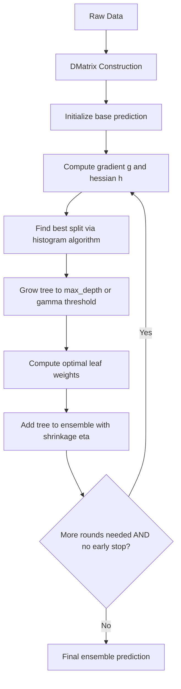

## XGBoost Implementation

### Environment Setup

XGBoost is available as a standalone library with APIs for Python, R, Java, and C++. The Python package provides both a native API (`xgboost.train` with `DMatrix`) and a scikit-learn-compatible API (`XGBClassifier`, `XGBRegressor`).

```bash
pip install xgboost
```

```python
import xgboost as xgb
import numpy as np
from sklearn.model_selection import train_test_split
from sklearn.datasets import load_breast_cancer
```

### Data Preparation with DMatrix

The native API uses `DMatrix`, an internal data structure optimized for memory efficiency and training speed. It supports NumPy arrays, pandas DataFrames, SciPy sparse matrices, and direct loading from CSV/LibSVM files.

```python
data = load_breast_cancer()
X, y = data.data, data.target

X_train, X_test, y_train, y_test = train_test_split(
    X, y, test_size=0.2, random_state=42
)

dtrain = xgb.DMatrix(X_train, label=y_train)
dtest = xgb.DMatrix(X_test, label=y_test)
```

`DMatrix` construction pre-bins continuous features into histogram buckets, which supports the split-finding algorithm used during tree construction.

### Native API Training

```python
params = {
    "objective": "binary:logistic",
    "eval_metric": "logloss",
    "max_depth": 4,
    "eta": 0.1,
    "subsample": 0.8,
    "colsample_bytree": 0.8,
}

evals = [(dtrain, "train"), (dtest, "eval")]

bst = xgb.train(
    params,
    dtrain,
    num_boost_round=200,
    evals=evals,
    early_stopping_rounds=20,
    verbose_eval=25,
)
```

`early_stopping_rounds` halts training if the evaluation metric on the last dataset in `evals` fails to improve for the specified number of rounds. This uses `bst.best_iteration` to record the optimal round.

### scikit-learn API

The sklearn-compatible wrapper integrates directly with `Pipeline`, `GridSearchCV`, and `cross_val_score`.

```python
from xgboost import XGBClassifier

clf = XGBClassifier(
    n_estimators=200,
    max_depth=4,
    learning_rate=0.1,
    subsample=0.8,
    colsample_bytree=0.8,
    eval_metric="logloss",
    early_stopping_rounds=20,
)

clf.fit(
    X_train, y_train,
    eval_set=[(X_test, y_test)],
    verbose=False,
)

preds = clf.predict(X_test)
proba = clf.predict_proba(X_test)
```

### Core Hyperparameters

**Key Points**
- `max_depth`: maximum tree depth; controls model complexity and overfitting risk
- `eta` (`learning_rate`): shrinkage applied to each tree's contribution, typically 0.01–0.3
- `n_estimators` / `num_boost_round`: number of boosting rounds (trees)
- `subsample`: fraction of training rows sampled per tree, reduces variance
- `colsample_bytree`, `colsample_bylevel`, `colsample_bynode`: column subsampling at different granularities
- `min_child_weight`: minimum sum of instance Hessian weight needed in a child node, acts as a regularization floor
- `gamma` (`min_split_loss`): minimum loss reduction required to make a further partition
- `lambda` (`reg_lambda`) and `alpha` (`reg_alpha`): L2 and L1 regularization on leaf weights

### Objective Functions

XGBoost supports objectives across task types. Common selections:

| Task | Objective | Notes |
|---|---|---|
| Binary classification | `binary:logistic` | outputs probability |
| Binary classification | `binary:hinge` | outputs 0/1 class directly |
| Multiclass | `multi:softmax` | outputs class label |
| Multiclass | `multi:softprob` | outputs class probabilities |
| Regression | `reg:squarederror` | standard L2 loss |
| Regression | `reg:absoluteerror` | L1 loss, robust to outliers |
| Ranking | `rank:pairwise`, `rank:ndcg` | learning-to-rank tasks |

Custom objectives can be supplied as Python functions returning gradient and Hessian arrays, which XGBoost consumes directly since it is a second-order (Newton boosting) method.

### The Boosting Objective (Mathematical Basis)

At each boosting round $t$, XGBoost minimizes a regularized objective combining the loss and a tree complexity penalty:

$$
\mathcal{L}^{(t)} = \sum_{i=1}^{n} l\left(y_i, \hat{y}_i^{(t-1)} + f_t(x_i)\right) + \Omega(f_t)
$$

where the regularization term is:

$$
\Omega(f_t) = \gamma T + \frac{1}{2}\lambda \sum_{j=1}^{T} w_j^2
$$

with $T$ the number of leaves and $w_j$ the leaf weights. A second-order Taylor expansion of the loss gives closed-form optimal leaf weights:

$$
w_j^* = -\frac{\sum_{i \in I_j} g_i}{\sum_{i \in I_j} h_i + \lambda}
$$

where $g_i$ and $h_i$ are the first and second derivatives (gradient and Hessian) of the loss with respect to the previous prediction. This second-order formulation is a defining architectural feature of XGBoost relative to first-order gradient boosting implementations.

### Tree Growth Diagram

<svg xmlns="http://www.w3.org/2000/svg" viewBox="0 0 720 320">
  <text x="360" y="24" text-anchor="middle" font-size="15" font-weight="bold" fill="#1a1a1a">XGBoost Sequential Tree Boosting (svg_diagram)</text>

  <rect x="20" y="60" width="150" height="50" rx="6" fill="#e8f0fe" stroke="#4285f4" stroke-width="1.5" />
  <text x="95" y="90" text-anchor="middle" font-size="12" fill="#1a1a1a">Tree 1 (f₁)</text>

  <rect x="210" y="60" width="150" height="50" rx="6" fill="#e8f0fe" stroke="#4285f4" stroke-width="1.5" />
  <text x="285" y="90" text-anchor="middle" font-size="12" fill="#1a1a1a">Tree 2 (f₂)</text>

  <rect x="400" y="60" width="150" height="50" rx="6" fill="#e8f0fe" stroke="#4285f4" stroke-width="1.5" />
  <text x="475" y="90" text-anchor="middle" font-size="12" fill="#1a1a1a">Tree 3 (f₃)</text>

  <rect x="590" y="60" width="110" height="50" rx="6" fill="#fce8e6" stroke="#ea4335" stroke-width="1.5" />
  <text x="645" y="85" text-anchor="middle" font-size="11" fill="#1a1a1a">...</text>
  <text x="645" y="100" text-anchor="middle" font-size="11" fill="#1a1a1a">Tree T</text>

  <line x1="170" y1="85" x2="210" y2="85" stroke="#5f6368" stroke-width="1.5" marker-end="url(#arrow)" />
  <line x1="360" y1="85" x2="400" y2="85" stroke="#5f6368" stroke-width="1.5" marker-end="url(#arrow)" />
  <line x1="550" y1="85" x2="590" y2="85" stroke="#5f6368" stroke-width="1.5" marker-end="url(#arrow)" />

  <text x="95" y="145" text-anchor="middle" font-size="11" fill="#5f6368">fits residual</text>
  <text x="285" y="145" text-anchor="middle" font-size="11" fill="#5f6368">of ŷ⁽¹⁾</text>
  <text x="475" y="145" text-anchor="middle" font-size="11" fill="#5f6368">of ŷ⁽²⁾</text>

  <rect x="230" y="190" width="260" height="50" rx="6" fill="#e6f4ea" stroke="#34a853" stroke-width="1.5" />
  <text x="360" y="220" text-anchor="middle" font-size="12" fill="#1a1a1a">ŷ = Σ η · fₖ(x)</text>

  <line x1="95" y1="110" x2="300" y2="190" stroke="#9aa0a6" stroke-width="1" stroke-dasharray="3,2" />
  <line x1="285" y1="110" x2="340" y2="190" stroke="#9aa0a6" stroke-width="1" stroke-dasharray="3,2" />
  <line x1="475" y1="110" x2="400" y2="190" stroke="#9aa0a6" stroke-width="1" stroke-dasharray="3,2" />

  <text x="360" y="270" text-anchor="middle" font-size="11" fill="#5f6368">η = learning rate (eta), applied as shrinkage per tree</text>

  </svg>

### Cross-Validation with `xgb.cv`

```python
cv_results = xgb.cv(
    params,
    dtrain,
    num_boost_round=500,
    nfold=5,
    early_stopping_rounds=20,
    metrics="logloss",
    seed=42,
)

best_round = cv_results["test-logloss-mean"].idxmin()
```

`xgb.cv` performs k-fold cross-validation internally and returns per-round mean/std metrics across folds, which is useful for selecting `num_boost_round` before final training on the full dataset.

### Regularization and Overfitting Control

**Key Points**
- Lower `eta` combined with higher `num_boost_round` generally produces smoother, better-generalizing models but increases training time
- `max_depth` between 3–6 is a common starting range for tabular data; deeper trees increase capacity to overfit
- `subsample` < 1.0 and `colsample_bytree` < 1.0 introduce stochasticity analogous to bagging, which can reduce variance
- `gamma` > 0 makes tree splits more conservative by requiring a minimum loss reduction
- `min_child_weight` higher values restrict splits in regions with few or low-weight samples, which is relevant for imbalanced datasets

The relative importance of these hyperparameters is dataset-dependent. [Inference] For a specific dataset, the ranked impact of individual hyperparameters cannot be determined without conducting a search (e.g., grid search, random search, or Bayesian optimization) against a held-out validation set.

### Feature Importance and Interpretation

```python
importance = bst.get_score(importance_type="gain")
xgb.plot_importance(bst, importance_type="gain")
```

Available `importance_type` values:
- `weight`: number of times a feature is used to split across all trees
- `gain`: average loss reduction attributed to splits using the feature
- `cover`: average number of samples affected by splits using the feature

For more granular, instance-level explanations, SHAP values are commonly paired with XGBoost:

```python
import shap

explainer = shap.TreeExplainer(bst)
shap_values = explainer.shap_values(X_test)
shap.summary_plot(shap_values, X_test, feature_names=data.feature_names)
```

`TreeExplainer` computes exact SHAP values efficiently for tree ensembles using the tree structure directly, rather than relying on sampling-based approximation.

### Handling Missing Values and Sparse Data

XGBoost has built-in handling for missing values: during training, for each split, the algorithm learns a default direction (left or right) for samples with missing values at that node, based on which direction minimizes the loss. This removes the need for explicit imputation in most cases.

```python
X_with_nan = X_train.copy()
X_with_nan[X_with_nan < 0.01] = np.nan  # simulate missingness

dtrain_nan = xgb.DMatrix(X_with_nan, label=y_train, missing=np.nan)
```

### Handling Class Imbalance

```python
params_imbalanced = {
    "objective": "binary:logistic",
    "scale_pos_weight": (y_train == 0).sum() / (y_train == 1).sum(),
}
```

`scale_pos_weight` rescales the gradient contribution of the positive class, which is a standard adjustment for imbalanced binary classification. For multiclass imbalance, per-sample weights via `DMatrix(..., weight=sample_weights)` are typically used instead.

### GPU Acceleration

```python
params_gpu = {
    "tree_method": "hist",
    "device": "cuda",
}
```

[Unverified] The exact parameter names and required XGBoost/CUDA versions for GPU acceleration have changed across releases (e.g., `gpu_hist` was deprecated in favor of `device="cuda"` with `tree_method="hist"` in more recent versions). Confirm the correct parameters against the installed XGBoost version's documentation, since behavior here is version-dependent and not something this response can verify for your specific environment.

### Model Persistence

```python
bst.save_model("model.json")
bst_loaded = xgb.Booster()
bst_loaded.load_model("model.json")

clf.save_model("model_sklearn.json")
```

Saving in JSON or UBJSON format (rather than pickling) is the documented approach for cross-version compatibility, since pickled Python objects can break across library version upgrades.

### Training Flow Overview



### Common Pitfalls

**Key Points**
- Treating `n_estimators` as fixed rather than tuning it jointly with `eta` often produces suboptimal results; a common workflow uses a high `n_estimators` with early stopping instead of fixing the count upfront
- Passing an inconsistent `eval_metric` relative to the `objective` (e.g., `rmse` with a classification objective) will raise an error or produce meaningless results
- Not setting a `random_state`/`seed` makes runs non-reproducible for feature subsampling and row subsampling steps
- Applying `scale_pos_weight` while also manually resampling the dataset can compound the imbalance correction beyond what's intended

**Conclusion**
XGBoost operationalizes gradient boosting through a regularized, second-order optimization objective, histogram-based split finding, and built-in handling for missing data and imbalance. Its native `DMatrix`/`Booster` API and sklearn-compatible wrapper cover both fine-grained control and pipeline integration. Effective use in practice depends on tuning depth, shrinkage, and sampling parameters against a validation strategy rather than relying on defaults, since optimal settings are dataset-dependent. [Inference]

**Related Topics**
- LightGBM implementation (leaf-wise growth, categorical feature support)
- CatBoost implementation (ordered boosting, native categorical handling)
- Hyperparameter optimization (grid search, random search, Bayesian optimization, Optuna)
- SHAP and model interpretability for tree ensembles
- Gradient boosting theory (first-order vs. second-order boosting)
- Stacking and blending ensemble strategies