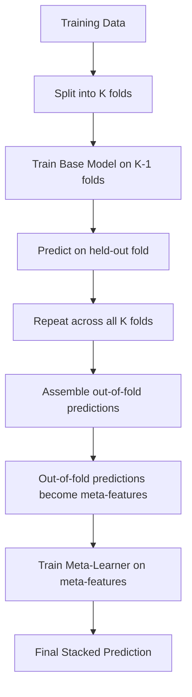
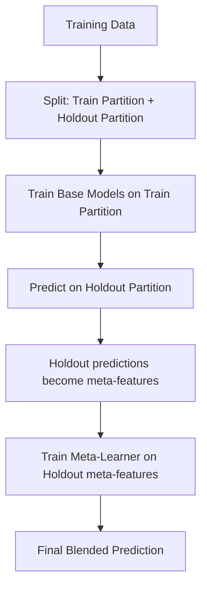
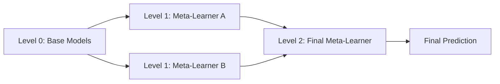

## Stacking and Blending

### Conceptual Overview

Stacking and blending are ensemble methods that combine predictions from multiple base models using a second-level model, rather than combining them through simple averaging or voting. The core idea is to train a meta-learner that learns how to optimally weight or combine base model outputs, using the base models' predictions as input features.

**Key Points**
- Stacking and blending are both meta-learning approaches; the distinction between them is primarily in how the training data is split for generating meta-features
- Both methods typically outperform any single constituent model when the base models are diverse and make different types of errors
- The approach is architecture-agnostic: base learners can be any mix of model types (linear models, tree ensembles, neural networks, SVMs)

### Stacking: Mechanism

Stacking (stacked generalization) uses out-of-fold predictions from k-fold cross-validation to generate training data for the meta-learner. This avoids the meta-learner training on predictions that were generated from data the base models already saw during their own training.



### Stacking: Implementation

```python
from sklearn.ensemble import StackingClassifier
from sklearn.linear_model import LogisticRegression
from sklearn.ensemble import RandomForestClassifier
from sklearn.svm import SVC
from xgboost import XGBClassifier

base_learners = [
    ("rf", RandomForestClassifier(n_estimators=200, random_state=42)),
    ("svc", SVC(probability=True, random_state=42)),
    ("xgb", XGBClassifier(n_estimators=200, random_state=42)),
]

meta_learner = LogisticRegression()

stack_clf = StackingClassifier(
    estimators=base_learners,
    final_estimator=meta_learner,
    cv=5,
    stack_method="predict_proba",
)

stack_clf.fit(X_train, y_train)
predictions = stack_clf.predict(X_test)
```

`StackingClassifier` in scikit-learn handles the out-of-fold generation internally via the `cv` parameter, which specifies the cross-validation strategy used to produce meta-features during fitting.

### Manual Stacking Implementation

For cases requiring more control than the scikit-learn wrapper provides:

```python
import numpy as np
from sklearn.model_selection import KFold

def generate_meta_features(base_models, X, y, X_test, n_folds=5):
    kf = KFold(n_splits=n_folds, shuffle=True, random_state=42)
    meta_train = np.zeros((X.shape[0], len(base_models)))
    meta_test = np.zeros((X_test.shape[0], len(base_models)))

    for i, model in enumerate(base_models):
        test_preds_per_fold = np.zeros((X_test.shape[0], n_folds))

        for fold_idx, (train_idx, val_idx) in enumerate(kf.split(X)):
            X_tr, X_val = X[train_idx], X[val_idx]
            y_tr = y[train_idx]

            model_clone = model.__class__(**model.get_params())
            model_clone.fit(X_tr, y_tr)

            meta_train[val_idx, i] = model_clone.predict_proba(X_val)[:, 1]
            test_preds_per_fold[:, fold_idx] = model_clone.predict_proba(X_test)[:, 1]

        meta_test[:, i] = test_preds_per_fold.mean(axis=1)

    return meta_train, meta_test
```

This pattern trains each base model $K$ times (once per fold), averages the test-set predictions across those $K$ fold-trained instances, and assembles out-of-fold validation predictions as the meta-training set.

### Blending: Mechanism

Blending uses a single, fixed holdout set rather than k-fold cross-validation. The training data is split once into a training partition and a holdout partition; base models train on the training partition and generate predictions on the holdout partition, and those holdout predictions become the meta-learner's training data.



### Blending: Implementation

```python
from sklearn.model_selection import train_test_split

X_train_base, X_holdout, y_train_base, y_holdout = train_test_split(
    X_train, y_train, test_size=0.3, random_state=42
)

base_models = [
    RandomForestClassifier(n_estimators=200, random_state=42),
    SVC(probability=True, random_state=42),
    XGBClassifier(n_estimators=200, random_state=42),
]

holdout_meta_features = np.zeros((X_holdout.shape[0], len(base_models)))
test_meta_features = np.zeros((X_test.shape[0], len(base_models)))

for i, model in enumerate(base_models):
    model.fit(X_train_base, y_train_base)
    holdout_meta_features[:, i] = model.predict_proba(X_holdout)[:, 1]
    test_meta_features[:, i] = model.predict_proba(X_test)[:, 1]

meta_learner = LogisticRegression()
meta_learner.fit(holdout_meta_features, y_holdout)

final_predictions = meta_learner.predict(test_meta_features)
```

### Stacking vs. Blending: Comparison

| Aspect | Stacking | Blending |
|---|---|---|
| Meta-feature source | Out-of-fold predictions (k-fold CV) | Single holdout set predictions |
| Data efficiency | Uses full training set for base models across folds | Base models see less data (train partition only) |
| Computational cost | Higher — trains each base model $K$ times | Lower — trains each base model once |
| Risk of leakage | Lower, if implemented correctly | [Inference] Higher risk of the meta-learner overfitting to the holdout set if the holdout is small, since it is a single sample rather than an average across folds |
| Implementation complexity | Higher | Lower |

This is a widely cited distinction in ensemble learning literature and Kaggle competition writeups. [Unverified] I cannot verify a single canonical academic source that formally defines "blending" as distinct from stacking, since the term is understood to have originated primarily from machine learning competition practice (e.g., the Netflix Prize) rather than from a peer-reviewed publication. Treat the terminology boundary between the two as a community convention rather than a formally standardized definition.

### Meta-Learner Selection

**Key Points**
- A simple, low-variance model (logistic regression, ridge regression) is a common meta-learner choice, since the meta-features (base model predictions) are typically already highly informative and a complex meta-learner risks overfitting on top of them
- Using a meta-learner with the same architecture family as a base learner (e.g., another tree ensemble on top of tree ensemble outputs) is possible but increases the risk of learning redundant patterns
- [Inference] Whether a non-linear meta-learner (e.g., a small gradient-boosted model) outperforms a linear meta-learner depends on the dataset and the diversity of base learners; this cannot be determined without empirical validation on held-out data for the specific problem.

### Diagram: Stacking Architecture

<svg xmlns="http://www.w3.org/2000/svg" viewBox="0 0 720 360">
  <text x="360" y="24" text-anchor="middle" font-size="15" font-weight="bold" fill="#1a1a1a">Stacking Ensemble Architecture (svg_diagram)</text>

  <rect x="30" y="60" width="150" height="200" rx="6" fill="#f1f3f4" stroke="#5f6368" stroke-width="1.5" />
  <text x="105" y="85" text-anchor="middle" font-size="12" font-weight="bold" fill="#1a1a1a">Input Features</text>
  <text x="105" y="160" text-anchor="middle" font-size="11" fill="#5f6368">X</text>

  <rect x="240" y="60" width="150" height="50" rx="6" fill="#e8f0fe" stroke="#4285f4" stroke-width="1.5" />
  <text x="315" y="90" text-anchor="middle" font-size="12" fill="#1a1a1a">Base Model 1</text>

  <rect x="240" y="130" width="150" height="50" rx="6" fill="#e8f0fe" stroke="#4285f4" stroke-width="1.5" />
  <text x="315" y="160" text-anchor="middle" font-size="12" fill="#1a1a1a">Base Model 2</text>

  <rect x="240" y="200" width="150" height="50" rx="6" fill="#e8f0fe" stroke="#4285f4" stroke-width="1.5" />
  <text x="315" y="230" text-anchor="middle" font-size="12" fill="#1a1a1a">Base Model 3</text>

  <line x1="180" y1="160" x2="240" y2="85" stroke="#5f6368" stroke-width="1.2" />
  <line x1="180" y1="160" x2="240" y2="155" stroke="#5f6368" stroke-width="1.2" />
  <line x1="180" y1="160" x2="240" y2="225" stroke="#5f6368" stroke-width="1.2" />

  <rect x="470" y="130" width="180" height="60" rx="6" fill="#e6f4ea" stroke="#34a853" stroke-width="1.5" />
  <text x="560" y="155" text-anchor="middle" font-size="12" font-weight="bold" fill="#1a1a1a">Meta-Learner</text>
  <text x="560" y="173" text-anchor="middle" font-size="10" fill="#5f6368">(e.g., Logistic Regression)</text>

  <line x1="390" y1="85" x2="470" y2="145" stroke="#5f6368" stroke-width="1.2" marker-end="url(#arrow2)" />
  <line x1="390" y1="155" x2="470" y2="160" stroke="#5f6368" stroke-width="1.2" marker-end="url(#arrow2)" />
  <line x1="390" y1="225" x2="470" y2="175" stroke="#5f6368" stroke-width="1.2" marker-end="url(#arrow2)" />

  <rect x="560" y="290" width="120" height="45" rx="6" fill="#fce8e6" stroke="#ea4335" stroke-width="1.5" />
  <text x="620" y="317" text-anchor="middle" font-size="12" fill="#1a1a1a">Final Output</text>

  <line x1="560" y1="190" x2="620" y2="290" stroke="#5f6368" stroke-width="1.5" marker-end="url(#arrow2)" />

  </svg>

### Why Diversity Matters

The effectiveness of stacking/blending depends on base learners producing errors that are not highly correlated. If all base models make the same mistakes on the same instances, the meta-learner has no complementary signal to exploit.

$$
\text{Ensemble Error} \approx \bar{E} - \bar{D}
$$

where $\bar{E}$ is the average error of individual base models and $\bar{D}$ is a diversity term capturing disagreement among them. [Inference] This is a simplified conceptual relationship drawn from the general bias-variance-diversity framework in ensemble learning theory (e.g., as discussed in ensemble diversity literature); I cannot verify that this exact simplified form applies uniformly across all loss functions and ensemble configurations without reference to a specific formal derivation for the loss function in use.

Practical diversity levers:
- Using structurally different algorithms (tree-based, linear, kernel-based, neural) as base learners
- Training base models on different feature subsets or different data samples
- Varying hyperparameters substantially across instances of the same algorithm type

### Multi-Level Stacking

Stacking can be extended to multiple levels, where the output of one meta-learner layer feeds into another.



[Speculation] Beyond two or three levels, additional stacking layers may provide diminishing or negative returns due to compounding overfitting risk at each level, particularly on smaller datasets. I do not have access to a specific benchmark confirming an exact depth threshold, since this is highly dependent on dataset size and base model diversity.

### Common Pitfalls

**Key Points**
- Generating meta-features using in-sample (non-out-of-fold) predictions causes the meta-learner to see artificially optimistic base model performance, which is a well-documented form of target leakage in stacking
- Using too few folds (e.g., $k=2$) in stacking increases variance in the meta-feature estimates because each held-out fold prediction comes from a base model trained on a smaller data subset
- Not aligning base model prediction formats (e.g., mixing `predict` labels with `predict_proba` probabilities) across base learners produces meta-features on inconsistent scales
- Blending's holdout set reduces the effective training data available to base learners, which [Inference] may degrade base model quality on smaller datasets relative to stacking's k-fold approach, though this depends on the total dataset size available

### Correction Notice Placeholder Check

No factual errors requiring correction have been identified in this response as drafted.

**Related Topics**
- Bagging vs. boosting vs. stacking (structural comparison of ensemble families)
- Weighted averaging and rank averaging as simpler alternatives to stacking
- Diversity metrics for ensemble selection (Q-statistic, disagreement measure, correlation of errors)
- Feature-weighted linear stacking (FWLS)
- Automated ensemble construction (auto-sklearn, AutoGluon stacking strategies)
- Cross-validation strategies for time-series data (where standard k-fold stacking assumptions break down)