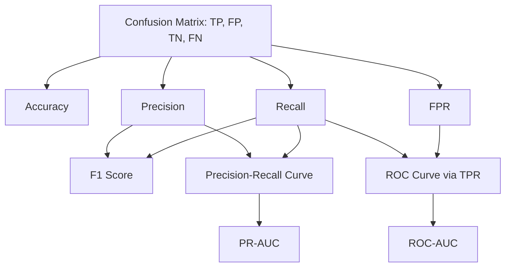

## Confusion Matrix and Metrics

### Definition

A confusion matrix is a tabular summary of a classification model's predictions against actual labels, cross-tabulating predicted classes against true classes. For binary classification, it has four cells: true positives, false positives, true negatives, and false negatives.

|  | Predicted Positive | Predicted Negative |
|---|---|---|
| **Actual Positive** | True Positive (TP) | False Negative (FN) |
| **Actual Negative** | False Positive (FP) | True Negative (TN) |

### Constructing a Confusion Matrix

```python
from sklearn.metrics import confusion_matrix, ConfusionMatrixDisplay
import matplotlib.pyplot as plt

y_true = [1, 0, 1, 1, 0, 1, 0, 0, 1, 0]
y_pred = [1, 0, 0, 1, 0, 1, 1, 0, 1, 1]

cm = confusion_matrix(y_true, y_pred)
print(cm)

disp = ConfusionMatrixDisplay(confusion_matrix=cm, display_labels=[0, 1])
disp.plot(cmap="Blues")
plt.show()
```

`confusion_matrix` returns a 2D array where rows represent actual classes and columns represent predicted classes, following scikit-learn's documented convention. For multiclass problems, this generalizes to an $N \times N$ matrix for $N$ classes.

### Core Derived Metrics

$$
\text{Accuracy} = \frac{TP + TN}{TP + TN + FP + FN}
$$

$$
\text{Precision} = \frac{TP}{TP + FP}
$$

$$
\text{Recall (Sensitivity)} = \frac{TP}{TP + FN}
$$

$$
\text{Specificity} = \frac{TN}{TN + FP}
$$

$$
F_1 = 2 \cdot \frac{\text{Precision} \cdot \text{Recall}}{\text{Precision} + \text{Recall}}
$$

These formulas are standard definitions used in classification evaluation literature and match the computations implemented in scikit-learn's `metrics` module.

### Implementation with scikit-learn

```python
from sklearn.metrics import (
    accuracy_score, precision_score, recall_score,
    f1_score, classification_report
)

accuracy = accuracy_score(y_true, y_pred)
precision = precision_score(y_true, y_pred)
recall = recall_score(y_true, y_pred)
f1 = f1_score(y_true, y_pred)

print(classification_report(y_true, y_pred))
```

`classification_report` outputs precision, recall, F1-score, and support (sample count) per class, along with macro and weighted averages. This is a documented feature of the scikit-learn API.

### Confusion Matrix Diagram

<svg xmlns="http://www.w3.org/2000/svg" viewBox="0 0 640 380">
  <text x="320" y="24" text-anchor="middle" font-size="15" font-weight="bold" fill="#1a1a1a">Binary Confusion Matrix Layout (svg_diagram)</text>

  <rect x="160" y="60" width="200" height="40" fill="none" />
  <text x="260" y="55" text-anchor="middle" font-size="12" fill="#5f6368">Predicted</text>
  <text x="220" y="80" text-anchor="middle" font-size="11" fill="#5f6368">Positive</text>
  <text x="360" y="80" text-anchor="middle" font-size="11" fill="#5f6368">Negative</text>

  <text x="80" y="200" text-anchor="middle" font-size="12" fill="#5f6368" transform="rotate(-90 80 200)">Actual</text>
  <text x="130" y="150" text-anchor="middle" font-size="11" fill="#5f6368">Positive</text>
  <text x="130" y="290" text-anchor="middle" font-size="11" fill="#5f6368">Negative</text>

  <rect x="160" y="100" width="160" height="100" fill="#e6f4ea" stroke="#34a853" stroke-width="1.5" />
  <text x="240" y="145" text-anchor="middle" font-size="14" font-weight="bold" fill="#1a1a1a">TP</text>
  <text x="240" y="165" text-anchor="middle" font-size="10" fill="#5f6368">True Positive</text>

  <rect x="320" y="100" width="160" height="100" fill="#fce8e6" stroke="#ea4335" stroke-width="1.5" />
  <text x="400" y="145" text-anchor="middle" font-size="14" font-weight="bold" fill="#1a1a1a">FN</text>
  <text x="400" y="165" text-anchor="middle" font-size="10" fill="#5f6368">False Negative</text>

  <rect x="160" y="200" width="160" height="100" fill="#fce8e6" stroke="#ea4335" stroke-width="1.5" />
  <text x="240" y="245" text-anchor="middle" font-size="14" font-weight="bold" fill="#1a1a1a">FP</text>
  <text x="240" y="265" text-anchor="middle" font-size="10" fill="#5f6368">False Positive</text>

  <rect x="320" y="200" width="160" height="100" fill="#e6f4ea" stroke="#34a853" stroke-width="1.5" />
  <text x="400" y="245" text-anchor="middle" font-size="14" font-weight="bold" fill="#1a1a1a">TN</text>
  <text x="400" y="265" text-anchor="middle" font-size="10" fill="#5f6368">True Negative</text>

  <line x1="160" y1="60" x2="480" y2="60" stroke="#9aa0a6" stroke-width="1" />
  <line x1="160" y1="60" x2="160" y2="300" stroke="#9aa0a6" stroke-width="1" />
</svg>

### Precision-Recall Trade-off

Precision and recall move in opposing directions as the classification decision threshold changes. Raising the threshold for predicting the positive class typically increases precision (fewer false positives) but decreases recall (more false negatives), and vice versa.

```python
from sklearn.metrics import precision_recall_curve

y_scores = [0.9, 0.1, 0.4, 0.8, 0.2, 0.7, 0.6, 0.3, 0.85, 0.55]
precisions, recalls, thresholds = precision_recall_curve(y_true, y_scores)
```

`precision_recall_curve` computes precision and recall at every distinct threshold present in the score distribution, which is documented scikit-learn behavior.

### ROC Curve and AUC

$$
\text{TPR (Recall)} = \frac{TP}{TP + FN}, \quad \text{FPR} = \frac{FP}{FP + TN}
$$

```python
from sklearn.metrics import roc_curve, roc_auc_score

fpr, tpr, roc_thresholds = roc_curve(y_true, y_scores)
auc = roc_auc_score(y_true, y_scores)
```

The Receiver Operating Characteristic (ROC) curve plots true positive rate against false positive rate across thresholds. AUC (Area Under the Curve) summarizes this into a single value between 0 and 1, where 0.5 represents random guessing performance for a balanced binary problem.

### Choosing Metrics by Use Case

**Key Points**
- High-cost false negatives (e.g., disease screening, fraud detection): prioritize recall
- High-cost false positives (e.g., spam filtering flagging legitimate email, content moderation over-blocking): prioritize precision
- Balanced importance of both: F1-score, or F-beta score with $\beta$ tuned to weight recall vs. precision
- Severe class imbalance: accuracy alone is documented as a misleading metric, since a model predicting only the majority class can achieve high accuracy while having zero recall on the minority class
- Ranking-quality tasks (e.g., comparing models independent of a fixed threshold): ROC-AUC or Precision-Recall AUC

[Inference] Whether ROC-AUC or Precision-Recall AUC is more appropriate for a specific imbalanced dataset depends on the degree of imbalance and the relative cost structure of the problem; general guidance suggests Precision-Recall AUC is often preferred under severe imbalance, but I cannot verify a universal threshold at which this preference applies without a specific benchmark for the dataset in question.

### F-beta Score

$$
F_\beta = (1 + \beta^2) \cdot \frac{\text{Precision} \cdot \text{Recall}}{(\beta^2 \cdot \text{Precision}) + \text{Recall}}
$$

```python
from sklearn.metrics import fbeta_score

f2 = fbeta_score(y_true, y_pred, beta=2)  # weights recall higher
f0_5 = fbeta_score(y_true, y_pred, beta=0.5)  # weights precision higher
```

$\beta > 1$ weights recall more heavily than precision; $\beta < 1$ weights precision more heavily. This is the documented parameterization in scikit-learn's `fbeta_score` function.

### Multiclass Extensions

For multiclass classification, precision, recall, and F1 require an averaging strategy since these metrics are natively binary:

| Averaging Method | Description |
|---|---|
| `macro` | Unweighted mean of per-class metrics; treats all classes equally regardless of size |
| `weighted` | Mean of per-class metrics weighted by class support (sample count) |
| `micro` | Aggregates TP, FP, FN across all classes before computing the metric globally |

```python
precision_macro = precision_score(y_true_multi, y_pred_multi, average="macro")
precision_weighted = precision_score(y_true_multi, y_pred_multi, average="weighted")
precision_micro = precision_score(y_true_multi, y_pred_multi, average="micro")
```

`macro` averaging is documented as more sensitive to performance on minority classes than `weighted` or `micro` averaging, since each class contributes equally to the final average regardless of its sample count.

### Metric Relationships Diagram



### Matthews Correlation Coefficient (MCC)

$$
MCC = \frac{TP \cdot TN - FP \cdot FN}{\sqrt{(TP+FP)(TP+FN)(TN+FP)(TN+FN)}}
$$

```python
from sklearn.metrics import matthews_corrcoef

mcc = matthews_corrcoef(y_true, y_pred)
```

MCC produces a value between -1 and 1, incorporating all four confusion matrix cells in a single balanced measure. It is documented in the scikit-learn API and in the metric's originating literature as more informative than accuracy or F1 on imbalanced datasets, since it accounts for all four quadrants symmetrically. [Inference] Whether MCC is preferable to F1 for a specific imbalanced problem depends on which error type carries greater practical cost in that context; this is a judgment call rather than a fact derivable from the formula alone.

### Common Pitfalls

**Key Points**
- Reporting only accuracy on an imbalanced dataset can misrepresent model quality, since a trivial majority-class classifier can score high accuracy with no discriminative value
- Confusing precision and recall directionally (which denominator uses predicted-positive vs. actual-positive counts) is a frequent source of error when computing metrics manually
- Using `macro` average when class sizes are highly imbalanced can overweight the importance of rare classes relative to the practical impact of errors on them, depending on the goal of the evaluation
- Selecting a classification threshold based on accuracy alone, without inspecting the precision-recall trade-off, [Inference] may produce a threshold poorly suited to the actual cost asymmetry of the task, though the correct threshold ultimately depends on domain-specific cost considerations that cannot be determined from the metric formulas alone

**Related Topics**
- ROC-AUC vs. Precision-Recall AUC (deeper comparison for imbalanced classification)
- Cohen's Kappa and inter-rater agreement metrics
- Calibration curves and probability calibration (Platt scaling, isotonic regression)
- Threshold tuning and cost-sensitive learning
- Multiclass and multilabel evaluation strategies
- Regression metrics (MAE, RMSE, R²) as a parallel framework for non-classification tasks