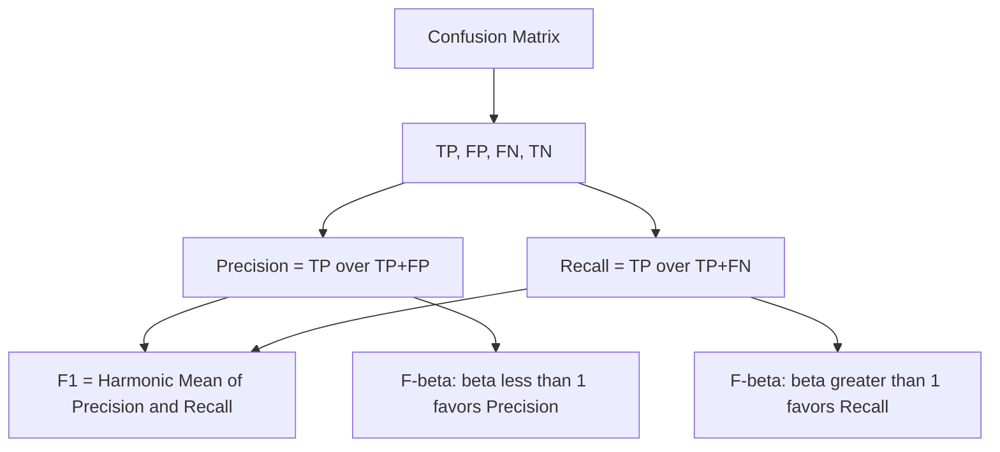

## Precision, Recall, and F1 Score

### Definitions

Precision, recall, and F1 score are classification metrics derived from the confusion matrix, each capturing a different aspect of predictive performance on the positive class.

$$
\text{Precision} = \frac{TP}{TP + FP}
$$

$$
\text{Recall} = \frac{TP}{TP + FN}
$$

$$
F_1 = 2 \cdot \frac{\text{Precision} \cdot \text{Recall}}{\text{Precision} + \text{Recall}}
$$

Precision answers: of all instances predicted positive, what fraction were actually positive. Recall answers: of all instances that were actually positive, what fraction did the model correctly identify. These are the standard definitions documented in classification evaluation literature and implemented in scikit-learn's `metrics` module.

### Implementation

```python
from sklearn.metrics import precision_score, recall_score, f1_score

y_true = [1, 0, 1, 1, 0, 1, 0, 0, 1, 0]
y_pred = [1, 0, 0, 1, 0, 1, 1, 0, 1, 1]

precision = precision_score(y_true, y_pred)
recall = recall_score(y_true, y_pred)
f1 = f1_score(y_true, y_pred)

print(f"Precision: {precision:.3f}")
print(f"Recall: {recall:.3f}")
print(f"F1: {f1:.3f}")
```

This usage matches the documented scikit-learn API signature for these three functions.

### Why the Harmonic Mean

F1 uses the harmonic mean of precision and recall rather than the arithmetic mean. The harmonic mean penalizes large disparities between the two values more heavily than an arithmetic mean would.

**Example**

If precision = 1.0 and recall = 0.01:
- Arithmetic mean: $(1.0 + 0.01)/2 = 0.505$
- Harmonic mean (F1): $2 \cdot (1.0 \cdot 0.01)/(1.0 + 0.01) \approx 0.0198$

This numeric example is a direct application of the stated formulas and is not itself an inference. The F1 score in this case correctly reflects that the model has near-zero practical recall, whereas the arithmetic mean would overstate the balance between the two metrics. [Inference] Describing the harmonic mean's behavior here as "correctly reflecting" the practical situation is an interpretive judgment about what a metric "should" communicate, not a claim verifiable purely from the arithmetic itself.

### Precision-Recall Trade-off Diagram

<svg xmlns="http://www.w3.org/2000/svg" viewBox="0 0 680 340">
  <text x="340" y="24" text-anchor="middle" font-size="15" font-weight="bold" fill="#1a1a1a">Precision-Recall Trade-off (svg_diagram)</text>

  <line x1="80" y1="280" x2="600" y2="280" stroke="#5f6368" stroke-width="1.5" />
  <line x1="80" y1="280" x2="80" y2="60" stroke="#5f6368" stroke-width="1.5" />
  <text x="340" y="310" text-anchor="middle" font-size="12" fill="#5f6368">Decision Threshold →</text>
  <text x="40" y="170" text-anchor="middle" font-size="12" fill="#5f6368" transform="rotate(-90 40 170)">Metric Value</text>

  <path d="M 80,260 C 200,240 350,120 600,80" fill="none" stroke="#4285f4" stroke-width="2.5" />
  <text x="560" y="70" font-size="11" fill="#4285f4">Precision</text>

  <path d="M 80,90 C 200,140 350,220 600,270" fill="none" stroke="#ea4335" stroke-width="2.5" />
  <text x="560" y="290" font-size="11" fill="#ea4335">Recall</text>

  <line x1="340" y1="60" x2="340" y2="280" stroke="#9aa0a6" stroke-width="1" stroke-dasharray="4,3" />
  <text x="340" y="50" text-anchor="middle" font-size="10" fill="#5f6368">example threshold</text>
</svg>

This diagram illustrates the general documented shape of precision and recall curves as a function of classification threshold — precision typically rising and recall typically falling as the threshold increases. [Inference] The exact shape, slope, and crossover point of these curves is dataset- and model-specific; the diagram represents a generalized qualitative pattern, not a measured curve from a specific dataset.

### Threshold Selection

```python
from sklearn.metrics import precision_recall_curve
import numpy as np

y_scores = [0.9, 0.1, 0.4, 0.8, 0.2, 0.7, 0.6, 0.3, 0.85, 0.55]
precisions, recalls, thresholds = precision_recall_curve(y_true, y_scores)

f1_scores = 2 * (precisions * recalls) / (precisions + recalls + 1e-10)
best_threshold_idx = np.argmax(f1_scores[:-1])
best_threshold = thresholds[best_threshold_idx]
```

`precision_recall_curve` is documented scikit-learn behavior: it computes precision and recall at each distinct score value present in the input, sorted by descending threshold. The F1-maximization pattern shown above is a common technique for selecting an operating threshold. [Inference] Whether maximizing F1 specifically is the correct threshold-selection criterion depends on whether precision and recall should be weighted equally for the task at hand; this is a judgment call about the problem's cost structure, not a fact this code can establish on its own.

### F-beta Generalization

$$
F_\beta = (1 + \beta^2) \cdot \frac{\text{Precision} \cdot \text{Recall}}{(\beta^2 \cdot \text{Precision}) + \text{Recall}}
$$

```python
from sklearn.metrics import fbeta_score

f2 = fbeta_score(y_true, y_pred, beta=2)    # recall weighted higher
f0_5 = fbeta_score(y_true, y_pred, beta=0.5)  # precision weighted higher
```

This is the documented parameterization of `fbeta_score` in scikit-learn: $\beta > 1$ shifts weight toward recall, $\beta < 1$ shifts weight toward precision, and $\beta = 1$ reduces to the standard F1 formula.

### Choosing Between Precision, Recall, and F1

**Key Points**
- Recall-prioritized scenarios: medical screening for a serious condition, fraud detection where missed cases carry high cost — [Inference] this prioritization reflects a common risk-management convention rather than a fixed rule that applies to every instance of these use cases, since actual priorities depend on the specific costs involved in a given deployment
- Precision-prioritized scenarios: spam filtering, content moderation systems where false positives block legitimate content — [Inference] same caveat applies; this is a general pattern, not a universal prescription
- F1-prioritized scenarios: cases where precision and recall are considered comparably important and a single combined metric is wanted for model comparison or hyperparameter selection

I do not have access to information about the specific cost structure, deployment context, or business priorities of any particular use case the reader may have in mind. Metric choice ultimately depends on those specifics.

### Multiclass Averaging

For multiclass problems, precision and recall require an averaging strategy since they are natively defined for binary classification:

```python
from sklearn.metrics import precision_score, f1_score

p_macro = precision_score(y_true_multi, y_pred_multi, average="macro")
p_weighted = precision_score(y_true_multi, y_pred_multi, average="weighted")
p_micro = precision_score(y_true_multi, y_pred_multi, average="micro")
```

| Averaging | Definition |
|---|---|
| `macro` | Unweighted mean across per-class scores |
| `weighted` | Mean across per-class scores, weighted by class support |
| `micro` | Aggregates TP/FP/FN globally before computing the metric |

These averaging definitions are documented in the scikit-learn API reference for these functions.

### Relationship Diagram



### Common Pitfalls

**Key Points**
- Reversing the denominators of precision and recall (using actual-positive count for precision, or predicted-positive count for recall) is a frequent manual computation error
- Using F1 as the sole comparison metric across models can obscure meaningful differences in the underlying precision/recall balance, since two models can produce the same F1 score through different trade-offs
- Applying `average="macro"` to severely imbalanced multiclass data can weight rare-class performance equally with common-class performance, which may or may not align with the actual evaluation goal — [Inference] whether this is desirable depends entirely on the specific evaluation objective, which I do not have information about
- Optimizing threshold selection purely for F1 without considering the deployment cost of false positives versus false negatives [Inference] may produce a threshold misaligned with actual operational priorities, though I cannot confirm what those priorities are for any unspecified use case

I cannot verify claims about how any specific production system, dataset, or deployed model will behave with these metrics, since that depends on data and context not available here. The code behavior described above reflects documented library functionality as of commonly available scikit-learn documentation, but exact behavior may vary by installed library version, and I do not have access to information confirming which version applies in your environment.

**Related Topics**
- ROC-AUC and Precision-Recall AUC as threshold-independent evaluation methods
- Confusion matrix and derived metrics (broader metric family)
- Matthews Correlation Coefficient as an alternative single-value summary
- Cost-sensitive learning and custom loss weighting
- Calibration of predicted probabilities
- Multiclass and multilabel metric extensions