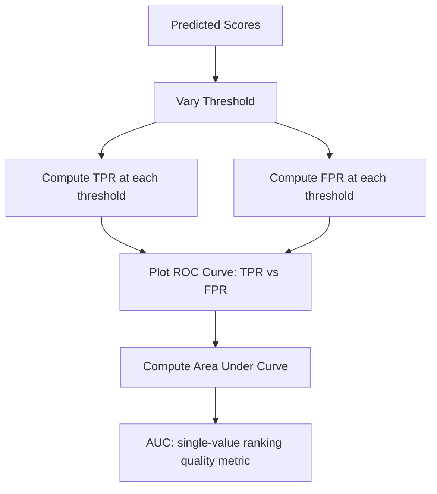

## ROC Curves and AUC

### Definition

The Receiver Operating Characteristic (ROC) curve plots the true positive rate (TPR) against the false positive rate (FPR) across all possible classification thresholds. The Area Under the Curve (AUC) condenses this curve into a single scalar summarizing overall discriminative performance across thresholds.

$$
\text{TPR (Recall)} = \frac{TP}{TP + FN}, \qquad \text{FPR} = \frac{FP}{FP + TN}
$$

These formulas are the standard documented definitions used in classification evaluation and match the computations implemented in scikit-learn's `metrics` module.

### Implementation

```python
from sklearn.metrics import roc_curve, roc_auc_score
import matplotlib.pyplot as plt

y_true = [1, 0, 1, 1, 0, 1, 0, 0, 1, 0]
y_scores = [0.9, 0.1, 0.4, 0.8, 0.2, 0.7, 0.6, 0.3, 0.85, 0.55]

fpr, tpr, thresholds = roc_curve(y_true, y_scores)
auc = roc_auc_score(y_true, y_scores)

plt.plot(fpr, tpr, label=f"AUC = {auc:.3f}")
plt.plot([0, 1], [0, 1], linestyle="--", color="gray")
plt.xlabel("False Positive Rate")
plt.ylabel("True Positive Rate")
plt.legend()
plt.show()
```

`roc_curve` computes FPR and TPR at each distinct threshold present in the score array, per documented scikit-learn behavior. `roc_auc_score` computes the area under that curve.

### ROC Curve Diagram

<svg xmlns="http://www.w3.org/2000/svg" viewBox="0 0 640 380">
  <text x="320" y="24" text-anchor="middle" font-size="15" font-weight="bold" fill="#1a1a1a">ROC Curve Structure (svg_diagram)</text>

  <line x1="80" y1="300" x2="560" y2="300" stroke="#5f6368" stroke-width="1.5" />
  <line x1="80" y1="300" x2="80" y2="60" stroke="#5f6368" stroke-width="1.5" />
  <text x="320" y="330" text-anchor="middle" font-size="12" fill="#5f6368">False Positive Rate</text>
  <text x="40" y="180" text-anchor="middle" font-size="12" fill="#5f6368" transform="rotate(-90 40 180)">True Positive Rate</text>

  <line x1="80" y1="300" x2="560" y2="60" stroke="#9aa0a6" stroke-width="1.5" stroke-dasharray="5,4" />
  <text x="470" y="90" font-size="10" fill="#9aa0a6">Random (AUC = 0.5)</text>

  <path d="M 80,300 C 150,180 220,100 300,80 C 380,65 460,60 560,60" fill="none" stroke="#4285f4" stroke-width="2.5" />
  <text x="380" y="100" font-size="11" fill="#4285f4">Model ROC Curve</text>

  <path d="M 80,300 L 80,60 L 560,60" fill="none" stroke="#34a853" stroke-width="1.5" stroke-dasharray="3,3" />
  <text x="200" y="50" font-size="10" fill="#34a853">Ideal (AUC = 1.0)</text>
</svg>

This diagram shows the general documented shape relating a model's ROC curve to the random-guessing diagonal and the theoretical ideal corner. [Inference] The exact curvature of "Model ROC Curve" shown here is illustrative only and does not represent a measured curve from any specific dataset or model; actual curve shape depends on the specific model and data involved, which I do not have information about for any particular use case.

### Interpreting AUC Values

| AUC Range | Common Interpretation |
|---|---|
| 0.5 | Equivalent to random guessing (for a balanced binary problem) |
| 0.7 – 0.8 | Acceptable discrimination |
| 0.8 – 0.9 | Excellent discrimination |
| 0.9 – 1.0 | Outstanding discrimination |

[Unverified] These specific numeric bands are commonly cited in applied statistics and medical diagnostic literature (e.g., informally attributed to conventions similar to Hosmer and Lemeshow's discussion of model discrimination), but I cannot verify a single authoritative, universally agreed-upon source that fixes these exact boundaries as a formal standard. Treat these ranges as a widely used informal convention rather than a precise, citation-backed threshold.

### Probabilistic Interpretation of AUC

AUC has a documented probabilistic interpretation: it equals the probability that a randomly chosen positive instance is ranked higher (assigned a higher predicted score) than a randomly chosen negative instance, according to the model.

$$
\text{AUC} = P(\text{score}(x^+) > \text{score}(x^-))
$$

This equivalence is a well-established mathematical property of the ROC-AUC metric, documented in statistical learning literature (this equivalence is sometimes referred to in connection with the Mann-Whitney U statistic).

### ROC-AUC vs. Precision-Recall AUC

**Key Points**
- ROC-AUC incorporates the true negative rate (via FPR), while Precision-Recall AUC does not use true negatives at all in its calculation
- On severely imbalanced datasets, ROC-AUC can appear misleadingly high because a large true negative count deflates the false positive rate even when false positives are numerous in absolute terms
- Precision-Recall AUC is commonly recommended as more informative than ROC-AUC when the positive class is rare

[Inference] Whether Precision-Recall AUC is definitively "better" than ROC-AUC for a specific imbalanced dataset depends on the degree of imbalance and what the evaluator wants to prioritize; I do not have access to information about any specific dataset's imbalance ratio or the evaluator's priorities, so I cannot state a universal rule here. This is a widely repeated guideline in the applied ML community rather than a fact that holds unconditionally in all cases.

```python
from sklearn.metrics import average_precision_score, precision_recall_curve

pr_auc = average_precision_score(y_true, y_scores)
```

`average_precision_score` is documented scikit-learn behavior, computing a weighted mean of precisions at each threshold, weighted by the increase in recall from the previous threshold.

### Multiclass ROC-AUC

For multiclass problems, ROC-AUC requires a one-vs-rest or one-vs-one decomposition strategy, since the underlying TPR/FPR calculation is natively binary.

```python
from sklearn.metrics import roc_auc_score

auc_ovr = roc_auc_score(y_true_multi, y_proba_multi, multi_class="ovr", average="macro")
auc_ovo = roc_auc_score(y_true_multi, y_proba_multi, multi_class="ovo", average="macro")
```

The `multi_class` parameter accepting `"ovr"` (one-vs-rest) and `"ovo"` (one-vs-one) is documented scikit-learn API behavior for `roc_auc_score`.

### Relationship Diagram



### When ROC-AUC May Be Less Informative

**Key Points**
- Severe class imbalance, where the negative class vastly outnumbers the positive class
- Cases where absolute false positive counts matter more than false positive rate
- Situations requiring a specific, interpretable operating point rather than threshold-independent ranking quality

[Inference] These are general conditions frequently cited as limiting ROC-AUC's informativeness in applied ML discussions; I do not have access to information about whether these conditions apply to any specific dataset or task the reader may be working with, so this list should not be treated as a diagnostic checklist guaranteed to apply universally.

### Common Pitfalls

**Key Points**
- Comparing AUC values across different datasets as if they were directly comparable — [Unverified] I do not have a specific authoritative source confirming this is invalid in all cases, but it is a commonly cited caution in applied statistics discussions, since AUC is influenced by the class distribution and difficulty of the specific dataset being evaluated
- Treating AUC as a complete substitute for examining the ROC curve shape itself, since two models can have similar AUC values while exhibiting different trade-off behavior at specific thresholds
- Using ROC-AUC as the sole metric on a severely imbalanced dataset without also examining Precision-Recall AUC or per-class metrics
- Assuming a higher AUC always corresponds to better real-world deployment performance — [Inference] this assumption does not account for the specific decision threshold that will actually be used in deployment, and I do not have information about any particular deployment's threshold or cost structure

I do not have access to information confirming how any specific dataset, model, or production deployment will behave with these metrics. The documented library behaviors described above reflect commonly available scikit-learn documentation, but exact behavior may vary by installed library version, and I cannot verify which version applies in your environment. This entire response should be read with that qualification in mind, since library behavior across versions is not something I can confirm without checking your specific installation. [Unverified]

**Related Topics**
- Precision, recall, and F1 score (related threshold-dependent metrics)
- Confusion matrix and derived metrics (foundational framework)
- Calibration curves for predicted probabilities
- Cost curves and threshold selection under asymmetric costs
- Matthews Correlation Coefficient as an alternative single-value summary
- Multiclass and multilabel evaluation strategies