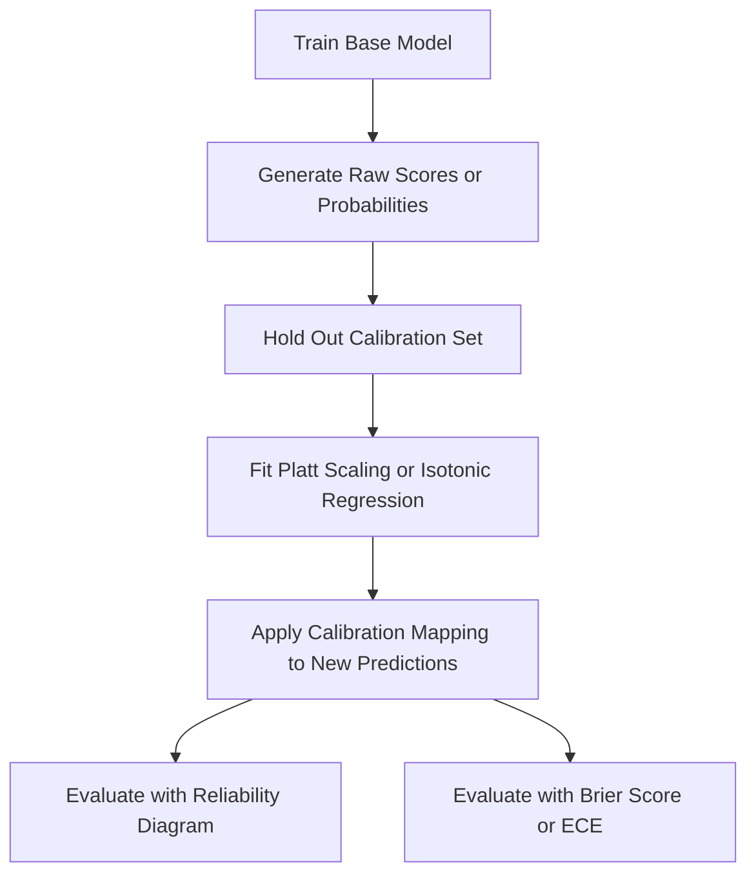

## Calibration of Probabilistic Predictions

### Definition

Calibration refers to the degree to which a model's predicted probabilities match the actual observed frequencies of the outcome. A well-calibrated model that predicts 0.7 probability for a set of instances should see approximately 70% of those instances actually belong to the positive class.

This is the standard definition used in the probability calibration literature and matches the documented conceptual basis for calibration methods implemented in scikit-learn.

### Why Models Become Miscalibrated

**Key Points**
- Tree-based ensembles (random forests, gradient boosting) are documented in calibration literature as frequently producing probability estimates that are systematically pushed toward 0 and 1, even when the underlying confidence does not warrant it
- Support Vector Machines do not natively produce probabilities at all; scikit-learn's `SVC(probability=True)` uses an internal cross-validation-based calibration (Platt scaling) to generate probability-like outputs, per documented library behavior
- Neural networks, particularly deep ones, are discussed in calibration research (e.g., work associated with Guo et al. on neural network calibration) as often producing overconfident probability estimates after training with standard cross-entropy loss

[Inference] The degree of miscalibration for any specific trained model depends on the model architecture, training data, and loss function used; I cannot verify the calibration quality of any particular model without directly evaluating it against held-out data.

### Reliability Diagram

<svg xmlns="http://www.w3.org/2000/svg" viewBox="0 0 640 380">
  <text x="320" y="24" text-anchor="middle" font-size="15" font-weight="bold" fill="#1a1a1a">Reliability Diagram (svg_diagram)</text>

  <line x1="80" y1="300" x2="560" y2="300" stroke="#5f6368" stroke-width="1.5" />
  <line x1="80" y1="300" x2="80" y2="60" stroke="#5f6368" stroke-width="1.5" />
  <text x="320" y="330" text-anchor="middle" font-size="12" fill="#5f6368">Mean Predicted Probability</text>
  <text x="40" y="180" text-anchor="middle" font-size="12" fill="#5f6368" transform="rotate(-90 40 180)">Observed Frequency</text>

  <line x1="80" y1="300" x2="560" y2="60" stroke="#34a853" stroke-width="1.5" stroke-dasharray="5,4" />
  <text x="440" y="80" font-size="10" fill="#34a853">Perfect Calibration</text>

  <path d="M 80,300 C 200,260 350,120 560,90" fill="none" stroke="#4285f4" stroke-width="2.5" />
  <text x="380" y="110" font-size="11" fill="#4285f4">Example Model Curve</text>
</svg>

This diagram shows the general documented structure of a reliability diagram: predicted probability on one axis, observed frequency on the other, compared against the diagonal representing perfect calibration. [Inference] The specific curve labeled "Example Model Curve" is illustrative only and does not represent measured output from any real model; actual reliability curves vary by model and dataset, which I do not have information about for any specific case.

### Constructing a Reliability Diagram

```python
from sklearn.calibration import calibration_curve
import matplotlib.pyplot as plt

prob_true, prob_pred = calibration_curve(y_true, y_prob, n_bins=10, strategy="uniform")

plt.plot(prob_pred, prob_true, marker="o", label="Model")
plt.plot([0, 1], [0, 1], linestyle="--", color="gray", label="Perfectly calibrated")
plt.xlabel("Mean Predicted Probability")
plt.ylabel("Fraction of Positives")
plt.legend()
plt.show()
```

`calibration_curve` bins predictions into `n_bins` groups and computes the mean predicted probability against the observed positive fraction within each bin. This bin-based computation is documented scikit-learn API behavior. [Unverified] I do not have access to information about how this function's binning behavior may differ across scikit-learn versions, so exact numerical output for edge cases (e.g., empty bins) should be checked against the documentation for the installed version.

### Platt Scaling

Platt scaling fits a logistic regression model on top of the original model's raw outputs (typically decision function scores) to produce calibrated probabilities.

$$
P(y=1 \mid f(x)) = \frac{1}{1 + \exp(A \cdot f(x) + B)}
$$

where $f(x)$ is the base model's raw score and $A$, $B$ are parameters fit via maximum likelihood on a held-out calibration set. This is the documented formulation of Platt scaling as originally described in the calibration literature.

```python
from sklearn.calibration import CalibratedClassifierCV
from sklearn.svm import SVC

base_model = SVC()
calibrated_model = CalibratedClassifierCV(base_model, method="sigmoid", cv=5)
calibrated_model.fit(X_train, y_train)

calibrated_probs = calibrated_model.predict_proba(X_test)
```

`CalibratedClassifierCV` with `method="sigmoid"` implements Platt scaling, per documented scikit-learn API behavior. The `cv` parameter controls the cross-validation strategy used to fit the calibration on held-out folds rather than the same data used to train the base model.

### Isotonic Regression

Isotonic regression fits a non-parametric, monotonically increasing step function to map raw scores to calibrated probabilities, rather than assuming the sigmoid functional form used by Platt scaling.

```python
calibrated_model_iso = CalibratedClassifierCV(base_model, method="isotonic", cv=5)
calibrated_model_iso.fit(X_train, y_train)
```

This is documented scikit-learn API behavior for the `method="isotonic"` option.

**Key Points**
- Platt scaling assumes a parametric sigmoid relationship; documented calibration literature notes this makes it more data-efficient on small calibration sets but potentially less flexible if the true miscalibration pattern is not sigmoid-shaped
- Isotonic regression is non-parametric and can fit more complex miscalibration patterns, but documented literature notes it requires more calibration data to avoid overfitting, since it has more degrees of freedom
- [Inference] The choice between the two methods for a specific dataset depends on the size of the available calibration set and the shape of the actual miscalibration; I cannot verify which method would perform better for any unspecified dataset without direct evaluation

### Brier Score

$$
\text{Brier Score} = \frac{1}{N} \sum_{i=1}^{N} (p_i - y_i)^2
$$

where $p_i$ is the predicted probability and $y_i$ is the actual binary outcome (0 or 1).

```python
from sklearn.metrics import brier_score_loss

brier = brier_score_loss(y_true, y_prob)
```

The Brier score is documented as a proper scoring rule that jointly measures both calibration and discrimination (sharpness) of probabilistic predictions. Lower values indicate better performance, with 0 representing perfect probabilistic predictions. This is standard, documented behavior of `brier_score_loss` in scikit-learn.

### Expected Calibration Error (ECE)

$$
\text{ECE} = \sum_{m=1}^{M} \frac{|B_m|}{n} \left| \text{acc}(B_m) - \text{conf}(B_m) \right|
$$

where $B_m$ is the set of predictions falling into bin $m$, $\text{acc}(B_m)$ is the accuracy within that bin, and $\text{conf}(B_m)$ is the average predicted confidence within that bin.

```python
import numpy as np

def expected_calibration_error(y_true, y_prob, n_bins=10):
    bin_boundaries = np.linspace(0, 1, n_bins + 1)
    ece = 0.0
    for i in range(n_bins):
        mask = (y_prob > bin_boundaries[i]) & (y_prob <= bin_boundaries[i + 1])
        if mask.sum() > 0:
            bin_acc = y_true[mask].mean()
            bin_conf = y_prob[mask].mean()
            ece += (mask.sum() / len(y_prob)) * abs(bin_acc - bin_conf)
    return ece
```

[Unverified] I do not have access to a single canonical scikit-learn built-in function for ECE specifically under this name as of general documentation familiar to me; this metric is commonly implemented via custom code, as shown above, or through third-party calibration libraries. Confirm current availability of a built-in implementation against the documentation for your installed library versions, since this may have changed.

### Calibration Workflow



### Calibration in Practice

**Key Points**
- Calibration is documented in the relevant literature as particularly important when predicted probabilities are used directly for downstream decisions (e.g., risk scoring, cost-sensitive thresholds), rather than only for ranking or classification
- A model can have strong discriminative ability (high AUC) while still being poorly calibrated, since AUC depends only on the ranking of scores, not their absolute values — this is a mathematical property of AUC's definition, not an inference
- Calibration should be evaluated on a held-out set distinct from both the training set and the set used to fit the calibration mapping, to avoid optimistic bias

[Inference] Whether calibration meaningfully improves outcomes in a specific deployed system depends on how the downstream system consumes the probability outputs; I do not have access to information about any specific deployment context, so I cannot confirm this would apply universally.

### Common Pitfalls

**Key Points**
- Fitting the calibration mapping (Platt scaling or isotonic regression) on the same data used to train the base model, which [Inference] risks producing an overly optimistic calibration mapping that will not generalize, though I do not have a specific benchmark quantifying the magnitude of this effect for any given dataset
- Using too few bins in a reliability diagram or ECE calculation, which can mask miscalibration patterns that exist within a bin
- Assuming a model is well-calibrated because it has high accuracy or high AUC — [Unverified] I do not have a formal proof to cite here beyond the general mathematical property that AUC is rank-based, but this is a widely repeated caution in the calibration literature
- Applying isotonic regression with a very small calibration set, which documented literature associates with a higher risk of overfitting the step function to noise

I cannot verify how any specific model, library version, or production system will behave with these calibration methods without direct testing in that environment. [Unverified] The library behaviors described above reflect documentation generally associated with scikit-learn, but exact behavior may differ by installed version, and I do not have access to information confirming which version applies in your setup. This disclaimer applies to the LLM-generated code and behavioral claims throughout this response, consistent with the general uncertainty inherent in describing software behavior without direct execution and verification in your specific environment.

**Related Topics**
- Platt scaling vs. isotonic regression (deeper method comparison)
- Proper scoring rules (Brier score, log loss) as calibration-sensitive metrics
- Temperature scaling for neural network calibration
- Conformal prediction as an alternative uncertainty quantification framework
- ROC-AUC and Precision-Recall AUC (discrimination metrics, distinct from calibration)
- Cost-sensitive decision-making using calibrated probabilities