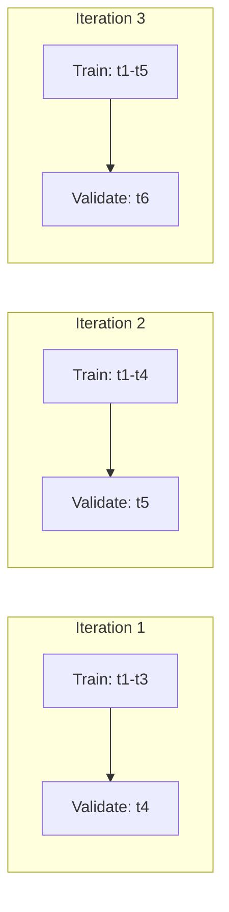
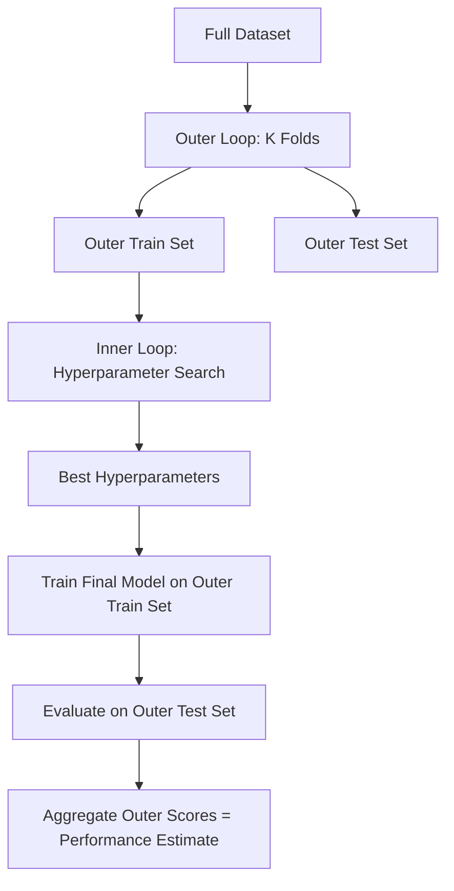

## Cross-Validation Strategies

### Overview

Cross-validation is a resampling procedure used to evaluate machine learning models on limited data by partitioning it into complementary subsets, training on one subset and validating on the other, then rotating which subset serves each role. The goal is to produce a performance estimate that generalizes better to unseen data than a single train/test split, and to reduce the variance associated with any one particular split of the data.

The core motivation is that a single train/test split gives a performance estimate that depends heavily on which data points happened to land in the test set. Cross-validation addresses this by systematically rotating which portion of the data is held out, then aggregating results across rotations.

### K-Fold Cross-Validation

**Key Points**

- The dataset is split into $k$ equally (or near-equally) sized folds.
- The model is trained $k$ times, each time using $k-1$ folds for training and the remaining fold for validation.
- The final performance estimate is the average (and often the standard deviation) across all $k$ runs.

The general formula for the aggregated metric is:

$$CV_{(k)} = \frac{1}{k} \sum_{i=1}^{k} L(f^{(-i)}, D_i)$$

where $f^{(-i)}$ is the model trained on all folds except fold $i$, $D_i$ is the held-out fold, and $L$ is the loss or scoring function.

Typical values of $k$ are 5 or 10. Smaller $k$ (e.g., 3) yields higher bias but lower variance in the estimate; larger $k$ (approaching leave-one-out) yields lower bias but higher variance and greater computational cost. This bias-variance tradeoff in choosing $k$ is a well-documented property of the technique, though the exact optimal value for a given dataset is [Inference] — it depends on dataset size, signal-to-noise ratio, and model stability, and cannot be stated as a fixed rule without empirical testing on the specific data.

Here is a diagram showing the rotation of folds:

<svg xmlns="http://www.w3.org/2000/svg" viewBox="0 0 640 300">
<text x="320" y="24" text-anchor="middle" font-size="15" font-weight="bold" fill="#1a1a1a">5-Fold Cross-Validation Rotation (svg_diagram)</text>

<text x="20" y="65" font-size="12" fill="#333">Iter 1</text>

<text x="20" y="105" font-size="12" fill="#333">Iter 2</text>

<text x="20" y="145" font-size="12" fill="#333">Iter 3</text>

<text x="20" y="185" font-size="12" fill="#333">Iter 4</text>

<text x="20" y="225" font-size="12" fill="#333">Iter 5</text>

<g>
<rect x="90" y="45" width="90" height="30" fill="#e74c3c" stroke="#999" />
<rect x="180" y="45" width="90" height="30" fill="#3498db" stroke="#999" />
<rect x="270" y="45" width="90" height="30" fill="#3498db" stroke="#999" />
<rect x="360" y="45" width="90" height="30" fill="#3498db" stroke="#999" />
<rect x="450" y="45" width="90" height="30" fill="#3498db" stroke="#999" />
</g>

<g>
<rect x="90" y="85" width="90" height="30" fill="#3498db" stroke="#999" />
<rect x="180" y="85" width="90" height="30" fill="#e74c3c" stroke="#999" />
<rect x="270" y="85" width="90" height="30" fill="#3498db" stroke="#999" />
<rect x="360" y="85" width="90" height="30" fill="#3498db" stroke="#999" />
<rect x="450" y="85" width="90" height="30" fill="#3498db" stroke="#999" />
</g>

<g>
<rect x="90" y="125" width="90" height="30" fill="#3498db" stroke="#999" />
<rect x="180" y="125" width="90" height="30" fill="#3498db" stroke="#999" />
<rect x="270" y="125" width="90" height="30" fill="#e74c3c" stroke="#999" />
<rect x="360" y="125" width="90" height="30" fill="#3498db" stroke="#999" />
<rect x="450" y="125" width="90" height="30" fill="#3498db" stroke="#999" />
</g>

<g>
<rect x="90" y="165" width="90" height="30" fill="#3498db" stroke="#999" />
<rect x="180" y="165" width="90" height="30" fill="#3498db" stroke="#999" />
<rect x="270" y="165" width="90" height="30" fill="#3498db" stroke="#999" />
<rect x="360" y="165" width="90" height="30" fill="#e74c3c" stroke="#999" />
<rect x="450" y="165" width="90" height="30" fill="#3498db" stroke="#999" />
</g>

<g>
<rect x="90" y="205" width="90" height="30" fill="#3498db" stroke="#999" />
<rect x="180" y="205" width="90" height="30" fill="#3498db" stroke="#999" />
<rect x="270" y="205" width="90" height="30" fill="#3498db" stroke="#999" />
<rect x="360" y="205" width="90" height="30" fill="#3498db" stroke="#999" />
<rect x="450" y="205" width="90" height="30" fill="#e74c3c" stroke="#999" />
</g>

<rect x="90" y="255" width="20" height="20" fill="#3498db" />
<text x="115" y="270" font-size="12" fill="#333">Training fold</text>
<rect x="250" y="255" width="20" height="20" fill="#e74c3c" />
<text x="275" y="270" font-size="12" fill="#333">Validation fold</text>
</svg>

**Example**For a dataset of 1,000 samples with $k=5$: each fold contains 200 samples. In iteration 1, folds 2–5 (800 samples) train the model, and fold 1 (200 samples) validates it. This repeats five times, and the five validation scores are averaged.

### Stratified K-Fold

Stratified K-Fold is a variant that preserves the percentage of samples for each class in every fold, which matters for classification tasks with imbalanced class distributions. Standard K-Fold shuffles and splits without regard to label distribution, which can produce folds where a minority class is underrepresented or absent entirely.

This is a well-documented behavior in libraries such as scikit-learn's `StratifiedKFold`, where folds are made by preserving the percentage of samples for each class.

**Key Points**

- Recommended default for classification problems, especially with class imbalance.
- Does not apply directly to regression targets, since there are no discrete classes to stratify by (though binned stratification on the target is sometimes used as a workaround).

### Leave-One-Out Cross-Validation (LOOCV)

LOOCV is the extreme case of K-Fold where $k$ equals the number of samples $n$. Each iteration trains on $n-1$ samples and validates on the single remaining sample.

$$CV_{(n)} = \frac{1}{n} \sum_{i=1}^{n} L(f^{(-i)}, x_i)$$

**Key Points**

- Produces a nearly unbiased estimate of generalization performance.
- Computationally expensive for large $n$, since it requires training $n$ separate models.
- The validation estimates across folds tend to be highly correlated with each other, since the training sets overlap almost entirely between iterations. This is a well-documented property discussed in statistical learning literature (e.g., in the context of the bias-variance tradeoff for LOOCV versus K-fold).
- Whether LOOCV is worth the computational cost for a given model/dataset combination is [Inference] — it depends on training time per model and dataset size, and cannot be generalized as a fixed recommendation.

### Leave-P-Out Cross-Validation

A generalization of LOOCV where $p$ samples are left out for validation instead of 1. This produces $\binom{n}{p}$ train/validation splits, which grows combinatorially and becomes computationally impractical for even modest $p$ and $n$. It is used rarely in practice for this reason.

### Repeated K-Fold Cross-Validation

Standard K-Fold is repeated multiple times with different random splits, and results are averaged across all repetitions. This reduces the variance of the performance estimate that comes from the specific random partition chosen, at the cost of a multiplicative increase in computation ($k \times$ number of repeats total model fits).

### Time Series Split (Rolling / Expanding Window)

For temporally ordered data, standard K-Fold is inappropriate because it can allow future data to be used to predict the past, leaking information and producing an overly optimistic performance estimate. Time Series Split addresses this by respecting temporal order: training always occurs on data prior to the validation window.

**Key Points**

- Two common variants: expanding window (training set grows each iteration, retaining all past data) and rolling/sliding window (training set has a fixed size and slides forward, dropping the oldest data).
- Implemented in scikit-learn as `TimeSeriesSplit`, which is a well-documented, deterministic splitting behavior.
- Choice between expanding and rolling windows depends on whether older data remains relevant to current patterns — this is a modeling judgment specific to the domain and is [Inference] rather than a fixed rule.

### Group K-Fold

Used when data points are not independent because they share a group identifier (e.g., multiple measurements from the same patient, multiple images from the same subject). Standard K-Fold could place samples from the same group in both training and validation sets, leaking group-specific information and inflating the validation score.

Group K-Fold ensures that the same group is never split across the training and validation sets within a single iteration. This is a well-documented constraint enforced by scikit-learn's `GroupKFold` implementation.

**Example**

In a medical dataset where each patient contributes 10 scans, Group K-Fold ensures all 10 scans from a given patient appear in only one of the training or validation sets per fold, never both.

### Nested Cross-Validation

Nested cross-validation uses two loops: an outer loop for estimating generalization performance, and an inner loop for hyperparameter tuning or model selection. This separation prevents the optimistic bias that occurs when the same data is used both to select hyperparameters and to estimate final performance.

**Key Points**

- The inner loop's job is model/hyperparameter selection; the outer loop's job is unbiased performance estimation.
- Computationally expensive: total model fits scale as (outer folds) × (inner folds) × (hyperparameter combinations).
- Whether the added computational cost of nested CV is justified for a specific project is a judgment call depending on dataset size and how much hyperparameter overfitting is a risk — this is [Inference], not a universal rule.

### Comparison of Strategies

| Strategy | Data Independence Assumption | Typical Use Case | Relative Cost |
| --- | --- | --- | --- |
| K-Fold | i.i.d. samples | General-purpose default | Moderate |
| Stratified K-Fold | i.i.d. samples, class labels present | Imbalanced classification | Moderate |
| LOOCV | i.i.d. samples | Small datasets | High |
| Leave-P-Out | i.i.d. samples | Rarely used | Very high |
| Repeated K-Fold | i.i.d. samples | Reducing split variance | High |
| Time Series Split | Temporal order matters | Forecasting, sequential data | Moderate |
| Group K-Fold | Grouped/clustered samples | Multiple observations per subject | Moderate |
| Nested CV | Any of the above (inner) | Unbiased performance with tuning | Very high |

I cannot verify the exact relative runtime multipliers for these strategies on any specific hardware or library version, since that depends on implementation details and dataset characteristics not specified here. The ordering in the "Relative Cost" column reflects the number of model-fitting operations each strategy requires, which is a structural/mathematical property of the method rather than an empirical benchmark.

### Common Pitfalls

- **Data leakage**: Applying preprocessing steps (scaling, feature selection, imputation) to the entire dataset before splitting, rather than fitting them only on the training fold, allows information from the validation fold to influence training. This inflates validation scores and is one of the most frequently cited sources of misleading CV results in practice.
- **Ignoring group structure**: Using standard K-Fold on grouped data when Group K-Fold is appropriate.
- **Ignoring temporal order**: Using standard K-Fold on time series data.
- **Over-tuning on a single validation split**: Repeatedly adjusting hyperparameters based on a single held-out set effectively turns that set into part of the training process, which is a known reason nested CV or a separate untouched test set is recommended for final reporting.

Whether any specific project has fallen into one of these pitfalls cannot be determined without inspecting the actual code and pipeline — that determination is [Unverified] in the absence of such inspection.

### Practical Implementation Notes

Scikit-learn provides implementations of most strategies described above (`KFold`, `StratifiedKFold`, `LeaveOneOut`, `LeavePOut`, `RepeatedKFold`, `TimeSeriesSplit`, `GroupKFold`), along with a `cross_val_score` and `cross_validate` convenience function to compute scores across folds. Pipelines (`sklearn.pipeline.Pipeline`) are commonly used alongside cross-validation so that preprocessing steps are refit correctly within each fold, avoiding the data leakage pitfall described above. This is standard, documented library behavior.

I do not have access to information about which specific library versions, hyperparameter defaults, or performance characteristics apply to any particular project environment; such details would need to be confirmed against the relevant documentation or codebase directly.

### Related Topics

- Bias-variance tradeoff in model evaluation
- Learning curves and diagnosing overfitting/underfitting
- Hyperparameter tuning methods (grid search, random search, Bayesian optimization)
- Performance metrics for classification and regression
- Train/validation/test split design and holdout set best practices
- Data leakage detection and prevention
- Bootstrap resampling as an alternative to cross-validation