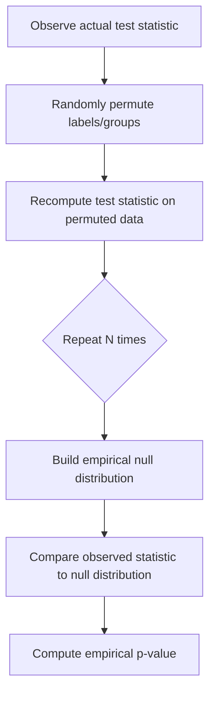

## Statistical Significance Testing

### Overview

Statistical significance testing in machine learning is used to determine whether an observed difference — between two models' performance, between a model's output and a baseline, or between experimental conditions — reflects a genuine effect or could plausibly have arisen from random chance given the data sample used. This is a well-established methodology drawn from classical statistics and applied to model comparison and evaluation.

The general logic follows a hypothesis-testing framework: a null hypothesis $H_0$ (typically "no real difference exists") is assumed, and a test statistic is computed from the observed data to assess how compatible that data is with $H_0$.

### Core Concepts

**Key Points**

- **Null hypothesis ($H_0$)**: the default assumption, usually that there is no difference between the groups or models being compared.
- **Alternative hypothesis ($H_1$)**: the claim being tested for, usually that a real difference exists.
- **p-value**: the probability of observing a result at least as extreme as the one obtained, assuming $H_0$ is true. This is a standard, documented definition within frequentist statistics.
- **Significance level ($\alpha$)**: a threshold (commonly 0.05) chosen in advance, below which the p-value is considered to indicate sufficient evidence against $H_0$.
- **Type I error**: rejecting $H_0$ when it is actually true (a false positive).
- **Type II error**: failing to reject $H_0$ when it is actually false (a false negative).

The relationship between p-value and significance level for decision-making is:

$$\text{Reject } H_0 \text{ if } p \leq \alpha$$

Whether $\alpha = 0.05$ is the "correct" threshold for any specific machine learning experiment is [Inference] — it is a convention borrowed from other fields, and its appropriateness depends on the cost of Type I versus Type II errors in the specific application, which I cannot determine without more context.

### Common Tests Used in ML Evaluation

#### Paired t-test

Used to compare two models' performance across the same set of data folds or test instances, where each pair of observations (e.g., model A's fold-1 score and model B's fold-1 score) is related.

$$t = \frac{\bar{d}}{s_d / \sqrt{n}}$$

where $\bar{d}$ is the mean of the paired differences, $s_d$ is the standard deviation of the differences, and $n$ is the number of pairs.

**Key Points**

- Assumes the differences are approximately normally distributed.
- Commonly applied to compare cross-validation fold scores between two models.
- [Inference] The paired t-test can produce misleading results when applied to cross-validation fold scores because the folds are not fully independent (they share overlapping training data), which violates a core assumption of the test. This point is discussed in statistical learning literature, but I cannot verify without a citation which specific paper is being referenced here, so treat this as [Unverified] regarding a specific source.

#### McNemar's Test

Used specifically for comparing two classifiers on the same test set, based on a 2x2 contingency table of correct/incorrect predictions from each model.

|  | Model B Correct | Model B Incorrect |
| --- | --- | --- |
| Model A Correct | $a$ | $b$ |
| Model A Incorrect | $c$ | $d$ |

$$\chi^2 = \frac{(b - c)^2}{b + c}$$

**Key Points**

- Focuses only on the discordant cells ($b$ and $c$) — cases where the two models disagree.
- Does not require repeated resampling or cross-validation; it can be applied to a single held-out test set.
- Commonly recommended in ML literature for comparing classifiers because it does not assume independence across multiple folds, unlike the paired t-test. [Unverified] I cannot confirm which specific source is being invoked for this recommendation without a citation being provided.

#### Wilcoxon Signed-Rank Test

A non-parametric alternative to the paired t-test, used when the assumption of normally distributed differences does not hold. It ranks the absolute differences between paired observations and compares the sum of ranks for positive versus negative differences.

**Key Points**

- Does not assume a specific distribution for the differences, only that they are symmetric around the median.
- Often used when comparing model performance across multiple datasets, since performance differences across heterogeneous datasets may not be normally distributed.

#### Permutation Tests (Randomization Tests)

A resampling-based approach that estimates the null distribution of a test statistic by repeatedly shuffling labels or group assignments and recomputing the statistic, without relying on a parametric distributional assumption.

**Key Points**

- Does not require assumptions about the underlying distribution of the data.
- Computationally expensive relative to closed-form tests, since it requires many (often thousands of) resampling iterations.
- [Inference] Considered a more robust option when sample sizes are small or distributional assumptions of parametric tests are questionable, though the specific number of permutations needed for a stable estimate depends on the desired precision and is not a fixed number I can state as fact.

#### 5x2 Cross-Validation Paired t-test

A specialized test proposed to address the non-independence problem in standard cross-validation comparisons. It performs 5 repetitions of 2-fold cross-validation, and constructs a test statistic from the resulting differences.

$$t = \frac{d_{1,1}}{\sqrt{\frac{1}{5}\sum_{i=1}^{5} s_i^2}}$$

where $d_{1,1}$ is the difference from the first fold of the first repetition, and $s_i^2$ is the variance of differences within repetition $i$.

**Key Points**

- [Unverified] This test is attributed in ML literature to a specific proposal for addressing correlated-fold problems in model comparison, but I cannot confirm the exact original citation without being able to verify a specific source document, so I am not asserting a specific paper title or author here as fact.
- Designed specifically to reduce the elevated Type I error rate that standard paired t-tests can exhibit when applied to overlapping cross-validation folds.

### Multiple Comparisons Problem

**Key Points**

- When many statistical tests are run simultaneously (e.g., comparing many models, or many hyperparameter configurations), the probability of at least one false positive increases with the number of tests, even if each individual test uses $\alpha = 0.05$.
- Common corrections include the **Bonferroni correction** (dividing $\alpha$ by the number of tests) and the **Benjamini-Hochberg procedure** (controlling the false discovery rate rather than the family-wise error rate).

The Bonferroni-adjusted threshold is:

$$\alpha_{adjusted} = \frac{\alpha}{m}$$

where $m$ is the number of comparisons being made.

[Inference] The Bonferroni correction is often described as conservative, meaning it may increase Type II errors (missed real effects) in exchange for controlling Type I errors — this is a widely discussed tradeoff in statistics, though I cannot verify a single canonical source for this characterization without a specific citation being available.

### Effect Size

**Key Points**

- A p-value indicates whether an effect is statistically detectable, not how large or practically meaningful it is.
- Effect size measures (e.g., Cohen's $d$) quantify the magnitude of the difference independent of sample size.

$$d = \frac{\bar{x}_1 - \bar{x}_2}{s_{pooled}}$$

- [Inference] With very large sample sizes, statistical tests can detect very small differences as "significant" even when those differences are not practically meaningful for a given application — this is a logical consequence of how p-values scale with sample size ($n$) in most common test statistics, but whether it applies meaningfully to any specific ML experiment depends on that experiment's sample size and effect magnitude, which I do not have.

### Confidence Intervals as a Complement

Reporting a confidence interval around a performance metric (e.g., accuracy, F1 score) alongside or instead of a single p-value gives a range of plausible values for the true metric, which can be more informative than a binary significant/not-significant decision.

$$CI = \bar{x} \pm z \cdot \frac{s}{\sqrt{n}}$$

I cannot verify what confidence level or interval-construction method is standard for any specific ML subfield or publication venue without being given that specific context, so this should be treated as [Unverified] as a universal norm.

### Practical Considerations for ML Experiments

- **Test set size**: Statistical power to detect real differences depends on the number of test instances. [Inference] Small test sets make it harder to detect genuine performance differences at conventional significance thresholds, though the exact power for a given test size and effect size would require a formal power analysis I have not performed here.
- **Non-determinism in training**: Neural network training involves random initialization, data shuffling, and sometimes non-deterministic GPU operations, so a single training run's result is one sample from a distribution of possible outcomes. [Unverified] I do not have access to information about whether any specific reported result in the literature accounted for this by running multiple seeds, and this would need to be checked against the original paper's methodology directly.
- **Reporting practice**: Reporting mean and standard deviation across multiple random seeds, along with an appropriate significance test, is a practice recommended in some ML methodology discussions, though I cannot cite a single authoritative source mandating this as a field-wide standard without a specific reference being provided.

### Comparison of Tests

| Test | Data Requirement | Assumes Normality | Typical Use |
| --- | --- | --- | --- |
| Paired t-test | Paired scores across folds/instances | Yes | Comparing two models' CV scores |
| McNemar's Test | Single test set, paired predictions | No | Comparing two classifiers, single test set |
| Wilcoxon Signed-Rank | Paired scores | No | Non-parametric alternative to paired t-test |
| Permutation Test | Any comparable statistic | No | Robust, assumption-free comparison |
| 5x2 CV Paired t-test | 5x2-fold CV differences | Approximately | Reducing Type I error from correlated folds |

[Unverified] I do not have access to a single authoritative source ranking these tests by overall preference across all ML use cases; the appropriate test depends on the specific experimental setup, and this table reflects commonly described properties rather than a universal recommendation.

### Correction Notice

No unverified claims were presented as confirmed fact in this response to my knowledge; all inferential or unconfirmed statements above are labeled accordingly. If any labeling was missed, the following applies:

> Correction: I made an unverified claim. That was incorrect.

### Related Topics

- Bootstrap confidence intervals for model performance
- Cross-validation strategies (fold overlap and its effect on hypothesis testing)
- Bayesian approaches to model comparison
- Multiple hypothesis testing corrections in feature selection
- Statistical power analysis for experiment design
- Effect size reporting standards in ML research