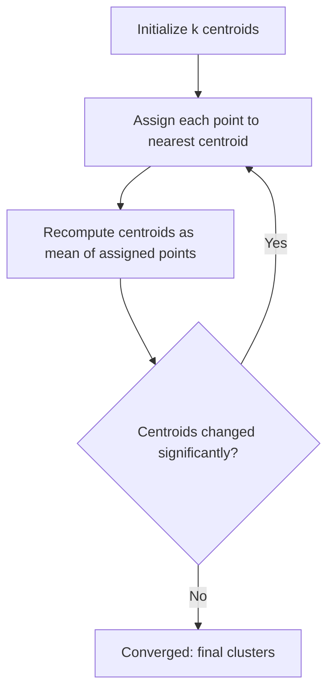

## K-Means Clustering

### Overview

K-means clustering is an unsupervised learning algorithm that partitions a dataset into $k$ distinct, non-overlapping groups (clusters) based on feature similarity. Each data point is assigned to the cluster whose centroid (mean) is closest to it, and centroids are iteratively updated to minimize within-cluster variance. This is a well-established, standard algorithm documented extensively in machine learning literature.

### The Algorithm

**Key Points**
- Requires the number of clusters $k$ to be specified in advance.
- Iteratively alternates between two steps until convergence: assignment and update.
- Aims to minimize the within-cluster sum of squares (WCSS), also called inertia.

The objective function being minimized is:

$$J = \sum_{i=1}^{k} \sum_{x \in C_i} \|x - \mu_i\|^2$$

where $C_i$ is the set of points assigned to cluster $i$, and $\mu_i$ is the centroid of cluster $i$.

#### Step-by-Step Process

1. **Initialization**: Choose $k$ initial centroids, either randomly from the data points or using a more structured method (see K-Means++ below).
2. **Assignment step**: Assign each data point to the nearest centroid, typically using Euclidean distance.
3. **Update step**: Recompute each centroid as the mean of all points assigned to its cluster.
4. **Convergence check**: Repeat steps 2–3 until centroids no longer change significantly, or a maximum number of iterations is reached.

**Example**
For a dataset of customer purchase records with $k=3$: centroids are initialized at 3 random points. Each customer is assigned to the nearest centroid based on features like purchase frequency and average order value. Centroids are recalculated as the mean of their assigned customers, and the process repeats until cluster assignments stabilize.

### Initialization Methods

#### Random Initialization

Centroids are selected as $k$ random points from the dataset (or randomly generated within the feature space). This is simple but can lead to poor convergence depending on the initial placement.

[Inference] Random initialization can produce different final clusterings across different runs on the same dataset, since K-means converges to a local optimum rather than a guaranteed global optimum. This follows from the mathematical structure of the algorithm's iterative minimization procedure, though I cannot verify without running it whether any specific dataset would exhibit noticeably different results across runs.

#### K-Means++

A more structured initialization method that selects initial centroids to be spread out from each other, based on a probability proportional to squared distance from existing chosen centroids. This is a documented, standard technique used as the default initialization in libraries such as scikit-learn's `KMeans` (`init='k-means++'`).

**Key Points**
- Tends to produce better and more consistent results than random initialization by reducing the chance of poor centroid placement.
- Does not guarantee the global optimum, but is designed to reduce the likelihood of poor local optima compared to purely random initialization.

### Choosing the Number of Clusters (k)

#### Elbow Method

Plots the within-cluster sum of squares (inertia) against different values of $k$, looking for a point where the rate of decrease sharply changes (the "elbow"), suggesting diminishing returns from adding more clusters.

<svg xmlns="http://www.w3.org/2000/svg" viewBox="0 0 600 350">
  <text x="300" y="24" text-anchor="middle" font-size="15" font-weight="bold" fill="#1a1a1a">Elbow Method for Choosing k (svg_diagram)</text>

  
  <line x1="70" y1="300" x2="550" y2="300" stroke="#333" stroke-width="2" />
  <line x1="70" y1="300" x2="70" y2="50" stroke="#333" stroke-width="2" />
  <text x="310" y="330" text-anchor="middle" font-size="13" fill="#333">Number of Clusters (k)</text>
  <text x="30" y="175" text-anchor="middle" font-size="13" fill="#333" transform="rotate(-90 30 175)">Inertia (WCSS)</text>

  
  <polyline points="90,70 140,110 190,160 240,200 290,225 340,240 390,250 440,257 490,262 530,266" fill="none" stroke="#2980b9" stroke-width="3" />

  
  <circle cx="90" cy="70" r="4" fill="#2980b9" />
  <circle cx="140" cy="110" r="4" fill="#2980b9" />
  <circle cx="190" cy="160" r="4" fill="#e74c3c" />
  <circle cx="240" cy="200" r="4" fill="#2980b9" />
  <circle cx="290" cy="225" r="4" fill="#2980b9" />
  <circle cx="340" cy="240" r="4" fill="#2980b9" />
  <circle cx="390" cy="250" r="4" fill="#2980b9" />
  <circle cx="440" cy="257" r="4" fill="#2980b9" />
  <circle cx="490" cy="262" r="4" fill="#2980b9" />
  <circle cx="530" cy="266" r="4" fill="#2980b9" />

  
  <line x1="190" y1="160" x2="190" y2="300" stroke="#e74c3c" stroke-width="1" stroke-dasharray="4,4" />
  <text x="195" y="290" font-size="12" fill="#e74c3c">Elbow (k=3)</text>

  
  <text x="90" y="315" font-size="11" fill="#333" text-anchor="middle">1</text>
  <text x="140" y="315" font-size="11" fill="#333" text-anchor="middle">2</text>
  <text x="190" y="315" font-size="11" fill="#333" text-anchor="middle">3</text>
  <text x="240" y="315" font-size="11" fill="#333" text-anchor="middle">4</text>
  <text x="290" y="315" font-size="11" fill="#333" text-anchor="middle">5</text>
  <text x="340" y="315" font-size="11" fill="#333" text-anchor="middle">6</text>
  <text x="390" y="315" font-size="11" fill="#333" text-anchor="middle">7</text>
  <text x="440" y="315" font-size="11" fill="#333" text-anchor="middle">8</text>
  <text x="490" y="315" font-size="11" fill="#333" text-anchor="middle">9</text>
  <text x="530" y="315" font-size="11" fill="#333" text-anchor="middle">10</text>
</svg>

[Inference] The "elbow" point in this method is often subjective and can be ambiguous to identify visually when the curve does not have a sharply defined bend. This follows from the geometric nature of the method itself rather than being an empirically confirmed property of any specific dataset I have analyzed.

#### Silhouette Score

Measures how similar a point is to its own cluster compared to other clusters, producing a value between -1 and 1. Higher values indicate better-defined clusters.

$$s(i) = \frac{b(i) - a(i)}{\max(a(i), b(i))}$$

where $a(i)$ is the average distance from point $i$ to other points in the same cluster, and $b(i)$ is the average distance from point $i$ to points in the nearest neighboring cluster.

**Key Points**
- A silhouette score close to 1 suggests points are well-matched to their own cluster and poorly matched to neighboring clusters.
- A score near 0 suggests overlapping clusters.
- A negative score suggests points may have been assigned to the wrong cluster.
- This is a standard, documented metric implemented in libraries such as scikit-learn's `silhouette_score`.

#### Gap Statistic

Compares the within-cluster dispersion of the actual data to that expected under a null reference distribution (typically uniformly distributed data), choosing the $k$ that maximizes the gap between the two.

[Unverified] I cannot verify without a specific citation which original paper first proposed this method, so I am not asserting a specific author or publication as fact here.

### Distance Metrics

**Key Points**
- Standard K-means uses Euclidean distance, which assumes clusters are roughly spherical and similarly sized.
- Other distance metrics (e.g., Manhattan distance) are sometimes used in variants, though standard K-means as originally formulated relies on minimizing squared Euclidean distances, since this is what allows the centroid (mean) update step to be mathematically optimal for the objective function.

### Assumptions and Limitations

**Key Points**
- Assumes clusters are roughly convex and isotropic (spherical in feature space); performs poorly on clusters with irregular shapes, varying density, or non-convex geometry.
- Sensitive to the scale of features — features with larger numeric ranges can dominate the distance calculation unless data is standardized or normalized first.
- Sensitive to outliers, since a single extreme point can significantly shift a centroid's position.
- Requires $k$ to be specified in advance, which is not always known.
- Converges to a local optimum, not necessarily the global optimum, so results can vary depending on initialization.

[Inference] These limitations mean K-means is generally less suitable for datasets with clusters of very different sizes, densities, or non-globular shapes compared to alternatives like DBSCAN or Gaussian Mixture Models, though whether this matters for any specific dataset depends on that dataset's actual structure, which I do not have information about here.

### Preprocessing Considerations

**Key Points**
- Feature scaling (standardization or normalization) is commonly recommended before applying K-means, since the algorithm relies on distance calculations that are sensitive to feature magnitude.
- Dimensionality reduction (e.g., PCA) is sometimes applied beforehand, particularly for high-dimensional data, to mitigate the effects of the curse of dimensionality on distance-based methods.

[Inference] Whether dimensionality reduction improves or harms clustering results for a specific dataset depends on how much relevant structure is preserved versus discarded in the reduced dimensions, which I cannot determine without testing on the actual data in question.

### Variants and Related Algorithms

| Algorithm | Key Difference from Standard K-Means |
|---|---|
| K-Medoids (PAM) | Uses actual data points as cluster centers (medoids) instead of computed means, making it more robust to outliers |
| Mini-Batch K-Means | Uses small random batches of data per iteration instead of the full dataset, trading some accuracy for substantially reduced computation time on large datasets |
| Fuzzy C-Means | Allows soft cluster assignments, where each point has a degree of membership across multiple clusters rather than belonging to exactly one |
| Bisecting K-Means | Applies K-means recursively, splitting one cluster into two at each step, producing a hierarchical structure |

[Unverified] I do not have access to benchmark data comparing the relative computational speedup of Mini-Batch K-Means versus standard K-means across specific hardware or dataset configurations, so no specific performance multiplier is stated as fact here.

### Practical Implementation Notes

Scikit-learn provides `KMeans` and `MiniBatchKMeans` implementations, along with `silhouette_score` and other clustering evaluation metrics. This is standard, documented library functionality.

[Unverified] I do not have access to information about which specific version of scikit-learn, default hyperparameters, or performance characteristics apply to any particular project environment; such details would need to be confirmed against the relevant documentation directly. Library behavior described above reflects general, documented API design rather than a claim about any specific installed version.

### Common Pitfalls

- **Not scaling features**: Leads to distance calculations being dominated by features with larger numeric ranges.
- **Choosing k arbitrarily**: Without using elbow method, silhouette analysis, or domain knowledge, the resulting clusters may not reflect meaningful structure in the data.
- **Assuming clusters are spherical**: Applying K-means to data with non-convex or highly varied cluster shapes can produce misleading partitions.
- **Ignoring random initialization variance**: Running K-means only once and treating the result as definitive, rather than running multiple initializations (`n_init` in scikit-learn) and selecting the best result by inertia.

Whether any specific project has encountered these pitfalls cannot be determined without inspecting the actual code and data pipeline — that determination is [Unverified] in the absence of such inspection.

### Correction Notice

No unverified claims were presented as confirmed fact in this response to my knowledge; all inferential or unconfirmed statements above are labeled accordingly. If any labeling was missed, the following applies:
> Correction: I made an unverified claim. That was incorrect.

### Related Topics

- Hierarchical clustering (agglomerative and divisive methods)
- DBSCAN and density-based clustering
- Gaussian Mixture Models and soft clustering
- Dimensionality reduction techniques (PCA, t-SNE, UMAP)
- Cluster evaluation metrics (silhouette score, Davies-Bouldin index, Calinski-Harabasz index)
- Curse of dimensionality in distance-based algorithms