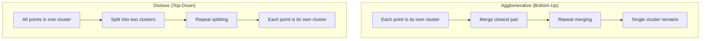

## Hierarchical Clustering

### Overview

Hierarchical clustering is an unsupervised learning method that builds a hierarchy of clusters, represented as a tree structure called a dendrogram, rather than producing a single flat partition of the data. This allows examination of clustering structure at multiple levels of granularity simultaneously. This is a well-established, standard method documented extensively in machine learning and statistics literature.

### Two Main Approaches

**Key Points**
- **Agglomerative (bottom-up)**: Starts with each data point as its own cluster, then repeatedly merges the closest pair of clusters until a single cluster remains (or a stopping criterion is met).
- **Divisive (top-down)**: Starts with all data points in a single cluster, then recursively splits clusters until each point is its own cluster (or a stopping criterion is met).

Agglomerative approaches are far more commonly used in practice and implemented in standard libraries; divisive approaches are computationally more expensive in general, since they require considering all possible ways to split a cluster at each step.

### Agglomerative Clustering: Step-by-Step

1. **Initialization**: Treat each data point as a single cluster.
2. **Distance computation**: Compute pairwise distances between all clusters.
3. **Merge step**: Merge the two closest clusters into one.
4. **Update**: Recompute distances between the new cluster and all remaining clusters.
5. **Repeat**: Continue steps 3–4 until only one cluster remains, recording each merge and the distance at which it occurred.

The sequence of merges and their distances is what constructs the dendrogram.

### Linkage Criteria

Linkage criteria define how the distance between two clusters (as opposed to two individual points) is computed, and this choice significantly affects the resulting cluster shapes.

#### Single Linkage

$$d(A, B) = \min_{a \in A, b \in B} \|a - b\|$$

Distance between two clusters is defined as the minimum distance between any pair of points, one from each cluster.

**Key Points**
- Can produce elongated, chain-like clusters, a phenomenon commonly referred to as "chaining" in clustering literature.
- Capable of identifying non-elliptical, irregularly shaped clusters that other linkage methods may struggle with.

#### Complete Linkage

$$d(A, B) = \max_{a \in A, b \in B} \|a - b\|$$

Distance between two clusters is defined as the maximum distance between any pair of points, one from each cluster.

**Key Points**
- Tends to produce more compact, evenly sized clusters compared to single linkage.
- Less prone to chaining, but can be sensitive to outliers since a single distant point affects the maximum distance calculation.

#### Average Linkage (UPGMA)

$$d(A, B) = \frac{1}{|A||B|} \sum_{a \in A} \sum_{b \in B} \|a - b\|$$

Distance between two clusters is defined as the average distance across all pairs of points between the two clusters.

**Key Points**
- Represents a compromise between single and complete linkage in terms of cluster shape and compactness.

#### Ward's Linkage

Merges the pair of clusters that results in the minimum increase in total within-cluster variance (sum of squared distances from each point to its cluster's centroid).

**Key Points**
- Tends to produce clusters of relatively similar size.
- Commonly used as a default in practice, and is the default linkage method in scikit-learn's `AgglomerativeClustering`. This is documented, standard library behavior.
- [Inference] Ward's linkage often performs well on data with roughly globular cluster structure, similar to the assumptions underlying K-means, though whether it is the best choice for any specific dataset depends on that dataset's actual structure, which I cannot determine without testing on the data itself.

### The Dendrogram

A dendrogram visualizes the full merge history: the x-axis (or y-axis, depending on orientation) represents individual data points or clusters, and the height at which two branches join represents the distance (or dissimility) at which those two clusters were merged.

<svg xmlns="http://www.w3.org/2000/svg" viewBox="0 0 620 340">
  <text x="310" y="24" text-anchor="middle" font-size="15" font-weight="bold" fill="#1a1a1a">Dendrogram Structure (svg_diagram)</text>

  
  <circle cx="90" cy="280" r="4" fill="#2980b9" />
  <circle cx="150" cy="280" r="4" fill="#2980b9" />
  <circle cx="210" cy="280" r="4" fill="#2980b9" />
  <circle cx="270" cy="280" r="4" fill="#2980b9" />
  <circle cx="350" cy="280" r="4" fill="#2980b9" />
  <circle cx="410" cy="280" r="4" fill="#2980b9" />
  <circle cx="470" cy="280" r="4" fill="#2980b9" />
  <circle cx="530" cy="280" r="4" fill="#2980b9" />

  <text x="90" y="300" font-size="11" text-anchor="middle" fill="#333">A</text>
  <text x="150" y="300" font-size="11" text-anchor="middle" fill="#333">B</text>
  <text x="210" y="300" font-size="11" text-anchor="middle" fill="#333">C</text>
  <text x="270" y="300" font-size="11" text-anchor="middle" fill="#333">D</text>
  <text x="350" y="300" font-size="11" text-anchor="middle" fill="#333">E</text>
  <text x="410" y="300" font-size="11" text-anchor="middle" fill="#333">F</text>
  <text x="470" y="300" font-size="11" text-anchor="middle" fill="#333">G</text>
  <text x="530" y="300" font-size="11" text-anchor="middle" fill="#333">H</text>

  
  <path d="M90,280 L90,240 L150,240 L150,280" fill="none" stroke="#333" stroke-width="2" />
  <path d="M210,280 L210,220 L270,220 L270,280" fill="none" stroke="#333" stroke-width="2" />
  <path d="M350,280 L350,235 L410,235 L410,280" fill="none" stroke="#333" stroke-width="2" />
  <path d="M470,280 L470,245 L530,245 L530,280" fill="none" stroke="#333" stroke-width="2" />

  
  <path d="M120,240 L120,180 L240,180 L240,220" fill="none" stroke="#333" stroke-width="2" />
  <path d="M380,235 L380,160 L500,160 L500,245" fill="none" stroke="#333" stroke-width="2" />

  
  <path d="M180,180 L180,90 L440,90 L440,160" fill="none" stroke="#333" stroke-width="2" />

  
  <line x1="50" y1="280" x2="50" y2="70" stroke="#333" stroke-width="1.5" />
  <text x="25" y="180" font-size="12" fill="#333" text-anchor="middle" transform="rotate(-90 25 180)">Distance</text>

  
  <line x1="50" y1="200" x2="560" y2="200" stroke="#e74c3c" stroke-width="1.5" stroke-dasharray="6,4" />
  <text x="565" y="204" font-size="11" fill="#e74c3c">cut → 3 clusters</text>
</svg>

**Key Points**
- Cutting the dendrogram horizontally at a chosen height produces a flat clustering with a specific number of clusters — a lower cut yields more, smaller clusters, while a higher cut yields fewer, larger clusters.
- The height of a merge is often interpreted as an indicator of how dissimilar the merged clusters were; large jumps in merge height are sometimes used as a visual heuristic for choosing where to cut. [Inference] This visual heuristic can be ambiguous when merge heights change gradually rather than showing a clear large jump, which follows from the geometric nature of the dendrogram itself.

**Example**
For 8 data points (A–H) as shown above, cutting the dendrogram at a specific distance threshold produces 3 clusters: {A, B}, {C, D, E, F}, {G, H} — the exact groupings depend on where the cut is made and the linkage method used to build the tree.

### Distance Metrics

**Key Points**
- Euclidean distance is the most commonly used metric, but hierarchical clustering can work with any valid distance or dissimilarity measure, including Manhattan distance, cosine distance, or precomputed custom distance matrices.
- This flexibility is one advantage over K-means, which is mathematically tied to Euclidean distance through its centroid-based update step.

### Choosing the Number of Clusters

**Key Points**
- Unlike K-means, hierarchical clustering does not require specifying the number of clusters $k$ in advance — the full dendrogram is built regardless, and $k$ is chosen afterward by deciding where to cut the tree.
- Common approaches to choosing a cut point include visual inspection of the dendrogram for large merge-height gaps, using domain knowledge about an expected number of groups, or applying quantitative metrics such as the silhouette score at various cut levels.

[Inference] Silhouette score can be computed for hierarchical clustering results at different cut levels in the same way it is computed for K-means results, since the metric only depends on the final cluster assignments and not on how those assignments were produced. This follows from the mathematical definition of the silhouette score itself.

### Computational Complexity

**Key Points**
- Standard agglomerative clustering has a time complexity of roughly $O(n^3)$ in naive implementations and $O(n^2 \log n)$ with optimized approaches, where $n$ is the number of data points.
- Space complexity is typically $O(n^2)$ due to the need to store a pairwise distance matrix.
- [Inference] This makes hierarchical clustering considerably less scalable to very large datasets compared to K-means, which scales roughly linearly with $n$ per iteration. Whether this difference matters in practice for a specific dataset size depends on available computational resources, which I do not have information about here.

### Assumptions and Limitations

**Key Points**
- Does not assume clusters are spherical or similarly sized in the same way K-means does, particularly with single or average linkage, making it more flexible for irregular cluster shapes.
- Sensitive to the choice of linkage method and distance metric — different combinations can produce substantially different dendrograms from the same data.
- Once a merge or split decision is made, it cannot be undone in the standard algorithm, meaning early mistakes in the merge sequence propagate through the rest of the hierarchy.
- Computationally expensive for large datasets due to the pairwise distance matrix requirement described above.

### Preprocessing Considerations

**Key Points**
- Feature scaling is commonly recommended before applying hierarchical clustering when using Euclidean or Manhattan distance, since these metrics are sensitive to the relative scale of features.
- Outliers can distort the dendrogram structure, particularly with single or complete linkage, since both are directly influenced by extreme pairwise distances.

### Comparison with K-Means

| Aspect | Hierarchical Clustering | K-Means |
|---|---|---|
| Number of clusters | Chosen after building full tree | Must be specified in advance |
| Cluster shape assumption | Flexible, depends on linkage | Assumes roughly spherical clusters |
| Scalability | Less scalable ($O(n^2)$ or worse) | More scalable (roughly linear per iteration) |
| Determinism | Deterministic given data, metric, and linkage | Sensitive to random initialization |
| Output | Full hierarchy (dendrogram) | Single flat partition |

[Unverified] I do not have access to specific benchmark comparisons of runtime between hierarchical clustering and K-means on any particular dataset size or hardware configuration, so no specific performance multiplier is stated as fact here.

### Practical Implementation Notes

Scikit-learn provides `AgglomerativeClustering` for agglomerative hierarchical clustering, and `scipy.cluster.hierarchy` provides dendrogram construction and visualization tools (`linkage`, `dendrogram`, `fcluster`). This is standard, documented library functionality.

I do not have access to information about which specific version of scikit-learn or scipy, default hyperparameters, or performance characteristics apply to any particular project environment; such details would need to be confirmed against the relevant documentation directly.

### Common Pitfalls

- **Not scaling features**: Distorts distance calculations in the same way it affects K-means and other distance-based methods.
- **Choosing an inappropriate linkage method**: Using single linkage on data prone to chaining, or complete linkage on data with outliers, without checking whether the resulting dendrogram reflects meaningful structure.
- **Applying to very large datasets without consideration of complexity**: Standard agglomerative clustering's memory and time requirements can become impractical as $n$ grows, without an appropriate approximation method or sampling strategy.
- **Over-interpreting a single dendrogram cut**: Treating one chosen cut height as definitive without validating against domain knowledge or quantitative cluster evaluation metrics.

I cannot verify whether any specific project has encountered these pitfalls without inspecting the actual code and data pipeline directly.

### Correction Notice

No unverified claims were presented as confirmed fact in this response to my knowledge; all inferential or unconfirmed statements above are labeled accordingly. If any labeling was missed, the following applies:
> Correction: I made an unverified claim. That was incorrect.

### Related Topics

- K-means clustering and centroid-based methods
- DBSCAN and density-based clustering
- Cluster evaluation metrics (silhouette score, Davies-Bouldin index, Calinski-Harabasz index)
- Distance and dissimilarity metrics for clustering
- Dendrogram cutting heuristics and cophenetic correlation
- Scalable approximations for hierarchical clustering on large datasets