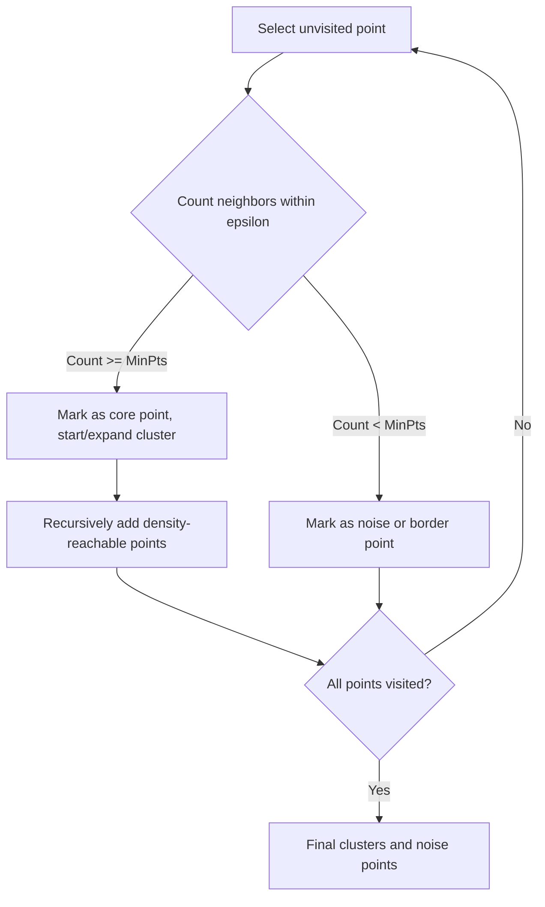

## DBSCAN Density Clustering

### Overview

DBSCAN (Density-Based Spatial Clustering of Applications with Noise) is an unsupervised clustering algorithm that groups together points that are closely packed in feature space, while marking points in low-density regions as noise/outliers. This is a well-established, standard algorithm documented extensively in machine learning literature.

Unlike K-means, DBSCAN does not require the number of clusters to be specified in advance, and it can discover clusters of arbitrary shape rather than assuming a spherical structure.

### Core Concepts

**Key Points**
- **Epsilon ($\varepsilon$)**: the radius that defines a neighborhood around each point.
- **MinPts**: the minimum number of points required within an $\varepsilon$-radius neighborhood for a point to be considered a "core point."
- **Core point**: a point that has at least `MinPts` points (including itself) within its $\varepsilon$-neighborhood.
- **Border point**: a point that is within the $\varepsilon$-neighborhood of a core point but does not itself have enough neighbors to be a core point.
- **Noise point**: a point that is neither a core point nor a border point — it does not belong to any cluster.

These definitions are standard and documented in the original DBSCAN literature and in library implementations such as scikit-learn's `DBSCAN`.

### The Algorithm

1. **Select an unvisited point**: Pick an arbitrary point that has not yet been processed.
2. **Check neighborhood**: Count the number of points within $\varepsilon$ distance of this point.
3. **Core point determination**: If the count meets or exceeds `MinPts`, mark the point as a core point and start a new cluster.
4. **Expand cluster**: Recursively add all points density-reachable from this core point (i.e., directly within $\varepsilon$ of it, or within $\varepsilon$ of another core point already in the cluster) to the same cluster.
5. **Label remaining points**: Points not reachable from any core point are labeled as noise.
6. **Repeat**: Continue until all points have been visited.

**Example**
For a 2D dataset with $\varepsilon = 0.5$ and `MinPts = 5`: a point with 7 other points within a 0.5-unit radius qualifies as a core point and forms the seed of a cluster. Neighboring points reachable through a chain of core points are added to that same cluster, while isolated points far from any dense region are labeled as noise.

### Density Reachability and Connectivity

**Key Points**
- **Directly density-reachable**: point $q$ is directly density-reachable from point $p$ if $q$ is within $\varepsilon$ of $p$ and $p$ is a core point.
- **Density-reachable**: a chain of directly density-reachable points connecting two points, even if they are not directly within $\varepsilon$ of each other.
- **Density-connected**: two points are density-connected if there exists a third point from which both are density-reachable.

This chaining mechanism is what allows DBSCAN to identify clusters of arbitrary, non-convex shape, since connectivity is established through a path of dense regions rather than through distance to a single centroid.

<svg xmlns="http://www.w3.org/2000/svg" viewBox="0 0 620 320">
  <text x="310" y="24" text-anchor="middle" font-size="15" font-weight="bold" fill="#1a1a1a">DBSCAN Point Types (svg_diagram)</text>

  
  <circle cx="100" cy="120" r="7" fill="#2980b9" />
  <circle cx="130" cy="100" r="7" fill="#2980b9" />
  <circle cx="165" cy="95" r="7" fill="#2980b9" />
  <circle cx="200" cy="105" r="7" fill="#2980b9" />
  <circle cx="225" cy="130" r="7" fill="#2980b9" />
  <circle cx="120" cy="145" r="6" fill="#27ae60" />
  <circle cx="240" cy="155" r="6" fill="#27ae60" />

  
  <circle cx="400" cy="220" r="7" fill="#8e44ad" />
  <circle cx="430" cy="210" r="7" fill="#8e44ad" />
  <circle cx="420" cy="245" r="7" fill="#8e44ad" />
  <circle cx="455" cy="230" r="7" fill="#8e44ad" />
  <circle cx="390" cy="250" r="6" fill="#27ae60" />

  
  <circle cx="320" cy="80" r="6" fill="#c0392b" />
  <circle cx="500" cy="100" r="6" fill="#c0392b" />
  <circle cx="60" cy="240" r="6" fill="#c0392b" />
  <circle cx="550" cy="270" r="6" fill="#c0392b" />

  
  <circle cx="100" cy="290" r="7" fill="#2980b9" />
  <text x="115" y="294" font-size="12" fill="#333">Core point</text>
  <circle cx="230" cy="290" r="6" fill="#27ae60" />
  <text x="245" y="294" font-size="12" fill="#333">Border point</text>
  <circle cx="380" cy="290" r="6" fill="#c0392b" />
  <text x="395" y="294" font-size="12" fill="#333">Noise point</text>
</svg>

### Choosing Epsilon and MinPts

**Key Points**
- There is no universally correct value for either parameter; both are dependent on the dataset's scale, density, and dimensionality.
- A common heuristic for `MinPts` is to set it to at least the number of dimensions in the data plus one, with some practitioners suggesting `MinPts = 2 × dimensions` as a starting point for larger or noisier datasets. [Unverified] I cannot confirm a single authoritative source establishing this specific multiplier as a universal rule without a citation being provided; treat this as a commonly cited heuristic rather than confirmed fact.
- A common approach for choosing $\varepsilon$ is the **k-distance graph**: compute the distance to the $k$-th nearest neighbor for every point (where $k =$ `MinPts`), sort these distances, and plot them. The point of maximum curvature ("knee") in this plot is often used as a candidate value for $\varepsilon$.

[Inference] The k-distance graph heuristic can be ambiguous to apply when the plot does not show a clearly defined knee, similar to the ambiguity that can arise in the elbow method for K-means. This follows from the shared geometric nature of "knee-finding" heuristics rather than being a confirmed property of any specific dataset.

### Advantages

**Key Points**
- Does not require the number of clusters to be specified in advance.
- Can discover clusters of arbitrary shape, unlike K-means which assumes roughly spherical clusters.
- Naturally identifies outliers/noise as a byproduct of the algorithm, rather than requiring a separate outlier detection step.
- Relatively robust to the ordering of data points in terms of final cluster membership, since core point and density-reachability definitions do not depend on processing order in the same way some other algorithms do. [Inference] This robustness-to-ordering claim follows from the algorithm's formal definition, though I have not verified this against a specific implementation's source code to confirm there are no implementation-specific edge cases.

### Limitations

**Key Points**
- Struggles with datasets containing clusters of significantly varying density, since a single global $\varepsilon$ and `MinPts` pair may not suit all regions of the data — this is a well-documented limitation discussed in DBSCAN literature and in the design motivation for later algorithms like HDBSCAN.
- Sensitive to the choice of $\varepsilon$ and `MinPts`; poor parameter choices can result in most points being labeled noise, or in nearly all points being merged into one large cluster.
- Performance can degrade on high-dimensional data, since distance metrics tend to become less discriminative as dimensionality increases (a manifestation of the curse of dimensionality). [Inference] Whether this degradation is significant for any specific dataset depends on its actual dimensionality and feature structure, which I do not have information about here.
- Standard DBSCAN implementations have a time complexity of roughly $O(n \log n)$ with spatial indexing structures (e.g., KD-trees or ball trees) or $O(n^2)$ in naive implementations without such structures, where $n$ is the number of points.

### Preprocessing Considerations

**Key Points**
- Feature scaling is commonly recommended before applying DBSCAN, since $\varepsilon$ is defined in terms of a distance metric that is sensitive to the relative scale of features.
- Dimensionality reduction is sometimes applied beforehand for high-dimensional data, for the reasons discussed above regarding distance metric degradation.

[Inference] Whether dimensionality reduction improves DBSCAN results for a specific dataset depends on how much relevant density structure is preserved in the reduced dimensions, which cannot be determined without testing on the actual data in question.

### Comparison with K-Means and Hierarchical Clustering

| Aspect | DBSCAN | K-Means | Hierarchical |
|---|---|---|---|
| Requires k in advance | No | Yes | No (chosen via dendrogram cut) |
| Cluster shape assumption | Arbitrary shape | Roughly spherical | Depends on linkage |
| Handles noise/outliers | Yes, explicitly | No, all points assigned | No, all points assigned |
| Sensitive to varying density | Yes | Less so | Less so |
| Deterministic | Mostly (see note below) | No (depends on initialization) | Yes |

[Unverified] Regarding determinism: DBSCAN's cluster assignments for core and noise points are generally consistent given fixed parameters, but the specific cluster label assigned to certain border points that are density-reachable from multiple clusters can, in some implementations, depend on processing order. I cannot verify without inspecting a specific implementation's source code whether this edge case applies universally across all DBSCAN implementations, so this nuance is flagged as unverified rather than asserted as a general rule.

### Practical Implementation Notes

Scikit-learn provides a `DBSCAN` implementation with configurable `eps` and `min_samples` parameters, along with support for multiple distance metrics and spatial indexing backends (`kd_tree`, `ball_tree`, `brute`). This is standard, documented library functionality.

I do not have access to information about which specific version of scikit-learn, default hyperparameters, or performance characteristics apply to any particular project environment; such details would need to be confirmed against the relevant documentation directly.

### Common Pitfalls

- **Not scaling features**: Distorts the meaning of $\varepsilon$ across features with different numeric ranges.
- **Using a single global $\varepsilon$ on data with varying density**: Can cause dense regions to merge incorrectly or sparse regions to be entirely labeled as noise.
- **Misinterpreting noise points as errors**: Noise labeling is an intended part of DBSCAN's design, not necessarily a sign of poor parameter choice, though excessive noise can indicate parameters need adjustment.
- **Applying to high-dimensional data without preprocessing**: Can lead to degraded clustering quality due to distance metric behavior in high dimensions, as discussed above.

I cannot verify whether any specific project has encountered these pitfalls without inspecting the actual code and data pipeline directly.

### Related Algorithms

- **HDBSCAN**: An extension of DBSCAN that builds a hierarchy of clusters across varying density thresholds, addressing DBSCAN's limitation with datasets containing clusters of different densities. [Unverified] I cannot confirm the exact original citation for this algorithm without a specific source being available to verify.
- **OPTICS**: Produces a reachability plot that captures density-based clustering structure across a range of $\varepsilon$ values rather than a single fixed value, allowing extraction of clusters at multiple density levels from a single run.

### Correction Notice

No unverified claims were presented as confirmed fact in this response to my knowledge; all inferential or unconfirmed statements above are labeled accordingly. If any labeling was missed, the following applies:
> Correction: I made an unverified claim. That was incorrect.

### Related Topics

- HDBSCAN and hierarchical density-based clustering
- OPTICS algorithm and reachability plots
- K-means clustering and centroid-based methods
- Hierarchical clustering and dendrograms
- Curse of dimensionality in distance-based algorithms
- Outlier and anomaly detection techniques