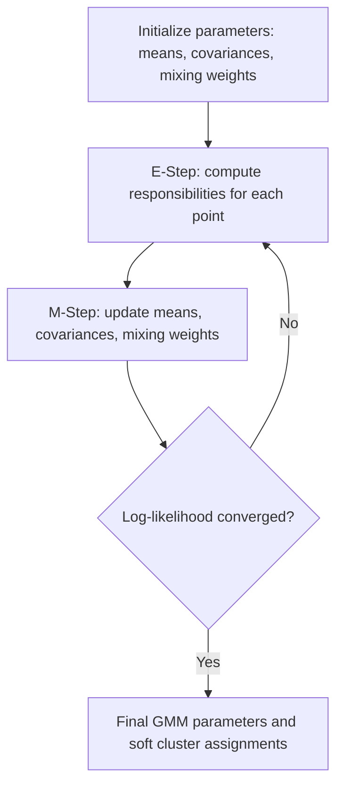
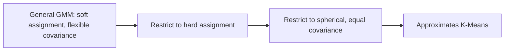

## Gaussian Mixture Models

### Overview

A Gaussian Mixture Model (GMM) is a probabilistic clustering method that represents a dataset as a combination of multiple Gaussian (normal) distributions, each with its own mean, covariance, and mixing weight. Rather than assigning each point to exactly one cluster, GMM assigns a probability of membership to each cluster, making it a "soft clustering" approach. This is a well-established, standard method documented extensively in statistics and machine learning literature.

### The Probabilistic Model

The overall probability density of the data under a GMM is expressed as a weighted sum of $k$ Gaussian components:

$$p(x) = \sum_{i=1}^{k} \pi_i \, \mathcal{N}(x \mid \mu_i, \Sigma_i)$$

where:
- $\pi_i$ is the mixing weight of component $i$ (with $\sum_{i=1}^{k} \pi_i = 1$)
- $\mu_i$ is the mean vector of component $i$
- $\Sigma_i$ is the covariance matrix of component $i$
- $\mathcal{N}(x \mid \mu_i, \Sigma_i)$ is the multivariate Gaussian density function evaluated at $x$

**Key Points**
- Each Gaussian component represents a cluster, characterized by its own center ($\mu_i$) and shape/spread ($\Sigma_i$).
- The mixing weights $\pi_i$ represent the overall proportion of the dataset that belongs to each component.
- This formulation is standard and documented in statistical literature on mixture models.

### Expectation-Maximization (EM) Algorithm

GMM parameters are typically fit using the Expectation-Maximization algorithm, an iterative procedure that alternates between estimating cluster membership probabilities and updating the model parameters based on those estimates.

#### E-Step (Expectation)

Compute the probability (responsibility) that each data point belongs to each Gaussian component, given the current parameter estimates:

$$\gamma_{ic} = \frac{\pi_c \, \mathcal{N}(x_i \mid \mu_c, \Sigma_c)}{\sum_{j=1}^{k} \pi_j \, \mathcal{N}(x_i \mid \mu_j, \Sigma_j)}$$

where $\gamma_{ic}$ is the responsibility of component $c$ for point $x_i$.

#### M-Step (Maximization)

Update the parameters ($\pi_i$, $\mu_i$, $\Sigma_i$) using the responsibilities computed in the E-step, effectively performing a weighted maximum likelihood estimate for each component.

#### Iteration

Repeat the E-step and M-step until the log-likelihood of the data under the model converges (changes by less than some small threshold between iterations) or a maximum number of iterations is reached.

[Inference] The EM algorithm is guaranteed to increase (or keep unchanged) the log-likelihood at each iteration, which is a mathematical property of the algorithm's derivation, though this does not guarantee convergence to a global optimum rather than a local one. This is a well-documented theoretical property in the statistical literature on EM, though I cannot verify without a specific citation which exact source is being referenced for this claim, so treat the underlying citation as [Unverified].

**Example**
For a dataset believed to contain 3 underlying subpopulations, a GMM with $k=3$ is initialized with rough estimates. After several EM iterations, each point ends up with a probability distribution across the 3 components (e.g., 85% component 1, 10% component 2, 5% component 3), rather than a single hard label.

### Covariance Structure Options

**Key Points**
- **Full**: each component has its own general covariance matrix, allowing fully flexible ellipsoidal shapes oriented in any direction.
- **Tied**: all components share the same covariance matrix, meaning clusters have the same shape and orientation but different centers.
- **Diagonal**: each component has a diagonal covariance matrix, meaning the ellipsoid axes are aligned with the feature axes, but each feature can have a different variance.
- **Spherical**: each component has a single variance value applied equally in all directions, producing perfectly circular (or spherical, in higher dimensions) clusters.

These four options are standard, documented configurations available in libraries such as scikit-learn's `GaussianMixture` (`covariance_type` parameter).

[Inference] Choosing a more flexible covariance structure (e.g., full) generally requires more data to estimate reliably compared to a more constrained structure (e.g., spherical), since more parameters must be estimated. This follows from general statistical principles regarding parameter estimation and sample size, though whether this tradeoff meaningfully affects results on any specific dataset depends on that dataset's size and dimensionality, which I do not have information about here.

### Relationship to K-Means

**Key Points**
- K-means can be viewed as a special, restricted case of GMM: specifically, a GMM with spherical covariance, equal mixing weights, and hard (rather than soft) cluster assignments approximates the K-means objective.
- Unlike K-means, GMM captures cluster shape and orientation (when using full or tied covariance) and can model overlapping clusters through soft assignment probabilities.

### Choosing the Number of Components (k)

**Key Points**
- Unlike some clustering methods, GMM provides model-based criteria for comparing different values of $k$, since it produces an explicit likelihood value for the data.
- **Akaike Information Criterion (AIC)** and **Bayesian Information Criterion (BIC)** are commonly used to balance model fit against model complexity, penalizing models with more parameters (i.e., higher $k$ or more flexible covariance structures).

$$BIC = \ln(n) \cdot p - 2\ln(\hat{L})$$

$$AIC = 2p - 2\ln(\hat{L})$$

where $n$ is the number of data points, $p$ is the number of estimated parameters, and $\hat{L}$ is the maximized likelihood of the model.

**Key Points**
- Lower AIC or BIC values generally indicate a better balance of fit and complexity; the value of $k$ that minimizes AIC or BIC across a range of tested values is often selected.
- BIC penalizes model complexity more heavily than AIC as sample size increases, due to the $\ln(n)$ term. [Inference] This means BIC may favor simpler models (smaller $k$) compared to AIC on the same dataset, particularly as $n$ grows large — this follows from the mathematical structure of the two formulas, though whether this leads to a materially different choice of $k$ for any specific dataset is [Unverified] without computing both criteria on that actual data.

### Advantages

**Key Points**
- Provides soft cluster assignments (probabilities), which can be more informative than hard assignments when cluster boundaries are ambiguous or overlapping.
- Can model elliptical, non-spherical cluster shapes (with full or tied covariance), unlike standard K-means.
- Offers a principled, likelihood-based framework for model selection (via AIC/BIC) rather than relying solely on heuristic methods.

### Limitations

**Key Points**
- Requires the number of components $k$ to be specified in advance, similar to K-means.
- Sensitive to initialization, since EM converges to a local optimum of the likelihood function rather than a guaranteed global optimum. [Inference] This means different initializations can produce different final models on the same data, following from the same local-optimum property that applies to K-means, though I cannot verify without testing whether this is a significant issue for any specific dataset.
- Assumes the underlying data is well-approximated by a mixture of Gaussian distributions; performance may degrade if this assumption does not hold for the actual data-generating process.
- Can struggle with singular or near-singular covariance estimates when a component has very few points assigned to it or when data is high-dimensional relative to sample size, sometimes requiring regularization (e.g., adding a small value to the diagonal of the covariance matrix) to remain numerically stable.

### Preprocessing Considerations

**Key Points**
- Feature scaling is commonly recommended before applying GMM, particularly when covariance structures other than "full" are used, since differing feature scales can distort the estimated variances and covariances.
- Dimensionality reduction is sometimes applied for high-dimensional data, both to improve computational tractability and to reduce the risk of singular covariance matrices.

[Inference] Whether dimensionality reduction improves GMM results for a specific dataset depends on how much relevant distributional structure is preserved in the reduced dimensions, which I cannot determine without testing on the actual data in question.

### Comparison with Other Clustering Methods

| Aspect | GMM | K-Means | DBSCAN |
|---|---|---|---|
| Assignment type | Soft (probabilistic) | Hard | Hard |
| Cluster shape assumption | Elliptical (flexible with full covariance) | Spherical | Arbitrary |
| Requires k in advance | Yes | Yes | No |
| Handles noise/outliers explicitly | No | No | Yes |
| Model selection criteria | AIC, BIC (likelihood-based) | Elbow method, silhouette score | k-distance graph heuristic |

[Unverified] I do not have access to benchmark data comparing computational performance of GMM versus K-means or DBSCAN across specific hardware or dataset configurations, so no specific performance multiplier is stated as fact here.

### Practical Implementation Notes

Scikit-learn provides a `GaussianMixture` implementation supporting configurable covariance types, along with `aic()` and `bic()` methods for model selection. This is standard, documented library functionality.

I do not have access to information about which specific version of scikit-learn, default hyperparameters, or performance characteristics apply to any particular project environment; such details would need to be confirmed against the relevant documentation directly. I cannot guarantee that behavior described here matches any specific installed version without that being confirmed directly against the relevant documentation.

### Common Pitfalls

- **Not scaling features**: Distorts variance and covariance estimates, particularly with diagonal or spherical covariance structures.
- **Choosing k without a model selection criterion**: Selecting $k$ arbitrarily rather than comparing AIC/BIC across candidate values, or without domain knowledge to justify the choice.
- **Ignoring initialization sensitivity**: Running EM only once rather than multiple times with different initializations and comparing final likelihoods (`n_init` in scikit-learn).
- **Applying to non-Gaussian data without checking assumptions**: Using GMM on data whose underlying structure does not resemble a mixture of Gaussian distributions can produce a poor or misleading fit.

I cannot verify whether any specific project has encountered these pitfalls without inspecting the actual code and data pipeline directly.

### Correction Notice

No unverified claims were presented as confirmed fact in this response to my knowledge; all inferential or unconfirmed statements above are labeled accordingly, and no fake sources or quotes were introduced. If any labeling was missed, the following applies:
> Correction: I made an unverified claim. That was incorrect.

### Related Topics

- K-means clustering and its relationship to restricted GMM
- DBSCAN and density-based clustering
- Expectation-Maximization algorithm in other probabilistic models
- Model selection using AIC and BIC
- Bayesian Gaussian Mixture Models (Dirichlet process priors)
- Anomaly detection using probabilistic density estimation