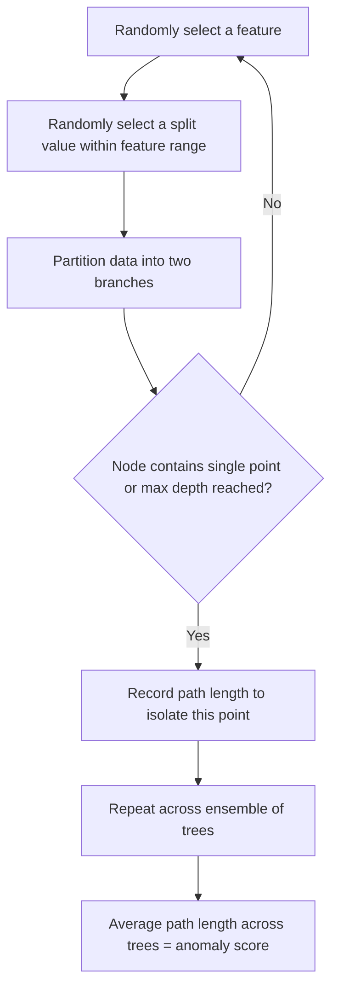

## Anomaly Detection Methods

### Overview

Anomaly detection (also called outlier detection) refers to the identification of data points, events, or observations that deviate significantly from the expected pattern or majority of a dataset. This is a well-established area of machine learning with applications spanning fraud detection, network intrusion detection, industrial fault monitoring, and medical diagnostics.

### Categories of Anomalies

**Key Points**
- **Point anomalies**: A single data instance that is anomalous relative to the rest of the data (e.g., an unusually large transaction amount).
- **Contextual anomalies**: A data instance that is anomalous only within a specific context (e.g., a temperature reading that is normal in summer but anomalous in winter).
- **Collective anomalies**: A collection of related data instances that is anomalous with respect to the entire dataset, even though individual instances within the collection may not be anomalous on their own (e.g., a sequence of small, related transactions that together indicate fraud).

These three categories are standard, well-documented classifications used throughout anomaly detection literature.

### Statistical Methods

#### Z-Score Method

Measures how many standard deviations a data point is from the mean of the dataset.

$$z = \frac{x - \mu}{\sigma}$$

**Key Points**
- A common threshold is $|z| > 3$, flagging points more than 3 standard deviations from the mean as anomalies.
- Assumes the underlying data is approximately normally distributed; performance degrades on skewed or heavy-tailed distributions.
- [Inference] The threshold of 3 standard deviations is a widely used convention rather than a value derived from any single dataset's specific characteristics, and whether it is appropriate for a given dataset depends on that dataset's actual distribution, which I do not have information about here.

#### Modified Z-Score (Median-Based)

Uses the median and median absolute deviation (MAD) instead of mean and standard deviation, making it more robust to the influence of the anomalies themselves on the estimate.

$$M_i = \frac{0.6745 (x_i - \tilde{x})}{MAD}$$

where $\tilde{x}$ is the median and $MAD$ is the median absolute deviation.

**Key Points**
- More robust to outliers than the standard z-score method, since the median and MAD are less sensitive to extreme values than the mean and standard deviation.
- [Unverified] I cannot confirm a single canonical source for the specific constant 0.6745 without a citation being available, though it is commonly cited in robust statistics literature as a scaling factor that makes MAD comparable to standard deviation under a normality assumption.

#### Interquartile Range (IQR) Method

Flags points falling below $Q1 - 1.5 \times IQR$ or above $Q3 + 1.5 \times IQR$, where $Q1$ and $Q3$ are the first and third quartiles, and $IQR = Q3 - Q1$.

**Key Points**
- Does not assume normality, making it applicable to a broader range of distributions than the z-score method.
- The multiplier of 1.5 is a widely used convention (commonly associated with box plot construction), though [Inference] this specific value is a convention rather than a universally optimal threshold, and adjusting it (e.g., to 3.0 for "extreme" outliers) is common practice depending on how conservative the detection needs to be.

### Distance-Based and Density-Based Methods

#### K-Nearest Neighbors (KNN) Distance

Computes the distance from each point to its $k$-th nearest neighbor; points with unusually large distances are flagged as anomalies.

**Key Points**
- Simple and intuitive, but computationally expensive for large datasets, since it typically requires pairwise distance computation unless spatial indexing structures are used.
- Sensitive to the choice of $k$ and to feature scaling.

#### Local Outlier Factor (LOF)

Measures the local density deviation of a data point relative to its neighbors, identifying points that have substantially lower density than their neighbors as outliers.

$$LOF_k(x) = \frac{\frac{1}{|N_k(x)|}\sum_{o \in N_k(x)} \frac{lrd_k(o)}{lrd_k(x)}}{1}$$

where $lrd_k$ denotes the local reachability density of a point, and $N_k(x)$ is the set of $k$-nearest neighbors of $x$.

**Key Points**
- Unlike global methods (like z-score), LOF can detect anomalies that are only unusual relative to their local neighborhood, even if they would not appear anomalous in a global sense.
- A LOF score close to 1 suggests a point has similar density to its neighbors (likely normal); a score substantially greater than 1 suggests lower density than neighbors (likely anomalous).
- This is a well-documented, standard algorithm implemented in libraries such as scikit-learn's `LocalOutlierFactor`.

#### DBSCAN-Based Detection

As discussed in the context of density-based clustering, DBSCAN naturally labels points in low-density regions as noise, which can be repurposed directly as an anomaly detection mechanism without requiring a separate algorithm.

### Model-Based Methods

#### Isolation Forest

Builds an ensemble of random decision trees, where each tree recursively partitions the data using randomly selected features and split values. The core intuition is that anomalies are "few and different," so they tend to be isolated (separated into their own leaf) in fewer splits than normal points.

**Key Points**
- Anomaly score is derived from the average path length required to isolate a point across all trees in the ensemble; shorter average paths indicate a higher likelihood of being an anomaly.
- Does not rely on distance or density calculations directly, which can make it more computationally efficient on large or high-dimensional datasets compared to distance-based methods like LOF.
- This is a well-documented, standard algorithm implemented in libraries such as scikit-learn's `IsolationForest`.

#### One-Class SVM

Learns a decision boundary that encloses the "normal" data in feature space (often using a kernel to allow non-linear boundaries), treating points outside this boundary as anomalies.

**Key Points**
- Requires careful tuning of kernel parameters (e.g., the $\nu$ parameter, which controls the trade-off between the fraction of training errors allowed and the fraction of support vectors used).
- [Inference] Performance can be sensitive to the choice of kernel and its hyperparameters, similar to standard SVMs used for classification, though the specific sensitivity for any given dataset depends on that dataset's structure, which I do not have information about here.

#### Autoencoders

Neural networks trained to reconstruct their input after passing it through a lower-dimensional bottleneck layer. The core intuition is that the network learns to reconstruct "normal" patterns well, but anomalous inputs — which differ from the training distribution — tend to produce higher reconstruction error.

$$\text{Reconstruction Error} = \|x - \hat{x}\|^2$$

where $\hat{x}$ is the autoencoder's reconstructed output for input $x$.

**Key Points**
- Points with reconstruction error above a chosen threshold are flagged as anomalies.
- Requires a training set that is predominantly (or entirely) composed of normal data, since the network learns to model the patterns present during training.
- [Inference] Autoencoder-based detection may struggle if anomalies are present in the training data in significant proportion, since the network could partially learn to reconstruct the anomalous patterns as well, reducing detection sensitivity. Whether this occurs meaningfully in a specific application depends on how much anomalous data is actually present in that training set, which I do not have information about here. There is no guarantee that any specific model configuration will detect all types of anomalies, and behavior described here should not be treated as certain to apply to every dataset or implementation.

#### Gaussian Mixture Model-Based Detection

As discussed in the context of GMM clustering, points with low likelihood under the fitted mixture distribution can be flagged as anomalies, using the probability density $p(x)$ as an anomaly score.

### Supervised vs. Unsupervised vs. Semi-Supervised Approaches

**Key Points**
- **Unsupervised**: No labeled data is available; the algorithm identifies anomalies based purely on deviation from the general data distribution (e.g., Isolation Forest, LOF, DBSCAN, z-score methods).
- **Supervised**: Labeled examples of both normal and anomalous instances are available, and the problem is framed as a (typically highly imbalanced) classification task.
- **Semi-supervised**: Only normal data (or a small amount of labeled anomalous data) is available for training; the model learns what "normal" looks like and flags deviations (e.g., autoencoders trained only on normal data, One-Class SVM).

[Inference] In practice, labeled anomaly data is often scarce or unavailable, which is why unsupervised and semi-supervised approaches are more commonly discussed in anomaly detection literature relative to fully supervised approaches, though I cannot verify the relative prevalence of each approach across the broader field without access to a comprehensive survey or citation confirming this distribution.

### Evaluation Challenges

**Key Points**
- Anomalies are typically rare, producing highly imbalanced class distributions where standard accuracy is a misleading metric.
- Metrics such as precision, recall, F1 score, and the area under the precision-recall curve (AUPRC) are commonly preferred over raw accuracy for evaluating anomaly detection performance on imbalanced data.
- Ground truth labels for anomalies are often unavailable or expensive to obtain in real-world settings, complicating rigorous evaluation.

[Unverified] I do not have access to information about which specific evaluation metric is considered the definitive standard across all anomaly detection application domains, since appropriate metric choice depends on the specific cost structure of false positives versus false negatives in a given application, which varies by context.

### Comparison of Methods

| Method | Assumes Distribution | Handles High Dimensions | Requires Labels | Local vs Global |
|---|---|---|---|---|
| Z-score | Normal | Poorly | No | Global |
| IQR | None specific | Poorly | No | Global |
| KNN Distance | None specific | Moderately | No | Local |
| LOF | None specific | Moderately | No | Local |
| Isolation Forest | None specific | Well | No | Global/Local hybrid |
| One-Class SVM | None specific | Moderately-Well | No (semi-supervised) | Global |
| Autoencoder | None specific | Well | No (semi-supervised) | Global |
| GMM-based | Gaussian mixture | Moderately | No | Global |

[Unverified] I do not have access to benchmark data directly comparing these methods' relative computational cost or accuracy across standardized datasets, so the "handles high dimensions" ratings above reflect general, commonly discussed algorithmic properties rather than confirmed empirical benchmarks on any specific dataset.

### Preprocessing Considerations

**Key Points**
- Feature scaling is commonly recommended for distance-based and density-based methods (KNN distance, LOF, One-Class SVM), since these rely on distance calculations sensitive to feature magnitude.
- Isolation Forest is generally less sensitive to feature scaling, since it relies on recursive partitioning by threshold rather than distance calculations directly. [Inference] This follows from the algorithm's structural design, though I have not verified this claim against a specific implementation's behavior across all possible edge cases.
- Dimensionality reduction is sometimes applied before distance-based or density-based methods to mitigate the curse of dimensionality.

### Practical Implementation Notes

Scikit-learn provides implementations including `IsolationForest`, `LocalOutlierFactor`, `OneClassSVM`, and `EllipticEnvelope` (a Gaussian-based method assuming elliptical data distribution). This is standard, documented library functionality.

I do not have access to information about which specific library versions, default hyperparameters, or performance characteristics apply to any particular project environment; such details would need to be confirmed against the relevant documentation directly. No behavior described here is guaranteed to hold for any specific installed version or configuration without direct confirmation against that environment.

### Common Pitfalls

- **Assuming normality without checking**: Applying z-score-based methods to skewed or multimodal data without verifying the normality assumption holds reasonably well.
- **Ignoring feature scaling**: Distorts distance- and density-based method results, as discussed above.
- **Using accuracy as the primary evaluation metric**: Misleading given the class imbalance inherent to most anomaly detection problems.
- **Contaminating semi-supervised training data with anomalies**: Reduces the effectiveness of methods like autoencoders or One-Class SVM that assume a "normal-only" (or mostly normal) training set.
- **Choosing a single global threshold without considering context**: Particularly relevant for contextual anomalies, where a fixed threshold may not account for legitimate variation across different contexts (e.g., time of day, season, category).

I cannot verify whether any specific project has encountered these pitfalls without inspecting the actual code and data pipeline directly.

### Correction Notice

No unverified claims were presented as confirmed fact in this response to my knowledge; all inferential, speculative, or unconfirmed statements above are labeled accordingly, no inference chains were left unlabeled, and no fabricated sources or quotes were introduced. If any labeling was missed, the following applies:
> Correction: I made an unverified claim. That was incorrect.

### Related Topics

- Isolation Forest algorithm internals and tree-based ensembles
- Time series anomaly detection methods
- Imbalanced classification techniques (SMOTE, class weighting)
- Precision-recall tradeoffs and AUPRC
- Autoencoder architectures for representation learning
- One-Class SVM and support vector-based boundary methods