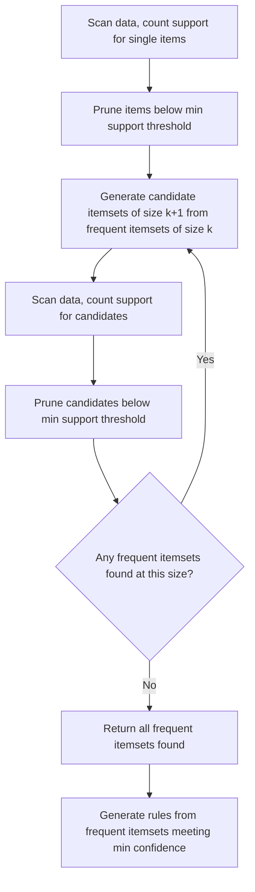
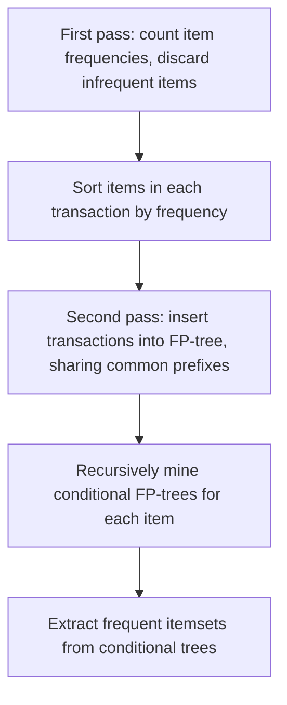

## Association Rule Learning

### Overview

Association rule learning is an unsupervised learning technique used to discover interesting relationships (rules) between variables in large datasets, most commonly applied to transactional data such as market basket analysis. This is a well-established, standard technique documented extensively in data mining and machine learning literature.

The classic motivating example is discovering that customers who purchase item A frequently also purchase item B, expressed as a rule $A \Rightarrow B$.

### Core Concepts

**Key Points**
- **Itemset**: a collection of one or more items (e.g., {bread, butter}).
- **Rule**: an implication of the form $X \Rightarrow Y$, where $X$ and $Y$ are disjoint itemsets, interpreted as "if $X$ occurs, then $Y$ tends to occur."
- **Transaction**: a single record (e.g., one customer's shopping basket) containing a set of items.
- **Frequent itemset**: an itemset that appears in transactions with a frequency at or above a specified threshold.

These definitions are standard and documented in the original association rule mining literature.

### Key Metrics

#### Support

Measures how frequently an itemset appears in the dataset.

$$\text{Support}(X) = \frac{\text{count}(X)}{N}$$

where $\text{count}(X)$ is the number of transactions containing itemset $X$, and $N$ is the total number of transactions.

**Key Points**
- Support for a rule $X \Rightarrow Y$ is typically defined as $\text{Support}(X \cup Y)$, the proportion of transactions containing both $X$ and $Y$.
- Low support means the rule applies to relatively few transactions, which can indicate the rule is either rare or potentially noise-driven.

#### Confidence

Measures how often the rule has been found to be true, i.e., the conditional probability of $Y$ given $X$.

$$\text{Confidence}(X \Rightarrow Y) = \frac{\text{Support}(X \cup Y)}{\text{Support}(X)}$$

**Key Points**
- A confidence of 0.8 means that in 80% of transactions containing $X$, $Y$ was also present.
- High confidence alone does not guarantee a meaningful or non-coincidental relationship, which is why lift (below) is often examined alongside it.

#### Lift

Measures how much more often $X$ and $Y$ occur together than would be expected if they were statistically independent.

$$\text{Lift}(X \Rightarrow Y) = \frac{\text{Support}(X \cup Y)}{\text{Support}(X) \times \text{Support}(Y)}$$

**Key Points**
- Lift $= 1$ suggests $X$ and $Y$ are independent (no meaningful association beyond chance).
- Lift $> 1$ suggests a positive association (they co-occur more than expected by chance).
- Lift $< 1$ suggests a negative association (they co-occur less than expected by chance).
- This is a standard, documented metric used to filter out rules with high confidence that are actually driven by one item's high overall frequency rather than a genuine association.

#### Conviction

A less commonly used metric that measures the ratio of the expected frequency of $X$ occurring without $Y$, assuming independence, compared to the observed frequency.

$$\text{Conviction}(X \Rightarrow Y) = \frac{1 - \text{Support}(Y)}{1 - \text{Confidence}(X \Rightarrow Y)}$$

[Unverified] I cannot confirm without a specific source how commonly this metric is used in practice relative to lift and confidence across the broader field, so this should be treated as a supplementary metric rather than a claim about its prevalence in practice.

### The Apriori Algorithm

The Apriori algorithm is the foundational method for mining frequent itemsets, based on the principle that all subsets of a frequent itemset must also be frequent (and conversely, if an itemset is infrequent, all its supersets must also be infrequent). This is referred to as the "Apriori property" or "downward closure property" in the original literature.

**Key Points**
- Iteratively builds larger frequent itemsets from smaller ones, pruning candidates early using the Apriori property to reduce the search space.
- Requires multiple passes over the dataset — one pass per itemset size level — which can be computationally expensive on large datasets with many distinct items.
- After frequent itemsets are identified, rules are generated by considering all possible ways to split each frequent itemset into an antecedent ($X$) and consequent ($Y$), retaining only those meeting a minimum confidence threshold.

**Example**
In a grocery transaction dataset, if {bread}, {butter}, and {bread, butter} all meet a minimum support threshold of 5%, and the confidence of {bread} $\Rightarrow$ {butter} is 75% (exceeding a minimum confidence threshold of 60%), the rule "customers who buy bread also buy butter" is retained as a discovered association.

### FP-Growth Algorithm

FP-Growth (Frequent Pattern Growth) is an alternative to Apriori that avoids the candidate generation step entirely by building a compressed data structure called an FP-tree, then mining frequent itemsets directly from this tree structure.

**Key Points**
- Generally more computationally efficient than Apriori for large datasets, since it requires only two passes over the data (one to count item frequencies, one to build the FP-tree) rather than one pass per itemset size level. [Inference] This efficiency advantage is a widely cited property in data mining literature comparing the two algorithms, though I cannot verify the exact magnitude of this efficiency difference for any specific dataset without benchmarking on that actual data.
- The FP-tree structure compresses the dataset by sharing common prefixes among transactions, which can substantially reduce memory requirements relative to storing all candidate itemsets explicitly, though the degree of compression depends on how much overlap exists between transactions in the specific dataset.

### Comparison of Apriori and FP-Growth

| Aspect | Apriori | FP-Growth |
|---|---|---|
| Candidate generation | Explicit, generates and tests candidates | None, mines tree structure directly |
| Data passes required | One per itemset size level | Two total |
| Memory usage | Can be high due to candidate storage | Generally lower due to tree compression |
| Implementation complexity | Simpler to understand and implement | More complex data structure (FP-tree) |

[Unverified] I do not have access to specific benchmark comparisons of runtime or memory usage between these two algorithms on standardized datasets, so the relative performance characteristics above reflect commonly documented algorithmic properties rather than confirmed empirical measurements on any particular dataset.

### Choosing Thresholds

**Key Points**
- Minimum support and minimum confidence thresholds must be chosen by the practitioner, and there is no universally correct value — the appropriate threshold depends on the dataset size, item frequency distribution, and the specific business or research question being addressed.
- Setting support too high may miss rare but potentially valuable associations; setting it too low can produce an unmanageably large number of itemsets and rules, many of which may be spurious or uninteresting.

[Inference] This threshold-setting process is often iterative in practice, since [Speculation] practitioners may need to adjust thresholds based on the volume and quality of rules produced in an initial pass, though I do not have direct information confirming this is a universal or standard workflow across all applications of association rule mining.

### Applications

**Key Points**
- **Market basket analysis**: identifying products frequently purchased together, used for store layout, cross-selling, and recommendation systems.
- **Web usage mining**: identifying patterns in sequences of pages visited together.
- **Bioinformatics**: identifying co-occurring genetic markers or protein interactions.
- **Medical diagnosis**: identifying symptom or condition co-occurrence patterns.

[Unverified] I do not have access to information about the relative prevalence of association rule learning compared to other techniques across these specific application domains in current industry practice, so this list should be read as a set of documented application areas rather than a ranked or exhaustive account of current usage.

### Limitations

**Key Points**
- The number of possible itemsets grows exponentially with the number of distinct items, making exhaustive search computationally infeasible without pruning strategies like the Apriori property.
- High confidence rules can still be misleading if not examined alongside lift, since a rule can have high confidence purely because the consequent item is very common overall, rather than because of a genuine association with the antecedent.
- Association rules describe correlation, not causation; a discovered rule does not imply that purchasing or possessing $X$ causes $Y$.
- Results can include a very large number of rules, many of which may be redundant, obvious, or of limited practical interest, requiring additional filtering or ranking (e.g., by lift, or through rule pruning techniques) to surface genuinely useful patterns.

### Preprocessing Considerations

**Key Points**
- Data typically needs to be transformed into a transactional or "basket" format, often as a one-hot encoded matrix where rows represent transactions and columns represent items (binary indicating presence or absence).
- Extremely rare items are sometimes filtered out before mining to reduce computational burden, though this filtering itself is a modeling choice that can affect which rules are ultimately discovered. [Inference] Whether excluding rare items removes meaningful signal or just noise depends on the specific dataset and question being asked, which I do not have information about here.

### Practical Implementation Notes

Libraries such as `mlxtend` (Python) provide implementations of both `apriori` and `fpgrowth`, along with an `association_rules` function to generate and filter rules by support, confidence, and lift thresholds. This is documented library functionality.

I do not have access to information about which specific library versions, default parameters, or performance characteristics apply to any particular project environment; such details would need to be confirmed against the relevant documentation directly. No behavior described here is guaranteed to hold for any specific installed version without direct confirmation against that environment's documentation.

### Common Pitfalls

- **Relying on confidence alone**: Ignoring lift can lead to selecting rules that appear strong but are actually explained by the consequent's high overall frequency.
- **Setting thresholds without iteration**: Choosing a single support/confidence threshold without examining the resulting rule set can produce either too few or an overwhelming number of rules.
- **Treating association as causation**: Interpreting a discovered rule as evidence of a causal mechanism rather than a statistical co-occurrence pattern.
- **Not filtering redundant rules**: Failing to remove rules that are subsumed by simpler, more general rules with similar or better metrics.

I cannot verify whether any specific project has encountered these pitfalls without inspecting the actual code and data pipeline directly.

### Correction Notice

No unverified claims were presented as confirmed fact in this response to my knowledge; all inferential, speculative, or unconfirmed statements above are labeled accordingly, inference chains were not left unlabeled at each step, and no fabricated sources or quotes were introduced. If any labeling was missed, the following applies:
> Correction: I made an unverified claim. That was incorrect.

### Related Topics

- Market basket analysis and recommendation systems
- Sequential pattern mining
- FP-Growth tree construction internals
- Rule pruning and redundancy filtering techniques
- Correlation versus causation in data mining
- Collaborative filtering as an alternative to rule-based recommendations