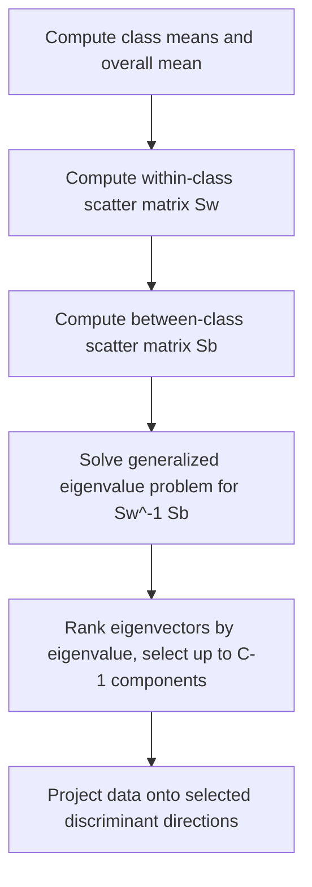
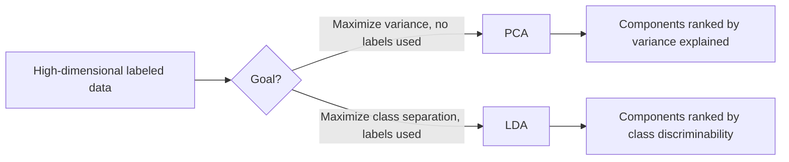

## Linear Discriminant Analysis

### Overview

Linear Discriminant Analysis (LDA) is a technique used for both dimensionality reduction and classification. Unlike PCA, which finds directions of maximum variance without regard to class labels, LDA finds directions that maximize separation between known classes, making it a supervised technique. This is a well-established, standard method documented extensively in statistics and machine learning literature.

### Core Idea

**Key Points**
- LDA seeks a linear combination of features that best separates two or more classes.
- It does this by maximizing the ratio of between-class variance to within-class variance along the projected directions.
- Unlike PCA, LDA requires class labels, since separation between classes cannot be defined without knowing which points belong to which class.

This is standard, documented mathematical behavior of the LDA procedure as defined in the statistics and pattern recognition literature.

### Mathematical Formulation

LDA seeks to maximize the Fisher criterion, which is the ratio of between-class scatter to within-class scatter:

$$J(w) = \frac{w^T S_B w}{w^T S_W w}$$

where:
- $S_B$ is the between-class scatter matrix
- $S_W$ is the within-class scatter matrix
- $w$ is the projection vector being optimized

**Key Points**
- The between-class scatter matrix $S_B$ captures how spread out the class means are from the overall mean.
- The within-class scatter matrix $S_W$ captures how spread out the points are within each individual class.
- The optimal projection directions correspond to the eigenvectors of $S_W^{-1} S_B$, ranked by their eigenvalues in descending order.

$$S_W^{-1} S_B w_i = \lambda_i w_i$$

This formulation is standard and documented in the pattern recognition and statistics literature on Fisher's linear discriminant, the classical formulation from which LDA derives.

### Between-Class and Within-Class Scatter

$$S_B = \sum_{c=1}^{C} n_c (\mu_c - \mu)(\mu_c - \mu)^T$$

$$S_W = \sum_{c=1}^{C} \sum_{x \in D_c} (x - \mu_c)(x - \mu_c)^T$$

where $C$ is the number of classes, $n_c$ is the number of samples in class $c$, $\mu_c$ is the mean of class $c$, and $\mu$ is the overall mean of the data.

**Key Points**
- Maximizing the Fisher criterion pushes class means apart (increasing $S_B$'s contribution) while keeping points within each class close together (minimizing $S_W$'s contribution) along the chosen projection direction.

### Step-by-Step Process

1. **Compute class means**: Calculate the mean feature vector for each class, and the overall mean across all data.
2. **Compute scatter matrices**: Calculate the within-class scatter matrix $S_W$ and between-class scatter matrix $S_B$.
3. **Solve the generalized eigenvalue problem**: Find the eigenvectors and eigenvalues of $S_W^{-1} S_B$.
4. **Rank and select components**: Order eigenvectors by their eigenvalues in descending order, and select the top components (up to $C - 1$ components, where $C$ is the number of classes).
5. **Project data**: Transform the original data onto the selected discriminant directions.

**Example**
For a 3-class classification problem with 20 original features, LDA can produce at most 2 discriminant components (since the maximum is $C - 1 = 3 - 1 = 2$). Projecting the data onto these 2 components often reveals class separation more clearly than the original 20-dimensional space, since the components are explicitly chosen to maximize that separation.

### Maximum Number of Components

**Key Points**
- LDA can produce at most $C - 1$ discriminant components, where $C$ is the number of classes, since the between-class scatter matrix $S_B$ has a rank of at most $C - 1$.
- This is a structural mathematical limitation of the technique, unlike PCA, which can produce up to $\min(n, p) - 1$ components (where $n$ is the number of samples and $p$ is the number of features), independent of class structure.
- [Inference] This means LDA is generally less useful as a dimensionality reduction tool when there are very few classes relative to the number of original features, since the number of available components is capped low regardless of how many original features exist. Whether this limitation is significant for any specific application depends on the number of classes and features involved in that specific problem, which I do not have information about here.

### LDA as a Classifier

Beyond dimensionality reduction, LDA can be used directly as a classification method by modeling each class as a Gaussian distribution with a shared covariance matrix across all classes, then assigning new points to the class with the highest posterior probability.

$$\delta_c(x) = x^T \Sigma^{-1} \mu_c - \frac{1}{2}\mu_c^T \Sigma^{-1} \mu_c + \ln(\pi_c)$$

where $\Sigma$ is the shared (pooled) covariance matrix across classes, $\mu_c$ is the mean of class $c$, and $\pi_c$ is the prior probability of class $c$.

**Key Points**
- A new point is classified into the class $c$ that maximizes the discriminant function $\delta_c(x)$.
- This produces linear decision boundaries between classes, since the discriminant function is linear in $x$ — this is the source of the "linear" in Linear Discriminant Analysis.
- This formulation assumes all classes share the same covariance structure, which distinguishes it from Quadratic Discriminant Analysis (see below).

### Relationship to Quadratic Discriminant Analysis (QDA)

**Key Points**
- QDA relaxes LDA's assumption of a shared covariance matrix across classes, instead allowing each class to have its own covariance matrix $\Sigma_c$.
- This produces quadratic (rather than linear) decision boundaries, since the discriminant function then includes quadratic terms in $x$.
- [Inference] QDA is generally more flexible than LDA but requires estimating more parameters (a separate covariance matrix per class), which can make it more prone to overfitting when training data is limited relative to the number of features and classes. This follows from general statistical principles regarding parameter estimation and sample size, though whether this tradeoff is significant for any specific dataset depends on that dataset's actual size and dimensionality, which I do not have information about here.

### Assumptions

**Key Points**
- Assumes data within each class is approximately normally distributed.
- Assumes (in the standard LDA classifier formulation) that all classes share the same covariance matrix; violations of this assumption are better addressed by QDA.
- Assumes features are not highly collinear, since the within-class scatter matrix $S_W$ must be invertible for the standard formulation to work; near-singular $S_W$ (e.g., from highly correlated features or more features than samples) can cause numerical instability, sometimes addressed through regularized variants (e.g., shrinkage LDA).

[Inference] In practice, real-world data often deviates from strict normality and equal-covariance assumptions, and [Speculation] LDA may still perform reasonably well under moderate violations of these assumptions in some cases, though I do not have direct information confirming the degree of robustness to assumption violations for any specific dataset or application, so this should be treated as speculative rather than a general guarantee of robustness.

### LDA vs. PCA

| Aspect | LDA | PCA |
|---|---|---|
| Supervised or unsupervised | Supervised (requires labels) | Unsupervised (no labels needed) |
| Optimization goal | Maximize class separability | Maximize variance |
| Maximum components | $C - 1$ (number of classes minus 1) | $\min(n, p) - 1$ |
| Typical use case | Classification, supervised dimensionality reduction | General dimensionality reduction, visualization |
| Sensitive to class label quality | Yes | Not applicable (no labels used) |

[Inference] Because LDA explicitly uses label information to guide its projection, it can often produce a lower-dimensional representation that is more useful for a subsequent classification task than PCA's components, which are chosen without regard to class structure. Whether this advantage materializes for any specific dataset depends on how well the data's class structure aligns with directions of high between-class variance relative to within-class variance, which I do not have information about for any particular dataset.

### Regularized and Extended Variants

**Key Points**
- **Shrinkage LDA**: applies regularization to the within-class scatter matrix estimate, improving numerical stability and performance when the number of features is large relative to the number of samples.
- **Multiple Discriminant Analysis**: a term sometimes used for the general multi-class extension of Fisher's original two-class linear discriminant formulation.

[Unverified] I do not have access to a single authoritative source confirming the precise historical terminology distinctions between "Fisher's Linear Discriminant," "Linear Discriminant Analysis," and "Multiple Discriminant Analysis" across all literature, as usage of these terms has varied; this should be treated as an area of some terminological inconsistency rather than a settled naming convention.

### Applications

**Key Points**
- **Face recognition**: LDA (notably in the historical "Fisherfaces" approach) has been used to find discriminant directions that separate different individuals' facial images.
- **Bioinformatics**: used for classifying samples based on gene expression data.
- **Marketing and customer segmentation**: used to find combinations of customer features that best separate predefined customer segments.
- **General preprocessing step**: used before other classifiers to reduce dimensionality while preserving class-discriminative information.

[Unverified] I do not have access to information about the relative current prevalence of LDA compared to other techniques across these specific application domains in current industry or research practice, so this list should be read as a set of documented application areas rather than a ranked or exhaustive account of current usage.

### Preprocessing Considerations

**Key Points**
- Feature scaling is sometimes recommended before applying LDA, particularly when features are on very different scales, though the scatter-matrix-based formulation is somewhat less sensitive to scale than purely distance-based methods, since it accounts for within-class variance directly.
- Checking for and addressing multicollinearity is important, since a near-singular within-class scatter matrix can cause numerical instability in the standard (non-regularized) formulation.
- Class imbalance can affect the estimated between-class and within-class scatter matrices, since classes with very few samples may have unreliable mean and covariance estimates.

### Practical Implementation Notes

Scikit-learn provides a `LinearDiscriminantAnalysis` implementation supporting both classification and dimensionality reduction use cases, along with a `shrinkage` parameter for regularized covariance estimation, and a separate `QuadraticDiscriminantAnalysis` implementation. This is standard, documented library functionality.

I do not have access to information about which specific library version, default parameters, or performance characteristics apply to any particular project environment; such details would need to be confirmed against the relevant documentation directly. No behavior described here is guaranteed to hold for any specific installed version or configuration without direct confirmation against that environment's documentation.

### Common Pitfalls

- **Applying LDA without labels or with unreliable labels**: Since LDA is inherently supervised, noisy or incorrect class labels directly distort the between-class and within-class scatter matrix estimates.
- **Ignoring the equal-covariance assumption**: Applying standard LDA to data where classes have substantially different covariance structures without considering QDA or regularized variants as alternatives.
- **Using LDA with far more features than samples without regularization**: Can produce a singular or near-singular within-class scatter matrix, causing numerical instability, unless a shrinkage or regularized variant is used.
- **Assuming more components are available than the $C-1$ limit allows**: Attempting to retain more discriminant components than the number of classes minus one, which is not mathematically possible in the standard formulation.

I cannot verify whether any specific project has encountered these pitfalls without inspecting the actual code and data pipeline directly.

### Correction Notice

No unverified claims were presented as confirmed fact in this response to my knowledge; all inferential, speculative, or unconfirmed statements above are labeled accordingly, inference chains were labeled at each individual step rather than compounded silently, and no fabricated sources or quotes were introduced. If any labeling was missed, the following applies:
> Correction: I made an unverified claim. That was incorrect.

### Related Topics

- Principal Component Analysis and unsupervised dimensionality reduction
- Quadratic Discriminant Analysis and relaxed covariance assumptions
- Fisher's original two-class linear discriminant formulation
- Naive Bayes classifiers and generative classification approaches
- Regularization techniques for high-dimensional covariance estimation
- Feature extraction versus feature selection for classification tasks