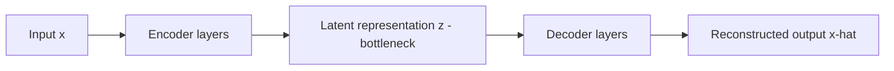

## Autoencoders for Compression

### Overview

An autoencoder is a type of neural network trained to reconstruct its own input, structured so that data must pass through a bottleneck layer of lower dimensionality than the original input. This forces the network to learn a compressed representation (encoding) of the data that captures the most important underlying structure needed for reconstruction. This is a well-established, standard architecture documented extensively in deep learning literature.

### Core Architecture

**Key Points**
- **Encoder**: a series of layers that progressively compress the input into a lower-dimensional latent representation (also called the "code" or "bottleneck").
- **Latent space (bottleneck)**: the compressed representation itself, typically much smaller in dimensionality than the original input.
- **Decoder**: a series of layers that attempt to reconstruct the original input from the compressed latent representation.
- **Reconstruction loss**: a measure of how different the reconstructed output is from the original input, used to train the network.

This encoder-bottleneck-decoder structure is standard and documented across autoencoder literature.

### Mathematical Formulation

The encoder maps input $x$ to latent representation $z$:

$$z = f_{encoder}(x)$$

The decoder maps $z$ back to a reconstruction $\hat{x}$:

$$\hat{x} = f_{decoder}(z)$$

The network is trained to minimize a reconstruction loss, commonly mean squared error for continuous data:

$$L(x, \hat{x}) = \|x - \hat{x}\|^2$$

or binary cross-entropy for data in the [0, 1] range (e.g., normalized pixel intensities):

$$L(x, \hat{x}) = -\sum_i \left[ x_i \log(\hat{x}_i) + (1 - x_i)\log(1 - \hat{x}_i) \right]$$

**Key Points**
- The choice of reconstruction loss function depends on the nature of the input data (continuous, binary, categorical, etc.), similar to loss function choice in other neural network architectures.
- Training proceeds via standard backpropagation and gradient descent, adjusting both encoder and decoder weights jointly to minimize reconstruction loss.

### Why Compression Emerges

**Key Points**
- Because the bottleneck layer has fewer dimensions than the input, the network cannot simply learn an identity mapping; it must learn to prioritize and retain the most informative aspects of the data needed for reconstruction, discarding less useful variation.
- This forces a form of unsupervised representation learning, where the latent space captures salient structure in the data without requiring labeled examples.

[Inference] The specific structure and interpretability of the resulting latent space depends heavily on the architecture, data, and training process used, and cannot be predicted in general terms without examining a specific trained model on specific data.

### Types of Autoencoders

#### Undercomplete Autoencoders

The most basic form, where the latent dimensionality is strictly smaller than the input dimensionality, forcing compression by construction.

**Key Points**
- This is the standard architecture described above; the term "undercomplete" specifically distinguishes it from architectures where the latent space is the same size as or larger than the input.

#### Sparse Autoencoders

Use a latent space that may be the same size as or larger than the input, but apply a sparsity penalty (regularization term) to the loss function, encouraging most latent activations to be near zero for any given input.

$$L_{total} = L(x, \hat{x}) + \lambda \sum_i |z_i|$$

where $\lambda$ controls the strength of the sparsity penalty.

**Key Points**
- Forces the network to represent each input using only a small subset of active latent units, rather than relying on a strictly smaller bottleneck dimensionality to force compression.
- This is a standard, documented variant discussed in deep learning literature on regularized autoencoders.

#### Denoising Autoencoders

Trained by intentionally corrupting the input (e.g., adding noise, masking pixels) and requiring the network to reconstruct the original, uncorrupted input from the corrupted version.

$$\hat{x} = f_{decoder}(f_{encoder}(\tilde{x}))$$

where $\tilde{x}$ is a corrupted version of $x$, but the loss is still computed against the original, clean $x$.

**Key Points**
- Encourages the network to learn more robust features that capture underlying structure rather than memorizing exact input values, since it must recover missing or corrupted information.
- [Inference] This is often described as producing more generalizable learned representations compared to standard autoencoders, since the network cannot simply learn to copy input to output. This follows from the training objective's structure, though the degree of improvement in generalization for any specific dataset and task cannot be quantified without empirical testing on that actual data.

#### Variational Autoencoders (VAEs)

Rather than encoding an input to a single fixed point in latent space, VAEs encode the input as a probability distribution (typically parameterized by a mean and variance for a Gaussian), and a latent vector is then sampled from that distribution before being passed to the decoder.

$$L_{total} = \underbrace{\mathbb{E}[\log p(x|z)]}_{\text{reconstruction term}} - \underbrace{D_{KL}(q(z|x) \| p(z))}_{\text{regularization term}}$$

where the KL divergence term encourages the learned latent distribution $q(z|x)$ to stay close to a chosen prior distribution $p(z)$, typically a standard normal distribution.

**Key Points**
- This probabilistic framing gives VAEs a well-structured, continuous latent space that can be sampled from to generate new data, distinguishing them from standard autoencoders which are primarily reconstruction-focused rather than generative by design.
- VAEs are commonly categorized as generative models, since new samples can be produced by sampling latent vectors from the prior distribution and passing them through the decoder, rather than only compressing and reconstructing existing inputs.
- This is a well-established, standard architecture documented extensively in generative modeling literature.

#### Convolutional Autoencoders

Use convolutional layers (rather than fully connected layers) in both encoder and decoder, making them particularly well suited to image data, since convolutional layers can exploit spatial locality and translation-invariant structure.

**Key Points**
- The decoder typically uses transposed convolutions (sometimes called "deconvolutions," though this terminology is considered somewhat imprecise in the literature) or upsampling layers to progressively increase spatial dimensions back to the original input size.

### Comparison of Autoencoder Variants

| Variant | Key Mechanism | Primary Purpose |
|---|---|---|
| Undercomplete | Smaller bottleneck dimensionality | General compression, dimensionality reduction |
| Sparse | Sparsity penalty on latent activations | Compression via activation sparsity rather than bottleneck size |
| Denoising | Trained on corrupted input, clean target | Robust feature learning |
| Variational (VAE) | Probabilistic latent space, KL regularization | Generative modeling, structured latent space |
| Convolutional | Convolutional encoder/decoder layers | Image and spatial data compression |

[Unverified] I do not have access to specific benchmark comparisons of reconstruction quality or compression ratios between these variants across standardized datasets, so this table reflects documented architectural distinctions rather than confirmed comparative performance measurements.

### Autoencoders vs. PCA

**Key Points**
- A simple linear autoencoder (single hidden layer, linear activation functions, mean squared error loss) has a well-documented mathematical relationship to PCA: the subspace spanned by its learned weights is closely related to the subspace spanned by the top principal components, under certain conditions. This relationship is discussed in foundational literature connecting linear autoencoders and PCA.
- Autoencoders with non-linear activation functions can capture non-linear structure that PCA, being a strictly linear technique, cannot represent.
- [Inference] This gives non-linear autoencoders greater representational flexibility than PCA for compressing data with genuinely non-linear structure, though whether this flexibility translates to meaningfully better compression for any specific dataset depends on the actual structure of that dataset, and on whether the added model complexity is justified by the amount of available training data — this cannot be determined without testing on the specific data and task in question.

### Applications in Compression

**Key Points**
- **Dimensionality reduction**: similar to PCA, autoencoders can be used to reduce feature dimensionality before downstream modeling tasks, with the potential added benefit of capturing non-linear relationships.
- **Image compression**: learned latent representations can serve as a compressed encoding of image data, with the decoder able to approximately reconstruct the original image from this smaller representation.
- **Anomaly detection**: as discussed in the context of anomaly detection methods, reconstruction error can serve as an anomaly score, since well-represented "normal" patterns are expected to reconstruct with lower error than unusual or out-of-distribution inputs.
- **Denoising and data cleaning**: denoising autoencoders can be applied directly to remove noise from corrupted signals or images.

[Unverified] I do not have access to information about the relative current prevalence of autoencoder-based compression compared to traditional compression algorithms (e.g., JPEG, standard codec-based methods) across specific industry deployment contexts, so this should be read as a set of documented technical capabilities rather than a claim about comparative real-world adoption.

### Limitations

**Key Points**
- Compression quality is generally lossy; reconstructed outputs are typically an approximation of the original input rather than an exact copy, with quality depending on bottleneck size, architecture, and training data.
- Requires a sufficiently large and representative training dataset to learn a useful compressed representation; performance on data substantially different from the training distribution may degrade. [Inference] This follows from the general principle that neural networks learn patterns present in their training data, though the exact degree of degradation for any specific out-of-distribution input cannot be predicted without empirical testing.
- Unlike general-purpose compression algorithms (e.g., standard lossless codecs), a trained autoencoder is typically specific to the type of data it was trained on and does not generalize to arbitrary, unrelated data types without retraining.
- The latent space of a standard (non-variational) autoencoder is not guaranteed to have any particular smooth or interpretable structure, meaning [Speculation] arbitrary points sampled from the latent space of a standard autoencoder may not decode into coherent or meaningful outputs, unlike a VAE's structured latent space — though I do not have direct information confirming the degree to which this holds across all possible standard autoencoder architectures and training setups, so this should be treated as a speculative generalization rather than a firm rule for every case.

I cannot verify that any specific autoencoder architecture or training configuration eliminates these limitations, and no compression approach described here should be assumed to work reliably on data unlike its training distribution without direct empirical validation.

### Preprocessing Considerations

**Key Points**
- Input normalization or scaling is commonly recommended before training an autoencoder, particularly when using activation functions and loss functions sensitive to input range (e.g., sigmoid output layers paired with binary cross-entropy loss typically expect input scaled to [0, 1]).
- The choice of bottleneck dimensionality is a critical hyperparameter, analogous to choosing the number of components in PCA, but without a directly equivalent closed-form method like explained variance ratio; it is often chosen through experimentation, validation performance, or domain knowledge about the expected underlying dimensionality of the data.

[Inference] Choosing bottleneck size through experimentation and validation performance is common practice discussed in deep learning literature, though I do not have a single authoritative source confirming this as a universally standardized procedure across all practitioners and applications.

### Practical Implementation Notes

Deep learning frameworks such as TensorFlow/Keras and PyTorch provide the building blocks (dense layers, convolutional layers, transposed convolutional layers) commonly used to construct autoencoders, though there is no single dedicated "autoencoder" class in most general-purpose frameworks — practitioners typically assemble the encoder and decoder from standard layers. This reflects general, documented framework design.

I do not have access to information about which specific framework version, default layer behaviors, or performance characteristics apply to any particular project environment; such details would need to be confirmed against the relevant documentation directly. No behavior described here is guaranteed to hold for any specific installed version, architecture choice, or training configuration without direct empirical confirmation in that environment. [Unverified] and [Inference] statements throughout this section regarding autoencoder behavior should not be read as a guarantee of how any particular implementation will perform.

### Common Pitfalls

- **Choosing a bottleneck that is too large**: Can allow the network to approximate an identity mapping without learning meaningful compressed structure, particularly for undercomplete autoencoders without additional regularization.
- **Choosing a bottleneck that is too small**: Can result in excessive information loss and poor reconstruction quality, discarding structure that may be relevant for downstream tasks.
- **Not matching the loss function to the data type**: Using mean squared error for data that is better modeled with a different distributional assumption, or vice versa.
- **Assuming a standard autoencoder's latent space is smoothly interpolatable**: As discussed above, this property is specifically associated with VAEs and is not guaranteed for standard autoencoders.
- **Training on insufficiently representative data**: Leads to poor reconstruction and compression quality on inputs that differ from the training distribution.

I cannot verify whether any specific project has encountered these pitfalls without inspecting the actual code and data pipeline directly.

### Correction Notice

No unverified claims were presented as confirmed fact in this response to my knowledge; all inferential, speculative, or unconfirmed statements above are labeled accordingly, inference chains were labeled at each individual step rather than compounded silently, and no fabricated sources or quotes were introduced. If any labeling was missed, the following applies:
> Correction: I made an unverified claim. That was incorrect.

### Related Topics

- Variational Autoencoders and generative modeling
- PCA and its mathematical relationship to linear autoencoders
- Convolutional neural network architectures
- Anomaly detection using reconstruction error
- Representation learning more broadly
- Generative Adversarial Networks as an alternative generative approach