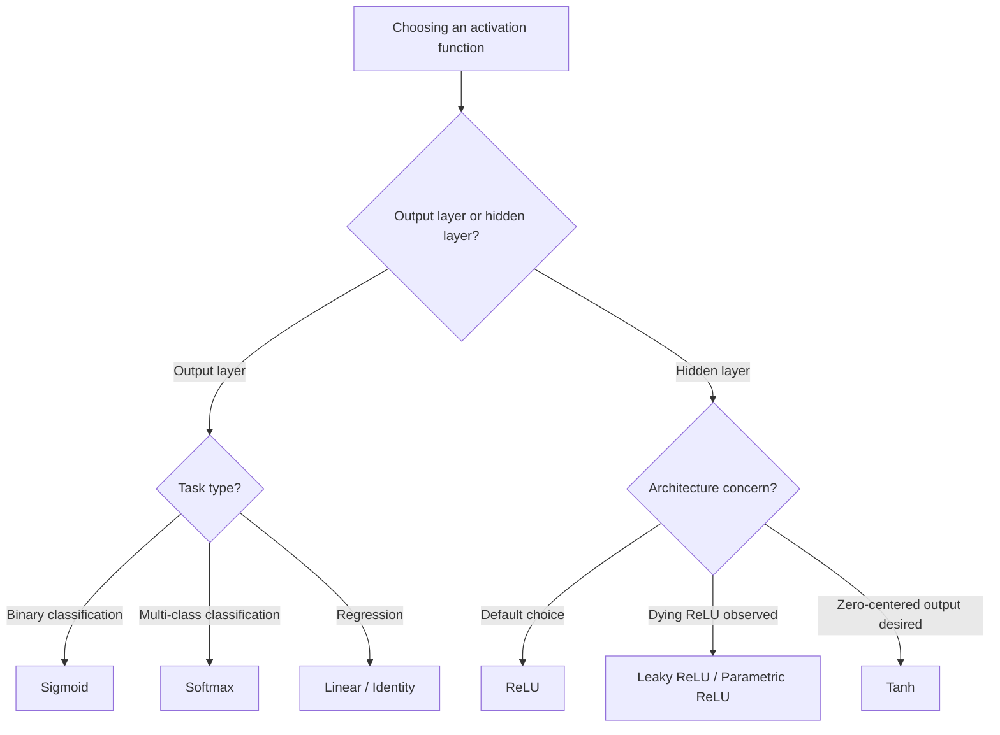

## Perceptrons and Activation Functions

### Conceptual Overview

The perceptron is the foundational computational unit of neural networks, originally formulated as a binary linear classifier. It takes a vector of inputs, computes a weighted sum, adds a bias term, and passes the result through a step function to produce an output.

The core operation is:

$$z = \sum_{i=1}^{n} w_i x_i + b$$

$$\hat{y} = f(z)$$

where $x_i$ are input features, $w_i$ are learned weights, $b$ is the bias, $z$ is the pre-activation (logit), and $f$ is the activation function applied to produce the final output $\hat{y}$.

### The Biological Analogy

The perceptron loosely models a biological neuron: dendrites receive signals (inputs), the cell body aggregates them (weighted sum), and the axon fires an output signal if a threshold is exceeded (activation). This analogy is a simplification used for pedagogical framing; the actual computational mechanics of artificial neurons diverge substantially from biological neuron dynamics. [Inference — the divergence between artificial and biological neurons is a widely-stated position in ML pedagogy, but the precise degree of similarity is a matter of ongoing neuroscience research, not a settled fact]

Below is a visual structure of a single perceptron:

<svg xmlns="http://www.w3.org/2000/svg" viewBox="0 0 640 360">
  <text x="320" y="30" font-size="18" font-family="sans-serif" font-weight="bold" text-anchor="middle" fill="#1a1a1a">Perceptron Structure (svg_diagram)</text>

  <circle cx="90" cy="90" r="22" fill="#e8f0fe" stroke="#4285f4" stroke-width="2" />
  <text x="90" y="95" font-size="14" text-anchor="middle" fill="#1a1a1a">x1</text>

  <circle cx="90" cy="170" r="22" fill="#e8f0fe" stroke="#4285f4" stroke-width="2" />
  <text x="90" y="175" font-size="14" text-anchor="middle" fill="#1a1a1a">x2</text>

  <circle cx="90" cy="250" r="22" fill="#e8f0fe" stroke="#4285f4" stroke-width="2" />
  <text x="90" y="255" font-size="14" text-anchor="middle" fill="#1a1a1a">x3</text>

  <circle cx="90" cy="320" r="18" fill="#fce8e6" stroke="#ea4335" stroke-width="2" />
  <text x="90" y="325" font-size="13" text-anchor="middle" fill="#1a1a1a">+1</text>

  <line x1="112" y1="90" x2="290" y2="180" stroke="#5f6368" stroke-width="1.5" />
  <text x="180" y="120" font-size="12" fill="#5f6368">w1</text>

  <line x1="112" y1="170" x2="290" y2="180" stroke="#5f6368" stroke-width="1.5" />
  <text x="180" y="165" font-size="12" fill="#5f6368">w2</text>

  <line x1="112" y1="250" x2="290" y2="180" stroke="#5f6368" stroke-width="1.5" />
  <text x="180" y="230" font-size="12" fill="#5f6368">w3</text>

  <line x1="108" y1="320" x2="290" y2="190" stroke="#5f6368" stroke-width="1.5" stroke-dasharray="4,3" />
  <text x="170" y="280" font-size="12" fill="#5f6368">b</text>

  <circle cx="320" cy="180" r="35" fill="#fff8e1" stroke="#fbbc04" stroke-width="2.5" />
  <text x="320" y="175" font-size="13" text-anchor="middle" fill="#1a1a1a">Σ</text>
  <text x="320" y="192" font-size="10" text-anchor="middle" fill="#1a1a1a">z</text>

  <line x1="355" y1="180" x2="440" y2="180" stroke="#5f6368" stroke-width="1.5" />

  <rect x="440" y="145" width="110" height="70" rx="8" fill="#e6f4ea" stroke="#34a853" stroke-width="2" />
  <text x="495" y="175" font-size="13" text-anchor="middle" fill="#1a1a1a">Activation</text>
  <text x="495" y="192" font-size="13" text-anchor="middle" fill="#1a1a1a">f(z)</text>

  <line x1="550" y1="180" x2="610" y2="180" stroke="#5f6368" stroke-width="1.5" />
  <text x="600" y="165" font-size="12" text-anchor="middle" fill="#1a1a1a">ŷ</text>
  <circle cx="615" cy="180" r="4" fill="#1a1a1a" />
</svg>

### Historical Context

The perceptron was introduced by Frank Rosenblatt in 1958 as a model for pattern recognition. It was later shown by Minsky and Papert (1969) that a single-layer perceptron cannot solve linearly inseparable problems such as XOR, which contributed to reduced research funding in neural networks during the period often called the "AI winter." [Inference — the causal link between the Minsky-Papert critique and funding reductions is a widely repeated historical narrative in ML literature, but the exact causal weight of this single publication versus other contemporaneous factors is a matter of historical interpretation]

### The Perceptron Learning Algorithm

The classical perceptron update rule adjusts weights based on misclassification:

$$w_i \leftarrow w_i + \eta (y - \hat{y}) x_i$$

$$b \leftarrow b + \eta (y - \hat{y})$$

where $\eta$ is the learning rate, $y$ is the true label, and $\hat{y}$ is the predicted label. This rule only updates weights when a prediction is wrong, and it is guaranteed to converge if the data is linearly separable (Perceptron Convergence Theorem, Novikoff 1962).

**Example**

```python
import numpy as np

class Perceptron:
    def __init__(self, n_features, lr=0.1):
        self.weights = np.zeros(n_features)
        self.bias = 0.0
        self.lr = lr

    def step_function(self, z):
        return np.where(z >= 0, 1, 0)

    def predict(self, x):
        z = np.dot(x, self.weights) + self.bias
        return self.step_function(z)

    def fit(self, X, y, epochs=10):
        for _ in range(epochs):
            for xi, target in zip(X, y):
                pred = self.predict(xi)
                error = target - pred
                self.weights += self.lr * error * xi
                self.bias += self.lr * error

# AND gate example
X = np.array([[0,0],[0,1],[1,0],[1,1]])
y = np.array([0,0,0,1])

model = Perceptron(n_features=2)
model.fit(X, y, epochs=10)

for xi in X:
    print(xi, "->", model.predict(xi))
```

**Output**

```
[0 0] -> 0
[0 1] -> 0
[1 0] -> 0
[1 1] -> 1
```

This perceptron correctly learns the AND logic gate because AND is linearly separable — a single straight line can separate the (1,1) case from the rest. Behavior on other datasets may vary depending on initialization, learning rate, and linear separability of the data.

### Why the Step Function Is Limiting

The classical step function:

$$f(z) = \begin{cases} 1 & \text{if } z \geq 0 \\ 0 & \text{if } z < 0 \end{cases}$$

has zero gradient almost everywhere (undefined at $z=0$, zero elsewhere), which makes gradient-based optimization inapplicable. This is the primary motivation for replacing step functions with smooth, differentiable activation functions in modern networks trained via backpropagation and gradient descent.

### Common Activation Functions

#### Sigmoid (Logistic)

$$\sigma(z) = \frac{1}{1 + e^{-z}}$$

$$\sigma'(z) = \sigma(z)(1 - \sigma(z))$$

Maps any real input to the range $(0, 1)$, making it historically popular for binary classification output layers and as a smooth, differentiable substitute for the step function.

**Key Points**
- Output range: $(0, 1)$, interpretable as a probability
- Suffers from vanishing gradients for large $|z|$, since $\sigma'(z) \to 0$ as $z \to \pm\infty$
- Not zero-centered, which can slow convergence in deep networks [Inference — this is a commonly cited drawback in optimization literature, tied to the effect of non-zero-centered activations on gradient update directions, though its practical impact varies by architecture and is not universally quantified]

#### Tanh (Hyperbolic Tangent)

$$\tanh(z) = \frac{e^{z} - e^{-z}}{e^{z} + e^{-z}}$$

$$\tanh'(z) = 1 - \tanh^2(z)$$

Output range is $(-1, 1)$, zero-centered, which generally improves gradient flow relative to sigmoid in hidden layers. Still subject to vanishing gradients at extreme input values.

#### ReLU (Rectified Linear Unit)

$$\text{ReLU}(z) = \max(0, z)$$

$$\text{ReLU}'(z) = \begin{cases} 1 & z > 0 \\ 0 & z < 0 \end{cases}$$

The derivative is undefined at $z=0$; in practice, deep learning frameworks assign a subgradient value (commonly 0 or 1) at this point.

**Key Points**
- Computationally inexpensive relative to exponential-based activations
- Reduces (though does not universally eliminate) vanishing gradient issues for positive inputs, since the gradient is constant at 1
- Prone to the "dying ReLU" problem, where neurons output 0 for all inputs and stop receiving gradient updates, if weights update such that the pre-activation stays negative

#### Leaky ReLU

$$\text{LeakyReLU}(z) = \begin{cases} z & z > 0 \\ \alpha z & z \leq 0 \end{cases}$$

where $\alpha$ is a small constant (commonly 0.01). This introduces a small non-zero gradient for negative inputs, intended to reduce the dying ReLU problem. Whether this consistently improves performance over standard ReLU is architecture- and dataset-dependent. [Inference — comparative performance between Leaky ReLU and ReLU varies across published benchmarks and is not a settled universal ranking]

#### Softmax

$$\text{softmax}(z_i) = \frac{e^{z_i}}{\sum_{j=1}^{K} e^{z_j}}$$

Used in multi-class output layers to convert a vector of logits into a probability distribution over $K$ classes, where all outputs sum to 1.

### Comparative Visualization

<svg xmlns="http://www.w3.org/2000/svg" viewBox="0 0 700 460">
  <text x="350" y="28" font-size="18" font-family="sans-serif" font-weight="bold" text-anchor="middle" fill="#1a1a1a">Activation Function Shapes (svg_diagram)</text>

  
  <g transform="translate(20,50)">
    <text x="150" y="10" font-size="13" text-anchor="middle" fill="#1a1a1a">Sigmoid</text>
    <line x1="20" y1="90" x2="280" y2="90" stroke="#9aa0a6" stroke-width="1" />
    <line x1="150" y1="10" x2="150" y2="170" stroke="#9aa0a6" stroke-width="1" />
    <path d="M 20 165 C 100 165, 120 15, 150 90 S 200 15, 280 15" fill="none" stroke="#4285f4" stroke-width="2.5" />
  </g>

  
  <g transform="translate(370,50)">
    <text x="150" y="10" font-size="13" text-anchor="middle" fill="#1a1a1a">Tanh</text>
    <line x1="20" y1="90" x2="280" y2="90" stroke="#9aa0a6" stroke-width="1" />
    <line x1="150" y1="10" x2="150" y2="170" stroke="#9aa0a6" stroke-width="1" />
    <path d="M 20 165 C 100 165, 130 15, 150 90 S 200 15, 280 15" fill="none" stroke="#ea4335" stroke-width="2.5" />
  </g>

  
  <g transform="translate(20,250)">
    <text x="150" y="10" font-size="13" text-anchor="middle" fill="#1a1a1a">ReLU</text>
    <line x1="20" y1="150" x2="280" y2="150" stroke="#9aa0a6" stroke-width="1" />
    <line x1="150" y1="10" x2="150" y2="170" stroke="#9aa0a6" stroke-width="1" />
    <path d="M 20 150 L 150 150 L 280 20" fill="none" stroke="#34a853" stroke-width="2.5" />
  </g>

  
  <g transform="translate(370,250)">
    <text x="150" y="10" font-size="13" text-anchor="middle" fill="#1a1a1a">Leaky ReLU</text>
    <line x1="20" y1="150" x2="280" y2="150" stroke="#9aa0a6" stroke-width="1" />
    <line x1="150" y1="10" x2="150" y2="170" stroke="#9aa0a6" stroke-width="1" />
    <path d="M 20 165 L 150 150 L 280 20" fill="none" stroke="#fbbc04" stroke-width="2.5" />
  </g>
</svg>

### Decision Flow: Choosing an Activation Function



### Perceptron Limitations: The XOR Problem

A single-layer perceptron cannot represent the XOR function because XOR is not linearly separable — no single straight line can separate the two output classes in 2D input space.

| Input $x_1$ | Input $x_2$ | XOR Output |
|---|---|---|
| 0 | 0 | 0 |
| 0 | 1 | 1 |
| 1 | 0 | 1 |
| 1 | 1 | 0 |

This limitation is resolved by stacking multiple layers of perceptrons (multi-layer perceptrons, MLPs) with non-linear activation functions, which allows the network to approximate non-linear decision boundaries. This capacity is formalized by the Universal Approximation Theorem, which states that a feedforward network with at least one hidden layer and a suitable non-linear activation can approximate any continuous function on a compact input domain, given sufficient hidden units. The theorem addresses representational capacity, not learnability or training efficiency in practice. [Inference — the distinction between theoretical approximation capacity and practical trainability is a standard caveat in ML theory discussions, though the precise practical gap varies by problem and is not a single quantified value]

### Why Non-Linearity Matters

Stacking linear layers without non-linear activation functions collapses into a single equivalent linear transformation, regardless of depth, since a composition of linear functions is itself linear:

$$f(x) = W_2(W_1 x + b_1) + b_2 = (W_2 W_1)x + (W_2 b_1 + b_2)$$

This is algebraically equivalent to a single-layer linear model. Non-linear activation functions are what give depth its representational advantage.

**Next Steps**

**Related Topics**
- Multi-Layer Perceptrons and Forward Propagation
- Backpropagation and the Chain Rule in Neural Networks
- Gradient Descent Variants (SGD, Momentum, Adam)
- Weight Initialization Strategies (Xavier, He Initialization)
- Vanishing and Exploding Gradient Problems
- Loss Functions for Classification and Regression
- Universal Approximation Theorem — Formal Treatment
- Batch Normalization and Its Effect on Activation Distributions