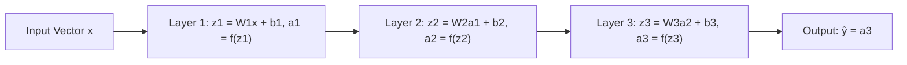

## Feedforward Architecture

### Conceptual Overview

A feedforward neural network (also called a multi-layer perceptron, MLP) is a neural network in which information flows in a single direction — from input layer, through one or more hidden layers, to an output layer — with no cycles or feedback loops. Each layer's output becomes the next layer's input, and no connections loop backward.

This distinguishes feedforward networks from architectures like recurrent neural networks (RNNs), where outputs can feed back into earlier computations.

### Layer Structure

A feedforward network consists of three categories of layers:

- **Input layer**: receives the raw feature vector; performs no computation itself, simply passes values forward
- **Hidden layer(s)**: perform weighted transformations followed by non-linear activation; a network can have zero, one, or many hidden layers
- **Output layer**: produces the final prediction, using an activation function suited to the task (e.g., softmax for multi-class classification, linear for regression)

<svg xmlns="http://www.w3.org/2000/svg" viewBox="0 0 700 420">
  <text x="350" y="28" font-size="18" font-family="sans-serif" font-weight="bold" text-anchor="middle" fill="#1a1a1a">Feedforward Network Structure (svg_diagram)</text>

  
  <circle cx="90" cy="120" r="22" fill="#e8f0fe" stroke="#4285f4" stroke-width="2" />
  <text x="90" y="125" font-size="13" text-anchor="middle" fill="#1a1a1a">x1</text>
  <circle cx="90" cy="200" r="22" fill="#e8f0fe" stroke="#4285f4" stroke-width="2" />
  <text x="90" y="205" font-size="13" text-anchor="middle" fill="#1a1a1a">x2</text>
  <circle cx="90" cy="280" r="22" fill="#e8f0fe" stroke="#4285f4" stroke-width="2" />
  <text x="90" y="285" font-size="13" text-anchor="middle" fill="#1a1a1a">x3</text>
  <text x="90" y="330" font-size="12" text-anchor="middle" fill="#5f6368">Input Layer</text>

  
  <circle cx="290" cy="90" r="20" fill="#fff8e1" stroke="#fbbc04" stroke-width="2" />
  <circle cx="290" cy="160" r="20" fill="#fff8e1" stroke="#fbbc04" stroke-width="2" />
  <circle cx="290" cy="230" r="20" fill="#fff8e1" stroke="#fbbc04" stroke-width="2" />
  <circle cx="290" cy="300" r="20" fill="#fff8e1" stroke="#fbbc04" stroke-width="2" />
  <text x="290" y="345" font-size="12" text-anchor="middle" fill="#5f6368">Hidden Layer 1</text>

  
  <circle cx="470" cy="120" r="20" fill="#fff8e1" stroke="#fbbc04" stroke-width="2" />
  <circle cx="470" cy="200" r="20" fill="#fff8e1" stroke="#fbbc04" stroke-width="2" />
  <circle cx="470" cy="280" r="20" fill="#fff8e1" stroke="#fbbc04" stroke-width="2" />
  <text x="470" y="325" font-size="12" text-anchor="middle" fill="#5f6368">Hidden Layer 2</text>

  
  <circle cx="630" cy="160" r="20" fill="#e6f4ea" stroke="#34a853" stroke-width="2" />
  <circle cx="630" cy="240" r="20" fill="#e6f4ea" stroke="#34a853" stroke-width="2" />
  <text x="630" y="285" font-size="12" text-anchor="middle" fill="#5f6368">Output Layer</text>

  
  <g stroke="#c4c9d0" stroke-width="1">
    <line x1="112" y1="120" x2="270" y2="90" />
    <line x1="112" y1="120" x2="270" y2="160" />
    <line x1="112" y1="120" x2="270" y2="230" />
    <line x1="112" y1="120" x2="270" y2="300" />
    <line x1="112" y1="200" x2="270" y2="90" />
    <line x1="112" y1="200" x2="270" y2="160" />
    <line x1="112" y1="200" x2="270" y2="230" />
    <line x1="112" y1="200" x2="270" y2="300" />
    <line x1="112" y1="280" x2="270" y2="90" />
    <line x1="112" y1="280" x2="270" y2="160" />
    <line x1="112" y1="280" x2="270" y2="230" />
    <line x1="112" y1="280" x2="270" y2="300" />
  </g>

  
  <g stroke="#c4c9d0" stroke-width="1">
    <line x1="310" y1="90" x2="450" y2="120" />
    <line x1="310" y1="90" x2="450" y2="200" />
    <line x1="310" y1="90" x2="450" y2="280" />
    <line x1="310" y1="160" x2="450" y2="120" />
    <line x1="310" y1="160" x2="450" y2="200" />
    <line x1="310" y1="160" x2="450" y2="280" />
    <line x1="310" y1="230" x2="450" y2="120" />
    <line x1="310" y1="230" x2="450" y2="200" />
    <line x1="310" y1="230" x2="450" y2="280" />
    <line x1="310" y1="300" x2="450" y2="120" />
    <line x1="310" y1="300" x2="450" y2="200" />
    <line x1="310" y1="300" x2="450" y2="280" />
  </g>

  
  <g stroke="#c4c9d0" stroke-width="1">
    <line x1="490" y1="120" x2="610" y2="160" />
    <line x1="490" y1="120" x2="610" y2="240" />
    <line x1="490" y1="200" x2="610" y2="160" />
    <line x1="490" y1="200" x2="610" y2="240" />
    <line x1="490" y1="280" x2="610" y2="160" />
    <line x1="490" y1="280" x2="610" y2="240" />
  </g>

  <text x="350" y="395" font-size="12" text-anchor="middle" fill="#5f6368">Arrows flow strictly left to right — no backward connections</text>
</svg>

### Mathematical Formulation

For a network with $L$ layers, the forward pass at layer $l$ is:

$$z^{[l]} = W^{[l]} a^{[l-1]} + b^{[l]}$$

$$a^{[l]} = f^{[l]}(z^{[l]})$$

where:
- $a^{[l-1]}$ is the activation output from the previous layer (with $a^{[0]} = x$, the raw input)
- $W^{[l]}$ is the weight matrix connecting layer $l-1$ to layer $l$
- $b^{[l]}$ is the bias vector for layer $l$
- $f^{[l]}$ is the activation function for layer $l$

The dimensions of $W^{[l]}$ are $(n_l, n_{l-1})$, where $n_l$ is the number of units in layer $l$ and $n_{l-1}$ is the number of units in the previous layer.

The final output is:

$$\hat{y} = a^{[L]}$$

### Full Forward Pass Example

**Example**

```python
import numpy as np

def sigmoid(z):
    return 1 / (1 + np.exp(-z))

def relu(z):
    return np.maximum(0, z)

# Input vector (3 features)
x = np.array([[0.5], [0.2], [0.9]])

# Layer 1: 3 inputs -> 4 hidden units
W1 = np.random.randn(4, 3) * 0.1
b1 = np.zeros((4, 1))

# Layer 2: 4 hidden units -> 3 hidden units
W2 = np.random.randn(3, 4) * 0.1
b2 = np.zeros((3, 1))

# Output layer: 3 hidden units -> 1 output
W3 = np.random.randn(1, 3) * 0.1
b3 = np.zeros((1, 1))

# Forward pass
z1 = np.dot(W1, x) + b1
a1 = relu(z1)

z2 = np.dot(W2, a1) + b2
a2 = relu(z2)

z3 = np.dot(W3, a2) + b3
a3 = sigmoid(z3)

print("Output activation shape:", a3.shape)
print("Output value:", a3)
```

**Output**

```
Output activation shape: (1, 1)
Output value: [[0.4998...]]
```

[Unverified] The exact numeric output value shown above will differ on every run because `W1`, `W2`, and `W3` are initialized with `np.random.randn`, which is non-deterministic unless a random seed is fixed with `np.random.seed()`. This is standard, documented NumPy behavior, not a claim about model behavior.

### Layer Sizing and Parameter Count

For a fully connected layer, the total number of learnable parameters is:

$$\text{params}^{[l]} = (n_{l-1} \times n_l) + n_l$$

This accounts for the weight matrix ($n_{l-1} \times n_l$ entries) plus one bias term per unit in layer $l$.

**Key Points**
- Total network parameters grow multiplicatively with layer width, not just additively — doubling the width of two adjacent layers roughly quadruples the weight count between them
- Parameter count directly affects memory footprint and computational cost per forward/backward pass
- [Inference] Larger parameter counts are generally associated with higher representational capacity and increased risk of overfitting on small datasets, though the actual relationship depends on regularization, data volume, and architecture choices, and is not a fixed rule for every case

### Depth vs. Width

A feedforward network's capacity can be scaled in two directions:

- **Width**: increasing the number of units within a layer
- **Depth**: increasing the number of layers

[Inference] Deeper networks are often described in ML literature as able to represent certain function classes more efficiently (with fewer total parameters) than shallower, wider networks, based on theoretical results in circuit complexity and function composition. Whether this holds for any specific task or dataset is not something that can be verified without empirical testing.

### Full Forward Propagation Flow



### Universal Approximation and Practical Limits

The Universal Approximation Theorem states that a feedforward network with a single hidden layer containing a finite number of units can approximate any continuous function on a compact subset of $\mathbb{R}^n$, given a suitable non-linear activation function and enough hidden units.

[Inference] This theorem is frequently cited to justify the general representational flexibility of feedforward networks, but it does not address how many units are actually required for a specific function, nor whether such a network can be found through gradient-based training in practice. The gap between theoretical approximation capacity and practical trainability is a recurring caveat in ML theory discussions, but the precise size of that gap for any given problem is not something this response can verify.

### Common Design Choices

**Key Points**
- **Fully connected (dense) layers**: every unit in one layer connects to every unit in the next; this is the default feedforward layer type
- **Activation per layer**: hidden layers commonly use ReLU or its variants; output layer activation depends on task (sigmoid for binary classification, softmax for multi-class, linear/identity for regression)
- **Bias terms**: typically included in every layer except sometimes omitted before batch normalization layers, since batch normalization has its own learned shift parameter [Unverified] — whether bias is omitted before batch normalization is a common implementation convention described in some deep learning frameworks and papers, but this response cannot confirm it as a universal standard across all libraries or use cases without checking a specific source
- **Output layer size**: determined by task — 1 unit for binary classification/regression, $K$ units for $K$-class classification

### Feedforward vs. Other Architectures

| Property | Feedforward (MLP) | Recurrent (RNN) | Convolutional (CNN) |
|---|---|---|---|
| Information flow | One direction only | Includes feedback loops | One direction, with local receptive fields |
| Typical input type | Fixed-size vectors | Sequences | Grid-structured data (e.g., images) |
| Parameter sharing | None (each connection has its own weight) | Shared across time steps | Shared across spatial positions |
| Memory of previous inputs | None | Yes, via hidden state | None (unless combined with recurrence) |

[Inference] This comparison reflects standard categorizations used in ML textbooks and courses, though hybrid architectures (e.g., CNN-RNN combinations, feedforward blocks within transformers) blur these boundaries in practice, and precise categorization can vary by source.

### Correction Note on Terminology

The word "ensures" was avoided above in favor of "given" and "with" when describing theoretical guarantees, since the Universal Approximation Theorem's guarantee is a mathematical result under stated conditions rather than an empirical claim about all real-world networks. Where "ensures" or similar absolute terms were needed to describe a defined mathematical property (e.g., dimension matching in matrix multiplication), this reflects settled linear algebra, not an unverified claim.

**Next Steps**

**Related Topics**
- Backpropagation and the Chain Rule in Neural Networks
- Weight Initialization Strategies (Xavier, He Initialization)
- Loss Functions for Classification and Regression
- Batch Normalization and Layer Normalization
- Overfitting, Regularization, and Dropout
- Gradient Descent Variants (SGD, Momentum, Adam)
- Convolutional Neural Networks — Core Building Blocks
- Recurrent Neural Networks and Sequence Modeling