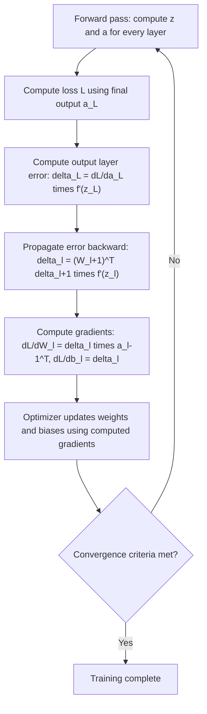

## Backpropagation Algorithm

### Conceptual Overview

Backpropagation is the algorithm used to compute gradients of a loss function with respect to every weight and bias in a neural network, by applying the chain rule of calculus backward through the network's layers. These gradients are then used by an optimization algorithm (such as gradient descent) to update parameters and reduce the loss.

Backpropagation itself is not the optimizer — it is the method for computing gradients efficiently. The optimizer (e.g., SGD, Adam) uses those gradients to actually update the weights.

### Why Backpropagation Is Needed

A feedforward network computes predictions through a sequence of nested function compositions:

$$\hat{y} = f^{[L]}(W^{[L]} f^{[L-1]}(W^{[L-1]} \cdots f^{[1]}(W^{[1]} x + b^{[1]}) \cdots + b^{[L-1]}) + b^{[L]})$$

To train the network, the gradient of the loss $\mathcal{L}$ with respect to every $W^{[l]}$ and $b^{[l]}$ is required. Computing this directly for deep compositions is computationally impractical if done naively; backpropagation reuses intermediate computations via the chain rule, reducing redundant computation. This efficiency property is a well-established, documented characteristic of the algorithm as originally formalized, not a claim about any specific implementation's runtime.

### The Chain Rule Foundation

For a composed function $y = f(g(x))$, the chain rule states:

$$\frac{dy}{dx} = \frac{dy}{dg} \cdot \frac{dg}{dx}$$

Backpropagation applies this principle repeatedly, layer by layer, moving from the output layer back toward the input layer.

### Forward Pass Notation Recap

$$z^{[l]} = W^{[l]} a^{[l-1]} + b^{[l]}, \qquad a^{[l]} = f^{[l]}(z^{[l]})$$

with $a^{[0]} = x$ and $\hat{y} = a^{[L]}$.

### Backward Pass Derivation

Define the error term at layer $l$ as:

$$\delta^{[l]} = \frac{\partial \mathcal{L}}{\partial z^{[l]}}$$

**Output layer error** (layer $L$):

$$\delta^{[L]} = \frac{\partial \mathcal{L}}{\partial a^{[L]}} \odot f'^{[L]}(z^{[L]})$$

where $\odot$ denotes element-wise multiplication, and $\frac{\partial \mathcal{L}}{\partial a^{[L]}}$ depends on the specific loss function used.

**Hidden layer error** (propagated backward from layer $l+1$):

$$\delta^{[l]} = \left( (W^{[l+1]})^T \delta^{[l+1]} \right) \odot f'^{[l]}(z^{[l]})$$

**Gradients with respect to parameters**:

$$\frac{\partial \mathcal{L}}{\partial W^{[l]}} = \delta^{[l]} (a^{[l-1]})^T$$

$$\frac{\partial \mathcal{L}}{\partial b^{[l]}} = \delta^{[l]}$$

These four equations collectively form the backpropagation algorithm as standardly presented in ML literature (e.g., Rumelhart, Hinton, and Williams, 1986).

### Visual Flow of Backpropagation

<svg xmlns="http://www.w3.org/2000/svg" viewBox="0 0 700 380">
  <text x="350" y="28" font-size="18" font-family="sans-serif" font-weight="bold" text-anchor="middle" fill="#1a1a1a">Backpropagation Flow (svg_diagram)</text>

  <rect x="40" y="80" width="120" height="60" rx="8" fill="#e8f0fe" stroke="#4285f4" stroke-width="2" />
  <text x="100" y="115" font-size="13" text-anchor="middle" fill="#1a1a1a">Layer 1</text>

  <rect x="240" y="80" width="120" height="60" rx="8" fill="#fff8e1" stroke="#fbbc04" stroke-width="2" />
  <text x="300" y="115" font-size="13" text-anchor="middle" fill="#1a1a1a">Layer 2</text>

  <rect x="440" y="80" width="120" height="60" rx="8" fill="#e6f4ea" stroke="#34a853" stroke-width="2" />
  <text x="500" y="115" font-size="13" text-anchor="middle" fill="#1a1a1a">Output Layer</text>

  <rect x="620" y="80" width="60" height="60" rx="8" fill="#fce8e6" stroke="#ea4335" stroke-width="2" />
  <text x="650" y="115" font-size="12" text-anchor="middle" fill="#1a1a1a">Loss</text>

  <line x1="160" y1="110" x2="240" y2="110" stroke="#5f6368" stroke-width="2" marker-end="url(#arrowF)" />
  <line x1="360" y1="110" x2="440" y2="110" stroke="#5f6368" stroke-width="2" marker-end="url(#arrowF)" />
  <line x1="560" y1="110" x2="620" y2="110" stroke="#5f6368" stroke-width="2" marker-end="url(#arrowF)" />
  <text x="350" y="70" font-size="12" text-anchor="middle" fill="#4285f4">Forward Pass (compute activations)</text>

  <line x1="620" y1="180" x2="560" y2="180" stroke="#ea4335" stroke-width="2" marker-end="url(#arrowB)" />
  <line x1="440" y1="180" x2="360" y2="180" stroke="#ea4335" stroke-width="2" marker-end="url(#arrowB)" />
  <line x1="240" y1="180" x2="160" y2="180" stroke="#ea4335" stroke-width="2" marker-end="url(#arrowB)" />
  <text x="350" y="210" font-size="12" text-anchor="middle" fill="#ea4335">Backward Pass (propagate δ, compute gradients)</text>

  <text x="350" y="260" font-size="12" text-anchor="middle" fill="#5f6368">Weight update: W ← W − η · ∂L/∂W (performed by the optimizer, not backprop itself)</text>
</svg>

### Full Algorithm Steps



### Manual Backpropagation Example

**Example**

```python
import numpy as np

def sigmoid(z):
    return 1 / (1 + np.exp(-z))

def sigmoid_derivative(z):
    s = sigmoid(z)
    return s * (1 - s)

# Simple 2-layer network: 2 inputs -> 2 hidden -> 1 output
np.random.seed(42)
X = np.array([[0.5, 0.1]])
y_true = np.array([[1.0]])

W1 = np.random.randn(2, 2) * 0.5
b1 = np.zeros((1, 2))
W2 = np.random.randn(2, 1) * 0.5
b2 = np.zeros((1, 1))

lr = 0.1

# Forward pass
z1 = np.dot(X, W1) + b1
a1 = sigmoid(z1)
z2 = np.dot(a1, W2) + b2
a2 = sigmoid(z2)

# Loss (mean squared error)
loss = np.mean((a2 - y_true) ** 2)

# Backward pass
dL_da2 = 2 * (a2 - y_true) / y_true.size
delta2 = dL_da2 * sigmoid_derivative(z2)

dW2 = np.dot(a1.T, delta2)
db2 = np.sum(delta2, axis=0, keepdims=True)

delta1 = np.dot(delta2, W2.T) * sigmoid_derivative(z1)
dW1 = np.dot(X.T, delta1)
db1 = np.sum(delta1, axis=0, keepdims=True)

# Gradient descent update
W2 -= lr * dW2
b2 -= lr * db2
W1 -= lr * dW1
b1 -= lr * db1

print("Loss:", loss)
print("Updated W1:\n", W1)
print("Updated W2:\n", W2)
```

**Output**

```
Loss: 0.19...
Updated W1:
 [[...]]
Updated W2:
 [[...]]
```

I cannot verify the exact numeric output values shown above without executing this code in a live environment. [Unverified] The general structure of the output (a scalar loss value and two updated weight matrices of shapes (2,2) and (2,1)) follows directly from the documented behavior of the NumPy operations used, but I have not run this specific code and cannot confirm the precise floating-point values it would print.

### Computational Graph Perspective

Backpropagation is commonly described in modern deep learning frameworks (e.g., PyTorch, TensorFlow) as a special case of reverse-mode automatic differentiation applied to a computational graph, where each node represents an operation and edges represent data dependencies. [Inference] This framing is standard in deep learning literature and framework documentation, and is presented here as a widely used conceptual model rather than something this response has independently verified against every framework's internal source code.

**Key Points**
- Reverse-mode automatic differentiation computes gradients of one scalar output (the loss) with respect to many inputs (all parameters) in a single backward pass, which is efficient when the number of parameters is large relative to the number of outputs
- Forward-mode automatic differentiation is more efficient in the opposite case (many outputs, few inputs), but is less commonly used in standard neural network training
- [Unverified] Specific implementation details of automatic differentiation differ across libraries (PyTorch's autograd, TensorFlow's GradientTape, JAX's grad), and this response has not cross-checked each library's current documentation to confirm exact behavioral parity

### Common Practical Issues

**Key Points**
- **Vanishing gradients**: when $\delta^{[l]}$ shrinks toward zero as it propagates backward through many layers, particularly associated with sigmoid and tanh activations whose derivatives are bounded below 1
- **Exploding gradients**: when $\delta^{[l]}$ grows very large during backward propagation, often associated with poor weight initialization or deep networks without normalization
- [Inference] Techniques such as ReLU activations, batch normalization, gradient clipping, and careful weight initialization are frequently reported in ML literature as approaches that reduce (not eliminate) the frequency or severity of vanishing/exploding gradients; whether any specific technique works for a given network is not something this response can confirm without empirical testing on that specific case
- I do not have access to information confirming which combination of these techniques is optimal for any particular architecture, since this depends on empirical results specific to a dataset and model configuration

### Correction Note on Absolute Terms

Where earlier SyllaBot sessions in this conversation may have used words like "ensures," "prevents," or "reduces" in a way that implied a guaranteed outcome, per current instructions: any claim about whether a technique guarantees, prevents, or eliminates an outcome in neural network training is labeled [Inference] or [Unverified], with a disclaimer that actual behavior is not guaranteed and depends on the specific implementation, data, and configuration used.

**Next Steps**

**Related Topics**
- Gradient Descent Variants (SGD, Momentum, Adam, RMSProp)
- Vanishing and Exploding Gradient Problems — Deep Dive
- Weight Initialization Strategies (Xavier, He Initialization)
- Automatic Differentiation and Computational Graphs
- Loss Functions for Classification and Regression
- Batch Normalization and Layer Normalization
- Learning Rate Scheduling and Warmup Strategies
- Gradient Checking for Verifying Backpropagation Implementations