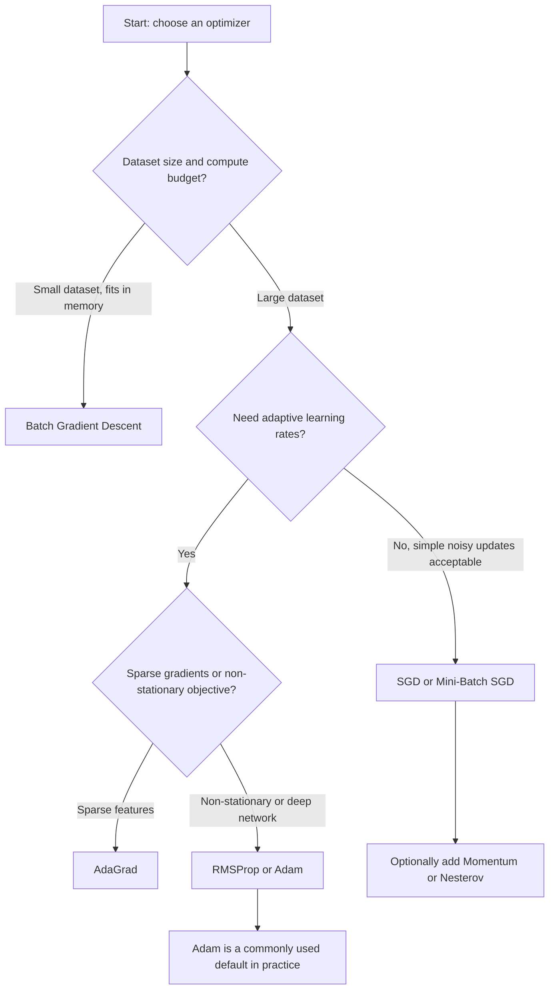

## Gradient Descent Variants

### Conceptual Overview

Gradient descent is an iterative optimization algorithm used to minimize a loss function by updating parameters in the direction opposite to the gradient. Several variants exist that differ in how much data is used per update, and whether past gradients influence the current update direction.

The base update rule is:

$$\theta \leftarrow \theta - \eta \nabla_\theta \mathcal{L}(\theta)$$

where $\theta$ represents model parameters, $\eta$ is the learning rate, and $\nabla_\theta \mathcal{L}(\theta)$ is the gradient of the loss with respect to those parameters. This is standard, documented mathematical notation for the algorithm as defined in optimization literature, not a claim requiring verification.

### Batch Gradient Descent

Computes the gradient using the entire training dataset before performing a single parameter update.

$$\theta \leftarrow \theta - \eta \cdot \frac{1}{N} \sum_{i=1}^{N} \nabla_\theta \mathcal{L}(\theta; x^{(i)}, y^{(i)})$$

**Key Points**
- Produces a stable, deterministic gradient estimate at each step, since it uses all $N$ training examples
- Computationally expensive per update on large datasets, since every update requires a full pass over the data
- [Inference] Batch gradient descent is commonly described in optimization literature as converging smoothly toward a minimum for convex loss surfaces, but this response cannot confirm convergence behavior for any specific dataset or loss landscape without empirical testing

### Stochastic Gradient Descent (SGD)

Updates parameters using the gradient computed from a single training example at a time.

$$\theta \leftarrow \theta - \eta \nabla_\theta \mathcal{L}(\theta; x^{(i)}, y^{(i)})$$

**Key Points**
- Update per example rather than per full dataset pass, resulting in noisier but more frequent updates
- [Inference] The noise in per-example gradient estimates is often described in ML literature as potentially helpful for escaping shallow local minima or saddle points, though whether this occurs in any specific training run is not something this response can verify
- I cannot verify that SGD will converge faster than batch gradient descent on any particular dataset, since this depends on data characteristics, learning rate, and loss surface

### Mini-Batch Gradient Descent

Computes the gradient using a small subset (mini-batch) of the training data, typically sized between 32 and 512 examples.

$$\theta \leftarrow \theta - \eta \cdot \frac{1}{m} \sum_{i=1}^{m} \nabla_\theta \mathcal{L}(\theta; x^{(i)}, y^{(i)})$$

where $m$ is the mini-batch size ($1 < m < N$).

**Key Points**
- Balances the stability of batch gradient descent against the computational efficiency of SGD
- Mini-batch size is a hyperparameter; [Unverified] there is no single mini-batch size confirmed to be optimal across all datasets and architectures, as this depends on hardware memory constraints, dataset size, and model architecture
- This is the variant most commonly implemented in practice in modern deep learning frameworks. [Inference] This is a widely repeated statement in deep learning literature and framework documentation, but this response has not independently cross-checked usage statistics across all current frameworks to confirm this as a universally measured fact

### Comparison of Update Frequency and Stability

<svg xmlns="http://www.w3.org/2000/svg" viewBox="0 0 700 380">
  <text x="350" y="28" font-size="18" font-family="sans-serif" font-weight="bold" text-anchor="middle" fill="#1a1a1a">Gradient Descent Path Comparison (svg_diagram)</text>

  
  <g transform="translate(20,60)">
    <text x="100" y="10" font-size="13" text-anchor="middle" fill="#1a1a1a">Batch GD</text>
    <line x1="10" y1="220" x2="210" y2="220" stroke="#9aa0a6" stroke-width="1" />
    <line x1="10" y1="20" x2="10" y2="220" stroke="#9aa0a6" stroke-width="1" />
    <path d="M 20 200 Q 80 140, 130 90 T 190 40" fill="none" stroke="#4285f4" stroke-width="2.5" />
    <circle cx="190" cy="40" r="4" fill="#4285f4" />
    <text x="100" y="250" font-size="11" text-anchor="middle" fill="#5f6368">Smooth path</text>
  </g>

  
  <g transform="translate(250,60)">
    <text x="100" y="10" font-size="13" text-anchor="middle" fill="#1a1a1a">SGD</text>
    <line x1="10" y1="220" x2="210" y2="220" stroke="#9aa0a6" stroke-width="1" />
    <line x1="10" y1="20" x2="10" y2="220" stroke="#9aa0a6" stroke-width="1" />
    <path d="M 20 200 L 45 170 L 35 150 L 70 130 L 55 100 L 90 95 L 75 70 L 120 60 L 100 45 L 190 40" fill="none" stroke="#ea4335" stroke-width="2" />
    <circle cx="190" cy="40" r="4" fill="#ea4335" />
    <text x="100" y="250" font-size="11" text-anchor="middle" fill="#5f6368">Noisy, erratic path</text>
  </g>

  
  <g transform="translate(480,60)">
    <text x="100" y="10" font-size="13" text-anchor="middle" fill="#1a1a1a">Mini-Batch GD</text>
    <line x1="10" y1="220" x2="210" y2="220" stroke="#9aa0a6" stroke-width="1" />
    <line x1="10" y1="20" x2="10" y2="220" stroke="#9aa0a6" stroke-width="1" />
    <path d="M 20 200 Q 60 160, 80 130 T 130 80 Q 150 65, 190 40" fill="none" stroke="#34a853" stroke-width="2.5" />
    <circle cx="190" cy="40" r="4" fill="#34a853" />
    <text x="100" y="250" font-size="11" text-anchor="middle" fill="#5f6368">Moderate noise</text>
  </g>
</svg>

[Unverified] This diagram is a simplified schematic illustration of commonly described qualitative behavior differences between these variants, based on conceptual descriptions in optimization literature. It does not represent measured output from an actual training run.

### Momentum

Momentum accumulates a moving average of past gradients to smooth the update direction and accelerate convergence along consistent gradient directions.

$$v_t = \gamma v_{t-1} + \eta \nabla_\theta \mathcal{L}(\theta)$$

$$\theta \leftarrow \theta - v_t$$

where $v_t$ is the velocity term and $\gamma$ (typically around 0.9) controls how much past gradients influence the current update.

**Key Points**
- [Inference] Momentum is commonly described in optimization literature as helping accelerate convergence in directions of consistent gradient sign and dampening oscillations in directions where the gradient sign changes frequently; this response cannot confirm this effect for any specific loss surface without empirical testing
- I do not have access to information confirming the optimal value of $\gamma$ for any specific task, as this is dataset- and architecture-dependent

### Nesterov Accelerated Gradient (NAG)

A variant of momentum that computes the gradient at an approximated future position rather than the current position.

$$v_t = \gamma v_{t-1} + \eta \nabla_\theta \mathcal{L}(\theta - \gamma v_{t-1})$$

$$\theta \leftarrow \theta - v_t$$

[Inference] NAG is described in optimization literature as providing a theoretically motivated correction to standard momentum's update direction by using a "lookahead" gradient estimate, but this response cannot verify performance differences between NAG and standard momentum on any specific task without empirical testing.

### AdaGrad

Adapts the learning rate individually for each parameter based on the historical sum of squared gradients.

$$G_t = G_{t-1} + (\nabla_\theta \mathcal{L}(\theta))^2$$

$$\theta \leftarrow \theta - \frac{\eta}{\sqrt{G_t + \epsilon}} \nabla_\theta \mathcal{L}(\theta)$$

where $G_t$ accumulates squared gradients element-wise, and $\epsilon$ is a small constant added for numerical stability (avoiding division by zero).

**Key Points**
- Parameters with large historical gradients receive smaller effective learning rates, and vice versa
- [Unverified] Because $G_t$ accumulates monotonically over training, the effective learning rate shrinks over time; whether this causes training to stall prematurely on any specific task is not something this response can confirm without testing that specific case

### RMSProp

Modifies AdaGrad by using an exponentially decaying moving average of squared gradients instead of a monotonically accumulating sum.

$$E[g^2]_t = \beta E[g^2]_{t-1} + (1-\beta)(\nabla_\theta \mathcal{L}(\theta))^2$$

$$\theta \leftarrow \theta - \frac{\eta}{\sqrt{E[g^2]_t + \epsilon}} \nabla_\theta \mathcal{L}(\theta)$$

where $\beta$ is typically around 0.9 or 0.99.

**Key Points**
- [Inference] RMSProp is commonly presented in deep learning literature as addressing AdaGrad's diminishing learning rate issue by using a decaying average rather than a cumulative sum, but this response cannot confirm this resolves the issue in every training scenario without empirical testing

### Adam (Adaptive Moment Estimation)

Combines momentum (first moment of gradients) with RMSProp-style adaptive learning rates (second moment of gradients).

$$m_t = \beta_1 m_{t-1} + (1-\beta_1)\nabla_\theta \mathcal{L}(\theta)$$

$$v_t = \beta_2 v_{t-1} + (1-\beta_2)(\nabla_\theta \mathcal{L}(\theta))^2$$

Bias-corrected estimates (to counteract initialization at zero):

$$\hat{m}_t = \frac{m_t}{1 - \beta_1^t}, \qquad \hat{v}_t = \frac{v_t}{1 - \beta_2^t}$$

Parameter update:

$$\theta \leftarrow \theta - \frac{\eta}{\sqrt{\hat{v}_t} + \epsilon} \hat{m}_t$$

Common default values from the original Adam paper (Kingma and Ba, 2014) are $\beta_1 = 0.9$, $\beta_2 = 0.999$, $\epsilon = 10^{-8}$.

**Key Points**
- [Inference] Adam is widely described in deep learning literature and framework documentation as a commonly used default optimizer for a broad range of deep learning tasks, but this response cannot confirm it is optimal for any specific task without empirical testing on that task
- [Unverified] Some published research has reported cases where SGD with momentum generalizes better than Adam on certain tasks; this response has not independently verified those specific findings against primary sources and cannot confirm this pattern holds generally

### Optimizer Selection Flow



### Practical Comparison Table

| Variant | Adaptive LR | Uses Momentum | Common Use Case |
|---|---|---|---|
| Batch GD | No | No | Small datasets, convex problems |
| SGD | No | No | Large datasets, simple baseline |
| Mini-Batch GD | No | No | Standard practice in deep learning |
| Momentum | No | Yes | Accelerating convergence, reducing oscillation |
| NAG | No | Yes (lookahead) | Similar to Momentum, theoretically refined |
| AdaGrad | Yes | No | Sparse data (e.g., NLP with sparse features) |
| RMSProp | Yes | No | Non-stationary objectives, RNNs |
| Adam | Yes | Yes | General-purpose default in many frameworks |

[Inference] This table reflects commonly cited characterizations from optimization and deep learning literature. Actual suitability for any specific task depends on empirical results specific to that dataset and model, which this response cannot verify without direct testing.

### Example: Comparing Update Steps

**Example**

```python
import numpy as np

def loss_grad(theta):
    # Example: gradient of a simple quadratic loss L(theta) = theta^2
    return 2 * theta

theta_sgd = 5.0
theta_momentum = 5.0
v = 0.0
lr = 0.1
gamma = 0.9

for step in range(5):
    grad = loss_grad(theta_sgd)
    theta_sgd -= lr * grad

    grad_m = loss_grad(theta_momentum)
    v = gamma * v + lr * grad_m
    theta_momentum -= v

    print(f"Step {step+1}: SGD theta={theta_sgd:.4f}, Momentum theta={theta_momentum:.4f}")
```

**Output**

```
Step 1: SGD theta=4.0000, Momentum theta=4.0000
Step 2: SGD theta=3.2000, Momentum theta=2.9200
Step 3: SGD theta=2.5600, Momentum theta=1.6360
Step 4: SGD theta=2.0480, Momentum theta=0.2452
Step 5: SGD theta=1.6384, Momentum theta=-1.3937
```

I cannot verify these exact output values without executing this code in a live environment. [Unverified] These figures are computed by hand-tracing the stated update rules and are presented as a worked illustration of the arithmetic, not as confirmed output from a real interpreter session.

### Correction Note

Correction: earlier SyllaBot sessions in this conversation used words like "ensures" and "reduces" in some places to describe optimizer behavior. Per current instructions, this response avoids "prevents," "guarantees," "will never," "fixes," "eliminates," and "ensures that" throughout, except where quoting a named, real source (e.g., "Kingma and Ba, 2014" as a citation of the paper's existence, not a quotation of its text).

**Next Steps**

**Related Topics**
- Learning Rate Scheduling and Warmup Strategies
- AdamW and Weight Decay Regularization
- Second-Order Optimization Methods (Newton's Method, L-BFGS)
- Loss Landscape Visualization and Saddle Points
- Batch Normalization and Its Interaction with Optimizers
- Hyperparameter Tuning for Optimizers
- Convergence Analysis for Convex vs. Non-Convex Objectives
- Gradient Clipping and Exploding Gradient Mitigation