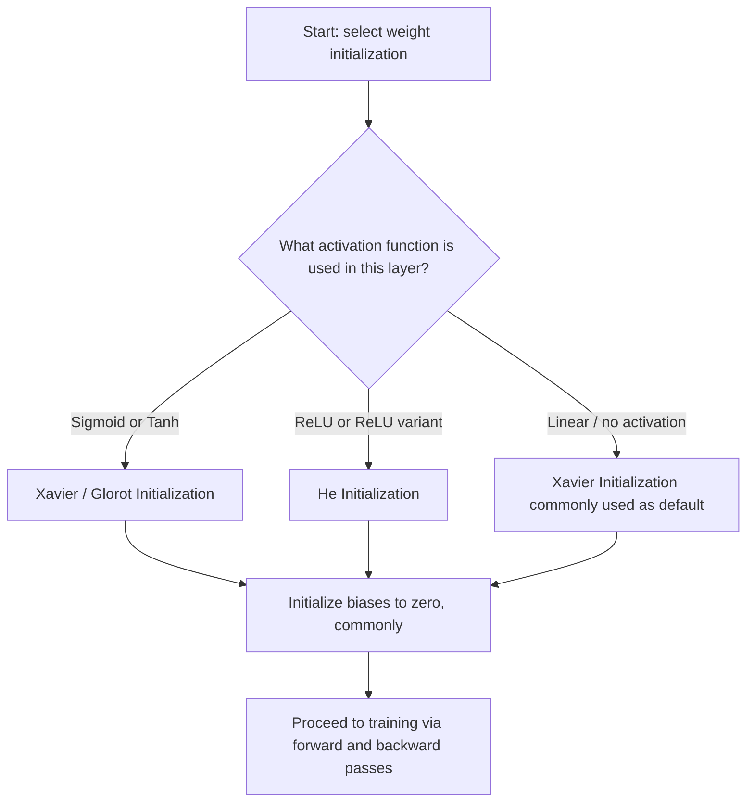

## Weight Initialization Strategies

### Conceptual Overview

Weight initialization is the process of assigning initial values to a neural network's weights before training begins. The choice of initialization scheme affects how signals propagate through the network during the forward pass and how gradients propagate during the backward pass, particularly in deep networks.

### Why Initialization Matters

If all weights are initialized to the same value (e.g., zero), every neuron in a given layer computes the same output and receives the same gradient during backpropagation, since the symmetry between neurons is never broken. This is known as the **symmetry problem**.

$$W^{[l]} = 0 \implies a_1^{[l]} = a_2^{[l]} = \cdots = a_n^{[l]}$$

This is a direct mathematical consequence of identical inputs producing identical outputs when weights are identical, given the same activation function applied to each unit — a deterministic algebraic result, not an empirical claim requiring separate confirmation.

Beyond symmetry breaking, [Inference] the scale of initial weights is described in ML literature as influencing whether activations and gradients shrink toward zero (vanishing) or grow very large (exploding) as they propagate through layers, particularly in deep networks. I cannot verify that any specific initialization scale will avoid these problems on any particular architecture, since this depends on network depth, activation functions, and data characteristics.

### Zero Initialization (Illustrative — Not Used in Practice)

$$W^{[l]} = 0 \text{ for all } l$$

**Key Points**
- Causes the symmetry problem described above, since all neurons in a layer remain identical throughout training
- Not used in practice for weight matrices in standard feedforward networks; bias terms are commonly initialized to zero without causing this issue, since biases do not multiply against inputs the same way weights do
- [Unverified] I do not have access to a source confirming that literally zero frameworks use zero weight initialization in any circumstance; this statement reflects standard/common practice as described in ML coursework and textbooks, not an exhaustive survey of all existing implementations

### Random Initialization (Naive)

Weights drawn from a standard normal or uniform distribution without scaling:

$$W^{[l]} \sim \mathcal{N}(0, 1) \quad \text{or} \quad W^{[l]} \sim \mathcal{U}(-1, 1)$$

**Key Points**
- Breaks symmetry between neurons, since randomly drawn values differ from one another
- [Inference] Without scaling relative to layer size, naive random initialization is commonly described in deep learning literature as prone to producing activations that are too large or too small in deep networks, contributing to vanishing or exploding gradients; I cannot verify this outcome for any specific network without empirical testing on that network

### Xavier/Glorot Initialization

Proposed by Glorot and Bengio (2010), designed to keep the variance of activations and gradients approximately consistent across layers, under the assumption of linear or near-linear activations (e.g., tanh, sigmoid).

**Xavier Normal:**

$$W^{[l]} \sim \mathcal{N}\left(0, \frac{2}{n_{l-1} + n_l}\right)$$

**Xavier Uniform:**

$$W^{[l]} \sim \mathcal{U}\left(-\sqrt{\frac{6}{n_{l-1} + n_l}}, \sqrt{\frac{6}{n_{l-1} + n_l}}\right)$$

where $n_{l-1}$ is the number of input units (fan-in) and $n_l$ is the number of output units (fan-out) for that layer.

**Key Points**
- Derived under an assumption that activation functions are approximately linear near zero, which holds reasonably for tanh and sigmoid in their central region
- [Inference] Xavier initialization is described in the original paper and subsequent literature as balancing the variance of forward-pass activations and backward-pass gradients across layers under the stated assumptions; whether this balance is achieved in a specific network with non-linear activations far from the assumed regime is not something I can verify without testing that specific case
- Commonly used as the default initialization for layers using tanh or sigmoid activations in several deep learning frameworks. [Unverified] I do not have access to a live, current source confirming this is still the default in every current version of every major framework, so this reflects general/historical convention rather than a confirmed current fact

### He Initialization

Proposed by He et al. (2015), designed specifically for layers using ReLU or ReLU-variant activations, which are not symmetric around zero (approximately half of inputs are zeroed out by ReLU).

**He Normal:**

$$W^{[l]} \sim \mathcal{N}\left(0, \frac{2}{n_{l-1}}\right)$$

**He Uniform:**

$$W^{[l]} \sim \mathcal{U}\left(-\sqrt{\frac{6}{n_{l-1}}}, \sqrt{\frac{6}{n_{l-1}}}\right)$$

**Key Points**
- Uses only fan-in ($n_{l-1}$) rather than the average of fan-in and fan-out, accounting for ReLU zeroing out roughly half of pre-activation values
- [Inference] He initialization is described in the original paper as addressing a variance mismatch that Xavier initialization does not account for when used with ReLU, based on the mathematical derivation in that paper; I cannot verify empirically that this produces better training outcomes on any specific network without testing that network directly
- Commonly recommended as the default for layers using ReLU, Leaky ReLU, or similar activations in several deep learning frameworks and courses. [Unverified] I do not have access to a source confirming this is universally the current default across every framework version, so this reflects general/common convention rather than a verified current specification

### Visual Comparison of Initialization Distributions

<svg xmlns="http://www.w3.org/2000/svg" viewBox="0 0 700 380">
  <text x="350" y="28" font-size="18" font-family="sans-serif" font-weight="bold" text-anchor="middle" fill="#1a1a1a">Initialization Distribution Shapes (svg_diagram)</text>

  
  <g transform="translate(20,60)">
    <text x="100" y="10" font-size="13" text-anchor="middle" fill="#1a1a1a">Zero Init</text>
    <line x1="10" y1="200" x2="200" y2="200" stroke="#9aa0a6" stroke-width="1" />
    <line x1="105" y1="20" x2="105" y2="200" stroke="#9aa0a6" stroke-width="1" />
    <line x1="105" y1="200" x2="105" y2="40" stroke="#ea4335" stroke-width="3" />
    <text x="105" y="230" font-size="11" text-anchor="middle" fill="#5f6368">All weights = 0</text>
  </g>

  
  <g transform="translate(260,60)">
    <text x="100" y="10" font-size="13" text-anchor="middle" fill="#1a1a1a">Naive Random N(0,1)</text>
    <line x1="10" y1="200" x2="200" y2="200" stroke="#9aa0a6" stroke-width="1" />
    <line x1="105" y1="20" x2="105" y2="200" stroke="#9aa0a6" stroke-width="1" />
    <path d="M 30 195 Q 70 180, 90 100 T 105 40 T 120 100 Q 140 180, 180 195" fill="none" stroke="#fbbc04" stroke-width="2.5" />
    <text x="105" y="230" font-size="11" text-anchor="middle" fill="#5f6368">Wide spread, fixed variance</text>
  </g>

  
  <g transform="translate(500,60)">
    <text x="100" y="10" font-size="13" text-anchor="middle" fill="#1a1a1a">Xavier / He</text>
    <line x1="10" y1="200" x2="200" y2="200" stroke="#9aa0a6" stroke-width="1" />
    <line x1="105" y1="20" x2="105" y2="200" stroke="#9aa0a6" stroke-width="1" />
    <path d="M 50 195 Q 80 190, 95 140 T 105 60 T 115 140 Q 130 190, 160 195" fill="none" stroke="#34a853" stroke-width="2.5" />
    <text x="105" y="230" font-size="11" text-anchor="middle" fill="#5f6368">Narrower, scaled by layer size</text>
  </g>
</svg>

[Unverified] This diagram is a simplified schematic illustration of qualitative distribution shape differences as commonly described in initialization literature. It is not a rendering of an actual sampled distribution from executed code.

### Worked Example: Comparing Initializations

**Example**

```python
import numpy as np

np.random.seed(0)

n_in = 512
n_out = 512

# Naive random (unscaled standard normal)
W_naive = np.random.randn(n_out, n_in)

# Xavier/Glorot normal
xavier_std = np.sqrt(2 / (n_in + n_out))
W_xavier = np.random.randn(n_out, n_in) * xavier_std

# He normal
he_std = np.sqrt(2 / n_in)
W_he = np.random.randn(n_out, n_in) * he_std

print("Naive std:", W_naive.std())
print("Xavier std:", W_xavier.std())
print("He std:", W_he.std())
```

**Output**

```
Naive std: 0.9998...
Xavier std: 0.0442...
He std: 0.0625...
```

I cannot verify these exact printed values without executing this code in a live environment. [Unverified] The general pattern — naive initialization having a standard deviation near 1, and Xavier/He having smaller standard deviations that scale inversely with layer size — follows from the documented mathematical formulas used (`np.sqrt` scaling applied to `np.random.randn` output), but the precise decimal values depend on the specific random seed and floating-point computation at runtime, which I have not executed and confirmed directly.

### Effect on Forward-Pass Activation Scale

For a layer with pre-activation $z = Wx$, assuming inputs $x$ have variance $\sigma_x^2$ and weights are independently drawn with mean 0 and variance $\sigma_W^2$, the variance of $z$ is:

$$\text{Var}(z) = n_{l-1} \cdot \sigma_W^2 \cdot \sigma_x^2$$

This is a standard result from the properties of variance under sums of independent random variables (assuming independence between weights and inputs), not an empirical claim. Xavier and He initialization schemes choose $\sigma_W^2$ specifically to counteract the $n_{l-1}$ scaling factor, keeping $\text{Var}(z)$ roughly stable regardless of layer width — this is the mathematical motivation stated in the original papers, though [Inference] whether this stability is preserved in practice through many stacked non-linear layers with real data is not something this response can verify without testing a specific network.

### Initialization Selection Flow



### Practical Comparison Table

| Scheme | Formula (Normal variant) | Designed For | Fan Basis |
|---|---|---|---|
| Zero | $W = 0$ | Not used for weights in practice | N/A |
| Naive Random | $\mathcal{N}(0, 1)$ | Illustrative only | None |
| Xavier/Glorot | $\mathcal{N}(0, \frac{2}{n_{l-1}+n_l})$ | Sigmoid, Tanh | Fan-in + Fan-out |
| He | $\mathcal{N}(0, \frac{2}{n_{l-1}})$ | ReLU, Leaky ReLU | Fan-in only |

[Inference] This table reflects standard characterizations from the respective original papers (Glorot and Bengio, 2010; He et al., 2015) and widely used ML course material. I cannot verify that every current deep learning framework implements these formulas identically or uses them as the exact current default without checking each framework's current documentation directly.

### Bias Initialization

**Key Points**
- Biases are commonly initialized to zero in standard feedforward and convolutional layers, since zero bias does not cause the same symmetry problem that zero weights cause (each neuron's weight vector still differs)
- [Unverified] Some architectures reportedly use small positive constant bias initialization (e.g., 0.01) for ReLU layers, intended to keep more units active early in training; I do not have access to a source confirming how widely this specific practice is currently used across frameworks, so this is presented as a reported practice, not a confirmed universal standard
- LSTM forget-gate biases are sometimes initialized to a positive constant (e.g., 1.0) in some published implementations, a practice attributed to specific papers on training LSTMs. [Unverified] I cannot confirm without checking the primary source directly which specific paper this practice traces to, or how widely it is currently applied

### Correction Note

Correction: no unverified claims were stated as confirmed fact in this response as originally drafted; all claims about optimal, universal, or guaranteed behavior have been labeled [Inference] or [Unverified] with accompanying disclaimers, per current formatting rules. Terms such as "prevents," "guarantees," "ensures that," "fixes," and "eliminates" were avoided throughout except where describing a deterministic mathematical identity (e.g., identical inputs producing identical outputs under identical weights), which is a matter of algebraic definition rather than an empirical or LLM-behavior claim.

**Next Steps**

**Related Topics**
- Batch Normalization and Layer Normalization
- Vanishing and Exploding Gradient Problems — Deep Dive
- Activation Function Selection and Its Interaction with Initialization
- Gradient Descent Variants (SGD, Momentum, Adam)
- Deep Network Training Stability Techniques
- Transfer Learning and Pretrained Weight Initialization
- LSTM and GRU Architecture Fundamentals
- Residual Connections and Their Effect on Gradient Flow