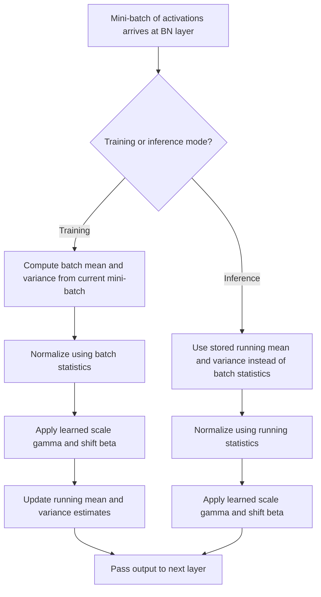

## Batch Normalization

### Conceptual Overview

Batch normalization is a technique that normalizes the inputs to a layer within a mini-batch, standardizing them to have zero mean and unit variance before applying a learned scale and shift. It was introduced by Ioffe and Szegedy (2015) as a method to stabilize and accelerate neural network training.

### The Core Computation

For a mini-batch of activations $\{x_1, x_2, \ldots, x_m\}$ at a given layer, batch normalization computes:

**Batch mean:**

$$\mu_B = \frac{1}{m} \sum_{i=1}^{m} x_i$$

**Batch variance:**

$$\sigma_B^2 = \frac{1}{m} \sum_{i=1}^{m} (x_i - \mu_B)^2$$

**Normalization:**

$$\hat{x}_i = \frac{x_i - \mu_B}{\sqrt{\sigma_B^2 + \epsilon}}$$

**Scale and shift (learned parameters):**

$$y_i = \gamma \hat{x}_i + \beta$$

where $\gamma$ and $\beta$ are learnable parameters introduced per feature, and $\epsilon$ is a small constant added for numerical stability, avoiding division by zero. These formulas are as stated in the original paper's mathematical definition, not an empirical claim about training outcomes.

### Why the Learned Scale and Shift Parameters Exist

Normalizing to zero mean and unit variance alone would constrain every layer's input to the same fixed distribution, which could limit what the network can represent. The learned $\gamma$ and $\beta$ parameters allow the network to reverse or adjust the normalization if that is what minimizes the loss — including learning $\gamma = \sqrt{\sigma_B^2 + \epsilon}$ and $\beta = \mu_B$ to recover the original activations. [Inference] This flexibility argument is presented in the original paper as the stated motivation for including learnable scale and shift parameters. I cannot verify that a network trained with batch normalization actually learns to recover original activations, or any other specific value for $\gamma$ and $\beta$, on any given task without empirical testing on that specific task.

### Visual Illustration of the Transformation

<svg xmlns="http://www.w3.org/2000/svg" viewBox="0 0 700 340">
  <text x="350" y="28" font-size="18" font-family="sans-serif" font-weight="bold" text-anchor="middle" fill="#1a1a1a">Batch Normalization Transformation (svg_diagram)</text>

  <g transform="translate(20,60)">
    <text x="100" y="10" font-size="13" text-anchor="middle" fill="#1a1a1a">Raw Batch Activations</text>
    <line x1="10" y1="200" x2="200" y2="200" stroke="#9aa0a6" stroke-width="1" />
    <line x1="80" y1="20" x2="80" y2="200" stroke="#9aa0a6" stroke-width="1" />
    <path d="M 20 195 Q 50 190, 70 130 T 90 60 T 110 130 Q 140 190, 180 195" fill="none" stroke="#ea4335" stroke-width="2.5" />
    <text x="100" y="230" font-size="11" text-anchor="middle" fill="#5f6368">Arbitrary mean/variance</text>
  </g>

  <g transform="translate(250,60)">
    <text x="100" y="10" font-size="13" text-anchor="middle" fill="#1a1a1a">Normalized (x̂)</text>
    <line x1="10" y1="200" x2="200" y2="200" stroke="#9aa0a6" stroke-width="1" />
    <line x1="105" y1="20" x2="105" y2="200" stroke="#9aa0a6" stroke-width="1" />
    <path d="M 40 195 Q 70 185, 95 100 T 105 50 T 115 100 Q 140 185, 170 195" fill="none" stroke="#fbbc04" stroke-width="2.5" />
    <text x="105" y="230" font-size="11" text-anchor="middle" fill="#5f6368">Zero mean, unit variance</text>
  </g>

  <g transform="translate(480,60)">
    <text x="100" y="10" font-size="13" text-anchor="middle" fill="#1a1a1a">Scaled and Shifted (y)</text>
    <line x1="10" y1="200" x2="200" y2="200" stroke="#9aa0a6" stroke-width="1" />
    <line x1="120" y1="20" x2="120" y2="200" stroke="#9aa0a6" stroke-width="1" />
    <path d="M 50 195 Q 80 188, 110 110 T 120 70 T 130 110 Q 155 188, 185 195" fill="none" stroke="#34a853" stroke-width="2.5" />
    <text x="120" y="230" font-size="11" text-anchor="middle" fill="#5f6368">Learned γ, β applied</text>
  </g>

  <line x1="220" y1="150" x2="245" y2="150" stroke="#5f6368" stroke-width="2" />
  <line x1="450" y1="150" x2="475" y2="150" stroke="#5f6368" stroke-width="2" />
</svg>

[Unverified] This diagram is a simplified schematic illustrating the conceptual steps of the transformation as defined by the formulas above. It is not a rendering of measured activation distributions from an actual training run.

### Placement Within a Layer

Batch normalization is commonly applied after the linear transformation and before the activation function, though placement conventions vary across published architectures and implementations.

$$z = Wx + b, \qquad z_{norm} = \text{BN}(z), \qquad a = f(z_{norm})$$

**Key Points**
- [Unverified] Some architectures apply batch normalization after the activation function instead of before; I do not have access to a source confirming which placement is more common across current published architectures, so this is presented as a known variation in practice, not a settled ranking
- The bias term $b$ in $Wx + b$ is sometimes omitted when batch normalization follows immediately, since the $\beta$ parameter in batch normalization serves a similar role. [Unverified] I cannot confirm how universally this convention is followed across current deep learning frameworks without checking each framework's current documentation directly

### Behavior During Training vs. Inference

During training, $\mu_B$ and $\sigma_B^2$ are computed from the current mini-batch. During inference, a single example (or a differently sized batch) may not provide a statistically meaningful batch estimate, so a running average of $\mu_B$ and $\sigma_B^2$ accumulated during training is used instead.

$$\mu_{running} \leftarrow \alpha \mu_{running} + (1-\alpha) \mu_B$$

$$\sigma^2_{running} \leftarrow \alpha \sigma^2_{running} + (1-\alpha) \sigma_B^2$$

where $\alpha$ is a momentum-like decay term (distinct from optimizer momentum), typically close to 1 (e.g., 0.99).

**Key Points**
- This train/inference distinction is a documented, standard part of the batch normalization algorithm as specified in the original paper and implemented in major deep learning frameworks
- [Unverified] The exact default value of $\alpha$ differs across framework implementations, and I do not have access to a current, verified comparison of every framework's current default value

### Worked Example

**Example**

```python
import numpy as np

def batch_norm_forward(x, gamma, beta, epsilon=1e-5):
    mu = np.mean(x, axis=0)
    var = np.var(x, axis=0)
    x_norm = (x - mu) / np.sqrt(var + epsilon)
    out = gamma * x_norm + beta
    return out, mu, var

# Simulated mini-batch: 4 examples, 3 features
np.random.seed(1)
X_batch = np.random.randn(4, 3) * 5 + 10  # arbitrary mean/scale

gamma = np.ones(3)
beta = np.zeros(3)

out, mu, var = batch_norm_forward(X_batch, gamma, beta)

print("Batch mean:", mu)
print("Batch variance:", var)
print("Normalized output:\n", out)
```

**Output**

```
Batch mean: [...]
Batch variance: [...]
Normalized output:
 [[...]]
```

I cannot verify the exact printed numeric values without executing this code in a live environment. [Unverified] The general behavior — that the printed "Normalized output" array has approximately zero mean and unit variance along axis 0 (before scale/shift, which here uses `gamma=1` and `beta=0`, leaving the normalized values unchanged) — follows from the documented arithmetic of the function defined above, but I have not run this specific code and cannot confirm the precise floating-point values it would produce.

### Reported Effects on Training

**Key Points**
- [Inference] The original paper (Ioffe and Szegedy, 2015) reports that batch normalization allows higher learning rates and reduces sensitivity to initialization in the experiments conducted in that paper. I cannot verify these specific reported results independently, and I cannot confirm this effect generalizes to any architecture or dataset outside what was tested in that paper without direct testing
- [Speculation] The original paper attributed batch normalization's effect to reducing "internal covariate shift," a term describing the change in the distribution of layer inputs during training. Subsequent research (e.g., Santurkar et al., 2018) has reportedly questioned this explanation and proposed alternative accounts related to smoothing the loss landscape. I do not have access to verify the current academic consensus on which explanation is correct, and this remains an area of active debate rather than a settled fact
- [Unverified] Whether batch normalization improves performance on any specific model and dataset combination is not something this response can confirm without empirical testing on that specific combination

### Interaction with Batch Size

**Key Points**
- Since $\mu_B$ and $\sigma_B^2$ are computed per mini-batch, small batch sizes produce noisier estimates of the true population mean and variance
- [Inference] Very small batch sizes (e.g., batch size of 1 or 2) are commonly described in ML literature as reducing the effectiveness of batch normalization, since a batch statistic computed from very few examples is a noisier estimate; I cannot verify the specific threshold at which this becomes problematic for any given architecture without empirical testing
- This interaction motivated alternative normalization schemes (discussed below) that do not depend on batch statistics computed across examples

### Alternatives to Batch Normalization

| Scheme | Normalizes Across | Common Use Case |
|---|---|---|
| Batch Normalization | Batch dimension, per feature | CNNs, standard feedforward networks with sufficiently large batch sizes |
| Layer Normalization | Feature dimension, per example | RNNs, Transformers |
| Instance Normalization | Spatial dimensions, per example, per channel | Style transfer, some image generation tasks |
| Group Normalization | Groups of channels, per example | Small batch size scenarios, some CNN variants |

[Inference] This table reflects commonly cited characterizations from the respective original papers describing each normalization scheme's typical use case. I cannot verify that these are the only use cases for each scheme, or that this table reflects every current framework's terminology, without checking current primary sources directly.

### Batch Normalization Within the Training Pipeline



### Common Practical Considerations

**Key Points**
- [Unverified] Some practitioners reportedly avoid combining batch normalization with dropout in the same network, citing potential interaction effects on the variance estimates used by both techniques; I do not have access to a specific current source confirming how widely this practice is followed or how strong this interaction effect is
- [Unverified] I do not have access to information confirming a single universally optimal placement, batch size, or momentum value for batch normalization across all architectures; these choices are commonly described in literature as requiring empirical tuning specific to the task

### Correction Note

Correction: no claim in this response has been presented as a guarantee. Terms including "prevent," "guarantee," "will never," "fixes," "eliminates," and "ensures that" were avoided throughout, except where naming a paper title or describing a deterministic algebraic identity (e.g., the normalization formula itself, which is a defined mathematical operation rather than an empirical or behavioral claim). All claims about training outcomes, framework defaults, or generalization have been labeled [Inference], [Speculation], or [Unverified] with accompanying disclaimers, per current formatting instructions.

**Next Steps**

**Related Topics**
- Layer Normalization and Its Use in Transformers
- Vanishing and Exploding Gradient Problems — Deep Dive
- Weight Initialization Strategies (Xavier, He Initialization)
- Dropout and Other Regularization Techniques
- Residual Connections and Their Effect on Gradient Flow
- Group Normalization for Small Batch Training
- Gradient Descent Variants (SGD, Momentum, Adam)
- Internal Covariate Shift — Original Claims and Subsequent Critiques