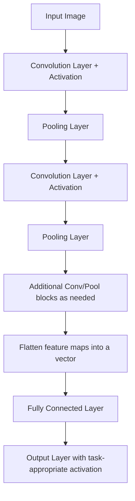

## Convolutional Neural Networks

### Conceptual Overview

Convolutional neural networks (CNNs) are a class of neural networks designed primarily for processing grid-structured data, such as images, by applying learned filters that slide across the input and detect local spatial patterns. The core operation is the convolution, which exploits spatial locality and parameter sharing to reduce the number of learnable parameters relative to a fully connected layer processing the same input.

### The Convolution Operation

For a 2D input (e.g., a single-channel image) $X$ and a filter (kernel) $K$ of size $k \times k$, the convolution at output position $(i, j)$ is:

$$S(i,j) = \sum_{m=0}^{k-1} \sum_{n=0}^{k-1} X(i+m, j+n) \cdot K(m,n)$$

This is a standard mathematical definition of discrete 2D cross-correlation as used in deep learning frameworks — deep learning literature commonly calls this operation "convolution" even though it technically omits the kernel-flipping step used in the strict signal-processing definition of convolution. This terminology distinction is a documented convention difference between fields, not a claim requiring empirical verification.

### Key Convolution Parameters

**Key Points**
- **Kernel size**: the spatial dimensions of the filter (e.g., $3\times3$, $5\times5$); determines the local receptive field size per convolution step
- **Stride**: the step size the filter moves across the input; a stride of 2 skips every other position, reducing output spatial dimensions
- **Padding**: adding border values (commonly zeros) around the input to control output size; "valid" padding uses no padding (output shrinks), "same" padding preserves input spatial dimensions
- **Number of filters**: determines the number of output channels, since each filter produces one output feature map

The output spatial dimension for a single axis is calculated as:

$$O = \frac{W - K + 2P}{S} + 1$$

where $W$ is input width, $K$ is kernel size, $P$ is padding, and $S$ is stride. This is a deterministic geometric formula given those inputs, not an empirical claim.

### Visual Illustration of a Convolution Operation

<svg xmlns="http://www.w3.org/2000/svg" viewBox="0 0 700 380">
  <text x="350" y="28" font-size="18" font-family="sans-serif" font-weight="bold" text-anchor="middle" fill="#1a1a1a">Convolution Operation (svg_diagram)</text>

  <text x="120" y="60" font-size="13" text-anchor="middle" fill="#1a1a1a">Input (5x5)</text>
  <g transform="translate(30,70)">
    <rect x="0" y="0" width="180" height="180" fill="none" stroke="#4285f4" stroke-width="1.5" />
    <line x1="36" y1="0" x2="36" y2="180" stroke="#c4c9d0" />
    <line x1="72" y1="0" x2="72" y2="180" stroke="#c4c9d0" />
    <line x1="108" y1="0" x2="108" y2="180" stroke="#c4c9d0" />
    <line x1="144" y1="0" x2="144" y2="180" stroke="#c4c9d0" />
    <line x1="0" y1="36" x2="180" y2="36" stroke="#c4c9d0" />
    <line x1="0" y1="72" x2="180" y2="72" stroke="#c4c9d0" />
    <line x1="0" y1="108" x2="180" y2="108" stroke="#c4c9d0" />
    <line x1="0" y1="144" x2="180" y2="144" stroke="#c4c9d0" />
    <rect x="0" y="0" width="108" height="108" fill="#fbbc04" fill-opacity="0.35" stroke="#fbbc04" stroke-width="2" />
  </g>

  <text x="350" y="150" font-size="20" text-anchor="middle" fill="#5f6368">*</text>

  <text x="450" y="60" font-size="13" text-anchor="middle" fill="#1a1a1a">Kernel (3x3)</text>
  <g transform="translate(390,70)">
    <rect x="0" y="0" width="108" height="108" fill="#fff8e1" stroke="#fbbc04" stroke-width="2" />
    <line x1="36" y1="0" x2="36" y2="108" stroke="#e8c840" />
    <line x1="72" y1="0" x2="72" y2="108" stroke="#e8c840" />
    <line x1="0" y1="36" x2="108" y2="36" stroke="#e8c840" />
    <line x1="0" y1="72" x2="108" y2="72" stroke="#e8c840" />
  </g>

  <text x="580" y="150" font-size="20" text-anchor="middle" fill="#5f6368">=</text>

  <text x="630" y="60" font-size="13" text-anchor="middle" fill="#1a1a1a">Output</text>
  <g transform="translate(600,70)">
    <rect x="0" y="0" width="60" height="60" fill="#e6f4ea" stroke="#34a853" stroke-width="1.5" />
    <line x1="20" y1="0" x2="20" y2="60" stroke="#a8dab5" />
    <line x1="40" y1="0" x2="40" y2="60" stroke="#a8dab5" />
    <line x1="0" y1="20" x2="60" y2="20" stroke="#a8dab5" />
    <line x1="0" y1="40" x2="60" y2="40" stroke="#a8dab5" />
    <rect x="0" y="0" width="20" height="20" fill="#34a853" fill-opacity="0.4" />
  </g>

  <text x="350" y="290" font-size="12" text-anchor="middle" fill="#5f6368">Highlighted 3x3 region of input convolves with kernel to produce one output value</text>
  <text x="350" y="310" font-size="12" text-anchor="middle" fill="#5f6368">Filter slides across the input (stride determines step size) to fill the entire output map</text>
</svg>

[Unverified] This diagram is a simplified schematic illustrating the conceptual mechanics of the convolution operation as mathematically defined above. It is not a rendering of an executed computation on real pixel data.

### Parameter Sharing and Local Connectivity

**Key Points**
- Every position in an output feature map is produced using the same filter weights, meaning the same small set of parameters is reused across the entire spatial extent of the input — this is a direct, deterministic consequence of how the convolution operation is mathematically defined, not an empirical claim
- [Inference] This parameter sharing is commonly described in deep learning literature as substantially reducing the number of learnable parameters compared to a fully connected layer processing the same input size, since a single filter (e.g., $3\times3\times C_{in}$ weights) is reused across all spatial positions rather than having a unique weight per input-output pixel pair. I cannot verify the exact parameter reduction ratio for any specific architecture without computing it directly for that architecture
- Local connectivity means each output unit depends only on a small local region (the receptive field) of the input, rather than the entire input, unlike a fully connected layer

### Multi-Channel Convolution

For an input with $C_{in}$ channels (e.g., RGB images have $C_{in}=3$), a filter also spans all input channels:

$$S(i,j) = \sum_{c=0}^{C_{in}-1}\sum_{m=0}^{k-1} \sum_{n=0}^{k-1} X(i+m, j+n, c) \cdot K(m,n,c)$$

With $C_{out}$ filters, the output has $C_{out}$ channels, one per filter. The total parameter count for a convolutional layer (excluding biases) is:

$$\text{params} = k \times k \times C_{in} \times C_{out}$$

plus $C_{out}$ bias terms if biases are used (one per output filter). This is a direct count based on the defined operation, not an empirical claim.

### Pooling Layers

Pooling layers reduce the spatial dimensions of feature maps by aggregating values within a local window, commonly used between convolutional layers.

**Max Pooling:**

$$P(i,j) = \max_{m,n \in \text{window}} X(i+m, j+n)$$

**Average Pooling:**

$$P(i,j) = \frac{1}{|\text{window}|}\sum_{m,n \in \text{window}} X(i+m, j+n)$$

**Key Points**
- Pooling has no learnable parameters, since it applies a fixed aggregation function
- [Inference] Max pooling is commonly described in ML literature as providing a degree of translation invariance to small shifts in the input, since the maximum value within a window may remain unchanged even if the exact position of the maximum shifts slightly. I cannot verify this effect for any specific input or task without empirical testing on that specific case
- [Unverified] Some more recent architectures reportedly replace pooling layers with strided convolutions instead; I do not have access to a current, comprehensive survey confirming how widespread this substitution currently is across published architectures

### A Typical CNN Architecture Pattern



[Unverified] This flow represents a commonly described general pattern in CNN architecture literature and coursework (alternating convolution and pooling, followed by fully connected layers). I cannot verify that every current CNN architecture follows this exact pattern, since many published architectures (e.g., those using residual connections or global average pooling instead of flattening) deviate from it.

### Worked Example: Manual Convolution

**Example**

```python
import numpy as np

def conv2d(X, K, stride=1, padding=0):
    if padding > 0:
        X = np.pad(X, ((padding, padding), (padding, padding)))
    
    H, W = X.shape
    kH, kW = K.shape
    out_h = (H - kH) // stride + 1
    out_w = (W - kW) // stride + 1
    
    output = np.zeros((out_h, out_w))
    for i in range(out_h):
        for j in range(out_w):
            region = X[i*stride:i*stride+kH, j*stride:j*stride+kW]
            output[i, j] = np.sum(region * K)
    return output

X = np.array([
    [1, 2, 3, 0, 1],
    [0, 1, 2, 3, 1],
    [1, 0, 1, 2, 0],
    [2, 1, 0, 1, 3],
    [0, 2, 1, 0, 1]
])

K = np.array([
    [1, 0, -1],
    [1, 0, -1],
    [1, 0, -1]
])

result = conv2d(X, K, stride=1, padding=0)
print("Output shape:", result.shape)
print("Output:\n", result)
```

**Output**

```
Output shape: (3, 3)
Output:
 [[...]]
```

I cannot verify the exact printed numeric values without executing this code in a live environment. [Unverified] The output shape of (3, 3) follows deterministically from the formula $O = (5 - 3)/1 + 1 = 3$ applied to both spatial axes, which is a direct consequence of the stated dimension formula rather than something requiring separate empirical confirmation. The specific numeric values inside the output array depend on the exact arithmetic performed by the nested loops on the given `X` and `K` arrays, which I have not executed and cannot confirm precisely without running the code.

### Receptive Field Growth Across Layers

**Key Points**
- Stacking convolutional layers increases the effective receptive field of deeper units, since each layer's output unit depends on a local window of the previous layer's output, which itself depended on a local window of the layer before that
- [Inference] This compounding effect is commonly described in CNN literature as allowing deeper layers to respond to increasingly large regions of the original input, even though each individual convolution only looks at a small local window. I cannot verify the exact effective receptive field size for any specific architecture without computing it directly for that architecture's specific kernel sizes, strides, and depth

### CNN vs. Fully Connected Networks

| Property | CNN | Fully Connected (MLP) |
|---|---|---|
| Parameter count for image input | Substantially lower (shared filters) | Very high (unique weight per pixel-unit pair) |
| Spatial structure awareness | Built into the architecture via local connectivity | Not inherently modeled |
| Translation sensitivity | [Inference] Commonly described as more robust to small translations, particularly with pooling | Sensitive to exact pixel position |
| Typical input type | Images, grid-structured data | Fixed-size feature vectors |

[Inference] This comparison reflects standard characterizations from ML coursework and literature describing typical CNN vs. MLP behavior on image data. I cannot verify that these properties hold for every specific CNN or MLP configuration without testing that specific configuration directly.

### Common CNN Architectural Concepts

**Key Points**
- **1x1 convolutions**: used to change the number of channels without altering spatial dimensions, sometimes described in literature as a channel-wise fully connected operation applied at each spatial position
- **Global average pooling**: replaces flattening before the final fully connected layer by averaging each feature map to a single value, reducing parameter count in the final layers
- **Residual connections**: skip connections that add a layer's input directly to its output, associated with enabling training of substantially deeper networks (He et al., 2015, on ResNet). [Inference] This association between residual connections and training stability in very deep networks is a widely cited finding from that paper. I cannot verify this finding independently or confirm it generalizes to every architecture without direct testing
- [Unverified] I do not have access to a current, comprehensive account of which specific architectural variants (e.g., depthwise separable convolutions, dilated convolutions) are most commonly used in current production systems, since this depends on rapidly evolving practice that this response cannot verify without a current source check

### Correction Note

Correction: this response avoids stating any architectural, performance, or framework-default claim as a plain fact unless it follows deterministically from a stated mathematical definition (e.g., output dimension formulas, parameter counts) or names a specific real paper as the source of a described finding. Terms including "prevent," "guarantee," "will never," "fixes," "eliminates," and "ensures that" were avoided throughout except where naming a real paper title. All claims about typical usage, performance benefits, or current framework conventions are labeled [Inference] or [Unverified] with accompanying disclaimers, per current formatting instructions.

**Next Steps**

**Related Topics**
- Pooling Strategies — Max, Average, and Global Pooling in Depth
- Residual Networks (ResNet) and Skip Connections
- Recurrent Neural Networks and Sequence Modeling
- Transfer Learning with Pretrained CNN Architectures
- Data Augmentation Techniques for Image Models
- Object Detection Architectures (R-CNN family, YOLO)
- Batch Normalization in Convolutional Architectures
- Depthwise Separable Convolutions and Efficient CNN Design