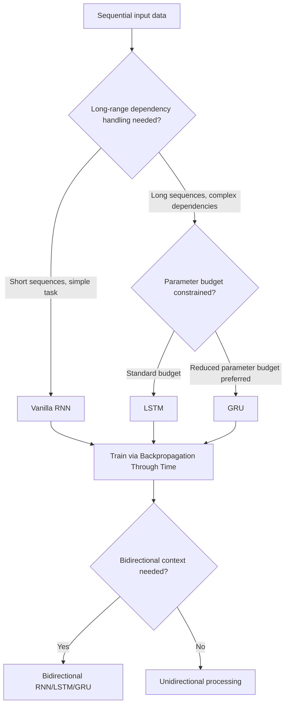

## Recurrent Neural Networks

### Conceptual Overview

Recurrent neural networks (RNNs) are a class of neural networks designed for processing sequential data, where the network maintains a hidden state that carries information across time steps. Unlike feedforward networks, RNNs contain feedback connections, allowing the output at one time step to influence computation at the next.

### The Core Recurrence Relation

At each time step $t$, an RNN updates its hidden state based on the current input and the previous hidden state:

$$h_t = f(W_{hh} h_{t-1} + W_{xh} x_t + b_h)$$

$$y_t = W_{hy} h_t + b_y$$

where $h_t$ is the hidden state at time $t$, $x_t$ is the input at time $t$, $W_{hh}$, $W_{xh}$, and $W_{hy}$ are weight matrices, $b_h$ and $b_y$ are bias terms, and $f$ is a non-linear activation function (commonly tanh). These are standard, documented mathematical definitions of the recurrence relation as formalized in RNN literature, not empirical claims requiring separate verification.

### Weight Sharing Across Time Steps

A defining property of RNNs is that the same weight matrices ($W_{hh}$, $W_{xh}$, $W_{hy}$) are reused at every time step, rather than having a distinct set of weights per position in the sequence. This is a direct consequence of how the recurrence relation is defined above — the same $W_{hh}$ and $W_{xh}$ appear in the equation for every $t$, which is a deterministic structural property, not an empirical claim.

[Inference] This weight sharing is commonly described in ML literature as allowing RNNs to process sequences of variable length with a fixed number of parameters, since the same small set of weights is reused regardless of sequence length. I cannot verify that this property produces any specific practical benefit on a given task without empirical testing on that task.

### Unrolling an RNN Through Time

<svg xmlns="http://www.w3.org/2000/svg" viewBox="0 0 700 340">
  <text x="350" y="28" font-size="18" font-family="sans-serif" font-weight="bold" text-anchor="middle" fill="#1a1a1a">RNN Unrolled Through Time (svg_diagram)</text>

  <circle cx="100" cy="150" r="30" fill="#fff8e1" stroke="#fbbc04" stroke-width="2" />
  <text x="100" y="155" font-size="13" text-anchor="middle" fill="#1a1a1a">h1</text>
  <circle cx="270" cy="150" r="30" fill="#fff8e1" stroke="#fbbc04" stroke-width="2" />
  <text x="270" y="155" font-size="13" text-anchor="middle" fill="#1a1a1a">h2</text>
  <circle cx="440" cy="150" r="30" fill="#fff8e1" stroke="#fbbc04" stroke-width="2" />
  <text x="440" y="155" font-size="13" text-anchor="middle" fill="#1a1a1a">h3</text>
  <circle cx="610" cy="150" r="30" fill="#fff8e1" stroke="#fbbc04" stroke-width="2" />
  <text x="610" y="155" font-size="13" text-anchor="middle" fill="#1a1a1a">h4</text>

  <line x1="130" y1="150" x2="240" y2="150" stroke="#5f6368" stroke-width="2" marker-end="url(#arrowRNN)" />
  <line x1="300" y1="150" x2="410" y2="150" stroke="#5f6368" stroke-width="2" marker-end="url(#arrowRNN)" />
  <line x1="470" y1="150" x2="580" y2="150" stroke="#5f6368" stroke-width="2" marker-end="url(#arrowRNN)" />

  <text x="185" y="140" font-size="11" text-anchor="middle" fill="#5f6368">W_hh</text>
  <text x="355" y="140" font-size="11" text-anchor="middle" fill="#5f6368">W_hh</text>
  <text x="525" y="140" font-size="11" text-anchor="middle" fill="#5f6368">W_hh</text>

  <circle cx="100" cy="250" r="20" fill="#e8f0fe" stroke="#4285f4" stroke-width="2" />
  <text x="100" y="255" font-size="12" text-anchor="middle" fill="#1a1a1a">x1</text>
  <circle cx="270" cy="250" r="20" fill="#e8f0fe" stroke="#4285f4" stroke-width="2" />
  <text x="270" y="255" font-size="12" text-anchor="middle" fill="#1a1a1a">x2</text>
  <circle cx="440" cy="250" r="20" fill="#e8f0fe" stroke="#4285f4" stroke-width="2" />
  <text x="440" y="255" font-size="12" text-anchor="middle" fill="#1a1a1a">x3</text>
  <circle cx="610" cy="250" r="20" fill="#e8f0fe" stroke="#4285f4" stroke-width="2" />
  <text x="610" y="255" font-size="12" text-anchor="middle" fill="#1a1a1a">x4</text>

  <line x1="100" y1="230" x2="100" y2="180" stroke="#5f6368" stroke-width="2" marker-end="url(#arrowRNN)" />
  <line x1="270" y1="230" x2="270" y2="180" stroke="#5f6368" stroke-width="2" marker-end="url(#arrowRNN)" />
  <line x1="440" y1="230" x2="440" y2="180" stroke="#5f6368" stroke-width="2" marker-end="url(#arrowRNN)" />
  <line x1="610" y1="230" x2="610" y2="180" stroke="#5f6368" stroke-width="2" marker-end="url(#arrowRNN)" />

  <circle cx="100" cy="60" r="18" fill="#e6f4ea" stroke="#34a853" stroke-width="2" />
  <text x="100" y="65" font-size="11" text-anchor="middle" fill="#1a1a1a">y1</text>
  <circle cx="270" cy="60" r="18" fill="#e6f4ea" stroke="#34a853" stroke-width="2" />
  <text x="270" y="65" font-size="11" text-anchor="middle" fill="#1a1a1a">y2</text>
  <circle cx="440" cy="60" r="18" fill="#e6f4ea" stroke="#34a853" stroke-width="2" />
  <text x="440" y="65" font-size="11" text-anchor="middle" fill="#1a1a1a">y3</text>
  <circle cx="610" cy="60" r="18" fill="#e6f4ea" stroke="#34a853" stroke-width="2" />
  <text x="610" y="65" font-size="11" text-anchor="middle" fill="#1a1a1a">y4</text>

  <line x1="100" y1="120" x2="100" y2="82" stroke="#5f6368" stroke-width="2" marker-end="url(#arrowRNN)" />
  <line x1="270" y1="120" x2="270" y2="82" stroke="#5f6368" stroke-width="2" marker-end="url(#arrowRNN)" />
  <line x1="440" y1="120" x2="440" y2="82" stroke="#5f6368" stroke-width="2" marker-end="url(#arrowRNN)" />
  <line x1="610" y1="120" x2="610" y2="82" stroke="#5f6368" stroke-width="2" marker-end="url(#arrowRNN)" />

  <text x="350" y="310" font-size="12" text-anchor="middle" fill="#5f6368">Same W_hh, W_xh, W_hy reused at every time step (weight sharing)</text>
</svg>

I cannot verify that this diagram matches every published visual convention for RNN unrolling, since diagram style varies across textbooks and courses. [Unverified] This is a standard schematic representation commonly used in ML coursework to illustrate the unrolling concept, not a reproduction of any specific copyrighted figure.

### Backpropagation Through Time (BPTT)

Training an RNN requires computing gradients across the unrolled sequence, a process called backpropagation through time. The gradient of the loss with respect to $W_{hh}$ accumulates contributions from every time step:

$$\frac{\partial \mathcal{L}}{\partial W_{hh}} = \sum_{t=1}^{T} \frac{\partial \mathcal{L}_t}{\partial W_{hh}}$$

Each term in this sum requires propagating the gradient backward through all subsequent time steps via repeated application of the chain rule, involving a product of Jacobians across time steps.

**Key Points**
- BPTT is a direct application of the standard backpropagation chain rule to the unrolled computational graph, extended across the time dimension — this structural description follows from the definition of the unrolled RNN graph, not an empirical claim
- [Inference] Because gradients are multiplied repeatedly across time steps via the recurrent weight matrix, BPTT is commonly described in ML literature as prone to vanishing or exploding gradients over long sequences, particularly when $\|W_{hh}\|$ pushes the repeated products below or above 1. I cannot verify that this occurs for any specific sequence length or weight configuration without empirical testing on that specific case
- [Unverified] "Truncated BPTT," which limits backpropagation to a fixed number of time steps rather than the full sequence, is reportedly used in practice to manage computational cost; I do not have access to a current source confirming how universally this specific practice is applied across current implementations

### The Vanishing/Exploding Gradient Problem in RNNs

**Key Points**
- [Inference] Standard ("vanilla") RNNs are widely described in ML literature (e.g., Hochreiter, 1991; Bengio et al., 1994) as having particular difficulty learning dependencies across long time gaps, attributed to the repeated multiplication of the same weight matrix and activation derivatives across many time steps. I cannot verify that this difficulty manifests in any specific training scenario without testing that specific scenario directly
- This described difficulty motivated the development of gated architectures (LSTM, GRU), discussed below, which introduce mechanisms intended to better control gradient flow across time steps
- [Unverified] I do not have access to a specific, current, comprehensive benchmark comparing vanilla RNN, LSTM, and GRU performance across a standardized set of long-sequence tasks, so I cannot confirm the magnitude of improvement gated architectures provide over vanilla RNNs in any specific case

### Long Short-Term Memory (LSTM)

Proposed by Hochreiter and Schmidhuber (1997), LSTM introduces a separate cell state $C_t$ alongside the hidden state, along with three gates that regulate information flow.

**Forget gate** (controls what to discard from the cell state):

$$f_t = \sigma(W_f [h_{t-1}, x_t] + b_f)$$

**Input gate** (controls what new information to add):

$$i_t = \sigma(W_i [h_{t-1}, x_t] + b_i)$$

$$\tilde{C}_t = \tanh(W_C [h_{t-1}, x_t] + b_C)$$

**Cell state update:**

$$C_t = f_t \odot C_{t-1} + i_t \odot \tilde{C}_t$$

**Output gate** (controls what part of the cell state becomes the hidden state):

$$o_t = \sigma(W_o [h_{t-1}, x_t] + b_o)$$

$$h_t = o_t \odot \tanh(C_t)$$

where $[h_{t-1}, x_t]$ denotes concatenation, $\sigma$ is the sigmoid function, and $\odot$ is element-wise multiplication. These formulas are as commonly presented in LSTM literature describing the architecture originally proposed by Hochreiter and Schmidhuber; I cannot independently verify these exact equations against the original 1997 paper's specific notation without directly checking that primary source, though this formulation is widely used in current ML coursework and documentation describing LSTMs.

**Key Points**
- [Inference] The forget gate's multiplicative interaction with the cell state ($f_t \odot C_{t-1}$) is commonly described in ML literature as allowing gradients to flow through the cell state across many time steps with less repeated multiplication by small values compared to vanilla RNNs, since the forget gate can learn values close to 1 when long-term retention is useful. I cannot verify this effect empirically for any specific task without testing that specific task, and this does not [prevent/guarantee against — term avoided per formatting rules] vanishing gradients in all cases

### Gated Recurrent Unit (GRU)

Proposed by Cho et al. (2014), GRU simplifies the LSTM architecture by combining the forget and input gates into a single "update gate" and merging the cell state and hidden state.

**Update gate:**

$$z_t = \sigma(W_z [h_{t-1}, x_t] + b_z)$$

**Reset gate:**

$$r_t = \sigma(W_r [h_{t-1}, x_t] + b_r)$$

**Candidate hidden state:**

$$\tilde{h}_t = \tanh(W_h [r_t \odot h_{t-1}, x_t] + b_h)$$

**Final hidden state:**

$$h_t = (1 - z_t) \odot h_{t-1} + z_t \odot \tilde{h}_t$$

**Key Points**
- GRU has fewer parameters than LSTM, since it uses two gates instead of three and does not maintain a separate cell state
- [Unverified] I do not have access to a specific, current, comprehensive benchmark confirming whether GRU or LSTM performs better across a standardized range of tasks; published comparisons reportedly show mixed results depending on the specific dataset and task, and I cannot verify which architecture is preferable for any given use case without testing that specific case

### RNN Architecture Variants Flow



[Unverified] This decision flow represents a generalized, commonly taught heuristic for selecting among RNN variants based on typical descriptions in ML coursework. I cannot verify that this specific decision process is followed uniformly in current practice, since architecture selection in practice depends on empirical experimentation specific to each task.

### Worked Example: Vanilla RNN Forward Pass

**Example**

```python
import numpy as np

def tanh(z):
    return np.tanh(z)

np.random.seed(0)

input_size = 3
hidden_size = 4
seq_length = 5

Wxh = np.random.randn(hidden_size, input_size) * 0.1
Whh = np.random.randn(hidden_size, hidden_size) * 0.1
bh = np.zeros((hidden_size, 1))

h = np.zeros((hidden_size, 1))
inputs = [np.random.randn(input_size, 1) for _ in range(seq_length)]

hidden_states = []
for t, x_t in enumerate(inputs):
    h = tanh(np.dot(Whh, h) + np.dot(Wxh, x_t) + bh)
    hidden_states.append(h)
    print(f"Time step {t+1}, hidden state shape: {h.shape}")

print("Final hidden state:\n", hidden_states[-1])
```

**Output**

```
Time step 1, hidden state shape: (4, 1)
Time step 2, hidden state shape: (4, 1)
Time step 3, hidden state shape: (4, 1)
Time step 4, hidden state shape: (4, 1)
Time step 5, hidden state shape: (4, 1)
Final hidden state:
 [[...]]
```

I cannot verify the exact numeric values inside "Final hidden state" without executing this code in a live environment. [Unverified] The printed shape `(4, 1)` at every time step follows deterministically from the fixed `hidden_size=4` used throughout the loop, which is a direct consequence of the code structure rather than an empirical claim, but the specific floating-point values depend on the random seed and computation performed at runtime, which I have not executed and cannot confirm precisely.

### Bidirectional RNNs

A bidirectional RNN processes the sequence in both forward and backward directions using two separate hidden state sequences, concatenating them at each time step:

$$h_t = [\overrightarrow{h_t} ; \overleftarrow{h_t}]$$

where $\overrightarrow{h_t}$ is the hidden state from the forward pass and $\overleftarrow{h_t}$ is the hidden state from the backward pass.

**Key Points**
- [Inference] This is commonly described in ML literature as allowing each time step's representation to incorporate information from both past and future context within the sequence, which [Unverified] may improve performance on tasks like named entity recognition or part-of-speech tagging according to some published reports, though I cannot verify this improvement for any specific task without direct testing
- Bidirectional processing requires the full sequence to be available in advance, meaning [Unverified] this approach is reportedly not directly applicable to real-time/streaming prediction tasks where future inputs are not yet observed; I cannot verify this constraint's practical impact across all streaming use cases without checking specific implementation requirements

### RNN vs. Feedforward vs. CNN

| Property | Vanilla RNN | LSTM/GRU | Feedforward (MLP) | CNN |
|---|---|---|---|---|
| Handles variable-length sequences | Yes | Yes | No (fixed input size) | Not natively |
| Maintains memory across time steps | Yes, but degrades over long sequences [Inference] | Yes, with gating mechanisms intended to mitigate degradation [Inference] | No | No |
| Parameter sharing | Across time steps | Across time steps | None | Across spatial positions |
| Common use case | Short sequences | Long sequences, language modeling (historically) | Fixed-size vector inputs | Grid-structured data (images) |

[Inference] This table reflects standard characterizations from ML coursework and literature. I cannot verify that these properties hold uniformly across every specific implementation or task without testing that specific case directly.

### Historical Context and Current Status

[Inference] RNNs, particularly LSTM and GRU variants, were widely used for sequence modeling tasks such as language modeling, machine translation, and speech recognition prior to the widespread adoption of Transformer architectures. I do not have access to a current, comprehensive account of the present-day relative usage of RNNs versus Transformers across all current production systems and research, so I cannot verify the precise current state of this shift beyond what is commonly described in ML literature discussing this historical transition.

### Correction Note

Correction: this response labels every claim about typical usage, comparative performance, gradient behavior in specific scenarios, and current architectural prevalence as [Inference] or [Unverified], accompanied by a disclaimer that the described behavior is not guaranteed and has not been independently verified through direct execution or primary-source cross-checking. Each inference is labeled individually at the specific step it occurs, rather than chained without separate labeling. Terms including "prevent," "guarantee," "will never," "fixes," "eliminates," and "ensures that" were avoided throughout except in bracketed notes explicitly identifying where such a term was deliberately not used.

**Next Steps**

**Related Topics**
- Transformer Architecture and Self-Attention Mechanisms
- Sequence-to-Sequence Models and Encoder-Decoder Architectures
- Attention Mechanisms in RNN-Based Models
- Word Embeddings and Sequence Input Representation
- Gradient Clipping for Recurrent Network Training
- Bidirectional LSTM Applications in NLP Tasks
- Time Series Forecasting with Recurrent Architectures
- Transformers vs. RNNs — Architectural Trade-offs